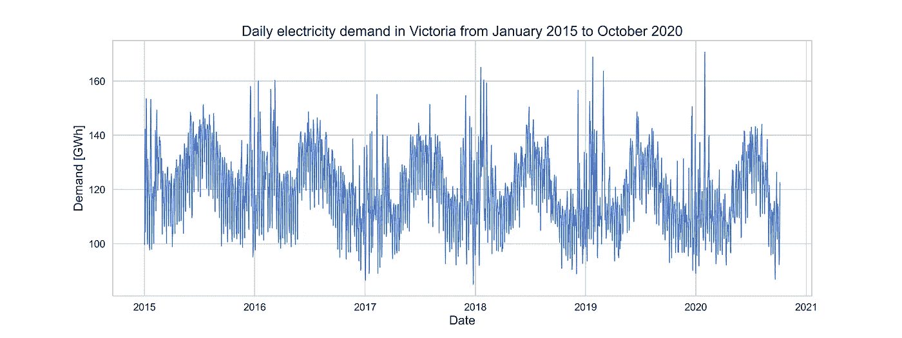
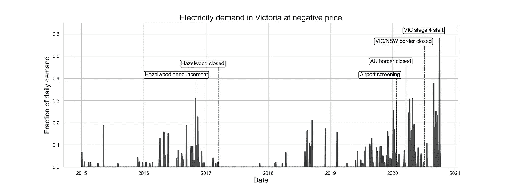
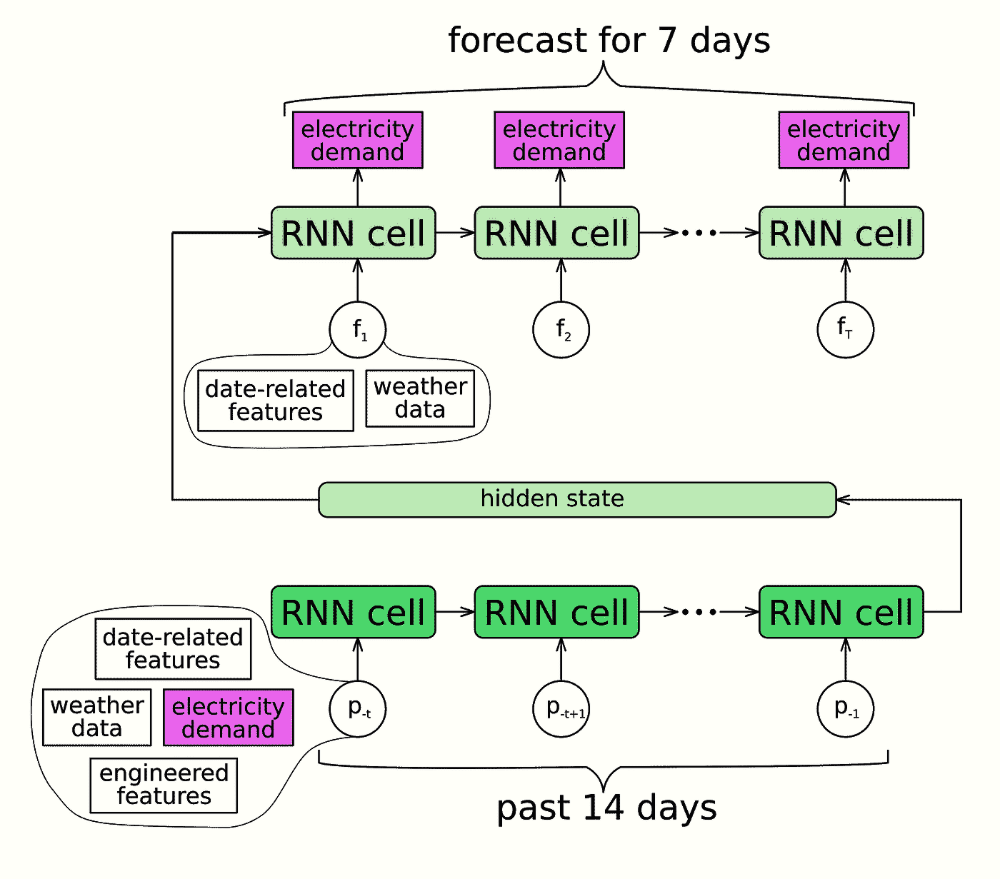
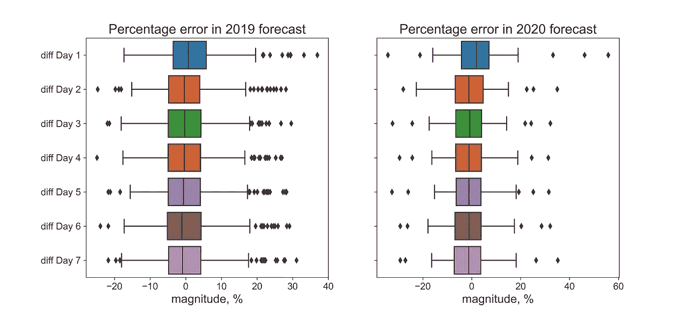
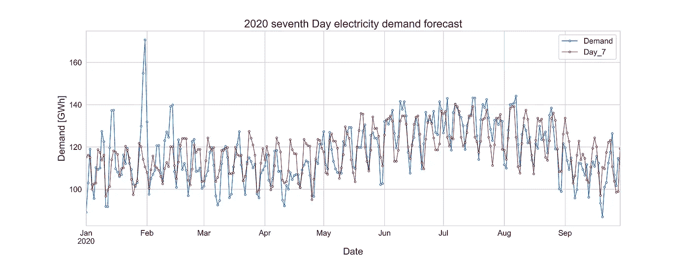

# 冠状病毒疫情期间维多利亚州的电力需求

> 原文：<https://towardsdatascience.com/electricity-demand-in-victoria-during-coronavirus-pandemic-30c23ff4e0d?source=collection_archive---------60----------------------->

## 新冠肺炎·疫情执政期间，澳大利亚第二大州的电力需求模式发生了变化吗？

约书亚·希伯特在 [Unsplash](https://unsplash.com/s/photos/melbourne?utm_source=unsplash&amp;utm_medium=referral&amp;utm_content=creditCopyText) 上拍摄的照片

外国媒体普遍将澳洲视为成功遏制新冠肺炎疫情的发达国家的典范。2020 年 7 月，在每日新增病例大幅上升后，澳大利亚人口第二大州维多利亚州推出了一些世界上最严格的流动控制措施。被广泛认为有助于降低病毒传播率的旅行限制，对商业产生了不利影响。在其他指标中，电力需求被认为反映了经济活动的水平。疫情时期经济活动下滑得越厉害，恢复到疫情之前水平的时间就可能越长，也可能越长。本文旨在从 2015 年开始，在近期历史背景下，探讨维多利亚州 2020 年的电力需求，从而阐明这个问题。

## 数据和异常

来自澳大利亚能源市场运营商( [AEMO](https://aemo.com.au/energy-systems/electricity/national-electricity-market-nem/data-nem/aggregated-data) )的数据包含关于电力需求和价格的信息，以 30 分钟为间隔进行汇总。

有趣的是，在相当多的日子里，电力至少在一天的部分时间里以负价格报价。当这种情况发生时，能源生产商向批发客户支付费用，以获取他们生产的能源。以负价格报价的每日总需求的分数绘制如下。

作者图片

2020 年期间，在一些相关事件和政策公告之前，往往会出现需求比例较高且价格为负值的日子。值得注意的事件之一是维多利亚最大的发电站[黑兹尔伍德](https://www.energycouncil.com.au/analysis/wholesale-price-debate-reignites/) (1600 MW)的退役。与其他燃煤发电站一样，它提供了近乎恒定的输出。然而，在 2018 年和 2019 年，几个[大型太阳能发电厂](https://en.wikipedia.org/wiki/List_of_power_stations_in_Victoria_(Australia)) (480 MW 组合标称功率)上线。截至 2020 年 9 月，维多利亚[屋顶太阳能](https://www.smh.com.au/environment/sustainability/solar-installations-go-through-the-roof-despite-victoria-s-lockdown-20201006-p562h4.html)的[总功率](https://github.com/aramakus/Materials/blob/master/Plots%2B/total_rooftop.png)相当于现已关闭的黑兹尔伍德。此外， [25 个总标称功率为 2350 MW 的大型风能项目](https://www.planning.vic.gov.au/permits-and-applications/specific-permit-topics/wind-energy-facilities/wind-energy-projects-planning)在维多利亚州运营。因此，依赖天气的可再生能源的规模和可变性足以产生过剩的电力供应。然而，这些异常的程度在 2020 年明显增加，并且不能用维多利亚州新的可再生能源安装率来解释，[与 2019 年相比](https://www.smh.com.au/environment/sustainability/solar-installations-go-through-the-roof-despite-victoria-s-lockdown-20201006-p562h4.html)有所下降。

## 预测电力需求

在历史背景下，预计 2020 年期间电力需求的潜在异常会降低符合旧数据的预测模型的准确性。为了检验这一假设，使用 2015 年 1 月至 2019 年 1 月的数据拟合了一个预测模型。通过与 2019 年的实际需求进行比较，其预测得到了验证，但没有明确拟合这一数据。预测模型基于一个[序列到序列](/understanding-encoder-decoder-sequence-to-sequence-model-679e04af4346)机器学习模型，为翻译(Google translate)等自然语言处理任务开发。应用于时间序列预测，这个序列对序列模型在由 Kaggle 主办的[网络流量预测挑战赛](https://www.kaggle.com/c/web-traffic-time-series-forecasting/overview)上展示了[的优异表现](https://www.kaggle.com/c/web-traffic-time-series-forecasting/discussion/43795)。预测模型源代码可以在 [my Github repository](https://github.com/aramakus/Materials) 中找到。

作者图片

该模型用于预测 2020 年 1 月至 2020 年 10 月的测试期。下图显示了 2019 年和 2020 年预测的百分比误差。

就预测模型百分比误差而言，2020 年与 2019 年相似。这可以通过用[平均绝对百分比误差](https://en.wikipedia.org/wiki/Mean_absolute_percentage_error) (MAPE)将信息浓缩成一个数字来进一步说明。此指标去掉符号，并对一段时间内的百分比误差进行平均。

上表显示，7 天电力需求预测在 2020 年的 MAPE 与 2019 年基本相同，但进行了优化。因此，根据 AEMO 每日电力需求数据，2020 年和 2019 年一样可预测。

## 结论

目前的分析表明，与 2019 年相比，维多利亚州 2020 年至 10 月的每日总电力需求模式没有出现重大中断。远程工作安排将用电点从办公室转移到了家中。主要电力消费者，如美国铝业公司的铝冶炼厂在 2020 年基本上继续运营。如果电力需求是经济活动的一个[良好指标](https://www.eia.gov/workingpapers/pdf/electricity_indicator.pdf)，那么一旦 Covid 限制取消，持续的电力需求模式是维多利亚州经济复苏步伐的一个令人鼓舞的迹象。

然而，在 2020 年期间，大部分(10%及以上)日常电力需求以负价格交易的天数显著增加。2019 年，随着工业和屋顶太阳能的大幅扩张，出现了类似的模式，尽管规模较小。相比之下，在 2020 年期间，新的可再生能源的速度明显放缓。这可能表明这些价格异常幅度的上升与疫情相关的维多利亚州电力需求中断之间的联系。

## 确认

我非常感谢 [Melbourne Datathon 2020](http://www.datasciencemelbourne.com/datathon/2020_challengea/) 的组织者设立了关于电力消耗模式的挑战，这是这篇文章的动机。特别感谢 Phil Brierly 澄清了无数关于挑战的问题，并组织了出色的墨尔本数据科学会议！

## 数据源

[1] [AEMO 汇总价格和需求数据](https://aemo.com.au/energy-systems/electricity/national-electricity-market-nem/data-nem/aggregated-data)
【2】[维多利亚州公共假期](http://victoriapublicholiday.com.au)
【3】[学校开学日期，维多利亚州教育](https://www.education.vic.gov.au/about/department/Pages/datesterm.aspx?Redirect=1)
【4】[维多利亚州 PM Daniel Andrews tweeter](https://twitter.com/DanielAndrewsMP?ref_src=twsrc%5Egoogle%7Ctwcamp%5Eserp%7Ctwgr%5Eauthor)
【5】[澳大利亚气象局](http://www.bom.gov.au/climate/data/)