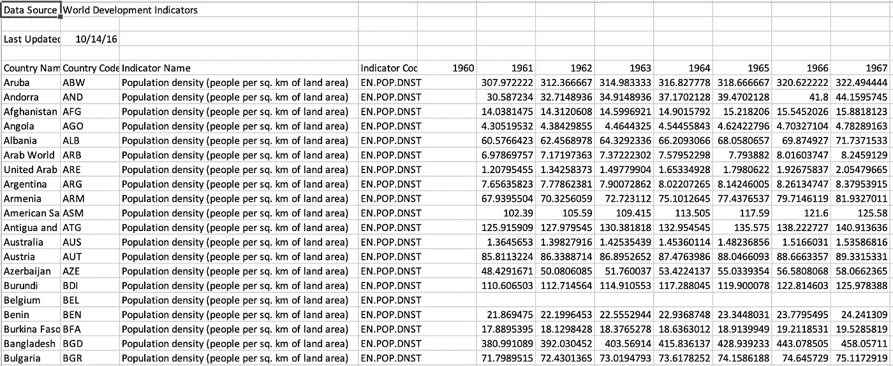
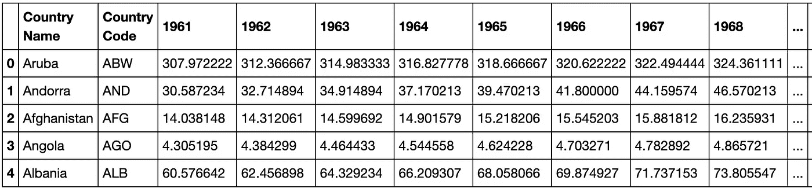
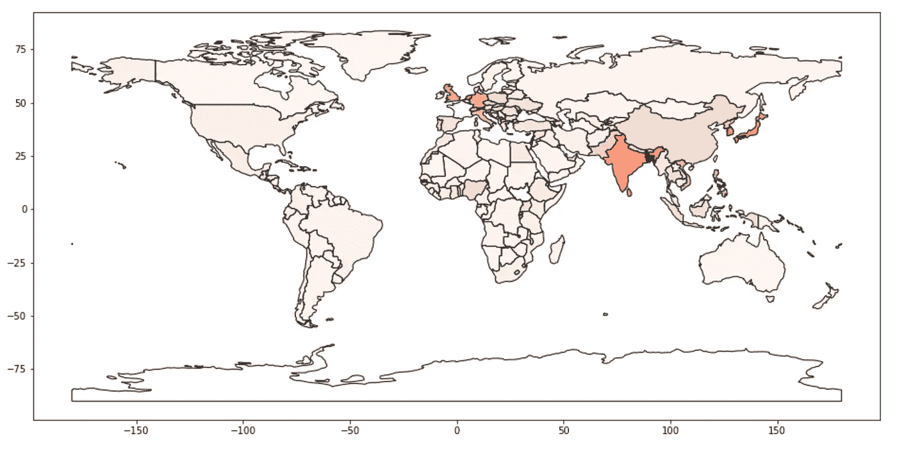
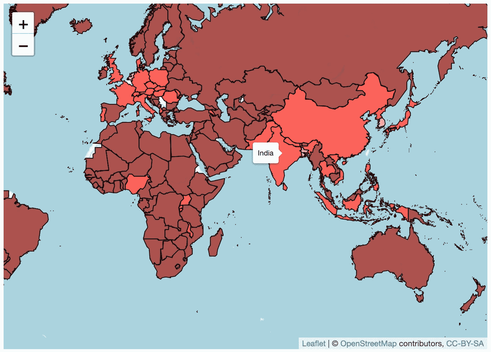

# 使用 GeoPandas 和传单的 Python 和 R 语言的优雅地理图

> 原文：<https://towardsdatascience.com/elegant-geographic-plots-in-python-and-r-using-geopandas-and-leaflet-27126b60bace?source=collection_archive---------22----------------------->

## 如何使用 GeoPandas 和传单？

照片由[марьянблан| @ marjanblan](https://unsplash.com/@marjan_blan?utm_source=medium&utm_medium=referral)在 [Unsplash](https://unsplash.com?utm_source=medium&utm_medium=referral) 上拍摄

有几个地理库可用于在地图上绘制位置信息。我以前在这里写过相同的主题，但是从那以后，我更广泛地使用了这些库，并且了解了新的库。在使用和检查了几个库之后，我发现 GeoPandas 和 Leaflet 库是两个最容易使用和高度可定制的库。该代码可作为 GitHub repo 获得:

 [## kb22/地理绘图

### 这个库描述了使用 Python 中的 GeoPandas 和 R 中的 Leaflet 作为两种非常优雅(和简单)的绘图方式…

github.com](https://github.com/kb22/geo-plotting) 

# 资料组

数据集取自 [Kaggle](https://www.kaggle.com/walla2ae/world-population) 。它包括世界各国的人口密度(每平方公里的人口数)。该数据集包括从 1961 年到 2015 年的值。

资料组

上图显示，在读取数据集时，我们需要跳过前 4 行，所以我们直接从数据开始。像“1960”这样的列是空的，因此可以删除。此外，比利时等一些国家的数据缺失，因此我们将从收集中删除这些记录。

# 使用 GeoPandas 的静态图(Python 语言)

## 导入库

我们将导入库`pandas`来读取数据集，然后使用`geopandas`绘制地图。注意，为了删除不必要的警告，我添加了特定的命令。

## 导入数据集

接下来，我们将导入数据集。如前所述，我跳过了前 4 行。

我用`drop()`的方法去掉所有多余的不需要的列(“指标名称”、“指标代码”、“1960”、“2016”、“未命名:61”)。我使用`dropna()`删除所有具有空值的记录，最后计算 1961 年到 2015 年的平均人口密度，放入新列`avgPopulationDensity`。

结果数据集

## 绘图数据

我们首先直接从 geopandas 加载世界基图，然后将我们上面细化的数据集与这个基图数据合并。然后，我们简单地用`avgPopulationDensity`列中的值绘制数据`world`。我们在`Reds`色图中给国家加阴影，这意味着平均人口密度较高的国家比其他国家更暗。

平均人口密度图(使用 GeoPandas)

> 我们可以清楚地看到，亚洲国家有更多的人口密度值，特别是印度，孟加拉国，韩国和日本。

# 使用传单的互动情节(R)

## 导入库

我们将加载用于生成绘图的`leaflet`库和用于读取 shapefiles 的`sf`库。

## 导入数据集

就像在 Python 中一样，我们跳过前 4 行导入数据集，删除多余的列，删除缺少值的行，并创建`avgPopulationDensity`列。

重要的是，我们还要加载绘图所需的 shapefile。因此，我们使用`st_read`方法，将带有这个 shapefile 的数据集合并到一个名为`shapes`的变量中。

## 绘图数据

在绘制数据之前，我们首先定义想要使用的调色板。我为不同的箱子定义了红色的阴影，基于此，我将对结果图进行着色。由于这是一个自定义调色板，它的颜色将不同于我们在 GeoPandas 图中看到的颜色。

接下来，我们绘制传单 geoplot。`leaflet()`开始创建地图,`addTiles()`添加国家地图。接下来，我们通过定义纬度和经度值以及缩放比例来设置地图视图，这样我们就可以一次看到整个地图。如果需要，我们可以更改这些值，但由于它是一个交互式地图，我们也可以动态地这样做。

最后，基于`avgPopulationDensity`列，我们对整个地块进行颜色分级，并附上国家名称作为标签。我们通过添加笔画(`STROKE = TRUE`)来定制每个国家的外观，然后用`weight = 1`将它们设置为`black`，定义每个边界的宽度。

平均人口密度图(使用传单)

> 我们观察到亚洲国家如印度、孟加拉国、中国、日本和其他国家的人口密度比其他国家高。

# 结论

从上面的两个例子中，我们可以看到创建漂亮的静态和动态地理图是多么容易。此外，我们还可以添加大量定制内容。

如果您有任何建议、问题或想法，请在下面告诉我。