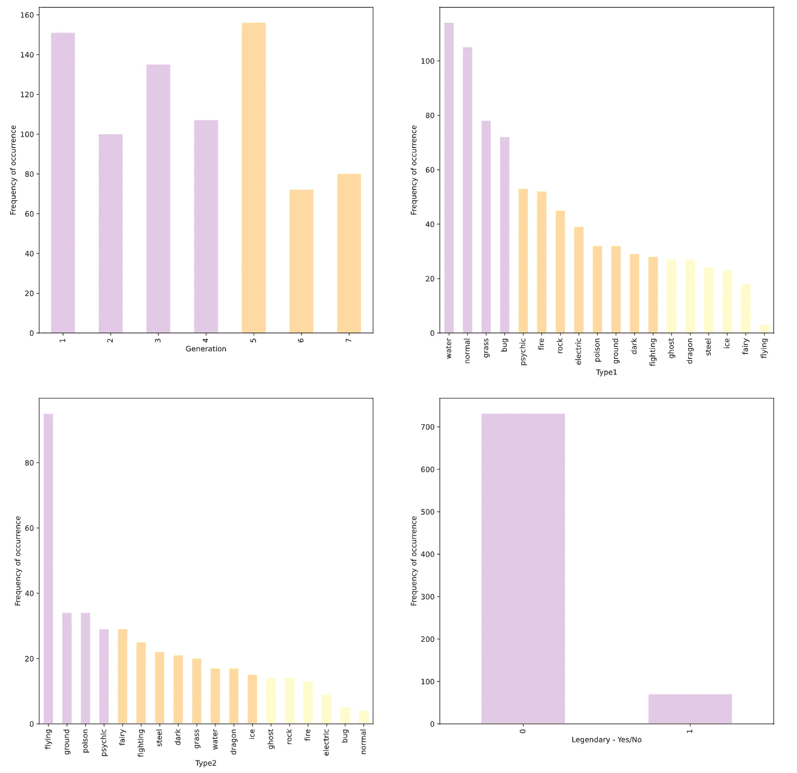
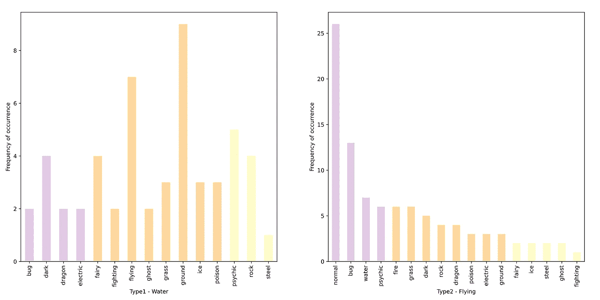
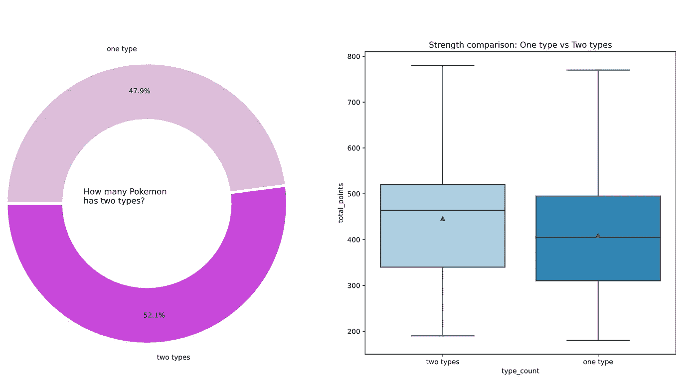
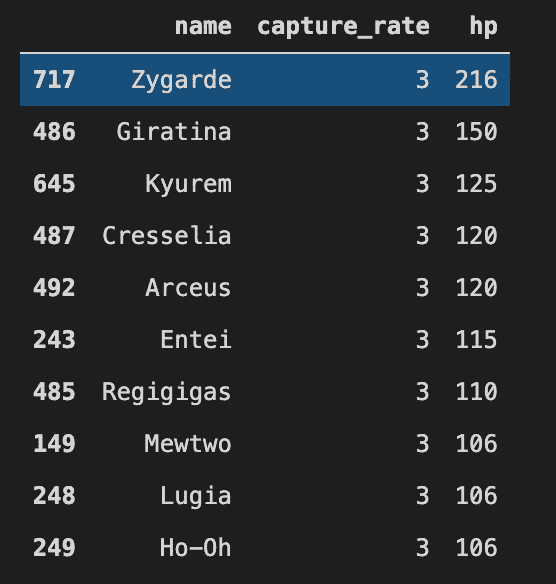
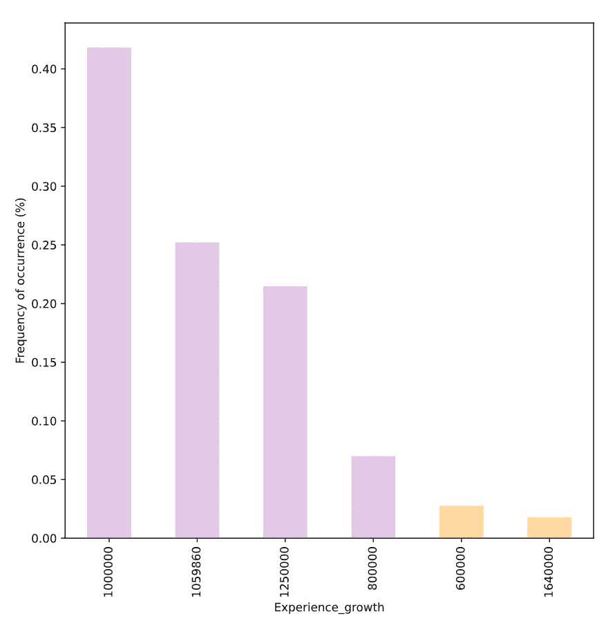
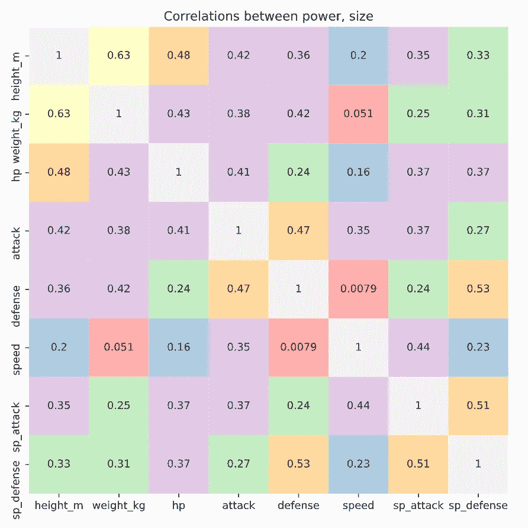
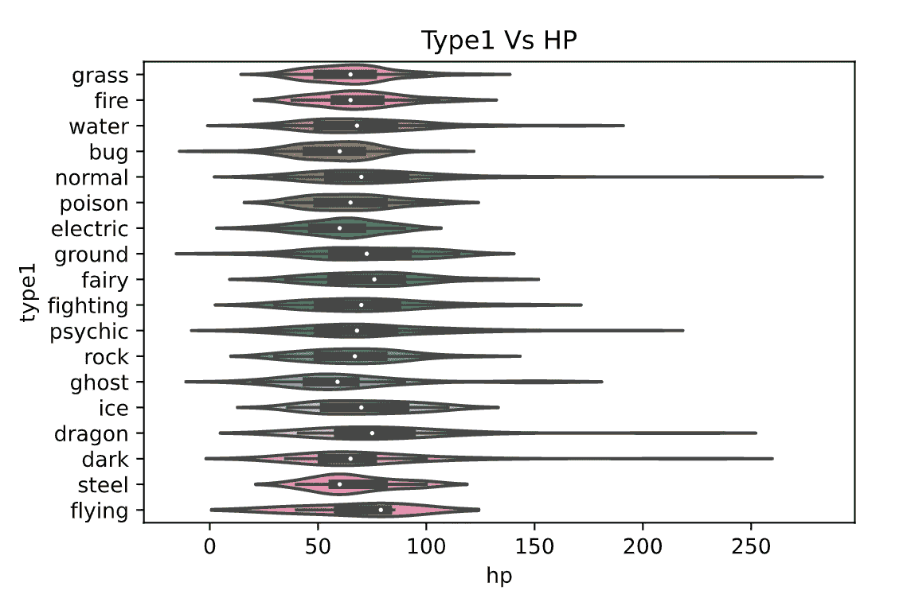
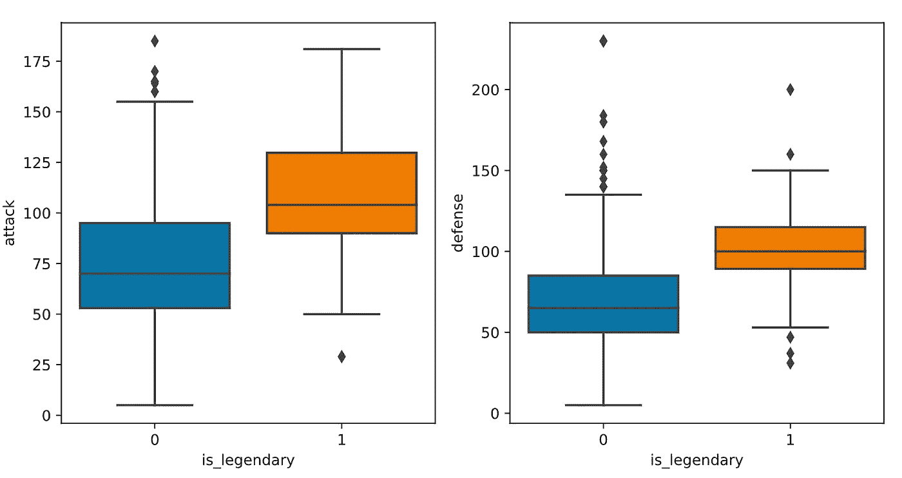
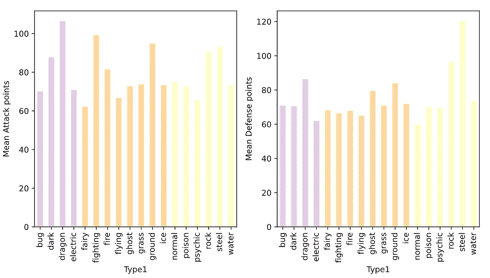
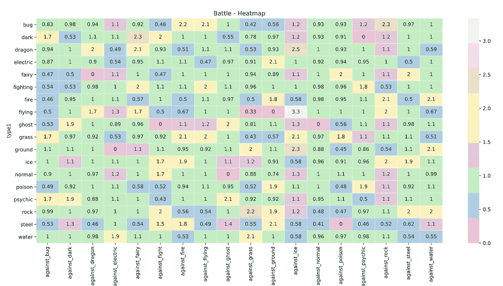

# 让数据说话的优雅方式:探索性数据分析

> 原文：<https://towardsdatascience.com/elegant-way-to-make-data-talk-stories-exploratory-data-analysis-783e68837a2?source=collection_archive---------53----------------------->

## 大数据无所不知


[杰](https://unsplash.com/@imjma?utm_source=unsplash&utm_medium=referral&utm_content=creditCopyText)在 [Unsplash](https://unsplash.com/s/photos/pokemon?utm_source=unsplash&utm_medium=referral&utm_content=creditCopyText) 上拍照

# 介绍

数据可以讲述伟大的故事，让数据传达正确的故事是一门艺术。获得这门艺术的手段是**探索性数据分析(EDA)** 。探索性数据分析只不过是使用*统计和概率*方法来理解数据试图传达给我们的信息。

作为一名数据科学家，大部分工作将主要集中在理解数据上，并试图只获得必要的特征，以发送到机器学习模型。只有当输入数据有意义时，模型才能够发挥其最大功效。

> 真正困难的事情之一是弄清楚该问什么问题。一旦你想通了这个问题，那么答案就相对容易了——埃隆·马斯克

从一张白纸中找到正确的问题通常是一项具有挑战性的任务。但是，通过不断地问 ***为什么，*** 我们将能够理解数据的行为并获得洞察力

现在，我们可以深入了解一些在执行 EDA 时可以使用的常见起点。我从小就是口袋妖怪的粉丝，我将使用*口袋妖怪🌟来自 [Kaggle](https://www.kaggle.com/rounakbanik/pokemon) 的数据集*用于逐步执行 EDA

来吧，让我们抓住他们:)

# 超级工具:熊猫

在描述执行 EDA 的一般步骤之前，让我们看一下一个重要的工具。

**Pandas** 库是建立在 **python** 之上的一个快速、强大且简单的工具。从我的个人经历来看，作为一名数据科学家，我每天的面包和黄油完全依赖于熊猫。只用一两行代码就可以轻松实现所有的编程逻辑，这使得这个库如此受欢迎。它可以处理成千上万的数据，而没有很多计算要求。此外，这个库提供的功能很简单，而且非常有效。

甚至对于我们的口袋妖怪数据集 EDA，我们将使用熊猫来理解数据，也用于*可视化*

# 探索性数据分析的常见步骤:

当我收到数据时，我会执行下面的一些步骤来掌握我实际处理的内容。

1.  了解您的数据
2.  了解数据中的特征/列
3.  数据的因果分析

## **了解你的数据:**

了解我们将要处理的数据点的数量是很重要的。这是因为，一旦数据的*大小增加*，代码必须以这样一种格式编写，即它是*高效的*，并且在更短的时间内执行。

```
#Import library
import pandas as pd
import numpy as np#Read data
data = pd.read_csv('../pokemon.csv')
```

**shape()** 函数在熊猫格式中给出行数和列数(rows，cols)

```
data.shape()
#Output: (801, 41)
```

## 了解数据中的特征/列

pandas 中的 **info()** 函数提供了完整的列分割，包括数据类型在内的每一列中总共有*个非空的*项。该函数用于确定是否有任何列必须被 [*估算*](https://en.wikipedia.org/wiki/Imputation_(statistics)) 以处理缺失数据

```
data.info()
```

在*口袋妖怪数据集*中有一些有趣的字段，比如世代、能力、类型*。*使用熊猫的可视化功能，并通过使用 *seaborn 的*美学外观，我们可以生成有助于提供基线故事的良好图表。

pandas 中的 **value_counts()** 函数对字段中的唯一值进行分组，并提供组中每个唯一值的频率份额(如果 *normalize* 参数设置为 *True，*提供出现份额的百分比)。使用**直方图**图可以很好地理解频率分布。

```
import seaborn as sns
import matplotlib.pyplot as plt
from matplotlib import cmcolor = cm.Pastel1(np.linspace(.4, .8, 30))fig, ax = plt.subplots(2,2, figsize=(18,18))data.generation.value_counts(normalize=False).sort_index().plot(kind='bar', color=color, ax=ax[0,0])
ax[0,0].set_xlabel('Generation')
ax[0,0].set_ylabel('Frequency of occurrence')data.type1.value_counts(normalize=False).plot(kind='bar', color=color, ax=ax[0,1])
ax[0,1].set_xlabel('Type1')
ax[0,1].set_ylabel('Frequency of occurrence')data.type2.value_counts(normalize=False).plot(kind='bar', color=color, ax=ax[1,0])
ax[1,0].set_xlabel('Type2')
ax[1,0].set_ylabel('Frequency of occurrence')data.is_legendary.value_counts(normalize=False).plot(kind='bar', color=color, ax=ax[1,1])
ax[1,1].set_xlabel('Legendary - Yes/No')
ax[1,1].set_ylabel('Frequency of occurrence')
```



图 1:频率分布(图片由作者提供)

上图提供了数据集中一些*特征*(列)的频率分布。从图 1 中的*可以推断，非传奇类型的 1、3、5 代口袋妖怪占了大多数。还有，大部分属于 1 型的*水*和 2 型的*飞*。*



图 2:类型 1 和类型 2 的特定值的频率分布(图片由作者提供)

*图 2* 图是分别有*类型 1 =水*和*类型 2 =飞*的过滤行得到的。结果表明，水(1 型)的主要 2 型成分是地面和空中的。同样，大多数飞行(2 型)属于正常和错误类型。



图 3:属于一种或两种类型的口袋妖怪的分割(图片由作者提供)

在类型领域更深入一点，*图 3* 描述了不是所有的口袋妖怪都属于这两种类型，而且，如果一个口袋妖怪属于两种类型，实力也没有太大差异。

因此，从最初的分析中，我们可以了解到数据中有相当有影响力的[](https://en.wikipedia.org/wiki/Categorical_variable)****分类变量，如类型、世代、传奇等，可能会影响建模结果。还有一些 [**连续变量**](https://en.wikipedia.org/wiki/Continuous_or_discrete_variable) 如攻击点、防御点、捕获率、base_egg_steps、sp_attack 和 sp _ defence 点，它们与分类变量的相关性对所研究的口袋妖怪的捕获和强度有一些影响。****

## ****因果分析****

****在开始因果分析之前，让我们弄清楚一些可能有助于构建口袋妖怪数据集大纲的问题****

*   ****捕捉一个给定的口袋妖怪有多难？****
*   ****它值得被捕获吗？它将如何在战斗中对我们有用？****
*   ****给定口袋妖怪的优点和缺点是什么？****

****现在，让我们深入了解各列之间的关系，揭开一些隐藏的故事，并得到一般的假设。****

******捕捉一只给定的口袋妖怪有多难？******

****可以使用数据集中的 *capture_rate 和 hp(hit-point)* 列来定义此指标。*捕获率*无非是在给定时间内，如果发现口袋妖怪，多久能捕获一只。所以如果捕获率少，那就意味着口袋妖怪很难被捕获。生命值是口袋妖怪可以承受的伤害量。所以如果生命值高，那么口袋妖怪就是强大的。所以大多数**难**到**捕捉**的口袋妖怪都有**高 hp** 。下图给出了十大难以捕捉的口袋妖怪****

```
**#clearn outlier data
cap = data[~(data.capture_rate == '30 (Meteorite)255 (Core)')]
cap['capture_rate'] = cap['capture_rate'].astype(int)cap[['name','capture_rate','hp']].sort_values(by=['capture_rate','hp'], ascending=[True,False]).head(10)**
```

********

****图 4:难以捕捉的口袋妖怪(图片由作者提供)****

****它值得被捕获吗？它在战斗中对我们有什么用处？****

****一旦一只口袋妖怪被捕获，我们需要明白我们能从中获得什么。所以知道它需要增长多少点就好了，这样它才能变得更强大。这可以从一个叫做 *experience_growth 的专栏中推断出来。*****

********

****图 5:口袋妖怪所需的经验增长点(图片由作者提供)****

****近 65%的口袋妖怪需要 1-106 万经验值才能成长。因此，如果一个高 hp 的口袋妖怪被捕获，那么它真的是一个头奖，否则需要更多的点数来增加它的价值。****

****像身高，体重，hp(生命值)，攻击，防御，特殊攻击和特殊防御等领域定义了口袋妖怪的实力，了解它们之间的相互联系是很好的。****

```
**power=data[['height_m','weight_kg','hp','attack','defense','speed','sp_attack','sp_defense']]sns.heatmap(power.corr(), annot=True, cmap='Pastel1', cbar=False)**
```

********

****图 6:相关热图(图片由作者提供)****

****口袋妖怪的身高和体重似乎有适度的相关性，其次是防御和特殊防御栏。然而，在功率、尺寸列之间没有发现显著的相关性。****

****一些类型的口袋妖怪有更好的生命值。这种关系可能有助于确定被捕获或将要被捕获的口袋妖怪的价值****

********

****图 type1 和 HP 的小提琴图(图片由作者提供)****

****小提琴图中的点是总体的中间值(第 50 个百分位数)，长尾表明该组中有一小部分人具有较高的值(例如正常值)。可以推断出*飞行、精灵和龙*类型的口袋妖怪有更高的生命值，因此捕捉任何这种类型的口袋妖怪可能在战斗中有用:)****

******给定口袋妖怪的优点和缺点是什么？******

****在人口中，有将近 9%的口袋妖怪是*传说中的*。人们常说传说中的口袋妖怪有更好的攻击和防御策略，我们可以用方块图来证实数据是否说了同样的事情****

```
**fig, ax = plt.subplots(1,2, figsize=(10,5))
sns.boxplot(x=data.is_legendary, y=data.attack, ax = ax[0])
sns.boxplot(x=data.is_legendary, y=data.defense, ax = ax[1])**
```

********

****图 8:传奇 Vs 攻击/防御的方框图(图片由作者提供)****

****因此，数据显示传奇口袋妖怪的攻击和防御值比普通口袋妖怪高，证明了我们的假设。****

****接下来，看看每种类型的口袋妖怪都有怎样的攻防策略会很有趣。为了得到这个结果，我根据口袋妖怪的*类型 1* 对它们进行了分组，并计算了每种类型的攻击和防御的平均值，从而得出一个推论。****

```
**fig, ax = plt.subplots(1,2, figsize=(10,5))data.groupby('type1')['attack'].mean().plot(kind='bar',color=color, ax = ax[0])
ax[0].set_xlabel('Type1')
ax[0].set_ylabel('Total Attack points')data.groupby('type1')['defense'].mean().plot(kind='bar',color=color, ax = ax[1])
ax[1].set_xlabel('Type1')
ax[1].set_ylabel('Total Defense points')**
```

********

****图 9: Type1 Vs Mean 攻击/防御(图片由作者提供)****

****龙，战斗和地面型口袋妖怪有最高的攻击行动计划，同时钢铁，岩石和龙有最高的防御行动计划。综合来看，*龙，钢，地*是最强的口袋妖怪类型****

****数据集中有一些有趣的字段，如*对抗 _ 电、对抗 _ 火*和其他一些*对抗 _* 字段，它们定义了口袋妖怪在战场上可以承受的伤害量，范围从 0 到 4。对于给定类型的口袋妖怪，我们可以找到每个战斗性质的耐力分数。****

********

****图 10:战力热图(图片由作者提供)****

****可以看出，飞行口袋妖怪对冰型口袋妖怪的伤害最高，其次是黑暗型口袋妖怪对仙女的伤害。因此，这张热图给出了在战场上使用的口袋妖怪的类型。****

# ****结论****

****忠太💫我们已经使用口袋妖怪原始数据集来获得一些基本问题的答案。同样，我们可以对这个基线故事进行更多的开发，具体地为每种类型的战斗找到最好的口袋妖怪名称，甚至更多。****

****希望这篇文章能让你了解如何从头开始。快乐学习:)****