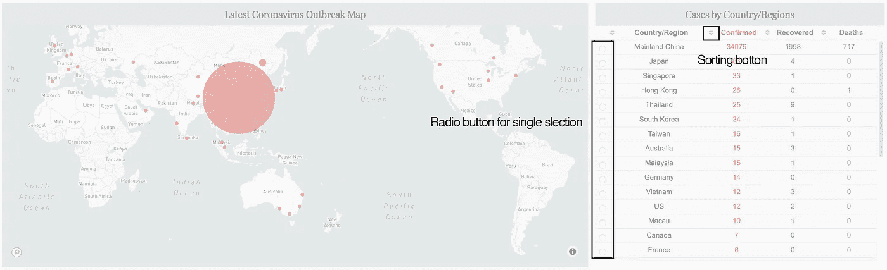
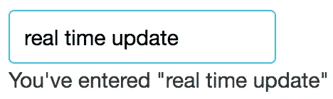
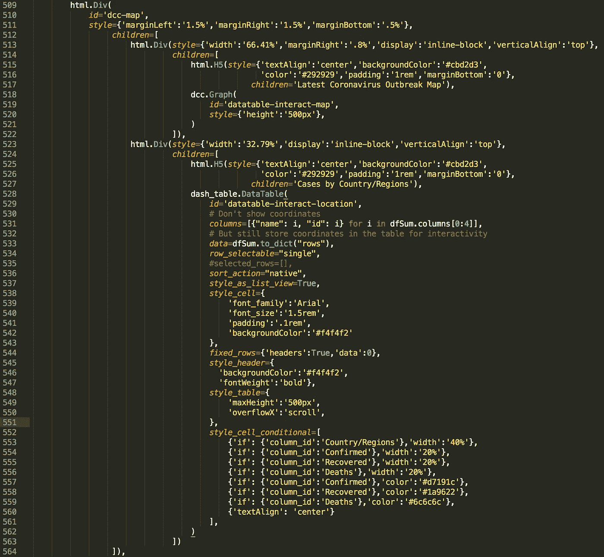
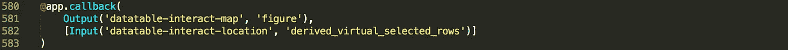
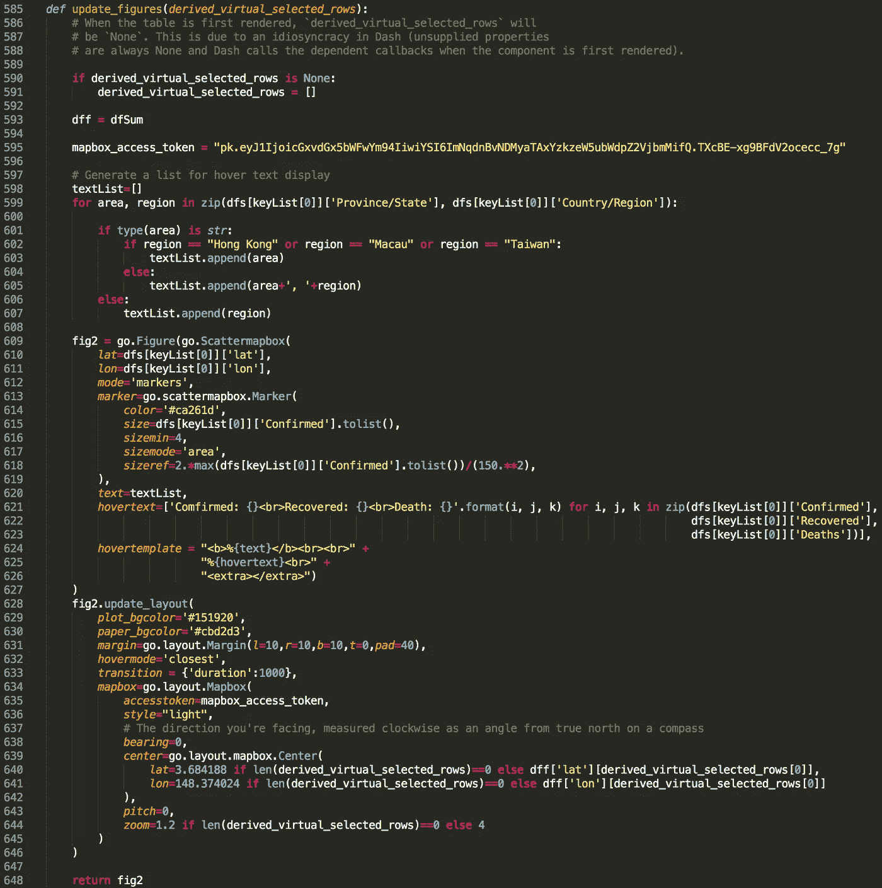

# 提升仪表板在 Dash 中的交互性

> 原文：<https://towardsdatascience.com/elevate-your-dashboard-interactivity-in-dash-b655a0f45067?source=collection_archive---------20----------------------->


海崖桥|君摄

## 在 dash 代码中实现“回调”的初学者协会

上周，我和大家分享了如何在 python 中使用 Dash 制作一个[仪表盘](https://dash-coronavirus-2020.herokuapp.com/)来跟踪冠状病毒的传播，从中可以实时了解全球冠状病毒病例的数量，包括确诊、痊愈和死亡病例，以及它们在世界地图上的分布。

[](/build-a-dashboard-to-track-the-spread-of-coronavirus-using-dash-90364f016764) [## 使用 Dash 构建一个仪表板来跟踪冠状病毒的传播

### 全球冠状病毒(2019-nCoV)患者确诊、康复和死亡的实时视图

towardsdatascience.com](/build-a-dashboard-to-track-the-spread-of-coronavirus-using-dash-90364f016764) 

对于第一个版本，我们实现了基本的 dash 功能，并获得了一个静态应用程序接口。换句话说，除了`plotly` ( *提供的本地交互，例如悬停文本显示和图形上的地图探索*，一旦应用程序在用户的浏览器上启动，屏幕上显示的所有内容都将被设置。用户可能会在几秒钟内使用完仪表板，然后弹开。

一般来说，作为一个 web 应用程序，其整体健康状况的一个主要指标是参与度，它表示在一段定义的时间内，在您的应用程序中保持活跃的用户的百分比。这对于依赖稳定的用户流来产生收入的商业 web 应用程序来说尤其重要(*当然这不是我的 dashboard 应用程序的目的，但是，为了引出本文的主题，让我们假设我们现在正在构建一个“商业应用程序”*)。提高 web 应用程序参与度的一个简单而有效的方法是提高它与用户的交互性。

大家可以看到，相比于第一个版本( [*标题图*](/build-a-dashboard-to-track-the-spread-of-coronavirus-using-dash-90364f016764) *在我上一篇*中)，在最新版本的 [2019-nCoV 跟踪仪表盘](https://dash-coronavirus-2020.herokuapp.com/)中的地图旁边放置了一个数据表(图 1)。随着该数据表添加了两种类型的交互性，

1.  用户可以根据四列中的任意一列(*即国家/地区、确诊、康复和死亡*)对行进行排序；
2.  一旦用户选择表格中的一行，地图将自动更新为国家/地区的放大视图(*例如，当选择“Mainland China”时，地图将放大到中国并显示每个省的病例数*)。



图 1 |仪表板中的两个函数和数据表

这两个功能可能有助于将用户保留在仪表板中更长时间，因为地图上显示的结果可以基于他们自己的兴趣和选择。

在本帖中，我将与你分享如何在 dash 中使用**回调**来实现前述的交互性。像往常一样，您可以从 [my Github](https://github.com/Perishleaf/data-visualisation-scripts/blob/master/dash-2019-coronavirus/dashboard-callback-virus.ipynb) 访问所有需要的数据和 jupyter 笔记本。

## dash 中的回调是什么

在 dash 中，`callback`可以理解为 python 函数和应用程序之间链接的双向隧道。

具体来说，`Input`和`Output`两种货物在一个`callback`内从两个方向交付，`Input`是从`app`到`function`交付的货物，通过用户在`app` ( *中的动作生成，例如输入一个值，选择一行，从下拉菜单中选择一个项目，将光标悬停在一个分散点上等。*)。相反，`Output`是从`function`到`app`的货物，由`function`根据`Input`返回。

`Input`和`Output`都有两个自变量`component_id`和`component_property`。`component_id`确保`callback`识别正确的发送者和接收者，而`component_property`是货物的实体。也就是说，基于这些`component_id` , `callback`知道哪个组件的`component_property`作为`Input`应该被监控，从`function`返回的`component_property`作为`Output`应该被分配给哪个组件。

在下面取自 [Dash 教程](https://dash.plot.ly/getting-started-part-2)的例子中，我们可以看到`html.Div()`容器中的两个组件(*即* `*dcc.Input()*` *和* `*html.Div()*`)各有一个`id`。这两个 id 分别分配给`callback`中的`Output`和`Input`。因此，用户输入的值( `*dcc.Input*` *的`*value*` *属性，其中* `*id*` *为‘my-id’*)将被传递给`update_output_div(input_value)`，返回的结果将被赋给`html.Div()`的`children`属性，其中`id`为‘my-div’。*

样本破折号

最重要的是，`callback`实时监控`input`的货物流量。如上例所示，一旦输入框内发生变化，就会触发`update_output_div(input_value)`，并且`children`内容会立即更新(图 2)。这一特性使用户能够在采取行动后立即看到来自应用程序的反馈。



图 2 |示例应用程序

您可能会注意到`component_property`只是给定组件的属性，这意味着我们可以通过回调函数返回组件的任何属性。

一旦我们理解了 dash 中回调的概念，让我们深入到我的仪表板的代码中。

## 此仪表板中的回拨



图 3 |地图容器的代码

这里我先在地图驻留的容器里面多加了一个`html.Div()` ( *图 3* ， *line523-line563* )子容器。在这个子容器中，有两个组件，`html.H5()`用于标题，`dash_tale.DataTable()`([*Dash DataTable*](https://dash.plot.ly/datatable)*是一个交互式表格组件，设计用于查看、编辑和探索数据表的大型数据集*。

还记得第一种交互性，排序功能吗？这个很简单，可以直接用`sort_action` ( *line536，* *)设置，可以让数据按列排序，接受 DataTable 组件中* `*none*` *、* `*native*` *、* `*custom*`的任意一个值。这里我们只使用了`native`，它根据数据的类型对数据进行排序(例如*升序表示数字，字母表表示字符串*)。

为了能够选择数据表中的行，我们还需要设置`row_selectable='single'` ( *line534* )，选择界面将显示在每一行数据的前面。

对于地图组件(*即* `*dcc.graph()*`)，你可以发现它的`id`是‘数据表-交互-地图’(*line 519*)，而带有‘数据表-交互-位置’`id`的数据表组件( *line529* )。这是回调中使用的两个 id。我喜欢使用有意义的 id 名称，这有助于将来维护代码。

好了，app 端的一切都准备好了，现在让我们进入回调部分。在我们的例子中，作为`Input` cargo，我们有`derived_virtual_selected_rows` ( *这不是一个任意的名字，它是一个从数据表中选择* `*dash_table.DataTable*` *组件*的行的索引列表)，cargo 然后将传递给函数为`dcc.graph()`返回一个`figure`属性。

因此，如图 4 所示，我们给`Output`和`Input`分配了相应的‘id ’,同时，标记了正确的属性以便回调到 monitor。注意`Input`必须在列表中。



图 4 |回调装饰器

最后，让我们完成功能方面。我们想要的交互性是让用户从数据表中选择一行，地图将自动移动到和放大所选的国家/地区。此外，在应用程序开始时，初始中心点和缩放级别应该显示整个世界地图。

第一次启动应用程序时，将调用回调及其函数。然而，当第一次呈现应用程序时，没有选择任何行，因此`derived_virtual_selected_rows`将是`None`。这可能会导致依赖于`derived_virtual_selected_rows`的函数出现问题。这就是为什么你可以从第 590 行到第 591 行(图 5)看到，在函数的开始，我们将`derived_virtual_selected_rows`设置为一个空列表。一旦用户做出选择，数据表中被选择行的索引将被存储在`derived_virtual_selected_rows`中。由于我们只启用了单一选择，它将只包含一个项目。为了访问这个索引，我们只需要调用`derived_virtual_selected_rows[0]`。



图 5 |回调包装的函数

通过使用`go.layout.mapbox.Center()`(图 5，*line 639–641*，我们可以指定地图应该居中的坐标及其放大级别。因此，当应用程序第一次启动并且`derived_virtual_selected_rows`是一个空列表时，我们将使用预定义的坐标和放大级别。一旦`derived_virtual_selected_rows`内有选择，callback 会用相应的坐标和放大级别更新地图。

```
lat=3.684188 if len(derived_virtual_selected_rows)==0 else **dff['lat'][derived_virtual_selected_rows[0]]**
lon=148.374024 if len(derived_virtual_selected_rows)==0 else **dff['lon'][derived_virtual_selected_rows[0]]**zoom=1.2 if len(derived_virtual_selected_rows)==0 else **4**
```

万岁，我们现在使用回调为仪表板添加两种类型的交互性。我希望你觉得这篇文章很有用，并且现在对 dash 中的回调有了一个想法。

以下是我用来学习破折号回调的列表:

*   [基本仪表板回调](https://dash.plot.ly/getting-started-part-2)
*   [破折号问题](https://dash.plot.ly/faqs)
*   [仪表板交互性](https://dash.plot.ly/datatable/interactivity)

和往常一样，我欢迎反馈、建设性的批评以及听到关于您的数据科学项目的信息。你可以在 Linkedin 上找到我，也可以在我的网站上找到我。