# 提升您的 Jupyter 笔记本电脑环境体验

> 原文：<https://towardsdatascience.com/elevate-your-jupyter-notebook-environment-experience-9bdd1101aa54?source=collection_archive---------14----------------------->

## 随后，让你喜欢在 Jupyter 环境中工作

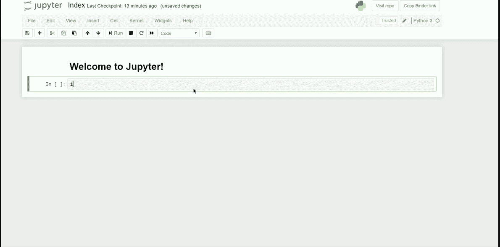

香草形式的 Jupyter 笔记本

Jupyter 笔记本是我这个数据科学家不可分割的一部分。Jupyter 笔记本能够在不同的单元格中测试我的代码，立即显示我的数字，甚至以 markdown 的形式编写必要的解释；这是任何其他 IDE 都没有的体验(或者据我所知)。

虽然我说了这些，但我意识到 Jupyter Notebook 更多的是一种探索和测试工具，而不是生产工具。我也知道使用它们的默认形式会很痛苦，特别是对于来自其他 IDE 的人来说。然而，我想展示一些我喜欢的 Jupyter 笔记本的功能，以提升我们使用 Jupyter 笔记本的体验。只需注意一点，这里的大部分扩展只有在假设您的 jupyter 笔记本使用的语言是 Python 的情况下才能正常工作。

[这里](/another-way-to-elevate-your-jupyter-notebook-experience-1965991d4269)我创建了文章的第 2 部分，作为提升您的 Jupyter 笔记本体验的附加文章。

# 降价和乳胶

对于那些不知道 Markdown 是什么的人来说，它是一种在纯文本文档中添加格式化元素的语言。Markdown 让你可以灵活地将你的纯文本转换成更有趣的文本(例如嵌入链接、图像甚至视频)

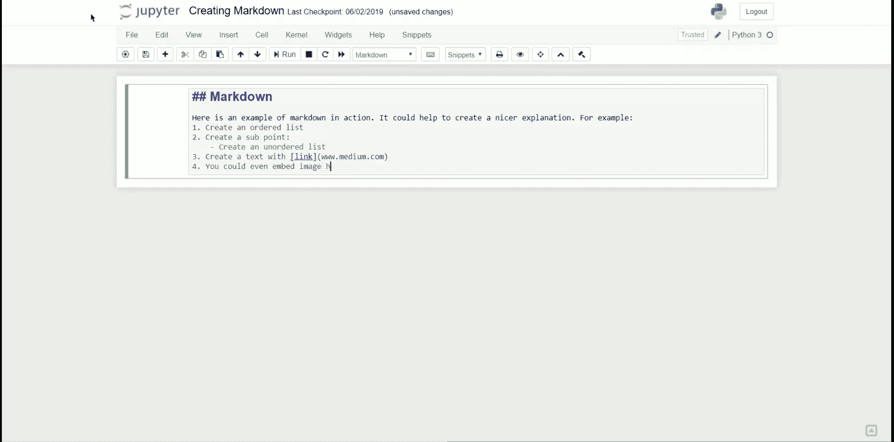

降价是如何运作的

要使用降价，我们需要将单元格切换到降价模式。我们只需要从下拉列表中选择降价选项。如果你想学习 markdown 格式中使用的所有命令，你可以在这里学习[。](https://www.markdownguide.org/)


我喜欢 Jupyter Notebook 中的 Markdown 的地方不是格式部分，而是它如何在他们的单元中实现 LaTeX。LaTeX 也是一种纯文本格式语言。具体来说，它通常用于复杂的数学表达式。


通过 Markdown 单元中的 LatEx 得出的标准偏差方程

就像 Markdown 一样，LaTeX 也有自己的规则。如果你想了解更多，这里有 LaTeX 文档的开源指南。

# 编程语言扩展

当我们通过 Anaconda 安装 jupyter 笔记本时，我们只会使用 Python 作为我们的工作语言。这就产生了一个假设，jupyter 笔记本只能与 Python 语言一起工作，如果我们想与另一种语言如 R 或 Julia 一起工作，我们应该使用另一个 IDE。这完全不是事实；我们可以在 jupyter 环境中实现其他语言。

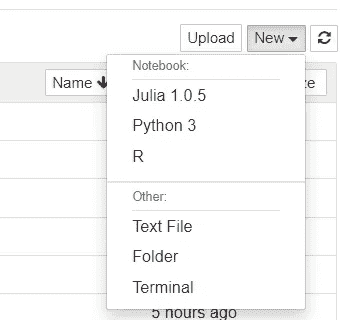

Jupyter 笔记本内核选择

例如，我们可以为 jupyter 笔记本环境嵌入一个额外的扩展，以便与 R 或 Julia 编程语言一起工作。

## 1.r 笔记本

要在我们的 jupyter 笔记本中包含 R 笔记本，我们需要遵循以下步骤:

1.  **装 R**；在 jupyter 笔记本环境中设置 R 之前，我们需要有自己的 R 编程语言。你可以在这里下载[。](https://cloud.r-project.org/index.html)
2.  **安装伊尔克内尔**；IRkernel 是一个 jupyter 内核，用于处理 jupyter 笔记本中的 R 语言。您可以通过 R 控制台输入`install.packages('IRkernel')`来安装 IRkernel。
3.  **启用 IRKernel**；为了让 jupyter 看到新安装的 IRkernel，我们需要通过 R 控制台输入`IRkernel::installspec(user = FALSE)`来启用它。

现在，我们可以在 jupyter 笔记本中使用 R 编程语言，方法是在创建新笔记本时选择 R。

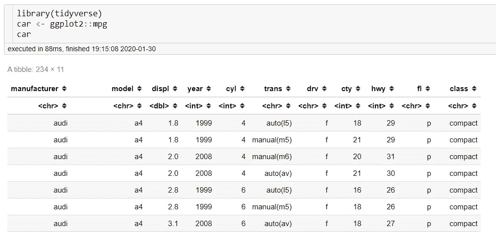

在 Jupyter 的 r

## 2.朱莉娅笔记本

朱莉娅怎么样？是的，我们还可以在 jupyter 笔记本中设置 Julia 语言。我们只需要遵循与上面类似的步骤。

1.  **安装茱莉亚**；就像 R 一样，我们需要下载 Julia 语言作为第一步。你可以在这里下载朱莉娅的作品。
2.  **安装 I Julia**；IJulia 相当于 r 中的 IRkernel。我们通过在 Julia 命令行中键入以下行来安装 IJulia:

```
using Pkg
Pkg.add("IJulia")
```

就这样，我们现在可以在 jupyter 笔记本上使用 Julia 语言了。

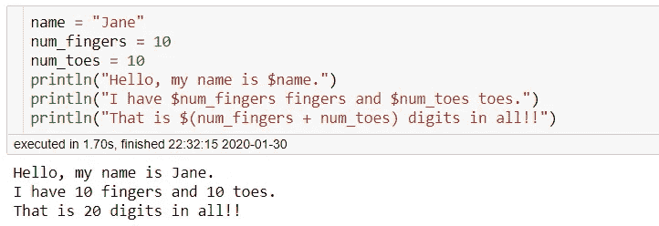

朱庇特的朱莉娅

# Jupyter 笔记本扩展

Jupyter 笔记本包含一个附件或扩展，以提高我们的生产力。 [Will Koehrsen](https://medium.com/u/e2f299e30cb9?source=post_page-----9bdd1101aa54--------------------------------) 已经就如何启用这个扩展创建了一个很棒的[帖子](/jupyter-notebook-extensions-517fa69d2231)，但是在这里我将总结安装部分并展示一些我最喜欢的扩展。

要为 Python 环境启用我们的 Jupyter 笔记本扩展，我们只需在终端中运行以下命令:

```
pip install jupyter_contrib_nbextensions && jupyter contrib nbextension install
```

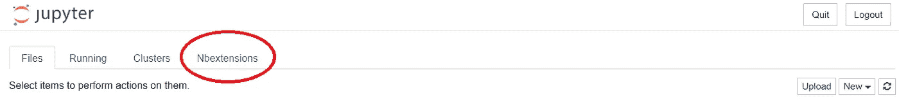

Jupyter 扩展选项卡

打开标签会给我们提供一个很好的扩展选项，如下所示。

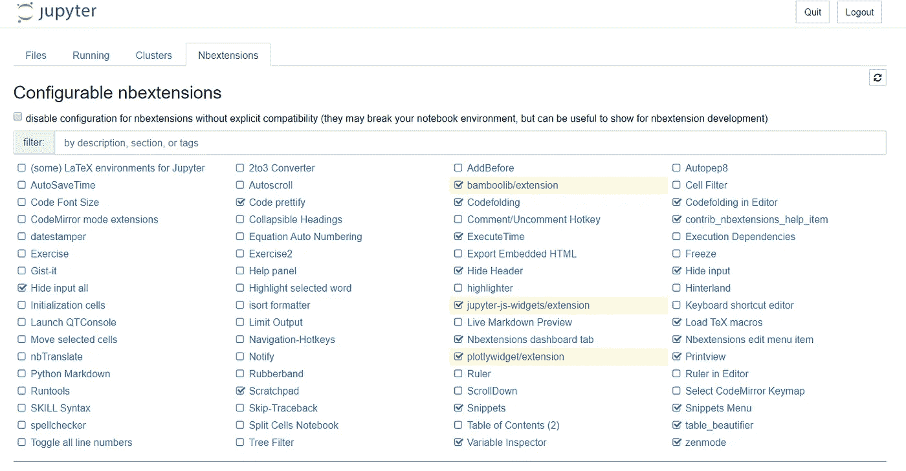

有许多扩展选项，其有用性取决于我们正在做什么样的工作，但我会展示一些我经常使用的。

## 1.执行时间

我发现执行时间扩展很有用，因为我经常测试各种代码组合，以找到运行速度最快的代码。每次我们运行当前单元格时，扩展都会出现，并且会一直保持在那里，直到我们再次运行单元格或重置笔记本。下面我用一个例子来展示一下。

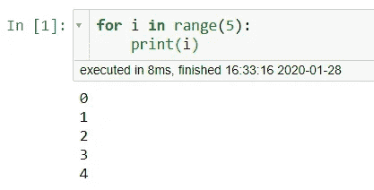

执行时间延长

当我们运行完代码后，这个扩展将为我们提供代码执行的运行时间和结束时间。

## 2.变量检查器

人们不喜欢使用 Jupyter Notebook 的原因之一是他们缺少另一个 IDE 提供的变量检查器。对于这种情况，我们有另一个名为变量检查器的扩展。

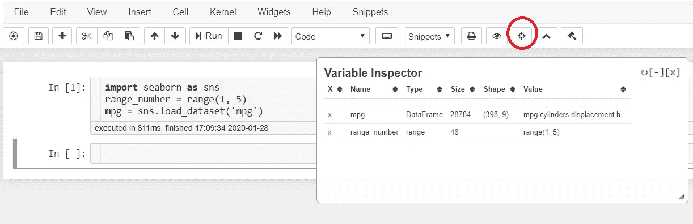

变量检查器如何工作

顾名思义，这些扩展将创建一个额外的实例来显示 jupyter 笔记本环境中的所有变量。

## 3.代码美化

只需按一下按钮，这个扩展就会重新构建我们的代码。我经常在漫长的编码过程后使用这个扩展来创建一行可读性更好、更整洁的代码。

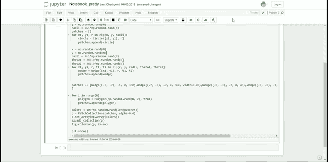

这个扩展并不总是像我们希望的那样工作。例如，如果我们已经有了一个简洁的线条，那么它根本不会改变我们的线条。

## 4.便条簿

这个扩展将创建一个独立的环境，就像我们书中的便签簿。如果我们需要一个地方进行代码实验，但又不想中断我们当前的 jupyter 环境，Scratchpad 是一个非常有用的扩展。

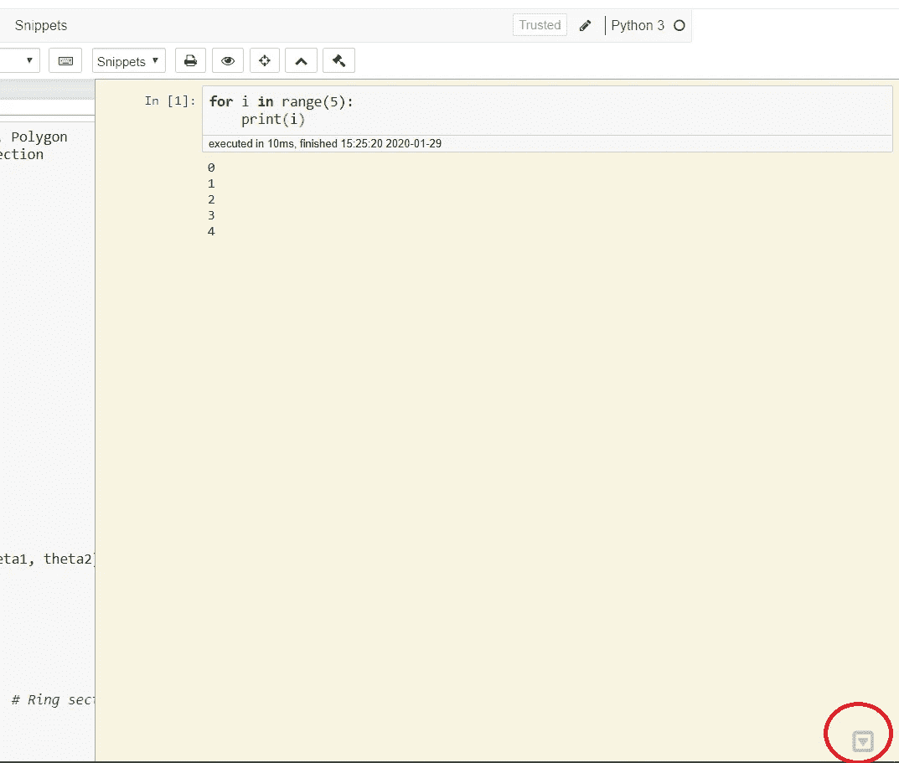

草稿栏示例，红色圆圈表示弹出草稿栏的位置

# 支持包

已经开发了许多模块来创建一种更加无缝和交互式的方式来在 Jupyter 环境中处理我们的数据。随着时间的推移，我确信这个模块列表会被开发得更多，但是这里我将展示一些我日常使用的包。

## 1.进度条

大多数时候，我们花了很多时间做循环过程，但我们甚至不知道什么时候能完成。此外，我们想知道我们的循环是否运行正常。

在这种情况下，我们可以使用 tqdm 模块提供的进度条。下面是我们 jupyter 笔记本中进度条的一个例子。

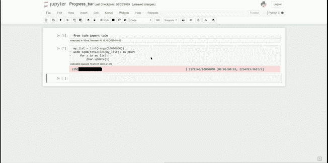

循环会话期间的进度条

我们在各自的环境中使用 pip 或 conda 来安装 tqdm 包。

`pip install tqdm`

下面是如何在我们的 jupyter 笔记本中添加进度条的代码示例。

```
#Import the module
from tqdm import tqdm#Creating the list for looping purposes
my_list = list(range(10000000))#Calling the progress bar in the jupyter noteboook
with tqdm(total=len(my_list)) as pbar:
    for x in my_list:
        pbar.update(1) #use this code to move our progress bar
```

我们通过调用带有 total 参数的 tqdm 来调用进度条，该参数接受迭代发生的次数。要移动进度条，在每次迭代中，我们需要使用 pbar.update()方法更新进度条，该方法接受增量(通常是 1)。

## 2.小工具

当我们努力探索我们的数据时，有时仅仅为了显示特定的情节而不断编辑我们的代码会是一件麻烦的事情。这肯定会阻碍我们的生产力，甚至浪费我们一些宝贵的时间。

在这里，我将展示一个交互式控件的示例，其目的是通过使用 ipywidgets 模块来更改我们的输入，而无需额外的代码编辑。

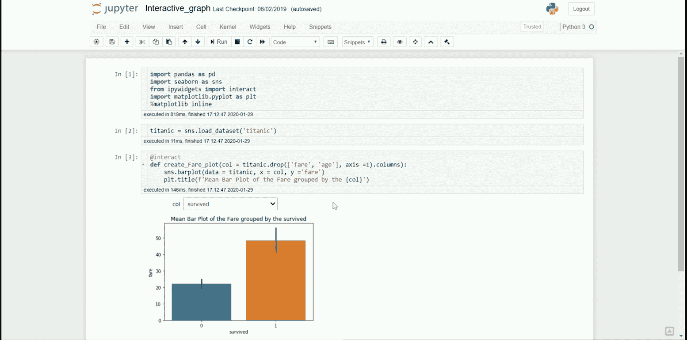

ipywidgets 如何在不编辑代码的情况下产生各种各样的情节

首先，我们通过使用通常的 pip 或 conda 来安装我们的模块。

`pip install ipywidgets`

然后，我们通过在命令提示符下键入以下代码来启用 ipywidget 模块:

```
jupyter nbextension enable --py widgetsnbextension
```

有了扩展，我们现在可以在 jupyter 笔记本中激活交互控制。这是我上面的 GIF 中的代码示例。

```
#Import all the important module
import matplotlib.pyplot as plt
import seaborn as sns
from ipywidgets import interact#load the example dataset
titanic = sns.load_dataset('titanic')
```

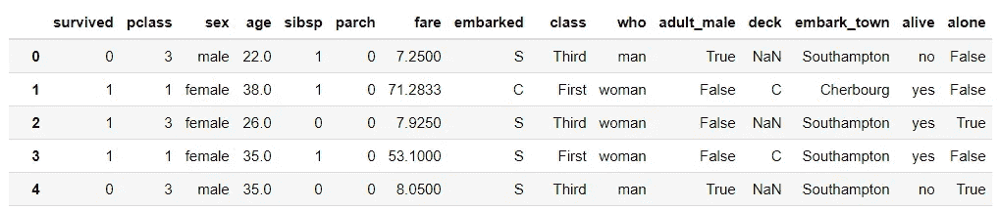

泰坦尼克号数据集

假设我有兴趣查看按数据集中每个分类组分组的票价的平均值。我们可以一个一个地过滤数据，但是这将花费很多时间，并且降低我们的生产率。因此，我们可以使用交互控件。

```
#Creating the interactive control@interact
def create_fare_plot(col = titanic.drop(['fare', 'age'], axis =1).columns):
    sns.barplot(data = titanic, x = col, y ='fare')
    plt.title(f'Mean Bar Plot of the Fare grouped by the {col}')
```

我们用“@interact”代码行启动交互，然后用 def 语句创建我们想要的交互控件。在这里，interact 小部件将为我们提供下拉列表，其中包含我们在 def 参数中输入的选项。

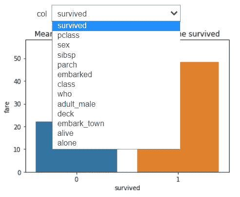

包含所有分类变量的下拉列表，用于在绘图之间切换

# 结论

以上是一些提升我们在 jupyter 笔记本上的体验的例子。我知道 jupyter 笔记本不会为了生产目的而改变 IDE，比如 Visual Studio 代码，但是我试图展示如何为了数据科学家的工作目的而改进 jupyter 环境。

# 如果您喜欢我的内容，并希望获得更多关于数据或数据科学家日常生活的深入知识，请考虑在此订阅我的[简讯。](https://cornellius.substack.com/welcome)

> 如果您没有订阅为中等会员，请考虑通过[我的介绍](https://cornelliusyudhawijaya.medium.com/membership)订阅。