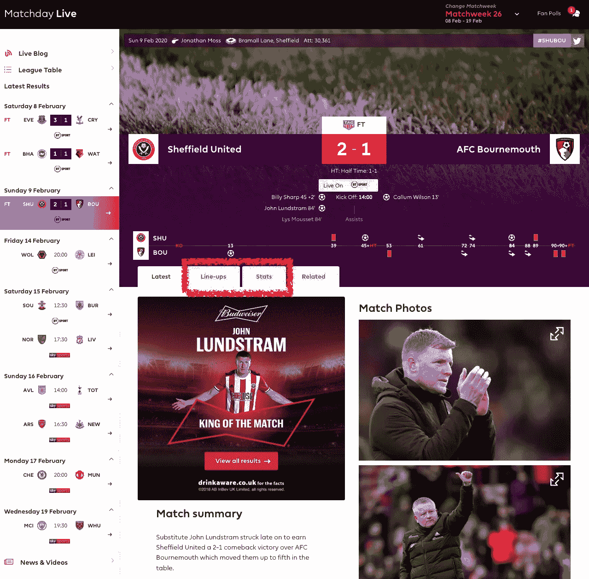
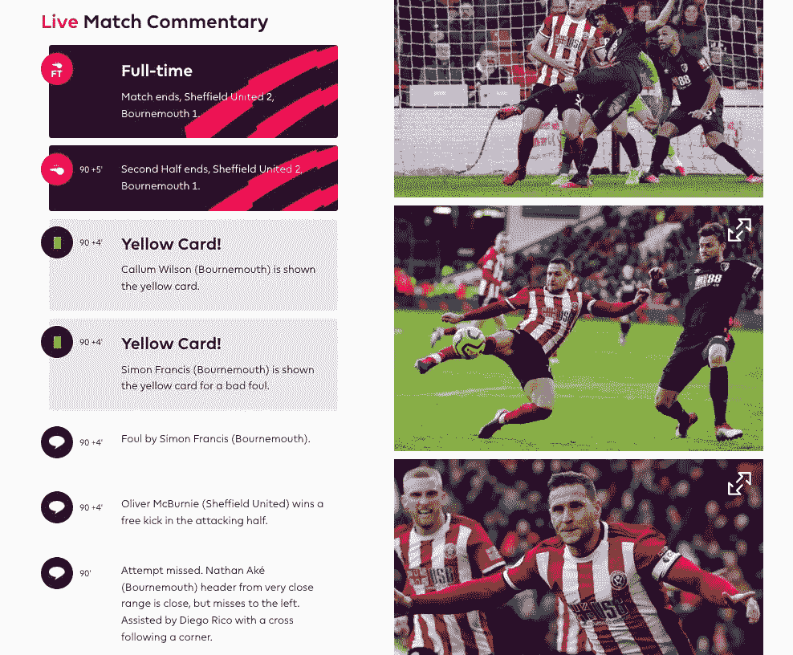
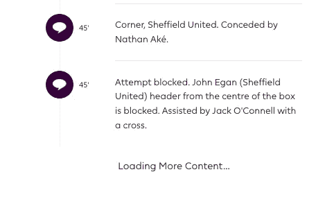
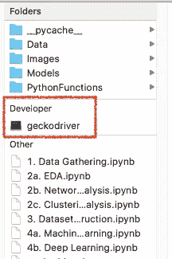
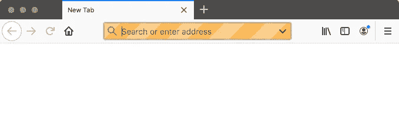
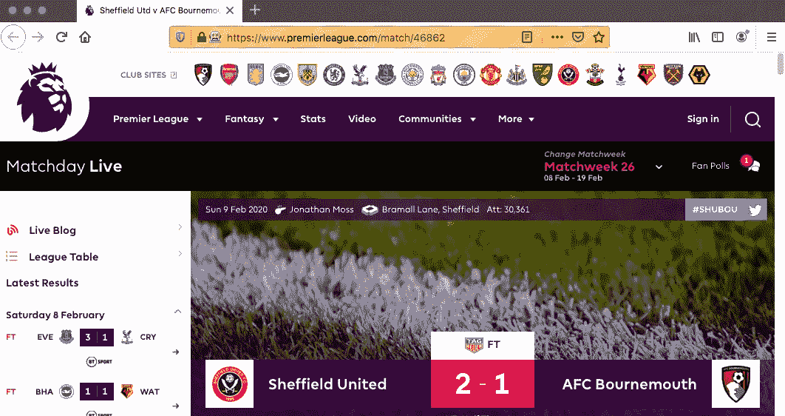
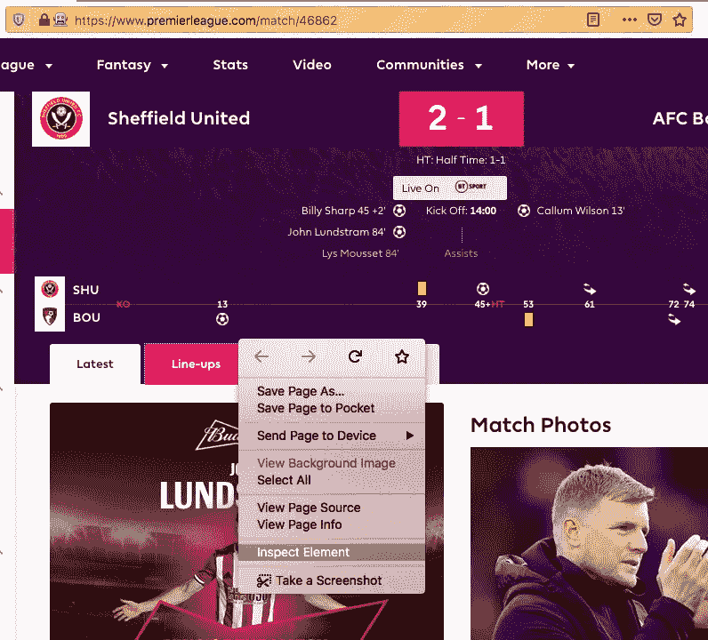
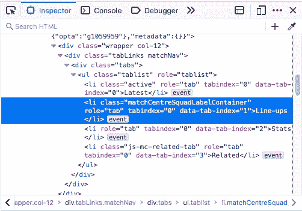
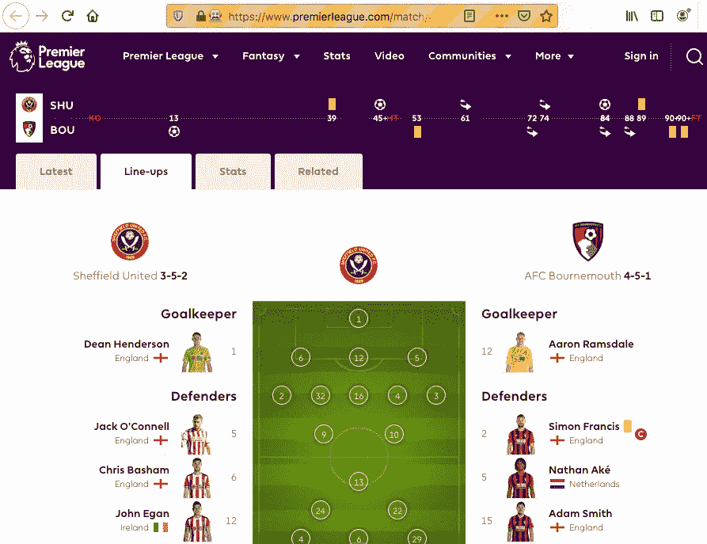
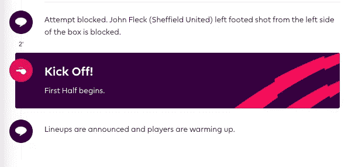

# 用 Splinter 提升你的网络抓取

> 原文：<https://towardsdatascience.com/elevate-your-webscraping-with-splinter-a926eee7f7d9?source=collection_archive---------10----------------------->

## [按目标](https://towardsdatascience.com/tagged/on-target)

## 通过自动化与网页的交互，从您的抓取中获得更好的数据


图像-像素

在以前的博客中，我使用两个包的组合探索了网络抓取的基础；*请求*，它获取一个网站的 HTML 和 *BeautifulSoup4* ，它解释那个 HTML。

[](/soup-of-the-day-97d71e6c07ec) [## 今日汤

### 美汤网刮——初学者指南

towardsdatascience.com](/soup-of-the-day-97d71e6c07ec) 

这些包很好地介绍了 webscraping，但是 Requests 有局限性，尤其是当您想要抓取的站点需要大量用户交互时。

提醒一下——Requests 是一个 Python 包，它将 URL 作为参数，并在第一次跟踪该 URL 时返回立即可用的 HTML。因此，如果你的目标网站只是在特定的交互之后才加载内容(比如滚动到页面底部或者点击一个按钮)，那么请求就不是一个合适的解决方案。

对于我在我的目标系列[中记录的](https://towardsdatascience.com/tagged/on-target) [FPL 项目](/how-to-moneyball-soccer-46b589429748)，我需要从英超联赛网站的[结果页面](https://www.premierleague.com/match/46862)中收集比赛数据。这些对请求提出了一些挑战。例如，我想要每个比赛页面上的“阵容”和“统计”标签中的数据，但是，这些数据不会加载新网页。相反，它们触发 JavaScript 事件，在同一个页面中加载新的 HTML。



我还想抓取比赛评论，可以通过向下滚动页面进入…



…但只有当用户继续向下滚动时才会完全加载(类似于脸书和 Reddit 等“无限滚动”网站)。



# 用碎片刮擦

我们可以使用一个名为 [Splinter](https://splinter.readthedocs.io/en/latest/) 的 Python 包来代替请求抓取。Splinter 是其他浏览器自动化工具之上的一个抽象层，比如 [Selenium，](http://seleniumhq.org)它保持了良好的用户友好性。此外，一旦我们用 Splinter 抓取了 HTML，BeautifulSoup4 可以从其中提取数据，就像我们使用请求一样。

首先，我们需要为我们想要使用的浏览器下载合适的浏览器“驱动程序”。对于 Firefox 来说，这意味着使用 Mozilla 的 [geckodriver](https://github.com/mozilla/geckodriver/releases) (注意——Splinter 默认使用 Firefox)。如果你用的是 Chrome，那么你需要 [chromedriver](https://chromedriver.chromium.org/) 。

您还需要使用您机器的终端 pip 安装 selenium(完整的细节包含在 [Splinter 文档](https://splinter.readthedocs.io/en/latest/drivers/chrome.html)中):

```
$ [sudo] pip install selenium
```



同样值得注意的是，驱动文件本身(即 geckodriver 或 chromedriver)需要包含在您的 repo 的根目录中(这在 Splinter 或 Firefox 文档中都不是一个明显的要求！)

Splinter 的工作原理是实例化一个“浏览器”对象(如果你愿意，它会在你的桌面上启动一个新的浏览器窗口)。然后，我们可以在 Jupyter Notebook 上运行方法，与浏览器进行交互。

```
from splinter import Browser***#State the location of your driver***
executable_path = {"executable_path": "/Users/Callum/Downloads/geckodriver"}***#Instantiate a browser object as follows...
#Pass 'headless=False' to make Firefox launch a visible window*** browser = Browser("firefox", **executable_path, headless=False)
```

这将启动一个空的浏览器窗口。



注意橙色条纹的地址栏，它告诉我们它是由我们的 Python 文件控制的

我们现在可以用一些 Python 命令来控制这个浏览器。首先，让它访问一个网页…

```
match_url = 'https://www.premierleague.com/match/46862'browser.visit(match_url)
```

查看我们桌面上的浏览器窗口，我们可以看到这已经工作了！



# 与元素交互

现在我们已经加载了网站，让我们来解决请求无法处理的两个问题。首先，我们想点击“阵容”和“统计”标签。

为此，我们首先需要了解这些元素在 HTML 中是如何被引用的。右键单击按钮，并选择“检查元素”。



我们可以在检查器中找到合适的 HTML。



所以按钮是一个有序列表元素

*   ，带有类“matchcentresquantlabelcontainer”。

Splinter 可以用。find_by_tag()方法。然后我们可以用[点击这个按钮。点击()](https://splinter.readthedocs.io/en/latest/mouse-interaction.html#click)方法。

```
target = ‘li[class=”matchCentreSquadLabelContainer”]’browser.find_by_tag(target).click()
```

注意 Splinter 可以使用六种不同的东西来查找元素。这些在这里有完整的文档[，但是包括通过元素 ID、CSS 或值进行查找的选项。](https://splinter.readthedocs.io/en/latest/finding.html)



现在浏览器已经‘点击’了我们想要的标签，我们可以使用 BeautifulSoup4 来获取和存储 HTML。

```
from bs4 import BeautifulSoup
html = BeautifulSoup(browser.html, 'html.parser')
```

然后，我们可以使用我之前的博客[中记录的相同技术提取我们想要的文本信息。](/soup-of-the-day-97d71e6c07ec)

当然，如果我们还想单击“Stats”选项卡，我们会执行相同的过程—使用 Inspect Element 工具检查该选项卡是如何被调用的，然后在使用 BeautifulSoup 提取 HTML 之前，在. find_by_tag()方法中传递它。

# 解决无限滚动问题

虽然 Splinter 的 Browser 类没有内置的“滚动”方法，但它有一个更强大的功能让我们可以做到这一点——也就是说，我们可以使用[。execute_script()方法](https://splinter.readthedocs.io/en/latest/api/driver-and-element-api.html#splinter.driver.DriverAPI.execute_script)运行 JavaScript。

为了让浏览器滚动到当前加载页面的底部，我们使用了 [JavaScript scrollTo()方法](https://www.w3schools.com/jsref/met_win_scrollto.asp)。它将 *x* 和 *y* 位置作为它的参数，所以为了到达页面的末尾，我们将‘document . body . scroll height’作为 *y* 位置(我们不需要改变 *x* 位置，因为我们只是在垂直方向上滚动)。

因此，我们运行:

```
browser.execute_script("window.scrollTo(0, document.body.scrollHeight);")
```

可能的情况是，在我们需要的所有东西加载之前，我们需要继续滚动。由于不同的比赛会有不同数量的事件，我们将需要在每一页上做不同数量的滚动。因此，我们需要某种条件来告诉我们的代码停止滚动。

令人高兴的是，英超网站上的评论总是以“阵容公布，球员热身”这句话开始。



因此，如果我们抓取的 HTML 包含这个短语，那么我们知道我们已经得到了我们需要的所有评论，我们可以停止滚动。这是一个适合“while 循环”的任务。

```
***#Declare the JavaScript that scrolls to the end of the page...***
scrollJS = "window.scrollTo(0, document.body.scrollHeight);"***#...and a variable that signifies the loop's end-condition***
condition = "Lineups are announced and players are warming up."***#Instantiate a 'first_content' variable (an empty string for now)*** first_content = ""***#Create a while loop that runs when 'first content'
#is not equal to our break condition***
while first_content != condition: ***#Scroll to the bottom of the page***
    browser.execute_script(scrollJS) ***#Use BS4 to get the HTML***
    soup = BeautifulSoup(browser.html, 'html.parser') ***#Store the first line of commentary displayed on the page as-is***
    first_content = soup.findAll('div',class_="innerContent")[-1].get_text() **#Scroll down again, and run the loop again if we
    #haven't reached the line "Lineups are announced..."**
    browser.execute_script(scrollJS)***#Store the soup that, thanks to the while loop, will
#definitely contain all of the commentary***
HTML = soup
```

然后，我们可以重构上面的所有内容，创建一个函数来接收匹配的 URL，并返回来自比赛评论的所有 HTML，以及来自阵容和统计选项卡的数据。因此，我们可以自动抓取本赛季到目前为止的所有比赛页面。当然，我们如何组织、存储和操纵这些数据完全是另一项任务(事实上，也是另一篇即将发表的博客的主题)。

值得一提的是，就 Splinter 的功能而言，这只是冰山一角。其他有趣的使用案例包括:

*   [输入文本字段](https://splinter.readthedocs.io/en/latest/elements-in-the-page.html#interacting-with-forms)
*   [操作 cookie](https://splinter.readthedocs.io/en/latest/cookies.html)
*   [截图](https://splinter.readthedocs.io/en/latest/screenshot.html)
*   [拖放元素](https://splinter.readthedocs.io/en/latest/mouse-interaction.html#drag-and-drop)
*   当然，你可以用标准 JavaScript 做任何事情。

无论如何，Splinter 是一个很棒的小 Python 包，它将帮助你把你的网络抓取提升到一个新的水平！试一试，看看你有什么想法。

> 这是我的博客系列“目标”中的最新一篇文章，在这篇文章中，我将尝试构建一个“摇钱树”梦幻英超联赛的模型。我很乐意听到关于这个博客的任何评论，或者这篇文章涉及的任何概念。欢迎在下面留言，或者通过 [LinkedIn](https://www.linkedin.com/in/callum-ballard/) 联系我。