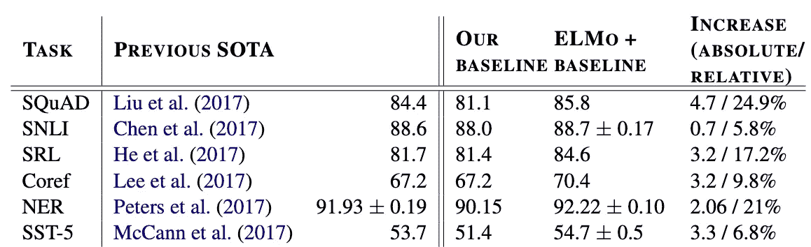

# ELMo:为什么这是 NLP 最大的进步之一

> 原文：<https://towardsdatascience.com/elmo-why-its-one-of-the-biggest-advancements-in-nlp-7911161d44be?source=collection_archive---------19----------------------->

## 语言模型嵌入(ELMo)是一种先进的语言建模思想。是什么让它如此成功？

2018 年发布的“深度语境化单词嵌入”提出了从语言模型嵌入(ELMo)的想法，在许多热门任务上实现了最先进的性能，包括问答、情感分析和命名实体提取。ELMo 已经被证明可以提高近 5%的性能。但是是什么让这个想法如此具有革命性呢？

[创作的](https://www.flickr.com/photos/40486157@N00)[《Elmo 近距离》](https://www.flickr.com/photos/40486157@N00/3438225685)在 2.0 的 [CC 下授权](https://creativecommons.org/licenses/by/2.0/?ref=ccsearch&atype=rich)

**ELMo 是什么？ELMo 不仅是一个提线木偶，还是一个强大的计算模型，可以将单词转换成数字。这一重要过程允许机器学习模型(接受数字，而不是单词作为输入)根据文本数据进行训练。**

**ELMo 为什么这么好？**当我通读原文时，有几个要点引起了我的注意:

1.  ELMo 说明了一个单词的上下文。
2.  ELMo 是在大型文本语料库上训练的。
3.  ELMo 是开源的。

让我们详细讨论这些要点，并谈谈它们为什么重要。

**#1: ELMo 可以唯一说明一个单词的上下文。**以前的语言模型，如 GloVe、Bag of Words 和 Word2Vec，只是基于单词的字面拼写生成嵌入。他们不考虑这个词的用法。例如，在以下示例中，这些语言模型将为“信任”返回相同的嵌入:

> 我不能信任你。
> 
> 他们不再信任他们的朋友。
> 
> 他有一个信托基金。

然而，ELMo 根据周围的单词为同一个单词返回不同的嵌入——它的嵌入是*上下文相关的*。在这些例子中，它实际上会为“信任”返回不同的答案，因为它会识别出这个词在不同的上下文中使用。这种独特的能力本质上意味着 ELMo 的嵌入有更多的可用信息，因此性能可能会提高。一个类似的考虑上下文的语言建模方法是 [BERT](https://arxiv.org/pdf/1810.04805.pdf) 。

埃尔莫接受了大量数据的训练。无论你是一名资深的机器学习研究人员还是一名不经意的观察者，你可能都熟悉大数据的力量。最初的 ELMo 模型是在 55 亿词的语料库上训练的，即使是“小”版本也有 10 亿词的训练集。数据真多啊！在如此多的数据上接受训练意味着 ELMo 学到了大量的语言知识，并将在广泛的数据集上表现良好。

**#3:任何人都可以使用 ELMo！**推动机器学习作为一个领域发展的最重要因素之一是开源研究的文化。通过开源代码和数据集，研究人员可以让该领域的其他人轻松应用和建立现有的想法。按照这种文化，ELMo 是广泛开源的。它有一个[网站](https://allennlp.org/elmo)，不仅包括它的基本信息，还包括该型号的小型、中型和原始版本的下载链接。希望使用 ELMo 的人绝对应该访问这个网站，快速获得该模型的副本。此外，代码[发布在 GitHub](https://github.com/allenai/allennlp) 上，包括一个非常详尽的自述文件，让用户知道如何使用 ELMo。如果有人花了几个多小时才让一个 ELMo 模型运行起来，我会感到很惊讶。

ELMo 在著名的任务上实现了最先进的性能，例如 SQuAD、NER 和 SST。图片来源于 Peters 等人，ELMo 论文的原始作者。

ELMo 是上下文感知单词嵌入和大数据的强大组合，在 NLP 的大数据集上取得了一流的性能，包括 SQuAD、NER 和 SST。ELMo 彻底改变了我们处理计算语言学任务的方式，如问答和情感检测，这显然是该领域的一个关键进步，因为它被引用了 4500 多次。此外，向计算语言学协会(ACL)会议(最大的国际 NLP 会议)提交的论文在 ELMo 发表后翻了一番，从 2018 年的 1，544 篇论文增加到 2019 年的 2，905 篇论文(尽管这也可能归因于 2019 年初 BERT 的发表)。

我还想指出，埃尔默和伯特非常相似，因为他们都来自芝麻街！好吧，它们都是语言模型，说明了一个单词的上下文，在一个大的数据集上训练，并且正如我们所知，正在彻底改变自然语言处理领域。(我也写了一篇关于 BERT 的博文，如果你感兴趣，可以在这里找到)。

ELMo 是 NLP 中最大的进步之一，因为它本质上是第一个关注上下文的语言模型，允许在多个任务中实现更好的性能。

延伸阅读:

*   [Peters 等人的原始论文](https://arxiv.org/pdf/1802.05365.pdf)
*   [ELMo 的网站，其中包括它的下载链接。](https://allennlp.org/elmo)
*   [BERT，一个使用上下文嵌入的类似语言模型。](https://arxiv.org/pdf/1810.04805.pdf)