# Elo 商家类别推荐——机器学习案例研究

> 原文：<https://towardsdatascience.com/elo-merchant-category-recommendation-a-case-study-33e84b8465c7?source=collection_archive---------28----------------------->


图片由[弗雷姆基·查马基](https://unsplash.com/photos/1K6IQsQbizI?utm_source=unsplash&utm_medium=referral&utm_content=creditShareLink)拍摄

在当今的现代，机器学习几乎涉及到我们生活的方方面面。从提供电影和产品推荐这样简单的事情到利用商业数据为组织推断和做出商业决策这样复杂的事情，机器学习和人工智能在过去几十年里已经走过了漫长的道路。今天，我将讨论一个关于 Elo Merchant 类别推荐的例子——一个我喜欢从事的机器学习(ML)案例研究。

# 案例研究概述:

案例研究方法分为以下步骤:

*   商业问题
*   ML 问题公式化
*   探索性数据分析
*   特征工程
*   特征关联和特征选择
*   回归模型
*   结论和结果

# 商业问题

Elo 是巴西最大的支付品牌之一。它们为用户提供餐馆推荐以及基于用户的信用卡提供商和餐馆偏好的折扣。Elo 与各种品牌建立了合作关系，为用户提供来自不同商家的促销和折扣。

现在，我们手头的问题是找出这些促销对商家以及用户(顾客)有多大的用处和益处。我们需要弄清楚顾客是否真的使用了提供给他们的这些促销或折扣。这可以通过预测一个称为客户忠诚度得分的指标来实现，该指标是目标变量。因此每张卡都有相应的预测忠诚度得分。

客户忠诚度得分将让我们了解用户/客户使用这些促销和折扣的频率。有了预测数据，公司(Elo)现在可以专注于更忠诚的客户。这意味着他们可以将他们的营销努力指向这些忠诚的客户。这也将确保 Elo 减少针对预计客户忠诚度较低的客户的不必要的营销活动。这将最终提高客户保持率。

# ML 问题公式化

尽管顾名思义，这是一个回归问题，因为对于给定的卡 ID，我们需要根据卡的交易和商户数据来预测它的忠诚度得分。因此，我们将根据这些数据生成的特征来训练我们的回归模型。然后，这些回归模型将根据生成的特征预测忠诚度得分。

## 数据概述

所有数据都是模拟的和虚构的，并不是真实的客户数据，原因很明显。所提供的数据包含每个卡 ID 长达 3 个月的交易数据。它还包含基于这些交易中涉及的商家的商家数据。还有一个附加文件，其中包含另外 2 个月的所有购买/交易数据，这些数据不包括在 3 个月的初始交易数据中。以下是每个文件的详细描述:

1.  **Data_Dictionary.xlsx** →该文件包含每个 csv 文件的数据字段描述。
2.  **train.csv 和 test.csv** →这些文件包含卡 id(Card _ id)和关于卡的信息。它们还包含需要预测的目标变量(忠诚度得分)。下面是对每个列的描述:

```
*card_id* → Unique card identifier
*first_active_month* → month of first purchase in 'YYYY-MM' format
*feature_1* → Anonymized card categorical feature
*feature_2*→ Anonymized card categorical feature
*feature_3* → Anonymized card categorical feature
*target* → Loyalty numerical score calculated 2 months after historical and evaluation period
```

3. **historical_transactions.csv 和 new _ merchant _ transactions . CSV**→这些文件包含交易数据。它们包含每张卡的交易信息。下面是对每个列的描述:

```
*card_id* → Card identifier
*month_lag* → month lag to reference date
*purchase_date* → Purchase date
*authorized_flag* → 'Y' if approved, 'N' if denied
*category_3* → anonymized category
*installments* → number of installments of purchase
*category_1* → anonymized category
*merchant_category_id* → Merchant category identifier(anonymized)
*subsector_id* → Merchant category group identifier(anonymized)
*merchant_id* → Merchant identifier(anonymized)
*purchase_amount* → Normalized purchase amount
*city_id* → City identifier(anonymized)
*state_id* → State identifier (anonymized)
*category_2* → anonymized category
```

4. **merchants.csv** →该文件包含交易中涉及的商家的附加信息。下面是对每个列的描述:

```
*merchant_id* → Unique merchant identifier
*merchant_group_id* → Merchant group(anonymized)
*merchant_category_id* → Unique identifier for merchant category (anonymized)
*subsector_id* → Merchant category group (anonymized)
*numerical_1* → anonymized measure
numerical_2 → anonymized measure
*category_1* → anonymized category
*category_2* → anonymized category
*category_4* → anonymized category
*city_id* → City identifier(anonymized)*most_recent_sales_range* → Range of revenue (monetary units) in last active month (A > B > C > D > E) *most_recent_sales_range* → Range of revenue (monetary units) in last active month (A > B > C > D > E)
*most_recent_purchases_range* → Range of quantity of transactions in last active month (A > B > C > D > E)*avg_sales_lag3* → Monthly average of revenue in last 3 months divided by revenue in last active month
*avg_purchases_lag3* → Monthly average of transactions in last 3 months divided by transactions in last active month
*active_months_lag3* → Quantity of active months within last 3 months*avg_sales_lag6* → Monthly average of revenue in last 6 months divided by revenue in last active month
*avg_purchases_lag6* → Monthly average of transactions in last 6 months divided by transactions in last active month
*active_months_lag6* → Quantity of active months within last 6 months*avg_sales_lag12* → Monthly average of revenue in last 12 months divided by revenue in last active month
*avg_purchases_lag12* → Monthly average of transactions in last 12 months divided by transactions in last active month
*active_months_lag12* → Quantity of active months within last 12 months
```

所有的数据文件都可以从[这个链接](https://www.kaggle.com/c/elo-merchant-category-recommendation/data)下载。

## 绩效指标

为了根据实际忠诚度得分计算预测误差，我们将使用的性能指标是 [RMSE(均方根误差)](https://en.wikipedia.org/wiki/Root-mean-square_deviation)。

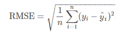

作者图片

这里，ŷ是预测的忠诚度得分，y 是每个卡 ID 的实际忠诚度得分。

# 探索性数据分析

## 培训和测试文件

1.  **目标变量分布:**

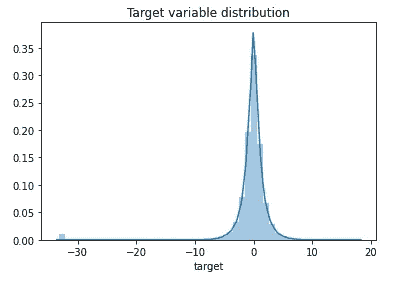

目标变量分布(作者图片)

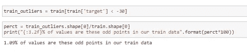

大多数忠诚度得分在-1 和 1 之间。同样，这些都以零为中心。所以有可能这些已经标准化了。

正如我们所见，有些点离所有的点都很远。这些人的忠诚度低于-30。因为这些点构成了数据的 1%,所以它们不能被称为异常值。这完全取决于这些点是否出现在我们的测试数据中。正如我们在后面的阶段会知道的，我们在测试数据中确实有这些点。所以，我们称它们为稀有数据点。

**2。分类特征**

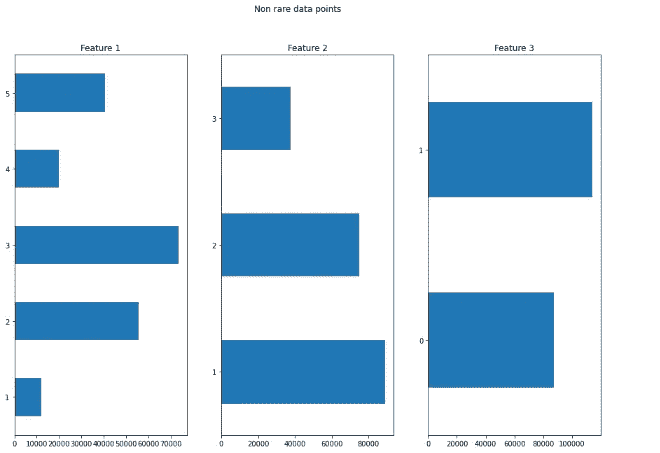

非稀有数据点的分类特征分布(图片由作者提供)

让我们来看看这些稀有数据点的分类特征..

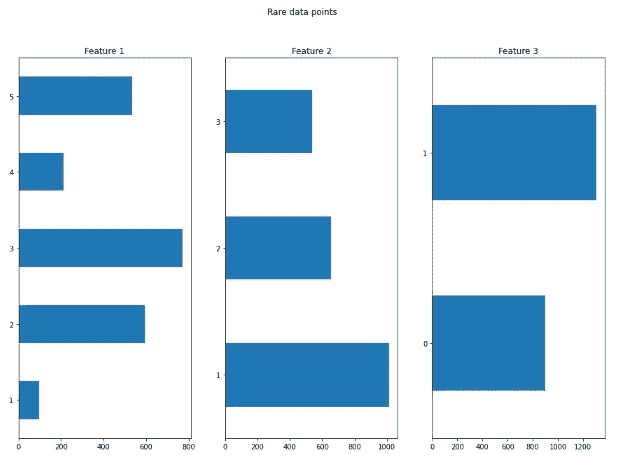

稀有数据点的分类特征分布(图片由作者提供)

对于稀有和非稀有数据点，分类特征 1、2 和 3 之间没有太大差异。从历史交易和商家交易中提取特征可能有助于更好地预测这些罕见的忠诚度得分

**3。第一个活跃月份**

因为这是以“YYYY-MM”格式给出的。让我们把它转换成一个简单的度量，比如从今天算起的月差。在 pandas 中使用 datetime 实现这一点非常简单。

现在，我们可以根据忠诚度得分(目标)来绘制这个图表..

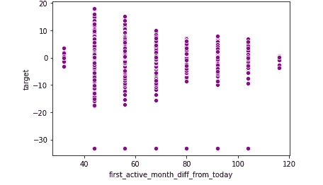

忠诚度得分与第一个活跃月的月差散点图(图片由作者提供)

*   我们可以在这里观察到一种趋势，即最近的用户具有更高的忠诚度得分以及忠诚度得分的高方差。
*   然而，这也表明，与长期用户相比，近期用户的数量更多。
*   一个更重要的观察结果是忠诚度得分为<=-30(that might be outliers) are at the very bottom of the plot for each of the bin/value ranges of the active month difference from today. This shows that this feature might not be useful enough to separate our rare data points from the actual data.
*   This feature would definitely help in predicting the loyalty scores.

## Historical Transactions

1.  **授权标志**的用户数量

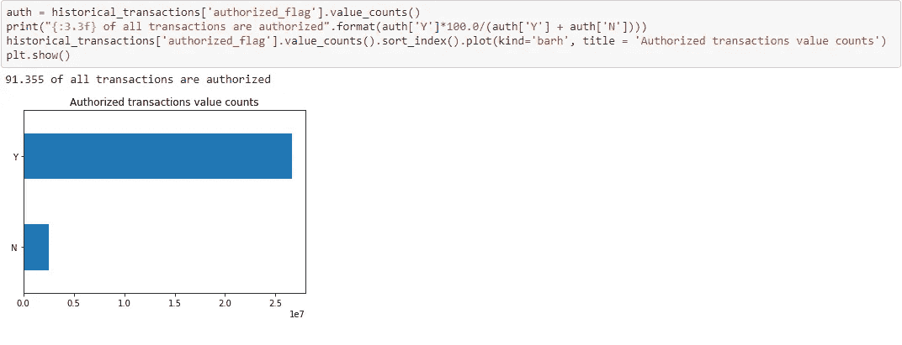

(图片由作者提供)

正如应该的那样，大多数交易都是经过授权的。

2.**分期付款**

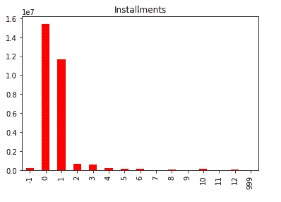

分期付款分布(作者图片)

对于分期付款来说，值-1 和 999 似乎有些奇怪。如果需要的话，我们以后可能需要修剪这些。

3.**购买金额**

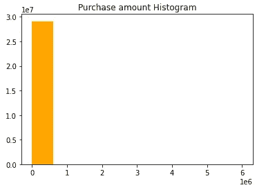

(图片由作者提供)

似乎这些也已经标准化了。

## 新商户交易

据观察，该文件不包含任何未经授权的交易。

分期付款和购买金额的分布与我们在历史交易中观察到的非常相似。

## 根据忠诚度得分绘制购买金额和分期付款

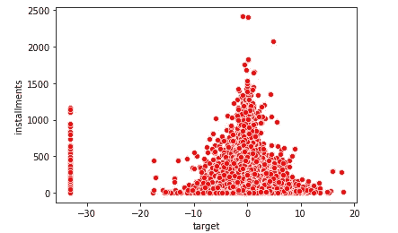

分期付款与忠诚度得分(目标)的散点图(图片由作者提供)

由于目标分数似乎是标准化的(在某个范围内)，观察到具有较高分期付款次数的人具有更接近于零的忠诚度分数。

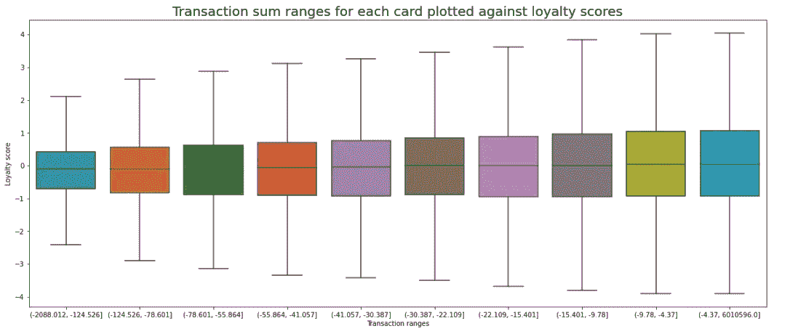

(图片由作者提供)

*   正如我们在这里看到的，忠诚度得分随着交易价值总额的增加而增加。
*   对于每个 card_id 进行的交易数量也观察到相同的趋势。

## 商户数据

该文件的列中有许多缺失值和无穷大值。无穷大值被替换为空值。然后，相应地使用均值和众数插补来处理这些缺失值。

1.  **匿名类别**

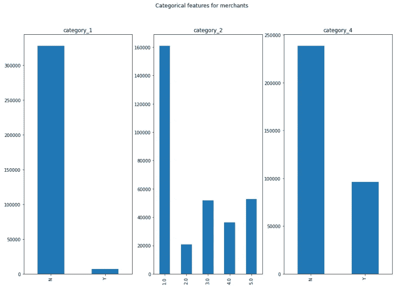

(图片由作者提供)

*   因为这三个特征都是匿名的，所以我们不能从这些情节中说太多关于商人的事情，尽管从这些情节中可以解释很多。
*   然而，可以进一步探索和检查，如果交易中涉及的商家属于多数类别，那么它可能导致什么样的忠诚度得分。

2.**活跃月滞后**

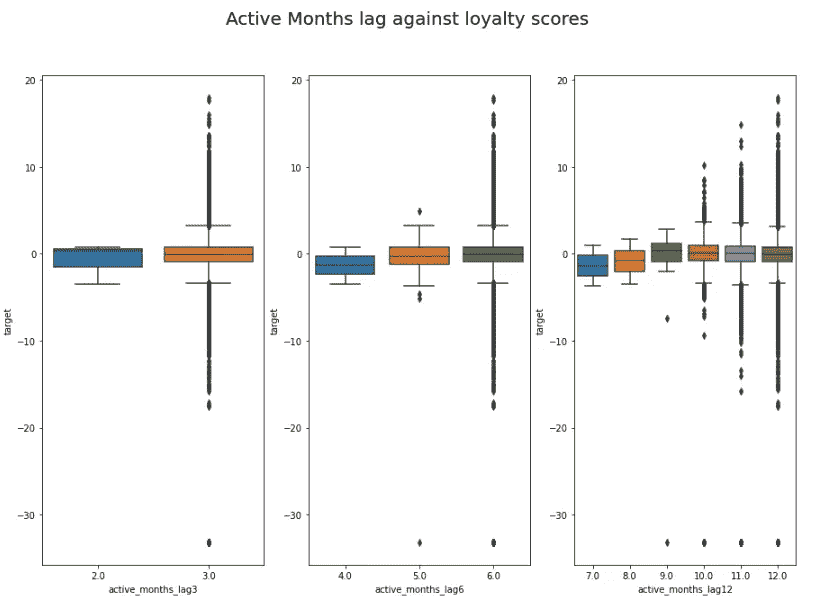

(图片由作者提供)

*   正如我们在这里所观察到的，活动月数较少的卡忠诚度较低。
*   我们可以在这里看到很多差异。这些活跃月份列可能是有用的特性。

3.**平均购买量滞后**

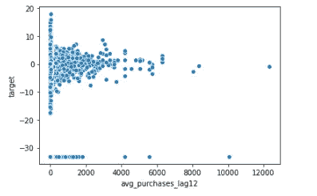

(图片由作者提供)

*   对于我们的稀有数据点(忠诚度得分<=-30), the purchase range lag is less than 2000.
*   This can be a very useful feature as well for predicting the loyalty scores.

## EDA Summary:

1.  The target variable(Loyalty score) has 1% of its points that seem like outliers. Dealing with these points depends on the number of these points in the test data. In that case, these aren’t actually outliers. They can be termed as Rare data points. However, the loyalty score would be difficult to predict for these points and they could have a major impact on our final scores.
2.  The first active month in train file could be very useful.
3.  Aggregated transaction features for each card would be very helpful in predicting the loyalty score using the regression models. Most of our features would be from the transaction files.
4.  Some features can be used from the merchants file as well. For example, we can have a categorical variable that states if the transaction involved a merchant that was active in the last 3/6 or 12 months. The average purchases and sales ranges might be useful as well.

# Data Preprocessing

Data Preprocessing included imputing the missing values with either mean and mode for categorical and continuous variables respectively.

In case of Purchase amounts, this issue was handled by trimming the purchase amount values in a specific range that covered up to 99.9 percentile of its values.

As observed earlier, the installments values such as -1 and 999 were replaced with nan(null value) and imputed accordingly.

```
historical_transactions['purchase_amount'] = historical_transactions['purchase_amount'].apply(**lambda** x: min(x, 0.8))
historical_transactions['installments'].replace([-1, 999], np.nan, inplace=**True**)
historical_transactions['installments'].fillna(historical_transactions['installments'].mode()[0], inplace=**True**)
```

# Feature Engineering

The Feature Engineering for this problem was done in two iterations. In the *第一次迭代*，两个事务文件都被合并到一个包含所有事务的文件中，并且使用这个合并文件生成特征。从这些特征获得的 RMSE 分数不够好。

因此，我不得不回到特征工程，分别从这两个文件中提取特征。与此同时，在第二次*迭代*中也产生了额外的特性。这将 RMSE 分数提高了约 0.35。

## 处理日期功能

purchase_date 和 first_active_month 在生成额外的特性方面非常有用，例如一年中的季度和从今天开始的月份差异。在 Pandas 中使用 datetime 可以很容易地做到这一点。

类似地，对于 purchase_date，我们生成了指示购买是在周末、假日还是工作日进行的特性。这还包括诸如月、年、日、时间和购买时间等特征。

## 处理分类特征

两种方法用于分类特征:

1.  一个热编码
2.  平均编码

在第一次迭代中使用了一个热编码。然而，在特征工程的*第二次迭代*之后，均值编码提供了更好的结果。分类变量的均值编码是基于相应目标变量的值是否小于-30(是稀有数据点)来完成的。这样做是为了改进对稀有数据点的预测。

使用基于变量的平均值、最大值、最小值、var、偏斜和 n_unique/count，通过“card_id”聚合来自交易的特征，以最终与训练和测试文件结合。

使用现有的特性和可用的领域专业知识生成了更多的特性。其中一些如下所示:

最终总共生成了 226 个特征。

**特征关联和特征选择:**

由于我们已经生成了近 200 个特征，相关矩阵看起来像这样..

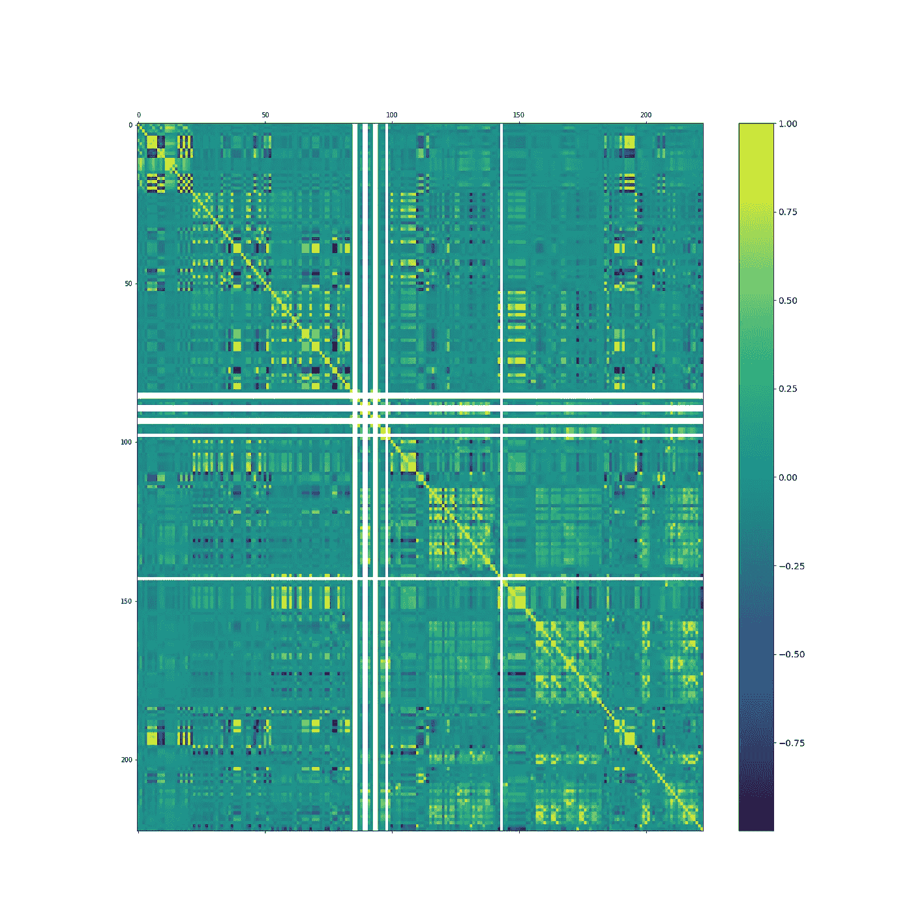

相关矩阵(图片由作者提供)

呀！！这看起来不太好。

很难从中解读出什么，因为我们有大量的特征。因此，使用相关矩阵采取了一种稍微不同的方法。

阈值设置为 0.85，并且移除了共线性高于阈值的特征对中的一个特征。这种方法将特性的数量从 226 个减少到了 134 个。

# 回归模型

## 基线回归模型

初始模型使用 RandomizedSearchCV 和 GridSearchCV 进行调整，并根据训练测试拆分后获得的训练数据进行训练。

**线性回归:**

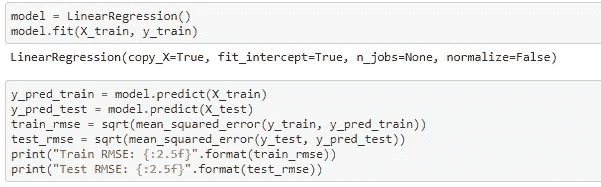

线性回归(作者图片)

**新币回归量:**

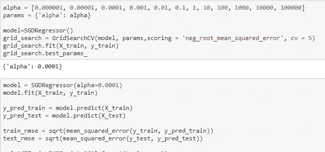

新币回归(图片由作者提供)

**随机森林回归量:**

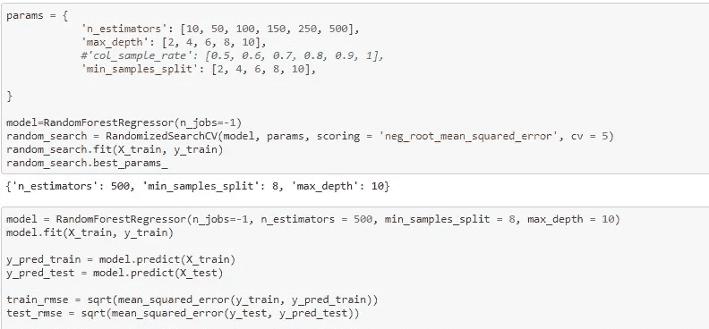

随机森林回归器(图片由作者提供)

**LGBM 回归量:**

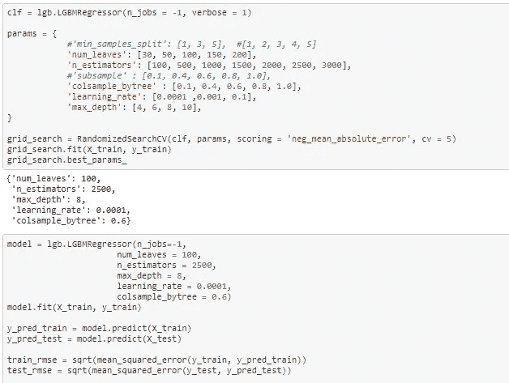

LGBM 回归器(图片由作者提供)

由于 RandomizedSearchCV 没有提供最好的结果，贝叶斯优化被用于超调 LGBM 模型

LGBM 模型在全套 226 个特征上比 134 个特征表现得更好。对此的可能原因可能是树和基于树的集合模型受相关特征的影响不大。

## 带 LGBM Goss 的贝叶斯岭回归堆叠模型

预测是使用 LGBM Goss 模型进行的，该模型根据训练数据进行分层折叠和重复折叠训练。在这里，不需要进行训练测试分割，因为我们是根据训练数据进行折叠预测的。因此，可以使用整个训练数据来训练模型。

这两个预测叠加在一起，作为贝叶斯岭回归模型(元模型)的输入。

## 低概率和高概率模型方法

因为，稀有数据点严重影响了异常值。我尝试了下面的模型架构来处理这个问题..

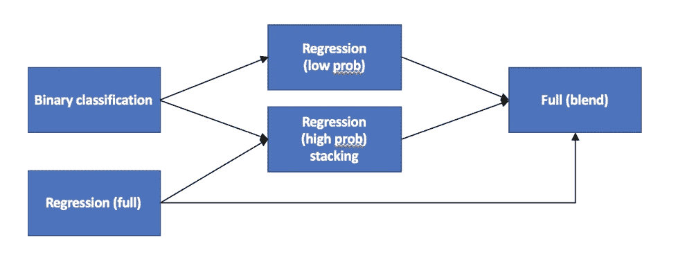

图片由[叶夫根尼·帕特卡](https://www.kaggle.com/c/elo-merchant-category-recommendation/discussion/82314)

1.  **二元分类模型:**该分类模型识别稀有数据点。这是一个 LGBM 分类器模型。基于从模型获得的分类概率，使用阈值(超参数)将卡/用户分类为稀有数据点(异常值)。
2.  **回归(完整):**这是一个简单的回归模型，在整个数据集上进行训练。这是对整个数据进行训练的堆叠贝叶斯岭回归模型。
3.  **回归(低概率模型):**在稀有数据点(异常值)的低浓度(超参数)上训练的回归模型。这也是一个 LGBM 回归模型训练的所有功能。
4.  **回归(高概率模型):**用高浓度(超参数)异常值训练的回归模型。我们只有非常少的稀有数据点，所以模型很容易过度拟合。因此，这是一个简单的回归模型(贝叶斯岭回归)。基于从用于训练的完全回归模型获得的特征重要性，使用来自完全回归模型、二元分类的预测以及 10 个最重要的回归特征。
5.  **完全(混合)模型:**混合来自高概率模型、低概率模型和完全回归模型的预测，以给出最终的忠诚度得分预测。这里的最终元模型也是贝叶斯岭回归模型。

# 结果

下表总结了上述所有方法的性能:

**基线回归模型:**

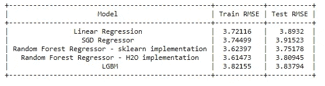

回归模型结果(图片由作者提供)

**堆叠和 LGBM Goss 模型结果:**

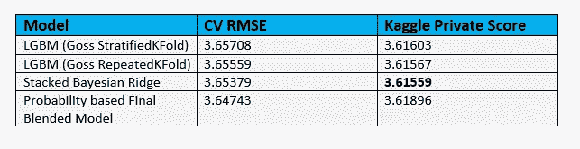

RMSE 为提到的不同方法打分(图片由作者提供)

堆叠贝叶斯岭模型提供了最好的 Kaggle 评分。因此，这是用于最终提交。

# Kaggle 提交

这是我提交的最好的 Kaggle 分数..

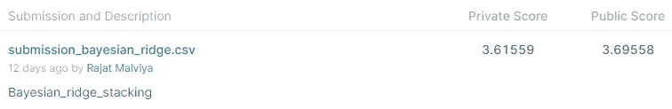

(图片由作者提供)

# **总结**

1.  在这个问题上，特征工程至关重要。从交易和商家数据中生成的特征越好，RMSE 分数就越好。
2.  处理异常值/稀有数据点是本案例研究的关键。这些分数极大地影响了最终的 RMSE 分数。
3.  在尝试了不同的回归模型和堆叠架构后，LGBM Goss 模型堆叠在贝叶斯岭回归上作为元模型，提供了最佳结果。

# 未来的工作/改进

1.  使用目标编码生成更多特征有助于提高分数。
2.  高和低概率模型方法可以进一步优化，增加更多功能，并尝试高和低概率模型。正如这里的[所解释的那样](https://www.kaggle.com/c/elo-merchant-category-recommendation/discussion/82314)，Evgeny Patekha 在其第五名的解决方案中成功实现了这一点。
3.  大多数分类和数字特征都是匿名的。因此，我们对这些特征没有明确的概念。这使得基于领域专业知识生成新特性变得困难。然而，这种限制/约束是为了避免泄露用户/公司数据。

# 结论

在这个案例研究中，我学到并改进了很多技巧。诸如特征工程和模型超调之类的技能对这个案例研究非常重要。这也是我第一次使用贝叶斯优化来超调模型。在 ML 领域，学习是一个持续的、永无止境的过程，因为每年都有新的技术和进步。因此，学习将继续…

希望你喜欢阅读这篇文章，就像我喜欢研究这个案例一样。感谢您的阅读！！

案例研究的完整代码可以在[这里](https://github.com/Rjt5412/Elo-Merchant-Category-Recommendation)找到。

**领英:**[www.linkedin.com/in/rjt5412](http://www.linkedin.com/in/rjt5412)

**Github:**[https://github.com/Rjt5412](https://github.com/Rjt5412)

# 参考资料:

1.  [https://www . ka ggle . com/sudalairajkumar/simple-exploration-notebook-elo](https://www.kaggle.com/sudalairajkumar/simple-exploration-notebook-elo)
2.  [https://www.kaggle.com/artgor/elo-eda-and-models](https://www.kaggle.com/artgor/elo-eda-and-models)
3.  [Robin Denz 的《日期变量的进一步观察》](https://www.kaggle.com/denzo123/a-closer-look-at-date-variables)
4.  [https://www.kaggle.com/fabiendaniel/elo-world/notebook](https://www.kaggle.com/fabiendaniel/elo-world/notebook)
5.  [https://www.kaggle.com/fabiendaniel/hyperparameter-tuning](https://www.kaggle.com/fabiendaniel/hyperparameter-tuning)
6.  [https://www . ka ggle . com/mfjwr 1/simple-light GBM-without-blending](https://www.kaggle.com/mfjwr1/simple-lightgbm-without-blending)
7.  [https://www . ka ggle . com/roydata science/elo-stack-with-Goss-boosting](https://www.kaggle.com/roydatascience/elo-stack-with-goss-boosting)
8.  [https://www . ka ggle . com/c/elo-merchant-category-re commendation/discussion/82314](https://www.kaggle.com/c/elo-merchant-category-recommendation/discussion/82314)