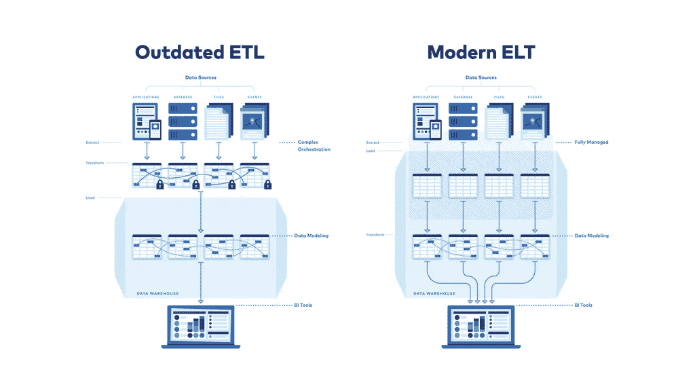
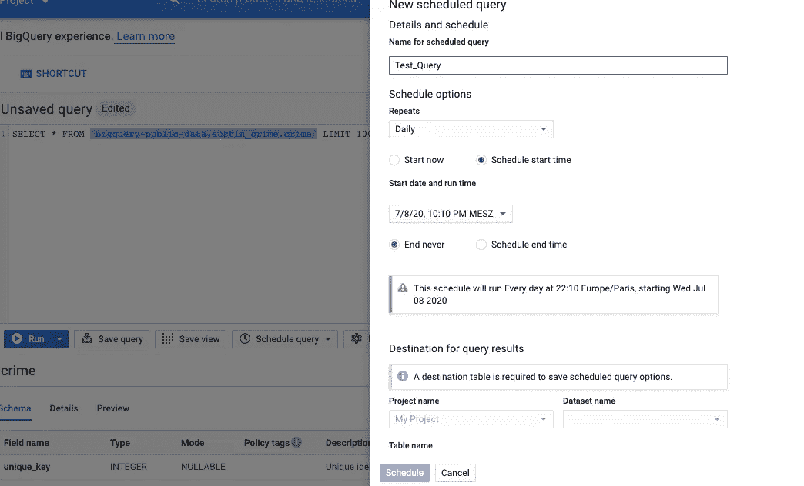

# 如何通过谷歌数据传输服务建立你的数据流程

> 原文：<https://towardsdatascience.com/elt-data-warehouse-process-via-google-data-transfer-service-and-big-query-9b5aa34b526c?source=collection_archive---------45----------------------->

## 用一个简单但仍然有效的工具集实现您的 ELT 和 ETL 数据管道

卡伦·艾姆斯利在 [Unsplash](https://unsplash.com/s/photos/nature?utm_source=unsplash&utm_medium=referral&utm_content=creditCopyText) 上的照片

在构建数据仓库或湖并实施 ELT/ETL 过程时，您会遇到许多问题，例如:

*   什么过程方法更好？ETL 还是 ELT？
*   数据集成过程使用哪种技术？
*   最好的数据仓库技术是什么？
*   还有更多

在这篇短文中，我想展示一种简单而有效的方法，通过谷歌数据传输服务(DTS)和数据仓库技术大查询，来**建立 ELT 数据仓库方法。**

## **回顾:ELT 与 ETL**

在下文中，对 ELT 和 ETL 的简短总结为不熟悉此事的人快速解释了这两种方法之间的差异。

来源:[https://fivetran.com/_/api/blog/elt-vs-etl/elt-vs-etl.png](https://fivetran.com/_/api/blog/elt-vs-etl/elt-vs-etl.png)[1]

在数据集成工具中进行转换之后，ETL 过程将数据加载到目标系统中，而 ELT 方法在转换数据之前首先将数据加载到目标系统中。通常 ELT 过程比传统的 ETL 过程更受欢迎，因为它实现起来更简单，加载数据更快。

## 使用谷歌的数据传输服务进行转换

通过 ELT 上传数据的过程可以通过以下方式实现:

*   手动上传数据
*   数据集成工具，如 talend/谷歌数据流/云功能等。
*   使用 DTS(目前仅限于亚马逊 S3、Google Play 等少数数据源。)

加载数据后，可以使用 Big Query 中的数据传输服务通过 SQL 实现转换，如下图所示:

通过数据传输服务安排查询-按作者排列的图片

Big Query 中转换任务的一个例子是连接两个表，对列数据类型或值进行一些转换，并将它们保存为一个新的数据对象，以便以后进行分析。编写完 SQL 并点击“Schedule query”后，您可以通过弹出的配置管理器(上图的右侧)自动执行该操作。

DTS 将为您提供通过调度查询来自动化转换任务的可能性，例如在每天的某个时间(类似于批处理和夜间 OLAP 操作)，但由于 GCP 内的可伸缩性，速度会快得多。

## 这种方法的优点

这种方法带来了某些优势:

*   你只需要使用 GCP 本地服务(不需要大型工具集。) [2]
*   转换可以由 SQL 完成(即使技术经验较少的员工也可以实现数据准备逻辑。)
*   DTS 和 Big Query 是完全的 SaaS 技术(不用担心基础设施和伸缩性。)
*   DTS 可以很好地处理大数据

## 结论

由于云平台为我们提供了无限的可扩展性，并且只需点击一下鼠标就可以实现许多服务，因此您可以快速建立数据仓库和所需的数据管道。这个例子向你展示了如何只使用两个 Google 服务和 SQL 来完成所有的设置。

## 资料来源和进一步阅读

[1]五川，[https://fivetran.com/_/api/blog/elt-vs-etl/elt-vs-etl.png](https://fivetran.com/_/api/blog/elt-vs-etl/elt-vs-etl.png)

[2]谷歌，【https://cloud.google.com/products/data-transfer 