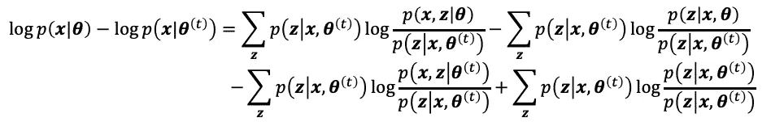

# EM 算法

> 原文：<https://towardsdatascience.com/em-algorithm-aaaa181af127?source=collection_archive---------17----------------------->

## 数学背景和例子

# 具有潜在变量的模型

利用基于机器学习的随机方法，我们将信息来源视为一种概率分布。一旦我们估计了分布，对未知数据进行分类以及预测未来生成的数据就变得简单了。估计概率分布有两个阶段。
1)决定定义分布的模型，例如，概率密度函数的形式(高斯分布、多项式分布……)。这里，考虑高斯混合模型(GMM)作为例子。概率密度函数的形式可以定义为


其中 w_k 是从第 k 个高斯分布产生的比率数据。

2)在确定概率密度函数的形式后，我们从观测数据中估计其参数。例如，在高斯分布的情况下，均值和方差是要估计的参数。

我们目前已知的知识是观测数据集 D 和生成分布的形式(未知参数高斯分布)。然而，为了求解 2 ),我们需要关于每个观测数据是从哪个高斯分布生成的信息，并且该信息不直接显示在观测数据中。


在这种情况下，代表不能从观测数据集中直接获得的信息的变量被称为**潜变量**。在上面的例子中，w_k 是一个潜变量。

因此，在 GMM，有必要先估计潜在变量。接下来，我们使用估计的潜在变量来估计每个高斯分布的参数。

在具有潜在变量的模型中估计参数的一种有效方法是**期望** **和最大化算法** ( **EM 算法**)。

# 算法的推导

让我们准备一下这部分用到的符号。

*   **D** ={ **x** _i | i=1，2，3，…，N}:随机变量的观测数据集 **x :** 其中 **x** _i 为 D 维向量。
*   **z** :潜在变量。 **z** _i 对应 **x** _i
*   **θ**:待估计的一组参数

我们的目的是用 EM 算法从观测数据集 **D** 中估计**θ**。

在观测数据为独立同分布的情况下，对数似然函数为


我们可以用下面的形式重写我们的目的。


对数似然函数 p(x，z |θ)中所示的概率可以用潜在变量 z 的概率表示为以下形式。第三个关系是潜在变量 **z** 边际分布的结果


现在，我们的目标是确定使对数似然函数 log p(x|theta)最大化的参数 theta。然而，不可能从上述关系中直接最大化该值。因此，我们决定在最大化 log p(x|theta)的同时更新参数 theta 的过程。我们认为θ是要定义的最佳参数，θ(t)是参数θ的第 t 步值。在下面的过程中，我们倾向于定义一个更新规则来增加 log p(x|theta(t))与 log p(x|theta)的比较。

这里，给定最近的参数θ和观测数据，我们用条件概率表示 q(z)。


因此，log p(x |θ)可以写成


我们首先关注更新 theta(t)时 log p(x|theta)-log p(x|theta(t))的变化。我们试图定义导致 log p(x|theta)-log p(x|theta(t))数量减少的规则。



重写这个关系，我们得到下面的形式。等式(1):


现在，我们需要评估右侧，以找到更新参数θ的规则。为此，考虑一个众所周知的数学关系
log x ≤ x-1。利用这个关系，我们可以得到下面的不等式。


因此，等式(1)的第三项是


等式(1)的第一项和第二项是非负的。之所以成立是因为，
当我们用 theta(t)代替 theta，term1-term2=0 那么通过最大化第一项，term1-term2 变得大于或等于 0。

考虑这个关系，log p(x | theta)-log p(x | theta(t))≥0。因此，为了最大化等式(1)的左侧，我们只需用最大化等式(1)右侧第一项的θ(t)值来更新θ(t)。


设上面更新规则的 argmax 的主语是函数 Q(theta)。


我们可以把这个关系翻译成当θ=θ(t)时 log p(x，z |θ)的一个期望值。


从这次更新中，我们可以将 EM 算法的过程总结为以下 E 步骤和 M 步骤。


# 高斯混合模型的 EM 算法

让我们以二维高斯混合模型为例。

随机变量: **x** _n (d 维向量)
潜变量:z_m
混合比:w_k
均值: **mu** _k (d 维向量)
方差-协方差矩阵:**适马** _k (dxd 矩阵)

这里，如果观测数据 **x** 由第 m 个高斯分布生成，则 z_m = 1，否则 z_m = 0。因此，潜在变量 z 的分布可以写成


第 m 个高斯分布的概率密度函数由下式给出


因此，数据 **x** 属于第 m 个分布的概率为 p(z_m=1| **x** ，其计算公式为


## 初态

随机初始化**穆**、**适马**和 **w** 。
t = 1。

## e 步骤

**计算 p(z|x，theta(t))**

用θ(t)计算潜变量 z 的期望值。


因此，若 z_nm 为 x_n 的潜变量，N_m 为第 m 个分布的观测数据个数，则以下关系成立。


## m 步

**更新参数**


我们在这一步的目标是定义 w_m，μ_m，适马 _ m，使 Q(θ|θ(t))最大化。

## 更新**穆(意思是)**


解此方程，μ的更新为


## 更新适马(方差-协方差矩阵)


解完这个方程，适马的更新就是


## 更新 w(混合比)

为了推导 w 的更新关系，我们使用拉格朗日方法使 Q(theta|theta(t))最大化，使 w_1+w_2+…+w_M=1。


求解λ的这个方程并使用约束关系，w_m 的更新规则是


所有参数更新:


# 用 Python 实现

## 人工数据生成

```
n1=150; n2=250; n3=300
n = n1+n2+n3
x = []
x.append(np.dot(np.random.randn(n1,2),np.sqrt(np.diag([1,4]))))
x.append(np.random.randn(n2,2)+np.dot(np.asarray([[1.]*n2]).T,np.asarray([[8.0,4.0]])))
x.append(np.dot(np.random.randn(n3,2),np.sqrt(np.asarray([[2.45,1],[1,4]])))+16.0)
X = np.concatenate((x[0],x[1],x[2]),axis=0)
```


## 初始化步骤

```
def genSigma():
    A = np.random.rand(2,2)+np.eye(2,2)
    #A = np.eye(2,2)*np.random.rand(1)
    S = np.dot(A.T,A)
    #S = np.diag(np.diag(S))
    return Sdef genMu(m):
    mu = np.zeros((2,m))
    mu[0] = np.linspace(np.min(X,axis=0)[0],np.max(X,axis=0)[0],m)
    mu[1] = np.linspace(np.min(X,axis=0)[1],np.max(X,axis=0)[1],m)
    return mu.TSigma = np.zeros((m,2,2))
    for i in range(m):
        Sigma[i] = (genSigma())Mu = genMu(m)    
    W = np.asarray([1.]*m)
    W = W/sum(W)
    L = -float('inf')iteration = 0
```

## e 步和 M 步

```
while True:
        if iteration >=100:
            break
        iteration+=1# **E step** wN = np.zeros((n,m))
        for j in range(m):
            for i in range(n):
                wN[i,j]=W[j]*gauss(X[i],Sigma[j],Mu[j])sum_wN = np.sum(wN,axis=1)
        Lnew = np.sum(np.log(sum_wN))
        if (Lnew-L) < 0.00001:
            print("Model Converged")
            break
        L = Lnewprint("iter#",iteration," Lnew:",Lnew)
        iters.append(iteration)
        Log.append(Lnew)# **M step**eta = np.zeros((n,m))
        for i in range(n):
            eta[i,:]=wN[i]/sum_wN[i]sum_eta = np.sum(eta,axis=0)
        W = sum_eta/nfor j in range(m):
            tmp = np.zeros((2,))
            for i in range(n):
                tmp += eta[i,j]*X[i]
            Mu[j]=tmp/sum_eta[j]for j in range(m):
            tmp = np.zeros((2,2))
            for i in range(n):
                xmu = (X[i]-Mu[j]).reshape(2,1)
                tmp1 = np.dot(xmu,xmu.T)*eta[i][j]
                tmp += tmp1
            Sigma[j]=tmp/sum_eta[j]
```

## 其他功能

```
import numpy as np
import random
from scipy.interpolate import griddata
from scipy.stats import multivariate_normal
import numpy.ma as ma
from numpy.random import uniform, seed
from matplotlib import cm
from scipy.special import softmax
import matplotlib.pyplot as plt# Gaussian pdf 
def gauss(x,sigma,mu):
    n = multivariate_normal(mu,sigma)
    return n.pdf(x)# Visualize
def plot_countour(sigma,mu):
    xy_range = np.zeros((2,2))
    xy_range[0] = np.linspace(mu[0]-2*sigma[0,0],mu[0]+2*sigma[0,0],2)
    xy_range[1] = np.linspace(mu[1]-2*sigma[1,1],mu[1]+2*sigma[1,1],2)
    x, y = np.mgrid[xy_range[0][0]:xy_range[0][1]:.01, xy_range[1][0]:xy_range[1][1]:.01]
    pos = np.dstack((x, y))
    rv = multivariate_normal(mu, sigma)
    z = rv.pdf(pos)
    levels = np.linspace(np.min(z),np.max(z),5)
    plt.contour(x, y, z,linewidths=1.0,colors='black',levels=levels)
    #plt.contourf(x,y,z,15,cmap=plt.cm.jet)
    plt.xlim([-5,25])
```

## 结果(1) M=2


## 结果(2) M=3


# 讨论

从结果来看，使用 EM 算法，对数似然函数在重复更新参数规则后总是收敛的。然而，由于 EM 算法是一种迭代计算，它容易陷入局部最优状态。正如在结果(1)、(2)中看到的，M 值(混合模型的数量)和初始化的差异提供了对数似然收敛和估计分布的不同变化。为了解决这个问题，一个简单的方法是用几个初始化状态重复该算法，并从那些作品中选择最佳状态。