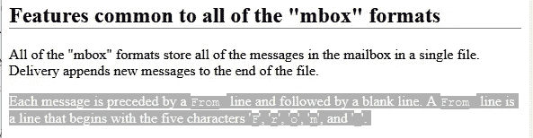

# 电子邮件分析:比你需要知道的更多

> 原文：<https://towardsdatascience.com/email-analytics-more-than-you-ever-need-to-know-b6e75b7b2541?source=collection_archive---------37----------------------->

## 黑匣子又火了


希腊的邮箱(摄影:Randy Au)

*向 Vicki 致敬，感谢她激发了我写这篇文章的动机，我总是乐于接受关于写作主题的想法和建议*hinthint**


如果你在 2010 年找到我，告诉我电子邮件跟踪分析将在 2020 年再次流行，我会认为你疯了。但是我现在在这里，用电子邮件通讯给你写信，谈论电子邮件技术和分析。

感谢原始的电子邮件，这是一个令人惊讶的短话题。我可以把我所知道的几乎所有东西，小到微小的技术细节，都放到这篇长文里。

# 那么 Substack 上的邮件跟踪是什么样子的呢？

我们得到了一些有趣的数据，比如你最近发的帖子，打开率和点击率。视图和注册(转换)似乎是网站页面，而不是电子邮件本身。


然后，您还可以在电子邮件地址级别获得更详细的电子邮件统计信息。打开、点击和设备计数。


我们现在要看看最后一个是如何收集的。呜哇！

# 现代网络分析实际上是持续的连接

现代网络分析涉及大量工具，从服务器端日志、[用户代理分析](https://counting.substack.com/p/the-user-agent-that-crazy-string-underpinning-a-bunch-of-analytics-86507ef632f0)、浏览器上的 cookies，到使用 [Javascript](https://developers.google.com/analytics/devguides/collection/analyticsjs/sending-hits) 和 [websockets](https://medium.com/nativeai/websocket-vs-http-for-collecting-events-for-web-analytics-c45507bd7949) 实时收集和传输数据的非常复杂的测量工具。每一次点击、滚动和悬停都有可能被报告回母舰进行分析。

像 [Google Analytics](https://analytics.google.com/) ，[振幅](https://amplitude.com/)， [Chartbeat](https://chartbeat.com/) ， [Mixpanel](https://mixpanel.com/) ， [Flurry](https://flurry.com/) 等分析平台。所有人都在这个领域工作，使用各种方法收集用户正在做的事情的数据。在核心上，它们以发生的“事件”的形式(页面查看、点击、滚动、悬停等)收集信息，并定期将信息报告给分析服务。这是一个相当复杂的空间。

这甚至不仅限于网页。最近有文章讨论 Kindle 上的每一次点击、触摸和互动是如何被亚马逊追踪和存储的。

尽管这听起来令人毛骨悚然且具有侵犯性，但这种超细粒度的数据收集和传输在现代分析时代几乎是必然的。我不得不依靠类似的数据来帮助团队做出产品决策。如果没有这种粒度级别的数据，许多 UX 和商业问题都无法得到解答。做这件事的工具现在也很容易得到，所以每个人都可以做这件事，不只是 megacorps。

与此同时，电子邮件(在一定程度上，短信)实际上没有这些高级跟踪功能。这对我们提出了挑战。

# 电子邮件(很大程度上)是单向交流

电子邮件是非常古老的技术。有一个 RFC # 196，可追溯到 1971 年，名为“邮箱协议”，它描述了一种向连接到行式打印机的系统发送消息的方法，消息由人工**传递到物理邮箱。**


显然，今天没有行式打印机和人工递送，但基本概念仍然完好无损:**电子邮件是一种单向的沟通渠道。**它接受一条消息，仅仅是字节的集合(默认为 7 位 ASCII 编码！)，然后通过一系列系统发送出去，这些系统试图将邮件传递给预定的收件人。

从一开始，整个电子邮件基础设施的设计就模仿了物理邮件的方式。用户通过他们的邮件客户端向[邮件提交代理](https://en.wikipedia.org/wiki/Message_submission_agent) (MSA)提交邮件，然后通过对 [MX 记录](https://en.wikipedia.org/wiki/MX_record)的 DNS 查找将邮件路由到一个或多个通过简单邮件传输协议(SMTP)传输邮件的[邮件传输代理](https://en.wikipedia.org/wiki/Message_transfer_agent) (MTA)。最后，经过 MTA 的一跳或多跳后，字节到达邮件传递代理(MDA ),它将字节放入一个数据结构中，由收件人的邮件客户端存储和读取。邮件实际上存储在目的地的一个或多个文件中。

*说句题外话:我要避免往下走一个*[*mbox*](http://jdebp.eu/FGA/mail-mbox-formats.html)*[*格式兔子洞*](http://jdebp.eu/FGA/mail-mbox-formats.html) *因为篇幅原因，但是很简短，很神奇。电子邮件都在一个文件中，并以“发件人”一词分隔！这就是通信存储的 CSV！**

**

*从 Alice 点击电子邮件客户端上的[发送]开始，直到她的电子邮件被发送到邮件发送代理(您的邮件客户端将通过 POP3/IMAP4/etc 访问该程序以将邮件呈现在您的眼前)，在整个时间长度内，电子邮件都是在推送模式下传输的。 [SMTP 命令列表](https://tools.ietf.org/html/rfc5321#section-4.1)本质上只有动词来表示“嗨，服务器，我有你的邮件，拿着这个并发送出去”。在 SMTP 中肯定没有办法表达“嗨，服务器，给我所有的电子邮件”。MTA 不支持这种功能。*

*事实上， [RFC 5321](https://tools.ietf.org/html/rfc5321) 明确指出，当一个 MTA 对传输给它的邮件给出 2xx 响应时，它接受确保消息到达它需要去的地方的责任，或者报告传递失败。*

**

*只有在旅程的最后一段，当收件人 Bob 加载他的邮件客户端来检查电子邮件时，它才最终成为拉动操作。收件人的客户端可以使用[邮局协议](https://en.wikipedia.org/wiki/Post_Office_Protocol) (v3)、POP3(旨在将邮件从 MDA 中取出，通常是从 MDA 中删除邮件)进行本地消费，或者使用[互联网邮件访问协议](https://en.wikipedia.org/wiki/Internet_Message_Access_Protocol) (v4)、IMAP4(旨在从服务器中读取邮件并将其留在那里，例如网络邮件)。如果需要，客户端也可以使用一些专有协议。*

*所有这些意味着，一旦 MTA 成功地传递了信息，他们就可以忘记你的信息(如果他们愿意的话)。寄件人唯一能得到有关流程反馈的时间通常是由于某些问题(地址不正确等)导致投递失败的时候。*

# *但是电子邮件并不完全是单向的(等等什么？)*

*有两个(！！)电子邮件规范本身允许通信从接收者向发送者反向流动的方式。附带说明。大的。*

# *交付状态通知*

*第一个是 [RFC 3461](https://tools.ietf.org/html/rfc3461) ，它是对 SMTP 的扩展，添加了交付状态通知(DSN)。如果你向一个不存在的电子邮件地址发送了一封电子邮件，但邮件无法送达，这个功能会通知你。它实际上是消息头中的一个可选标志，如果消息传递失败或成功，发送者可以请求得到通知。正常情况下，它只是默认只在交付失败或延迟时报告。*

*问题是这是一个可选功能，尤其是对于成功的 DSN。如果 MTA 或 MDA 选择[限制该特性的使用](http://www.postfix.org/DSN_README.html#scope)。不会成功的。实际上，成功的送达通知几乎从未使用过，你也不应该指望它们会起作用。请不要打开它们。*

*另外，一个成功的 DSN 只会告诉你计算机已经把它发送到了收件箱，而不会告诉你人们是否已经看到了它。这就像邮递员把跟踪确认箱放在门廊上，随时都有东西能让包裹消失。该消息也可以被完全忽略、过滤或删除。*

# *消息处理通知*

*第二种方式是通常所说的“已读收据”。根据你使用的电子邮件服务/客户端(尤其是如果你使用 MS Outlook 和 Thunderbird)，你可能会认出这个术语。这些事情实际上是在 [RFC 8098](https://tools.ietf.org/html/rfc8098) “消息处理通知”下标准化的，尽管对于这种功能有各种各样的专有协议。它主要出现在公司环境中，每个人都使用相同的软件。*

*与上面提到的 DSN 不同，这些是在用户实际打开和阅读电子邮件时触发的。这些 MDN 可以报告电子邮件被“显示”给用户，“发送”到其他地方，“处理”而不被看到，甚至“删除”而不被看到。哇！这么多信息！*

*除此之外，它要求接收客户端支持该特性(许多不支持或有限制)，并且通常涉及选择加入的方面。通常会有一个提示，比如“Alice 想要一个阅读回执，发送吗？是/否”。除了这些问题之外，还有很多边缘情况，例如，如果用户只是将一封电子邮件标记为已读，而没有打开它，会发生什么？*

*所以，还是那句话，不要指望使用这些数据。*

# *那么，我们能统计哪些涉及电子邮件的信息呢？*

*不是太多，而是一些东西。让我们来看看大的:*

# *发送的电子邮件*

*这个很简单，因为作为发件人，你应该知道你发出了多少封邮件。这至少给了你所有其他事情的通用标准。这可能是所有这些中唯一确定的数字。*

# *退回/失败的交货*

*由于 SMTP 的 DSN 特性，当你发出的邮件无法送达时，你通常会得到通知(但不是所有时间)。知道这一点对调整你的邮件列表很重要。从你的“发送”总数中扣除这些邮件也很常见，因为它们并没有真正去任何地方。*

*哦，是的，如果你用你自己的服务器，从你自己的域名发送电子邮件，你实际上可能会得到比你发出的电子邮件更多的反弹。这被称为[反向散射](https://en.wikipedia.org/wiki/Backscatter_(email))，垃圾邮件发送者通过伪造邮件标题假装从您的服务器发送邮件。所以你必须非常小心如何处理反弹。*

# *HTML 电子邮件给你更多的选择*

*如果你发送的是纯文本邮件，上面的统计数据几乎就是你所能得到的全部。但是如果你使用 HTML 格式的电子邮件(现在大多数人收发的都是这种格式)，你就能接触到更多的内容。*

# *通过跟踪像素打开*

*现代电子邮件客户端实际上是微型网络浏览器。至少，它们可以呈现 HTML，包括从互联网上获取图像等资源的能力。请注意，还有一种方法可以将图像附加到电子邮件中，这样就不需要外部获取，但这对分析没有帮助。*

*这种 HTML 特性可以用于分析的一种常见方式是通过放置一个微小的 1x1 像素透明 GIF 文件(因此得名)，该文件托管在某个外部服务器上(如 example.org/tracking_string/sneaky_1x1.gif 的*)。当电子邮件客户端试图加载图像时，它必须向 web 服务器发出 HTTP GET 请求。然后，服务器意识到“ *tracking_string* ”的 GIF 文件已经被加载，并把信息保存在某个地方。使用查询参数，*example.org/sneaky_1x1.gif?track_query=user12345*，也是向服务器传递详细信息的一种重要方式。**

**如果您为发出的每封电子邮件生成一个唯一的 tracking_string，那么您可以通过读取这些 pixel 访问日志来找出谁打开了该电子邮件！**

**注意:它不一定是 1x1 像素，或者 gif。你所需要的就是接收者从你的服务器上加载*一些东西，任何东西*。一个标志图像就可以了。**

****警告:**这种方法的一个问题是它依赖于接收者加载你的图像。出于安全原因，某些客户端在默认情况下不会这样做，至少您通常可以更改设置来选择加入/退出远程映像加载。所以，同样，这个数据不会是完美的。**

# **通过跟踪像素的 Cookie**

**pixel 的 HTTP GET 请求也可以在客户端的浏览器上设置一个 cookie。这是否有用将取决于[邮件客户端的浏览器功能是否有 cookie 功能](https://stackoverflow.com/questions/4940612/how-are-cookies-handled-by-email-clients)。通常默认情况下它是关闭的，所以依赖它是不明智的。**

**显然，这些 cookie 不会被传递到主浏览器，除非电子邮件客户端和浏览器以某种方式共享同一个 cookie 存储。我甚至在网上找不到任何关于这种共享行为的参考资料。**

**因此，您对这些 cookie 唯一能做的事情就是，如果您设置并在多次打开时看到同一个 cookie，您就可以知道它在同一设置中至少被打开过一次。也许吧。**

# **通过跟踪像素的设备**

**因为用户代理应该在每个 HTTP 请求的报头中发送，所以您可以对其进行分析，以确定是什么设备打开了电子邮件。这里说的太多了，所以对于那些好奇的人来说，我在之前的一篇文章中讨论了[用户代理的复杂性。对于流行的设备，它可以让分析师看到具体的型号和变体。](https://counting.substack.com/p/the-user-agent-that-crazy-string-underpinning-a-bunch-of-analytics-86507ef632f0)**

**随着时间的推移，存储这些用户代理的副本，你就可以计算出一个人可以访问多少个浏览器和设备。怪异。**

# **IP 通过跟踪像素**

**由于动态 IP 是通过 ISP 分配的，移动设备 IP 随着移动/进入/离开网络、VPN 和代理而变化，因此 IP 分析相当不一致，但总的来说，它们通过地理定位提供了人们来自哪里的概念。他们通常能告诉你请求来自哪个国家。**

**一些 IP 比其他 IP 更持久，静态服务器 IP 和家庭 IP 显然比移动设备更少改变。VPN 和代理也可以有不同的属性，这至少让你知道他们不是“普通用户”。因此，如果有人有这些信息，他们可以彻底调查，但在没有付费为你分类 IP 的情况下进行大规模调查是很痛苦的。**

**我经常懒得去调查知识产权，因为即使我有这些信息，我也无能为力。**

# **通过跟踪 URLs 重定向点击链接**

**因为我们有了 HTML，用户可以点击链接，这些链接将在他们实际的网络浏览器中打开(而不是他们邮件客户端内部的任何东西，后者可能具有有限的功能)。如何知道用户是否点击了一个链接，或者点击了什么链接？**

**URL 重定向是最简单的方法。有很多种方法可以实现重定向。**

****使用 HTTP 302 响应代码**“发现”(以前称为“临时移动”)使浏览器重定向到另一个 URL 的最简单方法。其他 3xx 响应代码也可以工作，但有不同的细微差别。所以你需要做的就是用一个去 myservers.com/tracking_string1*的链接替换你原来的链接，然后设置你的网络服务器发送一个 302 响应给实际的目的地。***

**因为你可以使链接变得独特，而且你确切地知道它在哪个电子邮件中，你可以明确地说点击来自那个电子邮件。请记住，电子邮件可以转发，链接可以共享。**

**你也可以在你的网络服务器日志中获得一个条目，包括所有的常用信息，IP，用户代理，时间戳，引用等。但仅此而已。如果你想要更多的分析，你必须使用其他方法。**

**更有效的方法是通过 META 标签或 JavaScript 制作一个既收集数据又重定向用户的页面。当用户短暂停留在你的页面上时，你可以做更复杂的[浏览器指纹识别](https://en.wikipedia.org/wiki/Device_fingerprint)。**

**这里有更多的技术细节需要解决。你必须快速地做每件事，因为用户讨厌东西加载缓慢，跟踪重定向增加了宝贵的毫秒加载时间。你也可能想做某种形式的 [*referrer 擦洗*](https://en.wikipedia.org/wiki/HTTP_referer#Referer_hiding) 来隐藏你正在从下游做这些重定向的事实。**

****警告:**如果 URL 隐藏在重定向的后面，那么很难防范这种形式的跟踪。所以这通常意味着你不会少算点击次数。然而，由于前面提到的链接分享，你可以很容易地计算很多很多点击。它们将是实际的点击，但你不会真的确定“谁”在做这些。**

**这是上周我的 10x data scientist 文章中发送的电子邮件子堆栈中的一个例子(去掉了样式和内容)。注意复杂的散列字符串占据了 URL 的大部分。**

```
**<a href="http://email.mg1.substack.com/c/eJwlUMuOwyAM_JpyRA55UA4ctt32NyIC3hRtAhGYjfL3S1ppJEtjax62hnCO6dBbzMRKxjR6p4eulaCAOQ1SWDkxn8efhLgav2i2lWnx1pCP4TwW8top9tKIQrWyU-BML0DIrkeB0KDr5TQADuy0GE1xHoNFjX-YjhiQLfpFtOVL-3URz4p937kzZF64bJgyj2muLPO6ikJF17TQC8UbrhoJ1--buqvb8_EQw6WDdW54LlMmY3-5jStLOpngDm5K3c5ngTddO4x1riV4OkYMZlrQaUoFGX1-8U5Lx4Y64J4XJML0Ic_OA4AaWHVysWoGbWMJ5MP8D_lucHE">datahelpers.org</a>**
```

**如果你按照链接，你会得到 302 重定向到正确的网站。**

****

# **通过点击链接的 Cookies**

**这开始进入你正常的网络分析。但与您可能在跟踪像素上设置的 cookie 不同，它绑定到一个可能不允许 cookie 的 web 客户端，您最有可能通过链接点击获得一个真正的浏览器。这意味着 cookie 信息更加持久和有用。至少，你可以识别出这个浏览器以前是否通过电子邮件访问过这个网站。**

**另外，你可以对用户进行所有常规的网络分析，因为他们已经在网站上了。**

# **网络分析一旦他们到达你的网站**

**虽然以上这些都是你可以从电子邮件中直接获得的，但成功地让某人访问你控制的网站会让他们获得更多的跟踪和分析机会。**

**如果你的电子邮件发送一个人到你拥有的网站，**并且他们登录**，你可以把点击和登录联系在一起。这让你可以讲述一个关于用户正在做什么的更丰富的故事。现在你可以说“他们收到了我的邮件，点击了我的行动号召链接，买了 10 个小部件”，而不是“用户来到我的网站，买了一个小部件”。**

**对于没有登录的人，你得到的有用信息要少得多。通常他们的推荐人是空的，这导致像 Google Anlaytics 这样的工具说流量是“(直接的)”，这意味着他们出现在页面上，GA 不知道为什么，所以他们必须被直接发送到那里。显然，没有人会在他们的浏览器中手工输入长 URL，但是我们没有任何关于他们从哪里得到链接的信息。**

**由于缺乏推荐人，从网络分析的角度来看，电子邮件客户端看起来就像短信一样，或者像 s lack 等其他外部应用程序的链接。他们一般都长得像(直接)，所以可能会很乱。您总是可以为不同的通信渠道分配唯一的链接来帮助缓解这种情况，但当链接不可避免地被共享时，这仍然只是一个最佳猜测。**

**缺少推荐人的原因有点复杂，这不是什么大阴谋或隐私运动。将用户发送到浏览器中的独立邮件客户端不会向浏览器发送推荐信息(它们几乎不能)。Webmail 客户端通常使用 HTTPS，当从 HTTPS 转到 HTTP 网站(但不是 HTTPS->HTTPS)时，推荐人会被删除，他们还可能使用带有元标签(如`<meta name="referrer" content="no-referrer"/>`(或类似的东西)的重定向页面，以进一步删除推荐人，以保护隐私。**

# **更多电子邮件讨论下一个帖子**

**这涵盖了我认为可以从电子邮件分析中收集的所有技术数据。接下来，我需要深入了解您在实际使用收集的数据时需要记住的细微差别。**

**我不喜欢为了从一个话题中挤出更多的帖子而拆分话题，但我们在这个帖子中推了 3000 字。这有点荒谬，所以我们下周见！**

***这篇文章最初于 2020 年 2 月 18 日发表在兰迪的* [*计数材料子栈*](https://counting.substack.com) *上，这是一份关于数据科学更世俗方面的每周时事通讯。在免费文章在媒体上重新发布之前，注册并获得每周文章。***