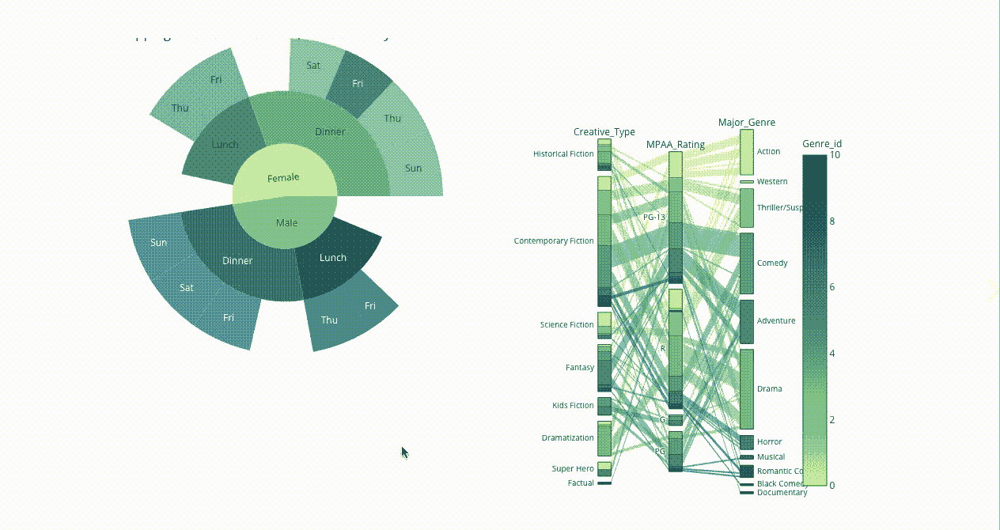
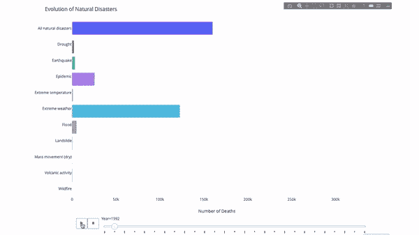
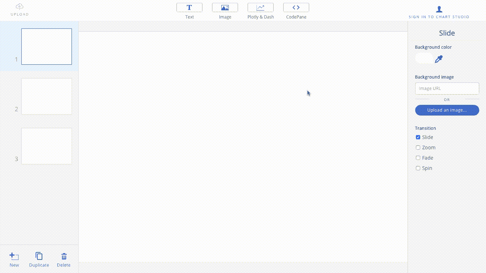
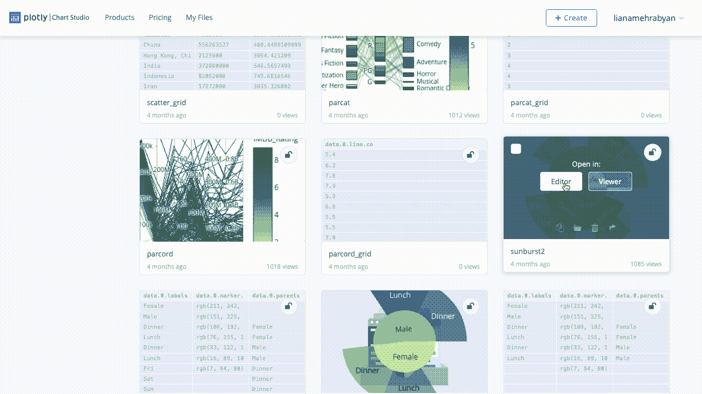
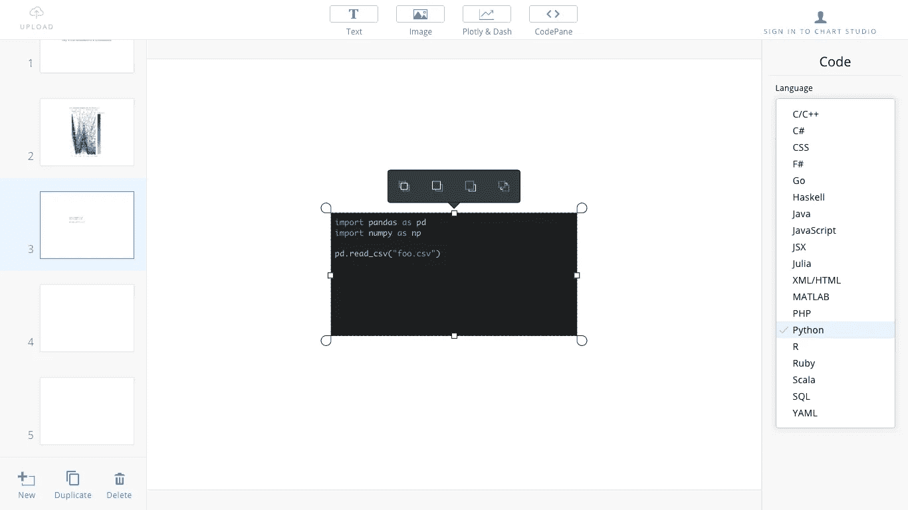
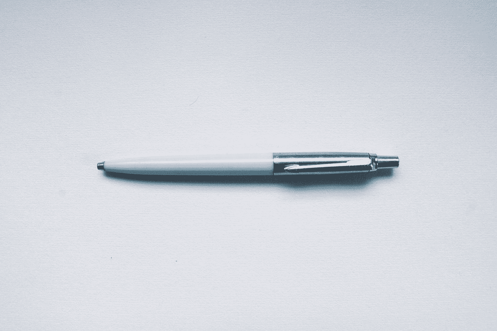

# 使用 Plotly 在幻灯片中嵌入交互式绘图

> 原文：<https://towardsdatascience.com/embed-interactive-plots-in-your-slides-with-plotly-fde92a5865a?source=collection_archive---------12----------------------->

## 用眼镜编辑器超越 PowerPoint

对于我们这些数据科学家来说，有效的沟通是必不可少的，而 Plotly 的交互式图表是一个很好的工具。但是当涉及到以传统的幻灯片风格展示我们的工作时，这些情节很难集成到我们的日常工具中，如 PowerPoint 或 Google Slides。在这篇文章中，我们将了解眼镜编辑器 Plotly 的一个演示工具，它允许在幻灯片中嵌入交互式情节和动画，并提升您的演示文稿。

# 酪 pptx 工作就好了…何必呢？

莱昂纳多·巴尔迪萨拉在 [Unsplash](https://unsplash.com?utm_source=medium&utm_medium=referral) 上的照片

想象一下，你已经涵盖了你认为对你的演讲很重要的内容，然后你的听众会提出一些涉及到次要细节或你的人群中某个特定人群的后续问题。现在，你必须回到你的代码中去获取一个答案，或者在以后继续跟进。把你的土地分割成小块，然后当场取回任何需要的东西，这不是更容易吗？例如，查看这个平行坐标图，您可以对任何变量进行过滤和高亮显示:

承蒙作者好意。

或者，您可以在演示时与之互动的动画条形图:

承蒙作者好意。

# 入门需要什么？

*   **A Plotly** [**图表工作室账号**](https://chart-studio.plotly.com/feed/#/) :你可以轻松注册你的 github、谷歌或者脸书账号。
*   **互动 Plotly 剧情**:在我的[上一篇](/5-visualisations-to-level-up-your-data-story-e131759c2f41)中，我介绍了 Plotly 的互动剧情和动画。帖子中提供的代码应该足以生成一些情节来玩。
*   最后，快速[下载](https://plotly.com/chart-studio-help/slide-decks/)眼镜编辑器。

# 潜入水中

一旦你登录，界面非常熟悉和直观。从你通常的演讲准备程序开始:

说到互动情节，你只需要:

1.[在 Chart Studio](https://plotly.com/python/getting-started-with-chart-studio/) 上发布您的图，并复制您的图的 url

2.回到眼镜，点击“Plotly 和破折号”并粘贴网址:

3.情节应该立即融入你的幻灯片。一旦进入演示模式(`**cmd+L**`)，它就会变成交互式的。

此外，您可以在幻灯片中很好地集成和共享任何语言的源代码。只需点击`**CodePane**`，选择您的语言并粘贴您的代码:

一旦你完成了，点击`**cmd+L**`来展示你的作品，切割你的情节，充分利用你的视觉化技能。如果需要，您还可以存储演示文稿的. pdf 版本。

下一次，你的观众想知道更多，你已经准备好当场操纵你的数据，并迅速解决任何疑问！

## 延伸阅读:

有关编辑器的更多信息，请查看 Plotly 的[官方文档。](https://plotly.com/chart-studio-help/slide-decks/)

更多互动的可视化，你可以看看我的文章“ [5 个可视化来提升你的数据故事](/5-visualisations-to-level-up-your-data-story-e131759c2f41)”。

## 差不多就是这样！

我希望您发现这很有用，并将它添加到您的工具箱中。保持安全和高效！

照片由[格伦·凯莉](https://unsplash.com/@glencarrie?utm_source=medium&utm_medium=referral)在 [Unsplash](https://unsplash.com?utm_source=medium&utm_medium=referral) 上拍摄