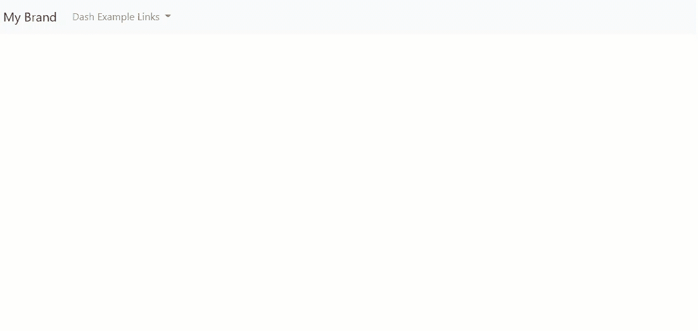
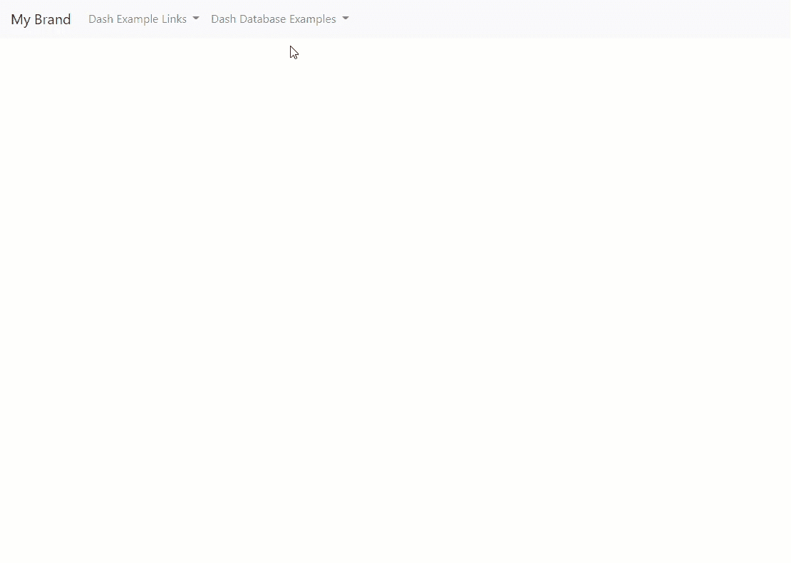
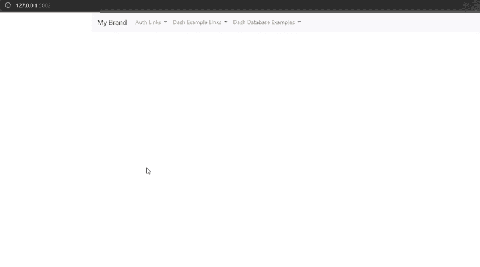

# 使用微软认证在 Flask 中嵌入多个 Dash 应用程序

> 原文：<https://towardsdatascience.com/embed-multiple-dash-apps-in-flask-with-microsoft-authenticatio-44b734f74532?source=collection_archive---------8----------------------->

## 唷！这是一次旅程(通过示例),目的是将所有部分组合在一起，为部署在一起的多个 Dash 应用程序构建一个可扩展的模板，并提供统一的导航和身份验证


图片来自 [Pixabay](https://pixabay.com/?utm_source=link-attribution&utm_medium=referral&utm_campaign=image&utm_content=3223941)

充分披露:我不是开发 web 应用程序的专家。我甚至不认为自己是数据科学家。自从我发现 Dash 以来，我就一直在努力构建一个适合我的用例的系统。这包括试图将多个松散关联的 Dash 应用组合在一起，这些应用使用 windows 电脑开发，但部署在公司防火墙后的 Ubuntu 虚拟机上。添加一些用户不会讨厌的身份验证(即他们已经在使用的东西)，我找到了一些我找不到的清晰示例，所以我想分享一下我当前的解决方案及其演变。

我是一名结构分析师，我每天使用 [Python](https://www.python.org/) 处理测试数据，缩放或合并分析结果，运行优化或权衡研究，和/或开发特定于组件或机制的分析方法。其他大部分工程师不使用 python。因此，一旦我开发或编码了一个现有的分析方法，我通常希望以一种可控的方式将其部署到其他人身上，使用一个熟悉的和用户友好的界面…进入 Plotly 的 [Dash](https://plotly.com/dash/) 框架！

# 普罗特利的 Dash 框架

我是 Plotly 的 [Dash](https://plotly.com/dash/) 框架的超级粉丝。如果你已经熟悉 python，制作一个 Dash 应用程序是相当简单的。添加 Dash Bootstrap 组件，流畅、美观、响应迅速的网络应用程序只需要几行额外的代码。从现有的 Python 脚本到 web 应用程序是 1–2–3 的事情

1.  为用户输入创建带有组件的布局([按钮](https://dash-bootstrap-components.opensource.faculty.ai/docs/components/button/)、[下拉框](https://dash.plotly.com/dash-core-components/dropdown)、[数字/文本输入](https://dash-bootstrap-components.opensource.faculty.ai/docs/components/input/)等)。)和有结果的区域([图](https://dash.plotly.com/dash-core-components/graph)、[表](https://dash.plotly.com/datatable)等。)使用布局元素( [div、row、column](https://dash-bootstrap-components.opensource.faculty.ai/docs/components/layout/) 等)。)
2.  通过[回调](https://dash.plotly.com/basic-callbacks)将用户输入链接到实际执行工作的函数
3.  部署应用程序，或者在目标用户可访问的主机或虚拟机上运行应用程序


普罗特利的破折号，图片来源:[https://plotly.com/dash/](https://plotly.com/dash/)

Dash 应用程序看起来很漂亮，你可以用 Python 编写它们(避免使用 javascript 和原始 html)，并且可以使用相同的“受控”工具拥有广泛的受众(不用传递 excel 文件，非常感谢)。如果你不熟悉 Dash 文档,请查看它。有很多其他优秀的关于构建 Dash 应用程序的教程，这些人无疑比我更优秀，所以我将保持这一节的简短。Dash 社区论坛[和堆栈溢出](https://community.plotly.com/c/dash/16)是你的朋友。

好了，现在我们有了一个很好的方法来给团队提供一个很好的工具。但是我有很多工具，有些相关，有些不相关。如果我们能以某种方式将这些应用组合在一起…

# 在 Flask 应用程序中嵌入多个 Dash 应用程序

这似乎是一个相当普遍的要求。Plotly 提供 [Dash Enterprise](https://plotly.com/dash/) 来帮助向更多受众部署多个应用，同时保持安全性。对于您的团队来说，这可能是一个更容易、更具可伸缩性的解决方案，尤其是当您有多个开发人员时。对于我们这些没有 Dash Enterprise 的人来说，Plotly 团队在开源文档中讨论了几种创建多页面应用程序的方法。第一个是通过使用 [dcc 向视图发送不同的布局来创建](https://dash.plotly.com/dash-core-components/location)[多页面 dash 应用](https://dash.plotly.com/urls)。位置 & [dcc。链接](https://dash.plotly.com/dash-core-components/link)通过回调交互的组件。对我来说，这对于一些小应用程序来说还行，但是随着应用程序数量的增加，它似乎变得混乱了。我更喜欢让单独的应用程序成为独立的对象。我通常先在本地创建一个独立的 Dash 应用程序，然后集成到其他应用程序中进行部署。一个应用部署完成后，我会经常回去更新它。一旦它被集成(至少是我实现它的方式)，我不得不加载整个应用系统，只是为了测试其中的一部分。这很快就过时了。所以我开始寻找不同的方法。

在我旅程中的某个时候，Plotly 团队在文档中添加了关于在现有 web 应用中部署 Dash 应用[的讨论。我还看到了他的精彩文章:](https://dash.plotly.com/integrating-dash)

[](https://medium.com/@olegkomarov_77860/how-to-embed-a-dash-app-into-an-existing-flask-app-ea05d7a2210b) [## 如何将 Dash 应用嵌入到现有的 Flask 应用中

### Dash(由 Plotly 开发)是一个开源的、易于使用的 Python 框架，用于构建漂亮的数据驱动的 web 应用程序。

medium.com](https://medium.com/@olegkomarov_77860/how-to-embed-a-dash-app-into-an-existing-flask-app-ea05d7a2210b) 

那时我根本没有使用过 Flask，所以模板、视图、蓝图、数据库对我来说都是新的。它花了一些时间来吸收这一切(至少足以尝试和工作)。烧瓶超级教程帮了大忙。有了 Oleg 的 Medium 文章和 Flask Mega 教程(加上大量的 google - > stackoverflow ),我开始拼凑一种新的(对我来说)方式来打包我的 Dash 应用程序，将它们嵌入到“父”Flask 应用程序中。

# 一个基本例子

我遇到的大多数例子基本上只是玩具。我觉得我遇到的那些没有覆盖足够的模板来使它可扩展。我认为我最大的问题是如何在 Flask 部分集成统一的导航和引导格式。这里的例子启动了我将在接下来的章节中构建的框架。本节涵盖的全功能项目可以在 [github](https://github.com/shkiefer/dash_in_flask_msal/tree/basic) 的“基本”分支下找到。

让我们从项目目录结构开始:

```
dash_in_flask_msal
│   config.py
│   env_p38_dash.yml
│   secret.env
│       
├───app
    │   __init__.py
    │   
    ├───dashapps
    │   │   dash_app_1.py
    │   │   dash_app_2.py
    │   │   routes.py
    │   │   __init__.py
    │   │   
    │   ├───templates
    │       └───dashapps
    │               dash_app.html
    │               dash_app_debug.html    
    |
    ├───main
    │       routes.py
    │       __init__.py
    │            
    ├───static
    ├───templates
            base.html
            index.html
```

我正在使用蓝图(“主”和“dashapps”)和一个应用程序工厂。主蓝图现在并不真正做任何事情，它只是为索引服务。“Dash apps”蓝图中有两个 Dash 应用程序(dash_app_1.py & dash_app_2.py)。这是一个相当标准的 Flask 应用程序布局。

## 应用程序工厂

`create_app()`应用程序工厂位于`app`目录下的`__init__.py`文件中。在这一点上，它是相当基本的。我们从`config.py`文件(基本上是空的)导入`Config`对象，并将其附加到应用程序。我们初始化 bootstrap-flask 扩展，并用 app_context 注册蓝图。那都是普通的烧瓶。现在新的东西来了:我们从每个 Dash 应用程序文件中导入一个`add_dash`函数，并通过每个文件传递 Flask 应用程序。

烧瓶中碱性 dash 的应用工厂

让我们来看一个 Dash 应用程序文件。`dash_app_1.py`文件看起来很正常。主要区别是:

1.  Dash 应用程序和所有回调的创建都在一个`add_dash()`函数中，该函数获取 Flask 应用程序(`server`)并在创建 Dash 应用程序对象时使用它，在创建所有回调后返回 Flask 应用程序
2.  当通过`URL_BASE`全局变量创建 Dash 应用程序时，我们传递一个定制的`url_base_pathname` 参数
3.  我们使用一个全局变量`APP_ID` 作为所有组件 id 的前缀。

典型的 Dash 应用程序包装在“add_dash”函数中

好了，现在我们看到 Dash 应用程序是如何附加到母 Flask 对象上的，但它们看起来仍然非常熟悉。为了完成设置，我们需要查看功能来显示 Dash 应用程序。让我们看看`dashapps` 蓝图文件夹中的`routes.py`文件。

dashapps 蓝图中的 Routes.py

需要注意的一点是，用于创建应用程序的 url_base_pathname 不是用于查看功能的 url。仪表板应用程序端点在`/dash/dash_app_1`处，但视图功能路线在`/dash_app_1`处。要了解发生了什么，我们必须看一下模板。

## 模板和引导！

有一个所有其他模板固有的基础模板(base.html)。这是我们安装导航系统的地方。为了在 Flask 位中使用引导样式，我找到了[引导-Flask](https://bootstrap-flask.readthedocs.io/en/1.4.x/index.html) 库。不要与 Flask-Bootstrap(不支持 Bootstrap 4)混淆。我真的很想避免 HTML，所以有一次我尝试了看起来很有希望的 Flask-Nav，只是后来发现 Flask-Bootstrap 看起来会停留在 Bootstrap 3。所以自举瓶和一点 HTML 就可以开始了！我从[自举烧瓶启动模板](https://bootstrap-flask.readthedocs.io/en/1.4.x/basic.html#starter-template)开始(当然！).然后我去了 [Bootstrap 4.0](https://getbootstrap.com/docs/4.0/components/navbar/#nav) 网站，抓取了一个包含下拉菜单的示例 navbar 部分，并把它放到一个名为“navbar”的 jinja2 块中，这个块放在一个容器中。我添加了一个消息部分，用于发送类别不在导航栏内的消息。您可以看到下拉链接是由 url_for('dashapps.dash_app_1 ')创建的，其中 dash_app_1 是该应用程序的查看功能。还有一个`` 模块，所有其他模板都将在其中工作。

base.html 模板有趣的导航位

现在我们看到 dash app 中的`url_base_pathname` 和 view 函数端点的区别。我将 Dash 应用程序嵌入 Flask 的方法是在它自己的 url 上运行 Dash 应用程序，然后通过 iFrame 元素将其注入模板。在调用`dash_app.html`模板的视图函数中，我传递了 Dash 应用 url ( `dash_url`)和一个`min_height`参数来定义 iFrame 的高度(我找不到让 iFrame 响应的方法)。

dash_app.html 模板

让我们看看它的工作！



使用 Bootstrap 4 实现统一导航！

现在是奖金！Dash 应用程序文件的末尾是以下代码。这使得 dash 应用程序可以独立运行，但在一个模板(`dash_app_debug.html`)内运行，该模板与主模板非常相似。

这允许独立的 Dash 应用程序测试(不需要启动整个 enchilada！

# 现在有了持久数据(即数据库)！

没有持久的数据，应用程序是非常简单的。我开发的许多应用程序只是花哨的计算器或数据解析器，所以它们不需要数据库。然而有些人会。作为结构分析，我生活和呼吸材料的属性，优惠券测试数据，振动测试数据。当然，我们可以将 excel 或 csv 文件复制到静态或资产目录，并从那里加载它们，但这是一种非常脆弱的数据存储方式。理想情况下，我们会有一些东西，多个用户可以安全地读写…进入数据库！我之所以使用 SQLite，是因为我的用例不需要太多其他东西(我在这里没有重新创建 Instagram ),但我认为它可以适应另一种数据库类型，而不会有太多麻烦。我还使用了 [Flask-Sqlalchemy](https://flask-sqlalchemy.palletsprojects.com/en/2.x/) 扩展。本节所涵盖的完整功能项目可以在 GitHub 的‘now _ with _ db’分支下找到。此示例添加了一个 Dash 应用程序，用户可以将带有一些数据的图像上传到该应用程序，并添加了另一个显示图像和数据的应用程序。


令人兴奋的持久数据！

让我们回顾一下新的目录结构！我从下面的目录结构中删除了一些“基本”例子中没有改变的内容。现在我们可以看到 app 文件夹旁边有一个`db` 文件夹。它有`my_data.db` & `users.db`文件，还有一个`img` 子目录，里面有一些`*.jpg`文件。

```
dash_in_flask_msal           
├───app
│   │   __init__.py
│   │   
│   ├───dashapps
│   │   │   dash_app_1.py
│   │   │   dash_app_2.py
│   │   │   models.py
│   │   │   routes.py
│   │   │   user_image_upload.py
│   │   │   user_image_view.py
│   │   │   __init__.py
│   │   │   
│   │   ├───templates
│   │           
│   ├───main
│   │           
│   ├───static
│   ├───templates
│           
├───db
    │   my_data.db
    │   users.db
    │
    └───img
            649303dc7de4402fb62acbd33a163e37.jpg
            ca49fc3d1e944398b42a95b04db14366.jpg
            d6f47fcc13e2408a88b512729b280b09.jpg
```

基本示例中的配置文件并不多，只有导航条的“品牌”。我们现在需要添加更多的配置变量。我们将通常的`SQLALCHEMY_DATABASE_URI`添加为 SQLite 数据库，带有默认的`users.db`文件名和带有`my_data`绑定的`SQLALCHEMY_BINDS`文件，附加到一个`my_data.db` sqlite 文件。我们还没有使用`users.db`数据库，所以从技术上来说现在还不需要(我们会实现的！).我们有一个定制的配置参数`IMG_FILE_DIR` ，默认为新`db` 文件夹下的`img` 目录。

我们还增加了两个新的 Dash 应用程序(`user_image_view.py` & `user_image_upload.py`)和一个新的`models.py`文件。在我们深入了解新的数据库用法之前，让我们先来看看`dashapps` 蓝图目录中的`routes.py` 文件:

我们增加了 2 条新路线(`/image_view` & `/image_upload`)。所有这一切的想法是试图将重点放在单个 Dash 应用程序上，而不是花太多时间集成(一旦框架建立)。除了添加了`routes.py`文件之外，我还在`base.html` 模板中添加了一个新的下拉组用于导航。到目前为止，添加额外的应用程序看起来非常简单…

现在让我们来看看新 Dash 应用程序的数据库模型:

这里我们创建了一个带有一些字符串数据列和一个`LargeBinary` 类型的`User_Image` 模型。让我们来看看`user_image_view.py`应用程序，看看这些是如何实现的:

我们从`app` 导入`db` ，从`app.dashapps.models.`导入`User_Image` 模型，我们有通常的全局变量，一切都在`add_dash` 函数中。新的是，在创建 Dash 应用程序后，我们将布局创建为一个函数`serve_layout()`，而不是一个静态布局变量。这允许在每次页面加载时调用这个函数，我们可以读取数据库。看，妈妈！没有复试！就在函数的顶部，我们使用以下命令查询数据库中所有的`User_Image` 对象:

`uimgs = db.session.query(User_Image).all()`

并且在通过`uimgs` 创建布局回路时，用[仪表板引导组件](https://dash-bootstrap-components.opensource.faculty.ai/)卡[卡](https://dash-bootstrap-components.opensource.faculty.ai/docs/components/card/)中的数据填充布局。注意，`User_Image` 对象(`LargeBinary`)的`thumb` 属性实际上是直接存储在数据库中的图像，数据被附加到`src` 属性上。将图像直接存储在数据库中并不理想，但是存储大的 blobs 会很有用。

`user_image_upload.py` Dash 应用更多的是传统的 Dash 应用，采用静态布局。这里还有很多内容，请访问 Github 查看。基本思想是有几个输入字段和一个上传组件以及一个卡片组件。我们基本上是在为`user_image_view.py`应用程序建卡。此外，还有一个[数据表](https://dash.plotly.com/datatable)，用于加载现有的图像数据，以便以后对其进行修改。这里我们添加一个图像:



填充数据并将图像添加到数据库

文件中有一些技巧，包括使用`dash.callback_context`来确定哪个组件触发了回调(主要是为了让 1 feedback div 可以被多个进程更新)。下面是“保存”回调中的一个片段，其中一个新图像被添加到数据库中。如果选择了一行，`derived_virtual_selected_rows` 将是一个长度为 1 的列表，并将包含该对象的主键数据库 id。它将被检索，其内容将被应用程序字段中的数据覆盖。

好了，我们可以向数据库中添加项目并查看它们了！但是我们不能让每个人都添加他们最喜欢的猫的照片，那只会融化服务器。所以我们需要一种方法来限制对上传的访问…

# 添加 Microsoft 身份验证库(MSAL)

你不需要另一个密码来尝试和记住，我知道我不需要。理想情况下，我们添加的任何密码都应该是目标受众已经在使用的密码。我在微软的世界里工作，在那里很多人花很多时间使用微软的产品。….输入 Microsoft 身份验证库(MSAL)。

微软身份平台是一个符合 *OAuth 2.0 和 OpenID Connect 标准的认证服务。*你可以按照[微软的 quickstart](https://docs.microsoft.com/en-us/azure/active-directory/develop/quickstart-v2-python-webapp) 为 python web 应用添加认证。起初，这让我很困惑(请记住，我不是 web 开发人员)。[这个例子](https://github.com/Azure-Samples/ms-identity-python-webapp)比微软的文档帮助更大。Miguel Grinberg 的另一篇关于 Flask 中誓言认证的博文也影响了我的学习。如果你想用 Twitter 或脸书 OAuth 认证取代微软认证，Miguel 的 OAuth 帖子可能会有所帮助。

基本步骤是:

1.  在 [Azure](https://docs.microsoft.com/en-us/azure/active-directory/develop/quickstart-register-app) 中注册你的应用并回拨(跟随快速入门)
2.  收集您的租户 ID、客户 ID 和客户机密，并将其放入您的 Flask 配置中
3.  添加一些生成 url 的函数，以获得身份验证和捕捉返回的方法

“Azure-Samples”示例没有将用户存储在数据库中。我想使用 Flask-login，这样我就可以简单地用`@login_required` 来修饰需要凭证的站点部分的回调，所以我混合了这些例子，一直进行下去，直到有东西可以工作为止。在 [Github](https://github.com/shkiefer/dash_in_flask_msal/tree/msal_login) 的“msal_login”分支下发布了一个几乎可以使用的例子。要将其提升到全功能，您需要提供`TENANT_ID`、`CLIENT_ID`、`CLIENT_SECRET.`

让我们从项目目录开始:

```
dash_in_flask_msal
│   config.py
│   env_p38_dash.yml
│   secret.env
│           
├───app
│   │   __init__.py
│   │   
│   ├───auth
│   │   │   models.py
│   │   │   routes.py
│   │   │   __init__.py
│   │   │   
│   │   └───templates
│   │       └───auth
│   │               login.html
│   │               
│   ├───dashapps
│   │   │   dash_app_1.py
│   │   │   dash_app_2.py
│   │   │   models.py
│   │   │   routes.py
│   │   │   user_image_upload.py
│   │   │   user_image_view.py
│   │   │   __init__.py
│   │   │   
│   │   ├───templates
│   │       └───dashapps
│   │               dash_app.html
│   │               dash_app_debug.html       
│   │           
│   ├───main
│   │       routes.py
│   │       __init__.py
│   │           
│   ├───static
│   ├───templates
│           base.html
│           index.html
│           
├───db
    │   my_data.db
    │   users.db
    │   
    └───img
            649303dc7de4402fb62acbd33a163e37.jpg
            770a75b7e77f4914b85eb610582b3cb3.jpg
            ca49fc3d1e944398b42a95b04db14366.jpg
            d6f47fcc13e2408a88b512729b280b09.jpg
```

大多数文件与上一个示例中的相同。然而，我们现在有了一个`auth`蓝图，包括模型、路线和模板。还显示了一个`secret.env`文件，但它不在 github 上。这个文件中定义了让这个例子正常工作所缺少的部分。不过，您可以将它们直接添加到您的配置中。

一个完全伪造的 secret.env 文件…但是它包含了变量名！

在我们进入`auth` 蓝图之前，让我们看看应用工厂功能是如何变化的。

我们看到我们正在从`flask-login` 导入`LoginManager`并初始化它。我们还用前缀 `/auth`注册了新的`auth` 蓝图。我们还在`add_dash` 函数中看到一个新参数:`login_req` ，它采用一个布尔值。我们将回到这一点。

现在让我们看看`auth` 蓝图。在`models.py`文件中，你会发现一个非常基本的用户模型，它缺少密码和登录信息(因为 MSAL 会处理这些)。我们只有`name` 和`email` 列(唯一 id 除外)。有趣的部分在蓝图`__init__.py`文件和`routes.py`文件中。

`__init__.py`文件有两个函数(`_build_msal_app` & `_build_auth_url`)，我们将在`routes.py`文件中导入和使用。这些函数基本上是从 [Azure-Samples Flask 示例](https://github.com/Azure-Samples/ms-identity-python-webapp/blob/master/app.py)中复制的。在 routes.py 文件中，我也非常接近 Azure-Samples 示例。主要区别是我使用的是熟悉的`@login_required`，认证完成后，要么将用户添加到数据库(如果这是他们第一次登录)，要么通过`flask-login.login_user()`功能登录。除了`auth` 蓝图，在`dashapps` 蓝图中也有一些新的特性。

dashpps 蓝图 __init__。py，现在有了新功能！

我们现在有了这个`_protect_dashviews()`函数，它遍历 Dash 应用程序的服务器视图函数，如果它以`url_base_pathname`开始，我们就用`login_required()`包装它。该功能被导入每个 Dash 应用*。py 文件，如果`add_dash()`函数的新`login_req`参数是`True` ，那么在创建应用程序的过程中，在返回服务器之前，Dash 应用程序被传递到`_protect_dashviews()`。所有的功劳都归于 Oleg，因为这种方法来自他的 medium 文章(链接如上)，我只是将其重新配置为一个选项，而不是将其应用于所有 Dash 视图。

除了保护推送到 iFrame 的 dash 视图，我们还必须用常用的`@login_required` 装饰器保护 Dash 应用程序的主视图功能。在本例中，我正在保护一个 Dash 示例和`user_image_upload` Dash 应用程序。

两个 Dash 应用程序的受保护视图功能



现在我们正在认证！

# 结尾…

这是一段不寻常的旅程。这不是一个完美的解决方案，我相信这里和那里都有一些漏洞，但我希望这能帮助你的下一个项目。感谢您花时间阅读本文！