# 在新冠肺炎研究中嵌入分析可以大大加快相关文档的定位

> 原文：<https://towardsdatascience.com/embedding-analysis-in-covid-19-research-can-greatly-expedite-the-location-of-relevant-documents-41b2c546c96?source=collection_archive---------51----------------------->

在 [Unsplash](https://unsplash.com/s/photos/stay-safe?utm_source=unsplash&utm_medium=referral&utm_content=creditCopyText) 上由 [Nelly Antoniadou](https://unsplash.com/@nelly13?utm_source=unsplash&utm_medium=referral&utm_content=creditCopyText) 拍摄的照片

> “数据的缺乏在很大程度上是由于在疫情爆发的早期阶段推迟推出广泛的测试。”—美国消费者新闻与商业频道

# **目标**

这项研究的主要目的是通过使用单词和文档的语义表示，并借助嵌入技术，促进发现与新冠肺炎相关的最相关的研究论文。

# **架构**

1.  加载语料库
2.  使用该数据训练无监督 word2vec 和 doc2vec 模型。
3.  接受输入问题，并选择定义该问题的最相关词语
4.  使用这些基于最相关单词的查询 word2vec 模型将生成额外的相似单词。
5.  使用这本词典，人们可以从整个语料库中过滤文档，以缩小我们的搜索空间。
6.  现在使用 doc2vec 模型，可以为过滤后的语料库生成特征向量，也可以为输入问题生成特征向量。
7.  最后，使用相似性度量，可以找到与我们的查询最近的邻居。

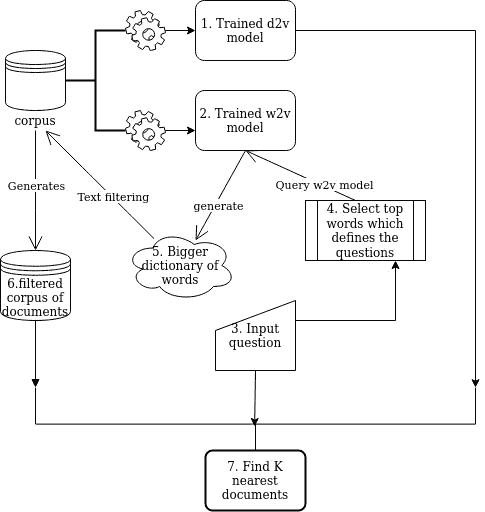

# **接近**

1.  **新冠肺炎数据加载和准备**

最近 Kaggle 向世界人工智能专家发出的[行动呼吁](https://www.kaggle.com/allen-institute-for-ai/CORD-19-research-challenge)倡议，[艾伦人工智能研究所](https://allenai.org/)已经提供了超过 70，000 篇学术文章，以及定期更新的 JSON 格式的元数据。

这里的 请参考 [**数据加载** **上的内核*处理、清理、删除重复*，然后将 JSON 中的文本数据加载到 pandas 中。下面是整个语料库的一个片段。**](https://www.kaggle.com/piyushrumao/covid-19-json-dataset-loader)

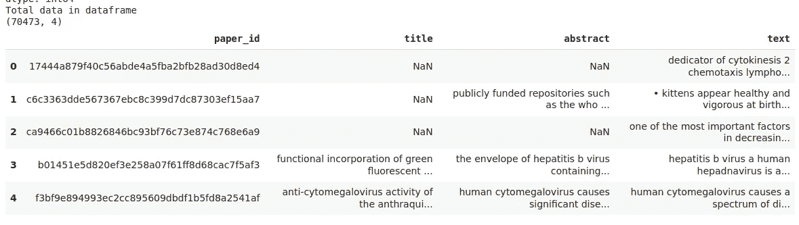

然而，在['text '，' title '，' abstract']下有许多空值，我们的文本越好，我们的嵌入模型就越好，所以我决定将所有文本数据合并到一列中。

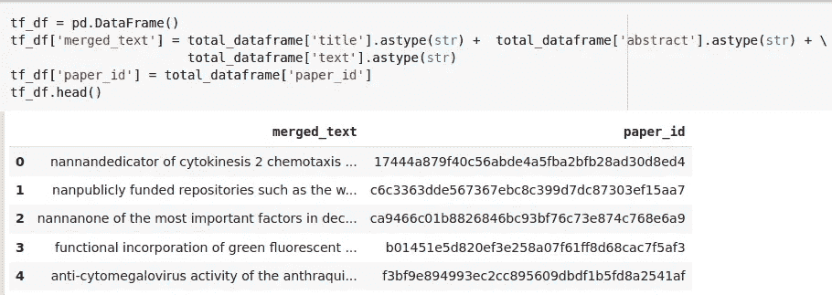

以下是数据清理和准备的要点。

现在，我将使用“merged_text”列进行模型训练，该列由每个 paper_id 的文本数据组成。

2.**训练 Word2Vec 模型**

[Word2vec](https://en.wikipedia.org/wiki/Word2vec) 是一种嵌入技术，与其他高维特征提取技术不同，它依赖于密集的低维特征。它提供的优势是，具有相似含义的单词将以这样一种方式表示，即它们看起来彼此更接近。

有两种类型的 word2vec 技术:

1.连续单词袋(CBOW)，2。跳跃图

想了解更多 word2vec 的工作原理，可以参考这个[帖子](/understanding-word2vec-embedding-in-practice-3e9b8985953)。我们将按照以下步骤训练 word2vec 模型:

2.1 为基于 gensim 的 word2vec 准备数据

让我通过删除停用词和长度少于 3 个字母的单词，为每个文档创建一个标记列表。

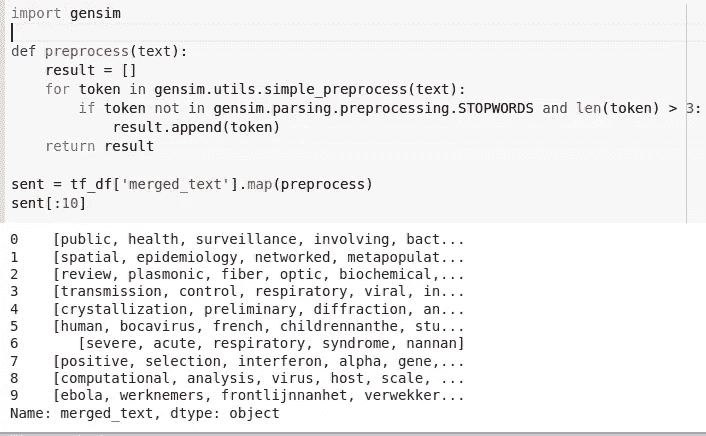

然而，这些是单个的记号，把 n 元语法生成为单词更有意义，所以我生成了二元语法。

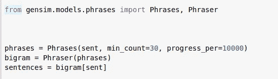

使用 gensim 的短语，我创建了有意义的二元符号，这些符号是使用上面完成的处理生成的。

2.2 培训模式

现在，当输入数据准备就绪时，我们可以通过定义以下参数来训练 word2vec:

*   `min_count`:语料库中要包含在模型中的单词的最小出现次数。数字越大，语料库中的单词就越少。
*   `window`:句子内当前词和预测词之间的最大距离。
*   `size`:特征向量的维数。
*   `workers`:我知道我的系统有 4 个内核。
*   `model.build_vocab`:准备模型词汇。
*   `model.train`:训练词向量。
*   `model.init_sims()`:当我们不打算进一步训练模型时，我们使用这一行代码来提高模型的内存效率。

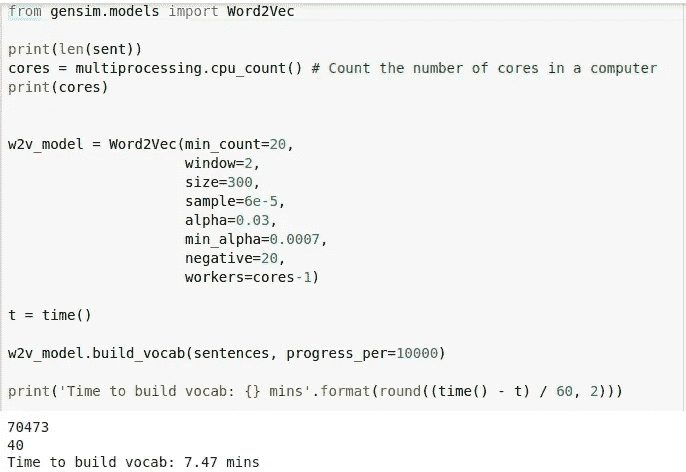

2.3 测试模型预测能力

我将创建一个单词列表来测试我们的模型为每个单词预测的前 10 个最接近的单词。

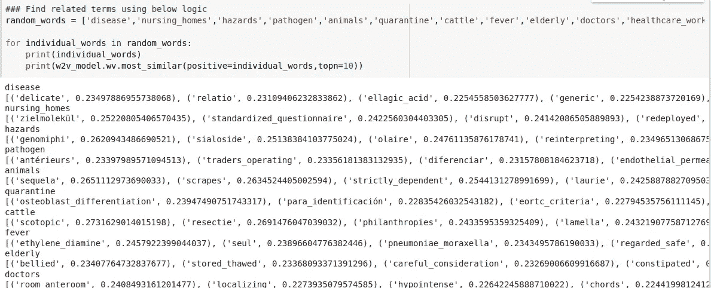

2.4 使用 t-SNE 可视化来可视化在向量空间中映射的单词

我将使用 t-SNE 把高维度的单词模型可视化成二维空间。为了做到这一点，我将使用一个单词样本来看看我们的模型如何将它们映射到空间中。

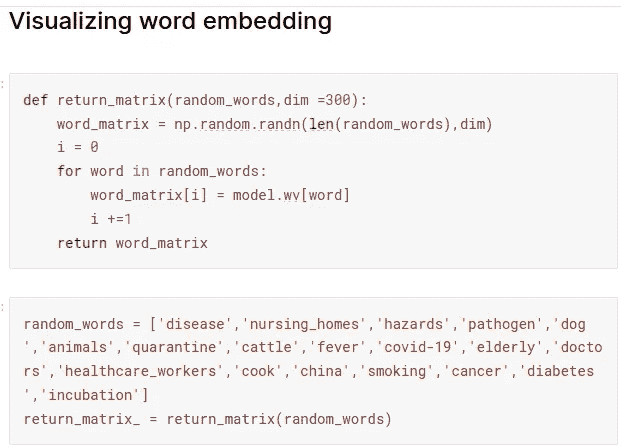

正如我们上面看到的，我使用了随机单词，然后使用我们训练的 w2v 模型从每个单词中提取了 300 个特征维度，创建了一个矩阵。

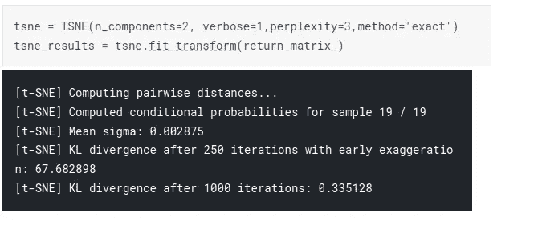

现在，使用 t-SNE 将 300 维单词矩阵映射到 2 维空间，我们最终可以将单词可视化，如下所示。

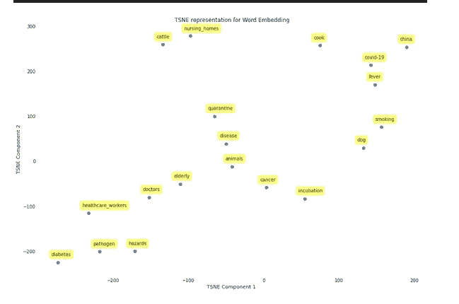

我们可以清楚地看到一组相似或被一起引用的词，如“卫生工作者”和“医生”，或“新冠肺炎”与“发烧”和“中国”。

3.**培训 Doc2Vec 模型**

因为上面的 word2vec 模型生成单词的数字表示，所以它一起表示语义相关的单词。Doc2vec 是 word2vec 的扩展，它将文档表示成向量空间，而不管其长度如何。

就像 word2vec 一样，doc2vec 也有两种类型:

1]分布式内存(DM)，2 .分布式单词包(DBOW)

你可以在这里找到关于它们用法的详细帖子[。让我们从首先将文档处理成 gensim 所依赖的格式开始我们的过程。然后，Doc2vec 需要一个单词标记列表和一个带有每个文档的文档 id/名称的标记。](/multi-class-text-classification-with-doc2vec-logistic-regression-9da9947b43f4)

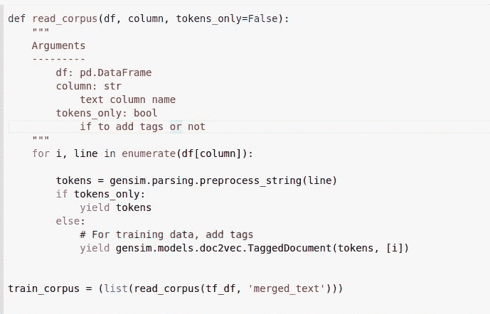

使用上述处理技术准备好输入数据后，我将使用它训练我的 doc2vec 模型。我正在训练 doc2vec 的 DBOW 和 DM 变体，并将它们合并到一个模型中以获得更好的健壮性。然而，我们甚至可以只用一个模型。

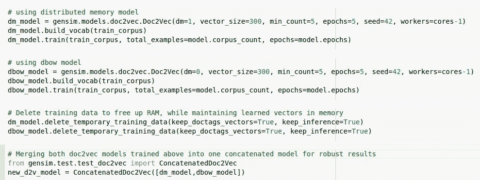

模型训练后的最后一步是将每个文档与其生成的特征向量相关联。

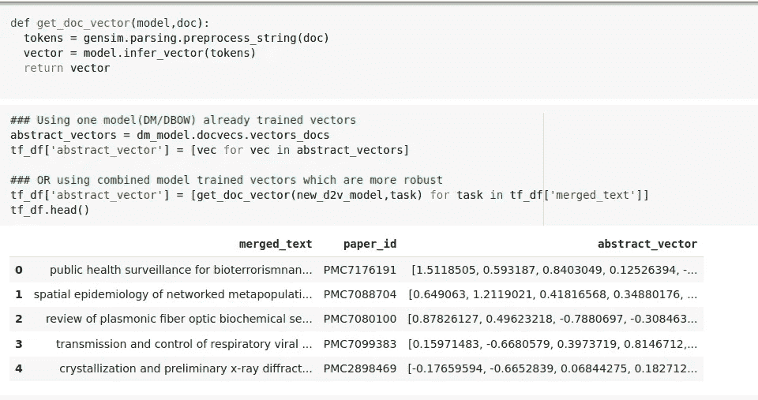

4.**创建一个与新冠肺炎相关的问题列表**

这项工作的全部目标是通过利用嵌入技术的能力有效地回答与新冠肺炎相关的问题，嵌入技术考虑了单词之间的语义关系。因此，我创建了一个需要回答的问题列表，然后使用我们训练的 doc2vec 模型为其提取特征向量，如下所示。

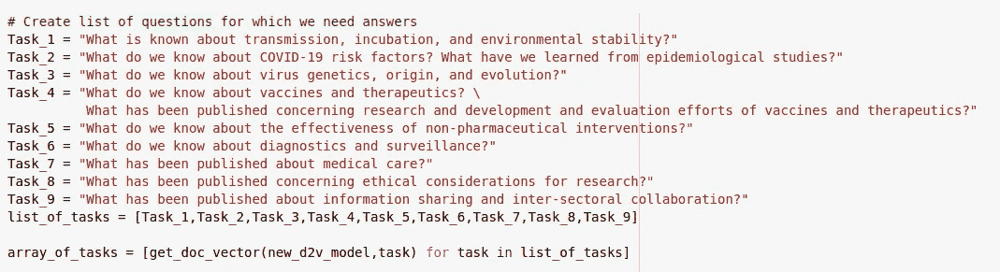

让我创建一个字典，其中包含分配给一个问题的每个任务，以及定义这些问题的最相关的单词，如下所示。

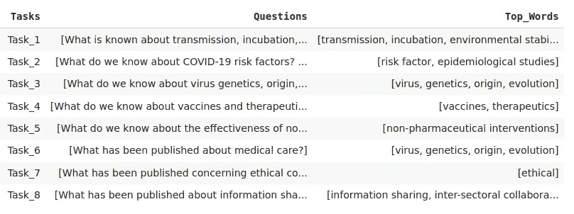

5.**使用 word2vec 丰富定义单项问题的关键术语**

正如我们在上面看到的，每一个与新冠肺炎有关的问题都与定义它的最相关的词联系在一起。我们将使用这些词来过滤文档，从而缩小我们的搜索空间。然而，上面选择的单词数量太少，所以我决定在我们训练的 word2vec 模型的帮助下，使用类似的单词来增加它们。

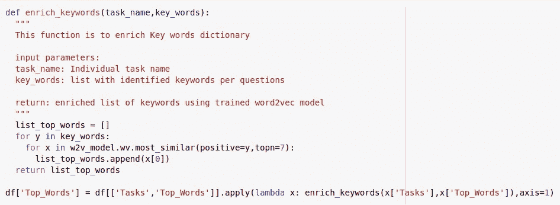

使用上面的代码，我将如上所述丰富我的关键字。对于每个单词，我也在我们训练的 word2vec 模型中寻找前 7 个最相似的单词，然后将它们添加到我们的搜索词典中。

6.**过滤文档以缩小搜索空间**

如果我们回头参考数据加载器，我们的语料库中有超过 7 万个文本文档。这导致我们进入一个大的搜索空间，也增加了遇到模糊结果的可能性。因此，我决定通过排除不包含相关关键字的文档来缩小搜索范围。

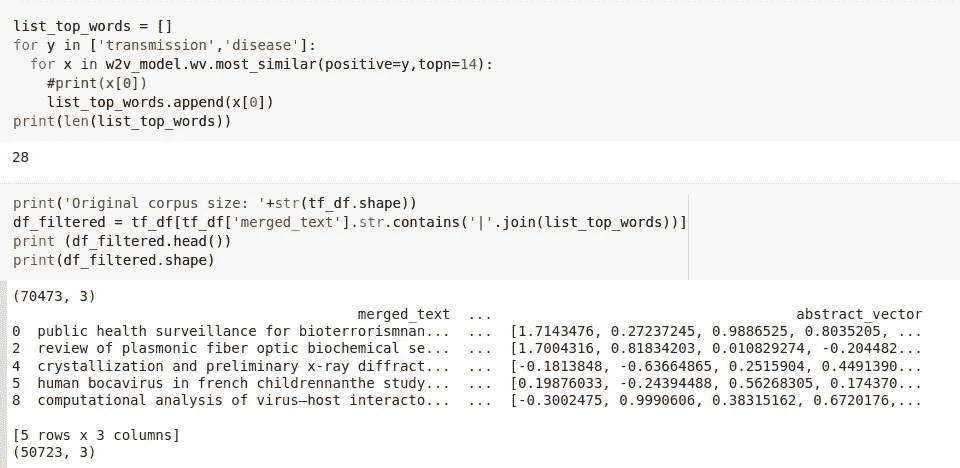

这是一个执行文档过滤的示例代码。我选择了两个词:['传播'，'疾病' ']，然后使用 word2vec 搜索了 14 个与列表中每个词相似的词，并创建了一个 28 个词的列表。最后，使用该列表，我将大小为 70k 文档的原始语料库过滤为 50k 文档，然后可以使用这些文档来查找与我们的输入查询相似的文档。

7.**使用 doc2vec 模型从用户问题推断特征向量**

为了让我们的机器学习模型理解这些问题，我们需要将其翻译成它可以理解的格式。所以我用我们训练好的 doc2vec 模型从中提取特征向量。

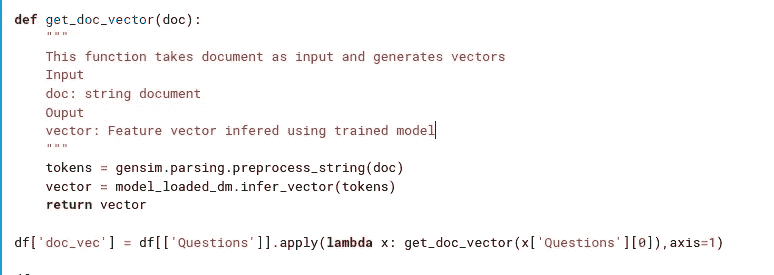

提取上述文档向量后生成的数据帧。

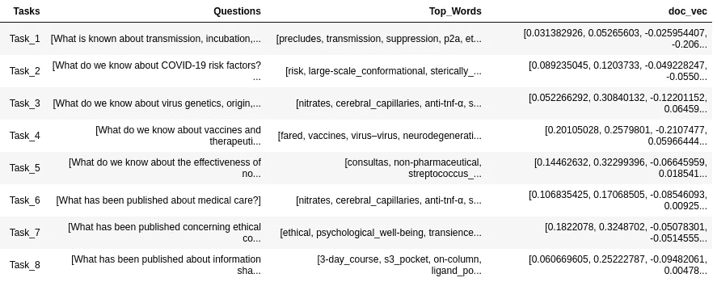

8.**查找最近的文件**

[最近邻居](https://en.wikipedia.org/wiki/Nearest_neighbor_search)是一种基于邻近度的搜索，它的工作假设是相似的事情发生在彼此附近。

> 人以群分

Sklearn 为我们提供了一个基于无监督[球树](https://en.wikipedia.org/wiki/Ball_tree)的最近邻搜索实现，我将使用它来查找与我们的搜索查询最相关的文档。

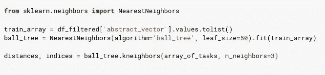

使用从过滤的文档语料库中生成的文档嵌入，我为一组相关问题训练了基于“球树”的最近邻算法，以找到前 3 个最相关的文档。

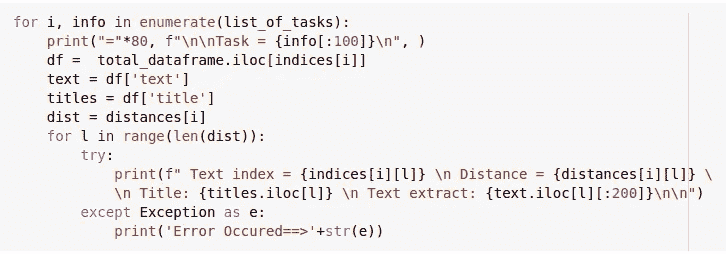

我将使用上面的代码来打印我们的“问题”,我们找到了最近的 3 个文档以及它们与问题的距离。

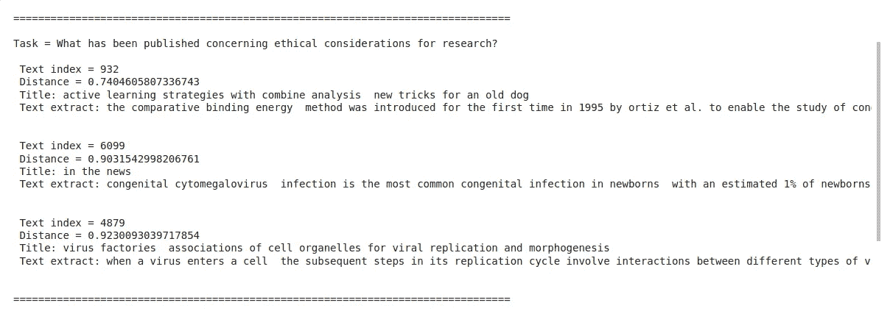

# **结论**

让我总结一下我为实现发现与输入查询最相似的文档这一最终目标而遵循的步骤。

1.  我首先根据新冠肺炎的研究数据训练了一个 word2vec 和一个 doc2vec 模型。
2.  然后，我使用了一个问题列表，我正在寻找在上下文中最相似的文档。
3.  后来，我使用定义这些问题的最相关的单词，通过在训练好的 word2vec 模型的帮助下找到相似的单词，进一步丰富了单词词典。
4.  使用这些词，我们过滤了语料库的大小，以减少搜索空间。
5.  最后，我们使用 doc2vec 模型提取特征向量，并训练最近邻算法来寻找最相似的文档。

> 新冠肺炎研究中有几个开放式的问题和答案，需要支持性的研究文章来验证其可信度。找到这样的文档是一项具有挑战性的任务。在处理不明确的文本数据时，简单的字符串匹配或距离度量等技术是不可靠的。因此，我决定创建一个健壮的基于自然语言处理的架构，其中我们结合了嵌入技术的语言能力，例如上面概述的，并使用它们来进行更好的预测。