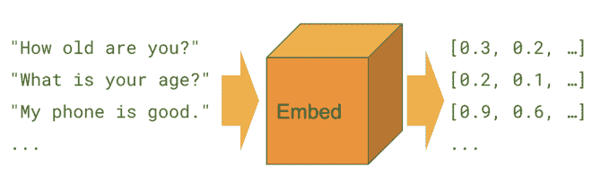
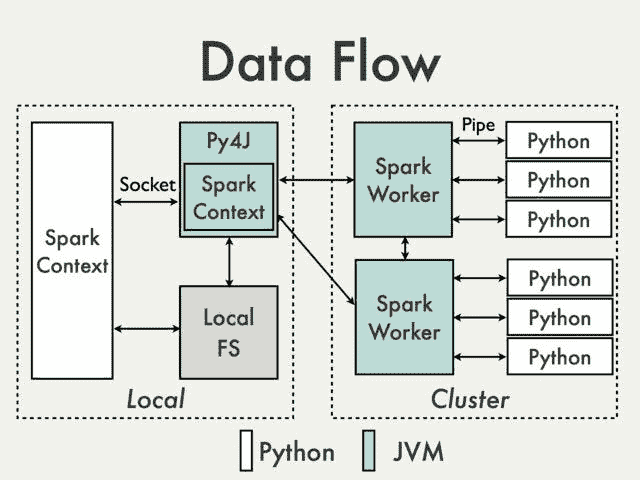
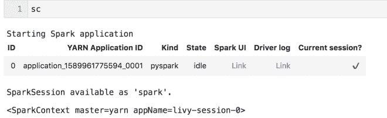
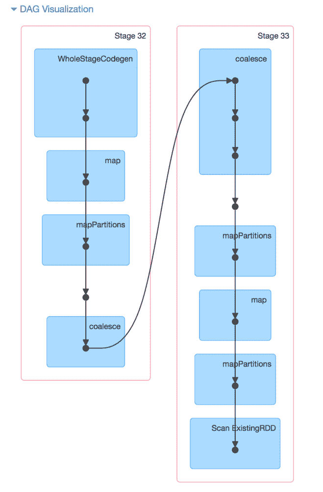
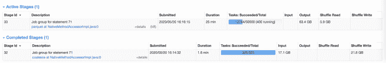
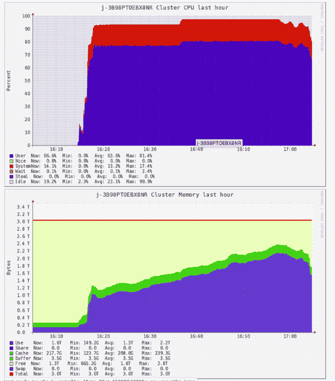

# 使用 Tensorflow 通用语句编码器和 Spark EMR 嵌入数十亿个文本文档

> 原文：<https://towardsdatascience.com/embedding-billions-of-text-documents-using-tensorflow-universal-sentence-encoder-and-spark-emr-422407eecf60?source=collection_archive---------56----------------------->

## [理解大数据](https://towardsdatascience.com/tagged/making-sense-of-big-data)


照片由 Enoc Valenzuela 拍摄(图片来源: [Unsplash](https://unsplash.com/photos/WJolaNbXt90)

Tensorflow HUB 提供了各种预训练模型，可随时用于推理。一个非常强大的模型是[(多语言)通用句子编码器](https://tfhub.dev/google/universal-sentence-encoder-multilingual/3)，它允许将以任何语言编写的文本嵌入到一个通用的数字向量表示中。



来自 [TensorFlow Hub](https://tfhub.dev/google/universal-sentence-encoder/4) 的通用语句编码器概述

嵌入文本是一种非常强大的自然语言处理(NLP)技术，用于从文本字段中提取特征。这些特征可用于训练其他模型或用于数据分析，例如基于单词语义的聚类文档或搜索引擎。

不幸的是，如果我们有数十亿的文本数据要编码，在一台机器上运行可能需要几天时间。在本教程中，我将展示如何利用 Spark。特别是，我们将使用 AWS 管理的 Elastic MapReduce (EMR)服务将句子编码器应用到大型数据集，并在几个小时内完成。

# 配置

# EMR 集群

在本例中，我们假设一个集群有一个主节点(r4.4xlarge)和 50 个核心节点(r4.2xlarge spot 实例)。该集群总共有 400 个内核和大约 3TB 的理论内存。在实践中，每个执行器的最大内存会被 YARN 限制在 52GB 左右。

如果运行一个包含大量节点的集群是不经济的，那么集群的总内存大小不应该成为瓶颈，因为 Spark 惰性执行模式不需要将整个数据集同时加载到内存中。

为了充分利用 EMR 集群资源，我们可以方便地使用属性“maximizeResourceAllocation”。此外，我们还需要配置 livy，使我们的会话不超时(spark-submit 作业不需要)。

我们可以通过指定以下配置来实现这两个目标:

```
[{"classification":"spark","properties":{"maximizeResourceAllocation":"true"}},{"classification":"livy-conf","properties":{"livy.server.session.timeout-check":"false"}}]
```

我还建议选择最近发布的 emr-5。x 并且至少包括以下软件包:Hadoop 2.8.5、Ganglia 3.7.2、Spark 2.4.4、Livy 0.6.0。

为主节点和核心节点添加对外界开放的安全组(如果集群部署在 VPC 中，这将是访问 Spark UI 和 Ganglia 所必需的)。

# 火花会议

创建一个 EMR 笔记本，并将其连接到之前创建的集群。在创建会话之前，我们需要调整一些内存配置。

由于大部分计算和内存将由 python 进程使用，我们需要改变 JVM 和 python 进程之间的内存平衡:



来自 [Apache Spark wiki](https://cwiki.apache.org/confluence/display/SPARK/PySpark+Internals) 的 PySpark 内部消息

指定的执行器内存将只考虑 JVM，而不考虑外部进程所需的内存，在我们的例子中是 TensorFlow。

我们需要调整 spark . yarn . executor . memory overhead，使其大于 spark.executor.memory 的 10%,并分配 spark.python.worker.memory，以避免不必要的磁盘溢出。

在启动 Livy 会话之前，我们将首先配置这些纱线参数，在笔记本单元中运行:

```
%%configure -f 
{ "conf":{ "spark.pyspark.python": "python3", "spark.pyspark.virtualenv.enabled": "true", "spark.pyspark.virtualenv.type":"native", "spark.pyspark.virtualenv.bin.path":"/usr/bin/virtualenv", "spark.executor.memory": "50g", "spark.yarn.executor.memoryOverhead": "12000", "spark.python.worker.memory": "10g" }}
```

在 61GB 的可用空间中，我们为 python workers 分配了 10GB，为 JVM 分配了 50GB，其中 12GB 是开销。

在亚马逊 EMR 上成功管理 Apache Spark 应用程序内存的[最佳实践中有更多关于配置调优的细节。](https://aws.amazon.com/blogs/big-data/best-practices-for-successfully-managing-memory-for-apache-spark-applications-on-amazon-emr/)

现在可以创建一个会话来执行包含 spark 上下文对象的单元:



Livy 信息小部件

# 依赖性管理

AWS 做得很好，使得在运行时安装库更容易，而不必编写定制的引导动作或 ami。我们可以使用 [install_pypi_package API](https://aws.amazon.com/blogs/big-data/install-python-libraries-on-a-running-cluster-with-emr-notebooks/) 在主节点和核心节点安装软件包:

```
for package in ["pandas==0.25", "tensorflow==2.1.0", "tensorflow_text==2.1.1", "tensorflow-hub==0.7.0"]: 
    sc.install_pypi_package(package) sc.list_packages()
```

它将安装所提供的包，并打印出 python 3.6 虚拟环境中已安装包的列表。

注意:在 Hadoop 3.0 (EMR 6.x)中，应该可以在 Docker 容器中部署 Spark 集群，但是我还没有尝试过。

# 嵌入作业

我们需要将数据加载为 Spark DataFrame，其中包含一个键列和一个文本列。

嵌入作业在概念上将执行以下操作:

1.  下载 TensorFlow 多语言通用句子编码器模型
2.  将数据分区分割成文本文档块
3.  将每个块嵌入一个 NumPy 矩阵中
4.  将矩阵转换成 spark.sql.Row 对象列表

```
muse_columns = [f"muse_{(format(x, '03'))}" for x in range(512)]

def get_embedding_batch(batch, model, id_col, text_col, muse_columns):

    rows = [row for row in batch if row[text_col] is not None and len(row[text_col].split(" ")) >=3]
    if len(rows) == 0:
        return []

    from pyspark.sql import Row

    EmbeddingRow = Row(id_col, *muse_columns)

    keys = [x[id_col] for x in rows]
    text = [x[text_col] for x in rows]

    embedding_mat = model(text).numpy()
    return [EmbeddingRow(keys[i], *embedding_mat[i, :].reshape(-1).tolist()) for i in range(len(keys))]

def chunks(iterable, n=10):
    from itertools import chain, islice
    iterator = iter(iterable)
    for first in iterator:
        yield chain([first], islice(iterator, n - 1))

def get_embedding_batch_gen(batch, 
                            id_col, 
                            text_col, 
                            muse_columns=muse_columns,
                            chunk_size=1000):
    import tensorflow_hub as hub
    import tensorflow_text

    model = hub.load("https://tfhub.dev/google/universal-sentence-encoder-multilingual/3")
    chunk_iter = chunks(batch, n=chunk_size)

    for chunk in chunk_iter:
        for row in get_embedding_batch(batch=chunk, model=model, id_col=id_col, 
                                       text_col=text_col, muse_columns=muse_columns):
            yield row
```

几个问题:

*   模型仅被下载和实例化一次；或者，我们可以使用 Spark 本地广播变量。
*   为了让模型在运行时工作，我们首先必须在每个执行器中导入 tensorflow_text
*   我们通过每次仅具体化 1000 行中的一个块，将行对象的可迭代转换为行对象的可迭代。
*   我们丢弃了少于 3 个标记的句子。
*   numpy float32 型与 Spark DoubleType 不兼容；因此，必须首先将其转换为浮点型。

# 玩具示例

让我们用一个小的数据样本来试试这段代码:

```
english_sentences = ["dog", "Puppies are nice.", "I enjoy taking long walks along the beach with my dog."]
italian_sentences = ["cane", "I cuccioli sono carini.", "Mi piace fare lunghe passeggiate lungo la spiaggia con il mio cane."]
japanese_sentences = ["犬", "子犬はいいです", "私は犬と一緒にビーチを散歩するのが好きです"]

sentences = english_sentences + italian_sentences + japanese_sentences
```

现在，我们可以使用 mapPartitions API 批量运行推断，然后将结果转换成包含键列和 512 muse 嵌入列的 Spark 数据帧。

```
from pyspark.sql.types import StructType
from pyspark.sql.types import StructField
from pyspark.sql.types import StringType, FloatType
from pyspark.sql import Row
from functools import partial
sentences = [Row(id=i, text=sentence) for i, sentence in enumerate(sentences)]

sentence_embeddings_rdd = sc.parallelize(sentences).mapPartitions(partial(get_embedding_batch_gen, id_col='id', text_col='text'))

schema = StructType([StructField('id', StringType(), False)] + [StructField(col, FloatType(), False) 
                                                                for col in muse_columns])
sentence_embeddings_df = sqlContext.createDataFrame(sentence_embeddings_rdd, schema)
```

在上面的例子中，我们手动指定模式以避免动态模式推理的减速。

# 分割

玩具示例应该马上就能工作，因为数据样本非常小。如果我们必须为非常大的数据集进行缩放，我们既不想遇到内存错误，也不想将输出存储在成千上万个小部分中。在映射句子 RDD 之前，我们可能需要调整它们的分区大小(大约几万个分区),并在写入存储层之前将嵌入数据帧合并到一个合理的小范围(几百个分区),并减少输出文件的数量。

请注意，块大小对分区进行切片，以使张量在进行推理时不会太大，但它们不能保证执行器不会将整个分区保存在内存中。

例如，10 亿个文本文档的数据集可以被分成 5k 个分区，每个分区 200k 个文档，这意味着每个分区将包含大约 200 个连续的组块。输出应该保存为 400 个部分的拼花文件。

```
sentence_embeddings_rdd = large_text_corpus_rdd.repartition(5000).mapPartitions(embedding_generator_function) large_text_corpus_df = sqlContext.createDataFrame(large_text_corpus_rdd, schema) large_text_corpus_df.coalesce(400).write.option("compression", "snappy").parquet(output_path)
```

就这样，您可以监视 Spark 作业，并最终访问以 parquet 格式划分为 400 个大小几乎相同的部分并用 snappy 压缩的嵌入。

# 监视

监控 Spark 作业的主要工具是它的 UI 和 Ganglia。

# Spark UI

如果我们在 Jupyter 笔记本中执行%info 来获得当前和过去的 Livy 会话列表。从这个小部件中，您还可以获得到 Spark UI 和主主机名的链接(从这里您可以通过[http://master _ hostname/Ganglia/)访问 Ganglia)。](http://master_hostname/ganglia/).)如果集群部署在私有网络中，我们将需要通过代理访问这些服务器。

从 Spark UI 中，我们可以看到如下的计算图:



Spark 作业的 DAG 可视化



Spark 工作的各个阶段

我们可以观察到两个级别的重新分区:阶段 32 在模型推断之前对数据进行重新分区，阶段 33 在写操作之前进行重新分区。

# 神经中枢

如果您打开 Ganglia UI 并正确完成了所有操作，您应该会看到如下内容:



集群的 Ganglia 概述

如果您遇到内存使用和 CPU 使用之间的严重不平衡，您可能希望将实例类型更改为计算优化程度更高的系列，而不是 r4。

对于每个 80k 文本句子，每个任务的执行时间大约为 20 分钟，并且考虑到 8 个任务将在同一个执行器中并发执行。

# 结论

这种方法可以适用于用任何规模的任何机器学习库运行模型推理。与 spot 实例一起使用 EMR 将使它变得快速和便宜。为了方便起见，我们使用了 EMR 笔记本，但是您可以将相同的逻辑封装到 spark-submit 作业中，并使用引导操作来安装包。

除了以数据框的形式存储嵌入之外，您还可以扩展用于存储每个分区的原始张量的代码，并将它们加载到 TensorBoard 中，以实现高效的三维可视化。

相反，如果您正在寻找在 Spark 上以分布式模式运行 TensorFlow 的方法，您必须使用不同的架构，如文章[在 Spark 上扩展分布式 tensor flow](/scaling-up-with-distributed-tensorflow-on-spark-afc3655d8f95)中所述。

请留下您的评论并订阅下一期教程。

*原载于 2020 年 5 月 21 日*[](https://datasciencevademecum.com/2020/05/21/embedding-billions-of-text-documents-using-tensorflow-universal-sentence-encoder-on-top-of-spark-emr/)**。**