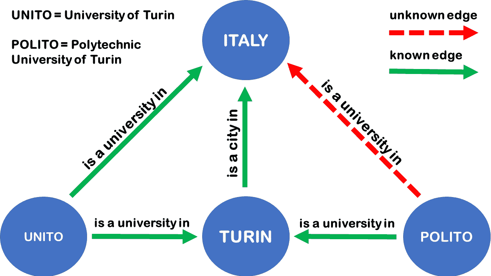
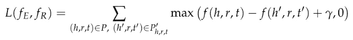
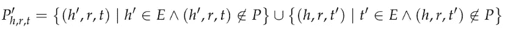
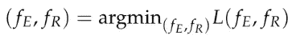
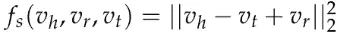
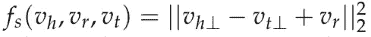
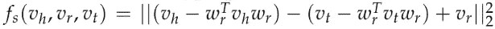
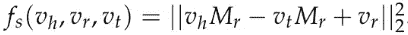

# 知识图补全的嵌入模型

> 原文：<https://towardsdatascience.com/embedding-models-for-knowledge-graph-completion-a66d4c01d588?source=collection_archive---------31----------------------->

## **TransE、TransH、TransR、CTransR 车型简介**

**知识图** (KG)在不同的学习领域有几种定义。在本文中，我们将 KG 定义为一个图，其中每个节点是一个*实体空间* E 的元素，每个边是一个*关系空间* R 的元素。E 和 R 的详细定义是特定于领域的:例如，在社交网络中，E 是一组人，R 是一组不同类型的关系(亲戚、朋友、伙伴、陌生人)。一般来说，E 和 R 可以分别包含每一个存在的实体(或概念、事件、情形等)。)和先前实体之间的每种类型的关系。此外，每个实体可以具有可变数量的属性或特性。鉴于 KG 的通用定义，它经常被用作**知识库** (KB)或**本体**的同义词。本体论这个术语有许多哲学和技术上的概念化和含义，在这个讨论中没有分析，事实上:上面给出的 KG 的定义只是为下面的段落做准备的简化。

KG 可应用于不同兴趣领域(学术和工业)的广泛任务:

*   识别一个单词在句子中使用的是哪个词义(词义消歧)；
*   自动回答用自然语言提出的问题(QA)；
*   用有意义而不仅仅是词汇匹配来搜索信息(语义搜索)；
*   检测和分类实体之间的语义关系(关系提取)；
*   预测用户的偏好(推荐系统)。

近年来，学术界和商业界都开发了大量的知识图谱:WordNet、DBpedia、Freebase、YAGO、Wikidata、Google Knowledge Graph、Facebook Graph Search 等。尽管有非常大量的实体，这些图仍然有许多缺失或错误的边，因此，**知识图完成** (KGC)是一个活跃的研究领域。

图片作者。KGC 的一个例子:基于实体之间已知的关系(实线)，KGC 算法应该推断未知的关系(虚线)。

上面给出的 KG 的定义允许我们用三元组元素 *(h，R，t) ∈ E × R × E* 指定 KG 的边，其中头( *h* )和尾( *t* )实体是 *E* 和 *r* 的元素，它们是有向的，是一种关系类型 *R* 。注意顺序很重要，因为不是每个关系都是双向的。形式上，我们将 KGC 定义为试图预测三元组 *(h，r，t)* 中任何缺失元素的任务。特别是，我们谈论:

*   **实体预测**当 h 或 t 之间的某个元素缺失时(*(？，r，t)* 或 *(h，r，？)*)；
*   **关系预测**当 r 缺失 *(h，？，t)*；
*   **三元组分类**当一个算法识别出给定的三元组 *(h，r，t)* 是否正确时。

从技术上来说，KGC 非常类似于社交网络分析中的链接预测:两者都试图完成一个不完整的网络。此外，KGC 面临挑战的原因如下:

*   造一个 KG 不是小事；
*   每个实体可以有可变数量的属性(非唯一规范)；
*   *R* 可以包含不同类型的关系(多层网络)；
*   一公斤随时间变化(随时间进化)。

为了解决 KGC 问题，过去几年中开发了不同的方法:例如，实体解析(er)，概率软逻辑(PSL)和知识图嵌入(KGE)。第一种方法试图对涉及相同底层实体的实体进行分组，而第二种方法使用概率推理。尽管它们是非常有趣的话题，但在本文中我们只关注 KGE。

嵌入背后的思想在数学中被广泛使用:如果我们需要研究未知空间的元素的性质，我们找到一个函数，通过保留一些关系将未知空间的每个元素映射到已知空间。

在 KGE 模型中，我们假设存在两个函数 *f_E* 、 *f_R* 和两个自然数 *k* 和 *l* 使得 *f_E : E → ℝ^k* 和 *f_R : R → ℝ^l* 是将实体和关系映射到ℝ^k 或ℝ^l.的嵌入函数。我们将详细描述 *f_E* 和 *f 的构造设(v_h，v_r，v_t) *∈* ℝ^k × ℝ^l × ℝ^k 为 *(f_E(h)，f_R(r)，f_E(t))* 的像。在嵌入空间ℝ^k × ℝ^l × ℝ^k 上，定义了一个得分函数*fs:ℝ^k×ℝ^l×ℝ^k→ℝ*来度量三元组 *(h，r，t)* 的不可置信性。因此，给定一个正确的三联体 *(h，r，t)* 和一个不真实的三联体 *(h '，r '，t')* ，应该发生 *f_s(v_h，v_h，v_t) < f_s(v_{h'}，v_{r'}，v_{t'})* 。为了简化符号，我们直接用 *f(h，R，t)* 表示组成 *f_s(f_E(h)，f_R(r)，f_E(t))* 。在现实世界中，我们可以定义先验的 *k，l，f_s* 而不能定义 *f_E* 和 *f_R* 。它们通过一些优化算法(例如:随机梯度下降、L-BFGS、自适应次梯度和自适应学习率方法)来估计，这些算法最小化使用 *f* 定义的损失函数:*

其中γ是边缘超参数， *P* 是正确三元组的集合，并且

不可信或手动损坏的三元组集。至此，我们可以确定 *f_E* 和 *f_R* 为

在上面解释的 KGC 背景下，研究人员提出了许多嵌入模型。例如，在**trans model**(2013)中，嵌入的实体和关系应该共存于同一空间中(即 *k = l* )，得分函数定义为

这意味着给定一个相干三元组 *(h，r，t)* ， *v_t* 应该是 *v_h + v_r* 的最近邻。最后一种暗示不适用于 *1-N* 、 *N-1* 和 *N-N* 的关系。为此，2014 年提出了 **TransH 车型**。与前面的模型一样，嵌入的实体和关系仍然共存于同一空间中，但得分函数的定义不同:

其中 *v_{h\perp}* 和 *v_{t\perp}* 分别是 *v_h* 和 *v_t* 在包含 *v_r* 的超平面上的投影。因此，给定 *w_r* 到 *v_r* 的超平面的法向量，使得 *||w_r||_2 = 1* ，得分函数可以写成

利用投影，可以对每个实体在不同关系中扮演的不同角色进行建模，从而克服跨模型的问题。在 2015 年出版的 **TransR 模型**和 **CTransR 模型**中包含了进一步的概括，其中嵌入的实体和关系不再是同一空间的元素:实际上，对于每个关系 *r∈ R* ，都存在一个投影矩阵 *M_r* ，使得嵌入的实体被投影到其特定的关系空间中。因此，TransR 的得分函数定义为

该得分函数在 CTransR 中略有不同，在 CTransR 中，通过使用分段线性回归的思想对同一关系的不同方面进行建模。为了这个介绍的完整性，我们只提一些其他的 KGE 模型而不讨论(虽然，列表还远不完整):结构化嵌入，神经张量网络，语义匹配能量模型，潜在因子模型，TransD。

**参考文献:**

*   海科·保罗海姆。知识图精化:方法和评估方法综述。*语义网*，8(3):489–508，2017。
*   王全、毛振东、王斌和李果。知识图嵌入:方法和应用综述。 *IEEE 知识与数据工程汇刊*，29(12):2724–2743，2017。
*   安托万·博德斯、杰森·韦斯顿和尼古拉斯·乌苏尼尔。弱监督嵌入模型的开放问题回答。在*关于数据库中的机器学习和知识发现的欧洲联合会议*中，第 165-180 页。斯普林格，2014。
*   安托万·博德斯，苏米特·乔普拉和杰森·韦斯顿。带有子图嵌入的问题回答。载于*2014 年自然语言处理经验方法会议论文集*，第 615–620 页，2014 年。
*   Antoine Bordes、Nicolas Usunier、Alberto Garcia-Duran、Jason Weston 和 Oksana Yakhnenko。翻译用于多关系数据建模的嵌入。在*神经信息处理系统进展*，2787–2795 页，2013 年。
*   王震、张建文、封建林和陈政。基于超平面平移的知识图嵌入。2014 年*第二十八届 AAAI 人工智能大会*。
*   林、、孙茂松、、。用于知识图完成的学习实体和关系嵌入。在*2015 年第二十九届 AAAI 人工智能大会*。

联系人:[LinkedIn](https://www.linkedin.com/in/shuyiyang/)|[Twitter](https://twitter.com/deltarule)