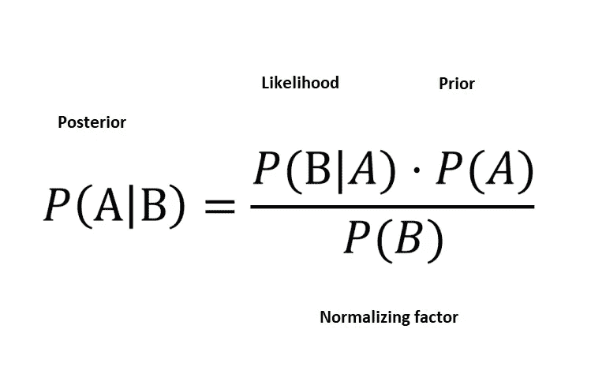
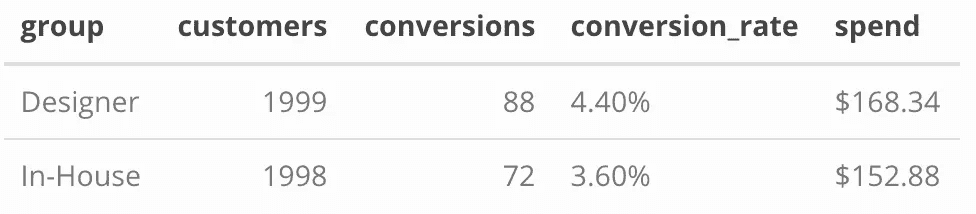
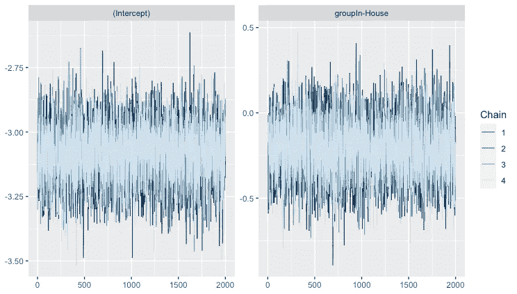
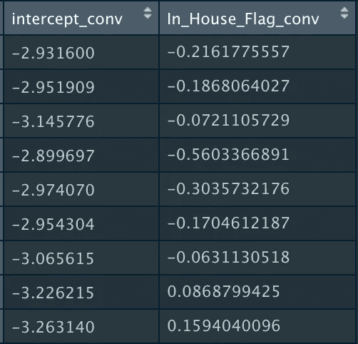
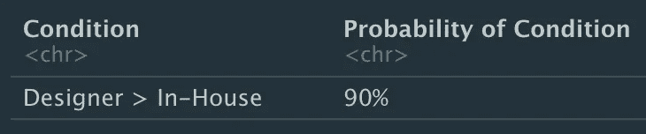
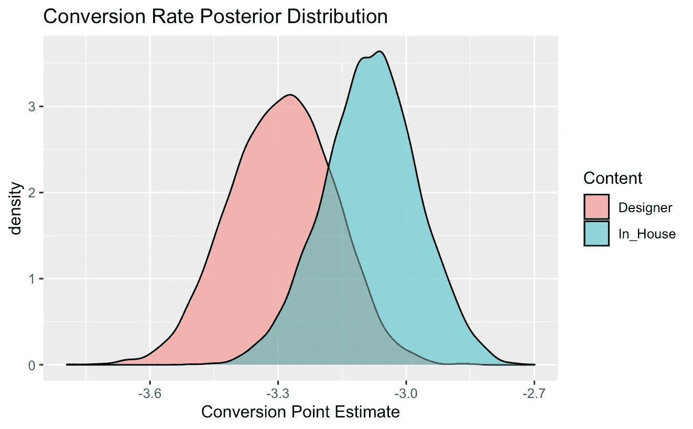
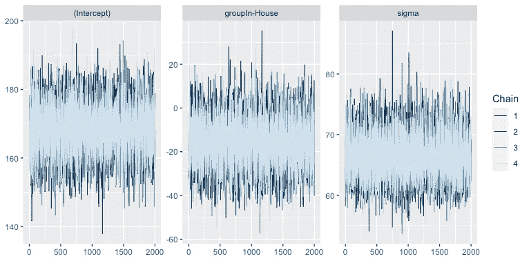
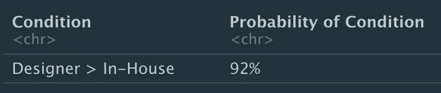
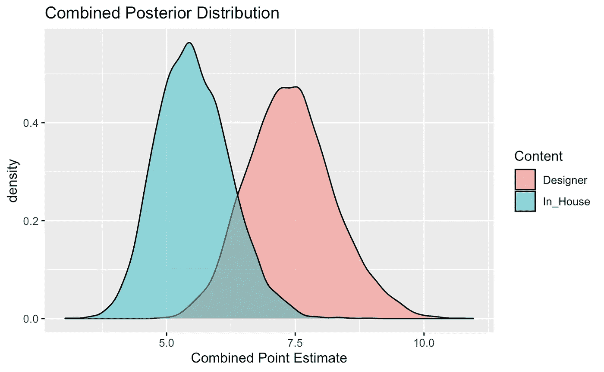

# 探索贝叶斯 A/B 测试测量作为 P 值的替代

> 原文：<https://towardsdatascience.com/embracing-bayesian-a-b-test-measurement-and-ditching-p-values-9e444df379ca?source=collection_archive---------21----------------------->

## 用 Rstan 将贝叶斯推理应用于 A/B 测试


威廉·艾文在 [Unsplash](https://unsplash.com/s/photos/measurement?utm_source=unsplash&utm_medium=referral&utm_content=creditCopyText) 上的照片

*(这是关于 A/B 测试的两部分系列的第二部分。第 1 部分介绍了在设计新测试时权衡所有选项的过程，可以在这里找到*[](/streamlining-design-and-maximizing-success-for-agile-test-and-learn-443156d9b2f1)**。这篇文章选取了测试测量阶段的例子，展示了在 R.)* 中使用贝叶斯分析的方法*

# *测量值几百万*

*如果你像我一样，你的收件箱每天都被电子邮件淹没。许多是与工作有关的，一些是来自朋友和家人的(包括来自奶奶的不健康的转发)，很多(可能太多了)是来自竞争你业务的公司的营销电子邮件。*

*它们可能看起来很讨厌，但是说实话，每隔一段时间，我们的兴趣就会被激起，我们就会打开一个。有时我们甚至会去公司的网站买些东西。这个神奇的时刻被公司捕捉到，并算作一次*转化*，我们花的钱*归于*邮件活动。*

*转换率因行业和内容类型而异，但通常相当低，不到 5%。这可能看起来不多，但是如果你给一个完整的订阅者列表发送一封电子邮件，即使 1%的转换率也能产生可观的投资回报。假设你是一家在线零售商，你向去年购买男装的 100 万名顾客发送了一封电子邮件。如果他们中只有 1%的人平均花费 50 美元进行转化，你就把 500，000 美元的收入归因于一个电子邮件活动！*

# *为什么是贝叶斯？*

*作为《走向数据科学》的读者，你可能熟悉贝叶斯分析的概念。贝叶斯定理旨在利用一个事件的信息来理解另一个事件。不严格地说，拥抱贝叶斯就是拥抱概率。应用贝叶斯推理进行 A/B 测试测量意味着我们将确定 A 与 B 不同的*概率**

**

*来源: [Pranav Prathvikumar](/intro-to-bayesian-statistics-5056b43d248d)*

*一段时间以来，统计学习的频率主义者和贝叶斯方法之间一直存在争论(有时激烈，通常是务实的)。剧透:在一天结束时，**你的数据有一个故事要告诉**，你可以通过几种不同的方式得出相同的结论。本文关注贝叶斯方法，强调与频率主义方法相比的一些不同之处。最终，我发现贝叶斯推理的某些方面在实践中很有价值。也就是说，贝叶斯推理提供了:*

1.  *变异不同的**概率**，使得对结果的解释更容易理解*
2.  *量化变量间差异的**大小的便捷方法***
3.  *一种计算每个变量的**总期望值**并可视化方差的直观方法*

*在本文中，我们将使用传统的频率主义方法和贝叶斯方法来衡量 A/B 测试结果，并以 A 对 B 的预期收入差异结束。 ***我们将展示这两种方法会导致类似的结果，并阐述贝叶斯技术的细微差别以及由此产生的解释*** 。*

# *设置*

*让我们来布置舞台。我们的业务合作伙伴设计并执行了一项新的电子邮件营销活动，测试两种不同类型的电子邮件内容，重点是男士西装。在 4000 名测试客户中，2000 名客户收到了一封电子邮件，宣传一个崭露头角的设计师的新系列礼服衬衫，而另外 2000 名客户收到了一封电子邮件，宣传一个内部品牌的类似系列礼服衬衫。我们将后起之秀的设计师邮件**称为设计师**，内部邮件**称为内部**。*

**

*测试结果:转换和花费汇总*

*邮件发出已经 7 天了，我们有了结果。88 名收到设计师内容的客户进行了购买，平均花费 168.34 美元，而 72 名收到内部内容的客户进行了购买，平均花费 152.88 美元(我们收到了 3 名客户的回复)。*

*设计师看起来是明显的赢家，对吗？也许是这样，但作为优秀的数据科学家，我们必须确保这种差异在统计上是显著的，而不仅仅是我们数据中随机性的结果。*

# *频繁主义方法*

*我们将从传统的测量方法开始。这可以通过比较两个样本的均值和方差的 t 检验来完成，或者通过拟合回归模型和调查独立变量系数来完成。我在这里使用回归方法，因为我喜欢灵活地添加额外的变量来控制(例如，发送电子邮件的日期、客户位置等)，这有助于与贝叶斯方法进行更好的比较，贝叶斯方法也使用回归。*

*我们首先单独研究转换率，将一个逻辑回归模型与我们的数据进行拟合，以观察组(我们的预测值)是否与转换率(我们的结果)有统计学上的显著关系。我们的无效假设是分组和转换之间没有关系，我们将使用 0.05 的标准 P 值阈值来确认或拒绝该假设。*

> *P >= 0.05 →无法拒绝 null(我们无法推断转换和组之间的关系)*
> 
> *P < 0.05 → Reject the null (we conclude a relationship does exist between Group and Conversion)*

*First, we fit a logistic regression on the data to model conversion rates.*

```
*Call:
glm(formula = conversion ~ group, family = binomial(), data = combined)Deviance Residuals: 
    Min       1Q   Median       3Q      Max  
-0.3001  -0.3001  -0.2709  -0.2709   2.5781Coefficients:
              Estimate Std. Error z value Pr(>|z|)    
(Intercept)    -3.0780     0.1090 -28.232   <2e-16 ***
groupIn-House  -0.2085     0.1622  -1.286    0.199    
---
Signif. codes:  0 ‘***’ 0.001 ‘**’ 0.01 ‘*’ 0.05 ‘.’ 0.1 ‘ ’ 1(Dispersion parameter for binomial family taken to be 1)Null deviance: 1343.3  on 3996  degrees of freedom
Residual deviance: 1341.6  on 3995  degrees of freedom
AIC: 1345.6Number of Fisher Scoring iterations: 6*
```

**注意，预测值是“* ***集团内部*** *”，这只是意味着回归将我们的二元预测值(集团)变成了虚拟变量，该变量将内部内容的值设为 1，将设计师内容的值设为 0。**

*我们的结果总结显示，在两个模型中，我们的预测因子的估计系数都是负的，这表明接收内部内容的客户比接收设计师内容的客户具有更低的转化率。然而，系数的 p 值为 **0.199** 高于我们的 0.05 阈值，这意味着我们未能拒绝我们的零假设，因此无法得出电子邮件内容对转化率有影响的结论。事实上，p 值是概率的一种度量。这意味着，在变量之间没有差异的零假设条件下，我们期望在 X%的时间里看到我们的数据。在这种情况下，如果真的没有差别，我们的数据在 20%的情况下会自然出现。虽然不是绝对的，但它确实表明可能存在一些潜在的差异。*

*然而，我们真正想测试的是**对收入的总体影响**，这意味着我们需要比较支出。我们将拟合一个关于花费的线性回归模型。*

```
*Call:
glm(formula = conv_spend ~ group, data = combined)Deviance Residuals: 
    Min       1Q   Median       3Q      Max  
 -7.411   -7.411   -5.509   -5.509  310.729Coefficients:
              Estimate Std. Error t value Pr(>|t|)    
(Intercept)     7.4106     0.7669   9.663   <2e-16 ***
groupIn-House  -1.9014     1.0847  -1.753   0.0797 .  
---
Signif. codes:  0 ‘***’ 0.001 ‘**’ 0.01 ‘*’ 0.05 ‘.’ 0.1 ‘ ’ 1(Dispersion parameter for gaussian family taken to be 1175.631)Null deviance: 4700258  on 3996  degrees of freedom
Residual deviance: 4696645  on 3995  degrees of freedom
AIC: 39604Number of Fisher Scoring iterations: 2*
```

*p 值为 0.0797，数据告诉我们，如果没有关系，我们只有 8%的机会看到我们的支出数据。我应该注意，我们看到的 p 值假设我们想要一个双尾检验。由于最初的数据汇总表明设计师将胜过内部人员，我们可以通过将 p 值除以 2 来重新解释单尾测试的 p 值。这将进一步降低 8%至 4%。一点也不差，显然有些不同。*

*查看我们的独立“内部分组”变量的系数，我们看到-1.90，表明平均而言，**内部内容导致*每次发送*的收入比设计师**少 1.90 美元。*

*那么我们学到了什么？如果我们的变量没有差异，我们的数据将只出现 8%的时间(如果我们使用不太保守的单尾测试，则为 4%)，因此，我们非常有信心在我们的两个变量之间存在差异。此外，由于向大约 100 万客户发送的每封电子邮件收费 1.90 美元，我们可能会获得 190 万美元的额外收入！如果没有真正的*分析我们的结果，我们不想错过这样的机会。**

# **输入贝叶斯**

**从频率主义者转向贝叶斯方法意味着从概率的角度考虑我们的数据。我们不是对群体和转化之间关系的假设给出“是”或“否”的答案，而是通过生成一个群体的结果始终不同于另一个群体的**概率**来进行测试。**

**简而言之，贝叶斯回归使用传统的基本回归公式，但不是返回输入系数β *i* 的点估计，而是*生成截距、输入系数和误差项*的分布。**

**这就是所谓的**后验分布**，它是利用数据的先验知识(“先验”)结合观测结果生成的。(如果你想更好地理解贝叶斯逻辑回归背后的理论，请查看威尔·库尔特的[这篇精彩概述](https://www.countbayesie.com/blog/2019/6/12/logistic-regression-from-bayes-theorem)或这篇 [rstanarm 教程](http://www.tqmp.org/RegularArticles/vol14-2/p099/p099.pdf))**

**我们将使用斯坦概述的贝叶斯分析的四个步骤来更好地理解我们的结果:**

> ****贝叶斯分析的四个步骤:****
> 
> **1.为结果和所有未知量指定联合分布，通常采用未知量的边际先验分布乘以以未知量为条件的结果的可能性的形式。这种联合分布与以观测数据为条件的未知量的后验分布成比例**
> 
> **2.使用马尔可夫链蒙特卡罗(MCMC)从后验分布中提取。**
> 
> **3.评估模型与数据的吻合程度，并可能修改模型。**
> 
> **4.从给定预测值的结果的后验预测分布中提取，以便可视化预测值的操作如何影响结果(的函数)。**

**我们将使用***Rstan****—*R 接口对 Stan —指定我们的后验分布，使用 MCMC 抽取样本，并评估模型拟合度。具体来说，我们使用 ***rstanarm*** 包。**

## **汇率**

**首先，我们有什么前科？让我们假设我们在一个新成立的团队中，这个团队之前对测试结果一无所知。这意味着我们事先不知道我们的转换率或花费应该是多少。默认情况下，Rstanarm 通过使用弱信息先验很好地处理了这个问题。截距和输入系数的默认先验假设为正态分布，并且 *Rstanarm* 根据数据调整标度。关于先验及其实现的更多细节可以在 [**rstanarm 简介**](https://cran.r-project.org/web/packages/rstanarm/vignettes/priors.html) 中找到。我们稍后将查看 *rstanarm* 如何调整(或没有调整)默认的优先级。**

**接下来，我们需要在建模阶段指定一些关键细节。由于我们的结果是一个转换率(0 或 1)，我们将使用*二项式分布*和 *logit* 链接函数。我们将设置*链= 4* ，这样我们可以运行 4 个不同的马尔可夫链，并确保得到的样本都收敛于相同的参数估计。然后我们将*迭代的次数*设置为 4000，预热*为 2000。这意味着每个链有 2，000 次迭代来训练和调整先验(如果需要的话)，对于 4 个链，我们最终从后验样本中提取了健康的 8，000 个记录样本。***

```
**Model Info:
 function:     stan_glm
 family:       binomial [logit]
 formula:      cbind(conversions, customers - conversions) ~ group
 algorithm:    sampling
 sample:       8000 (posterior sample size)
 priors:       see help('prior_summary')
 observations: 2
 predictors:   2Estimates:
                mean   sd     10%    50%    90% 
(Intercept)   -3.083  0.112 -3.227 -3.081 -2.939
groupIn-House -0.212  0.165 -0.425 -0.215  0.004Fit Diagnostics:
           mean   sd     10%    50%    90% 
mean_PPD 80.078  8.845 69.000 80.000 91.500The mean_ppd is the sample average posterior predictive distribution of the outcome variable (for details see help('summary.stanreg')).MCMC diagnostics
              mcse  Rhat  n_eff
(Intercept)   0.002 1.001 5242 
groupIn-House 0.002 1.000 4850 
mean_PPD      0.110 1.001 6448 
log-posterior 0.018 1.001 3174**
```

****

**显示参数分布收敛的转换轨迹图**

**快速检查汇总统计数据看起来不错。 *Rhat* 对于所有参数都非常接近 1，表明模型成功地收敛于每个参数的后验分布。我们还看到每个参数的有效样本量相对较高，远远超过样本量(8000)的 10%。此外，查看轨迹图，我们看到 4 条链中的每一条都收敛于截距和群系数的相同参数估计值附近。请注意，弱信息默认先验没有改变。**

**训练我们的模型的输出是从后验分布中采样的一组 8，000 个值。我们有单个预测组的截距和系数的样本。就像之前一样，模型已经把我们的预测器变成了 _House_Flag_conv 中的虚拟变量 ***。*****

****

**从转换后验中抽取的参数样本**

**因为我们的预测器是一个虚拟变量，其中内部= 1，设计师= 0，所以我们可以通过查看预测器***In _ House _ Flag _ conv***的采样系数来比较设计师内容和内部内容(上面的右栏)。**

**该系数的负值表示内部转换率低于设计者，正值表示相反。设计师优于内部设计师的概率就是在***In _ House _ Flag _ conv<0***的抽奖比例。**

****

**我们看到在 _House_Flag_conv 中的 ***在 90%的时间里是负的，因此设计者内容产生比 B 更高的转化率的概率是 90%。换句话说，如果我们运行这个测试 100 次， ***，我们将会期望在 100 次*** 中有 90 次来自设计者内容的更多转换。*****

*对于视觉型学习者来说，画出后验分布图来看看两组之间到底有多大的不同可能会有所帮助。*

**

*设计师与内部内容的样本分布*

*从营销的角度来看，设计师内容是一个非常明显的赢家。制作和发送带有内容的电子邮件在成本上没有本质的区别，所以选择设计师而不是内部设计师的决定似乎是显而易见的。但是转化率只有图片的一半…*

## *支出因素*

*因为我们做生意是为了赚钱，所以我们也想知道客户在转换时实际花了多少钱。不同的电子邮件内容可能会激发不同的购买行为，当我们向利益相关方展示我们活动的 ***总期望值*** 时，我们需要将这些因素考虑在内。*

*我们将使用与上面相同的序列，拟合模型(指定我们的后验分布)，使用 MCMC 绘制样本，并评估模型拟合。这里唯一真正的调整是将我们的响应变量切换为*花费*，将分布族切换为*高斯*，以适应我们的连续正态分布响应变量。*

```
*Model Info:
 function:     stan_glm
 family:       gaussian [identity]
 formula:      spend ~ group
 algorithm:    sampling
 sample:       8000 (posterior sample size)
 priors:       see help('prior_summary')
 observations: 160
 predictors:   2Estimates:
                mean    sd      10%     50%     90%  
(Intercept)   168.247   7.164 159.226 168.246 177.389
groupIn-House -15.293  10.803 -28.854 -15.401  -1.619
sigma          66.475   3.703  61.896  66.257  71.329Fit Diagnostics:
           mean    sd      10%     50%     90%  
mean_PPD 161.380   7.369 151.918 161.464 170.604The mean_ppd is the sample average posterior predictive distribution of the outcome variable (for details see help('summary.stanreg')).MCMC diagnostics
              mcse  Rhat  n_eff
(Intercept)   0.080 1.000 8004 
groupIn-House 0.122 1.000 7843 
sigma         0.042 1.000 7861 
mean_PPD      0.083 1.000 7953 
log-posterior 0.022 1.000 3378*
```

**

*显示参数分布收敛的轨迹图*

*汇总数据看起来也不错。 *Rhat = 1* 对于所有参数，每个参数的有效样本量都很高，轨迹图显示所有链都收敛于截距、组系数和 sigma 误差项的相同参数估计值。*

*使用与之前相同的流程，我们将使用我们的虚拟变量比较设计师和内部人员，这次命名为***In _ House _ Flag _ spend***。我们在我们的 8000 个样本中取***In _ House _ Flag _ spend<0***的比例，得到设计师胜过内部设计师的概率。*

**

*果不其然，在 92%的情况下，收到设计师作品的顾客比收到内部作品的顾客花费更多。现在让我们看看这转化成了多少美元。*

**

*因此，当我们的设计师客户通过电子邮件购物时，他们比内部客户平均多花了 15.55 美元。现在我们有两个强有力的证据表明，设计师内容推动了更高的转化率，并在转化时花费更多。现在让我们将两个信号结合起来，看看两者之间的*总值有何不同。**

## **结合转化和花费**

**我们可以通过组合来自我们的转换和支出后验分布的随机样本来计算*总值*。一项活动的总价值由转化的顾客百分比乘以他们的消费总额得出。因此，使用我们的后验样本，我们简单地将转换系数乘以每组的花费系数，然后进行比较。**

**我们先来看看设计师客户的总价值大于内部客户的总价值的概率。在 R 中，它看起来像这样:**

****

**我们有 96%的可能性认为设计师的总价值*高于内部人员的总价值*。这是一个非常强烈的迹象，表明设计师的内容对企业来说确实更有价值。**

**现在我们有一个非常强的概率，问题是收入的预期差异是多少？我们可以合并转换和花费样本，并计算两组之间总价值的平均差异。这将告诉我们 ***我们发送电子邮件给*** 的每一位客户，我们可以期望获得多少额外收入。**

****

**根据我们的组合后验分布，我们计算出 b 组的总价值为 1.89 美元。这意味着，平均而言， ***我们预计使用设计师内容与使用内部内容*** 相比，每次发送的收入将增加 1.89 美元。考虑到我们可以在一年内将它推广到 100 万用户，这还不错！**

**最后，我们可以使用 *ggplot* 可视化这些分布。**

****

**请注意，设计师的平均值略低于 7.5，内部人员的平均值约为 5.5，正好在 1.89 左右。**

# **结论**

**在本文中，我们对 A/B 测试度量的频率分析和贝叶斯分析进行了比较。总的来说，频率主义者和贝叶斯方法给我们带来了大致相同的结论，只是解释略有不同。**

*   **Frequentist 方法(支出的线性回归)得出的 p 值为 0.0787(或使用单尾检验得出的 p 值为 0.0394)，系数相当于设计师的 1.90 美元优势。**
*   **贝叶斯方法(结合转换率和支出后验分布)表明，设计师在 96%的情况下导致(平均)多 1.89 美元的收入。**

**分析结果表明，运行设计师的内容比运行内部内容有明显的优势，最终每发送一封电子邮件可带来*1.89 美元的额外收入。我们有 100 万合格的电子邮件订户，通过选择正确的内容，这相当于*189 万美元的额外年收入。****

*****注:*** *我修改了原来的文章，以反映频率主义者和贝叶斯方法之间的比较。一位读者指出，在许多 A/B 测试场景中，从均值的单尾 t 测试中得出的 p 值相当于贝叶斯推断的 A 大于 B 的概率。这一更新版本表明，两种方法得出的数值结果大致相同，并且对这些结果有大致的信心。***

# **密码**

***你可以从我的* [*GitHub*](https://github.com/peifern/bayesian_regression) 下载完整代码**

***感谢* [*柯特·博格曼*](https://www.linkedin.com/in/curtbergmann/) *向我介绍了这项技术，并在我学习的过程中提供了指导。***