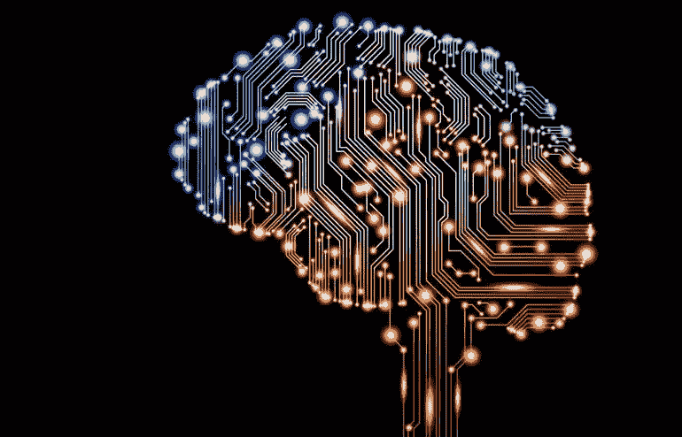
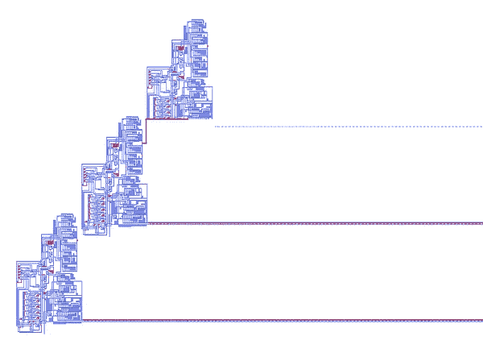
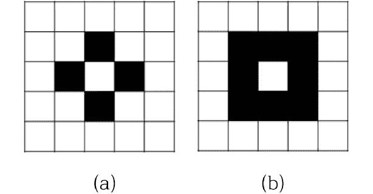

# 从简单到复杂:通向人工一般智能的可能途径

> 原文：<https://towardsdatascience.com/emergence-how-artificial-general-intelligence-can-be-computationally-modeled-b5fea4797028?source=collection_archive---------43----------------------->

来源:[山姆·敏](http://www.mcgilltribune.com/sci-tech/ai-company-is-developing-technologies-to-improve-healthcare200218/)，麦吉尔·论坛报

# 观点:在接近人工一般智能中细胞自动机样机制的一个论点(AGI)

> “如果我们要制造一台会说话、理解或翻译人类语言、用想象力解决数学问题、从事一种职业或指导一个组织的机器，要么我们必须将这些活动简化为一门精确到我们可以精确地告诉机器如何去做的科学，要么我们必须开发一台可以做事情而不需要被精确地告知如何做的机器”——理查德·m·弗里德伯格，1958

如果人工智能(AI)是一个有待解决的问题，那么人工通用智能(AGI)是目前令人垂涎的奖品。AGI 指的是机器能够理解和学习人类(以人类为中心)任务的假设智能。然而，与正常问题不同，我们似乎很难理解 AGI 系统是什么样子，直到最近才开始寻找系统评估 AGI 系统的方法[8]。

也就是说，很明显，三种基本的机器学习范式:监督学习(如神经网络、SVM、回归等。)、无监督学习(例如聚类、降维等。)和强化学习，虽然在明确定义的任务中非常有用，如计算机视觉[9]、自然语言处理[10]或甚至在国际象棋和 Shogi 游戏中与人竞争[11]，但未能推广到其他领域。有人可能会说，这些范式的巨大成功是其假设或其*归纳偏差的副产品，例如，*假设数据是线性的线性模型[12]。这些偏见抑制了*组合归纳*或者人类在无限可能的场景中进行推断、推理和行动的能力。例如，如果你让一个经过训练来检测人脸的神经网络来检测隐藏在滑雪面具后面的人脸，该模型可能不会比随机猜测更好，尽管人类可以很快推断出面具下面有一张脸。

在设计 AGI 系统时，我们需要考虑这样的系统，它既不了解手头的任务，也无法访问可用于通过“不智能的”变通方法“击败”任务指标的训练数据。相反，必须评估一个 *AGI 系统有效获取新技能的能力，以解决不止一个而是多个任务，这些任务分布在不同的领域，涉及人类中心的先验知识、习得的经验和相对推广难度* [12]。因此，可以对这样一个系统做出一些基本的假设，这些假设是这篇文章的中心论点，这篇文章号召人们重振对类似细胞自动机的机器的研究，以开发一个 AGI 系统。

## AGI 系统的假设

1.  *进化假设*:系统必须能够以一种依赖于时间和空间的方式进化，以便它能够解决日益复杂的任务，例如，开发像工作记忆这样的结构——从而将初始系统、环境和进化规则的设计优先于最终的可交付成果。这与传统统计模型的目标相反，传统统计模型的目标是在特定的、明确定义的任务中开发“专家”模型。
2.  *一般化假设:*系统必须能够进行广泛的一般化(即组合一般化)，使得先前的经验是获得新学习技能的基础，而不是特定技能本身[12]
3.  *学习假设:*系统必须针对各种任务的灵活性和效率进行优化，而不是针对特定任务的有限指标集(均方误差、交叉熵等)[8]。例如，获取新技能的效率可能是一个潜在的优化问题。
4.  *以人类为中心(核心知识)的假设:*系统必须能够编码以人类为中心的先验知识，即人类预定义要理解的东西，如物体的领域和数字的领域(人类强烈地认为世界是由物体组成的，并自然地倾向于分层表示，并对自然数有基本的理解)[13]。

这 4 个假设当然不是详尽的，但是可以作为一个很好的起点，告诉你哪里可以看，哪里不可以看。例如，许多计算框架可以很容易地结合人类中心假设所需的已知先验知识(例如贝叶斯网络或隐马尔可夫模型)；然而，很少有模型具有组合泛化的潜力(例如图网络[12])，甚至更少的系统能够执行依赖于时间的进化来处理日益复杂的任务(例如非图网络)。

除了我们的假设之外，AGI 系统还需要几个有用的性质。首先，我们希望 AGI 系统简单一些。第二，从这种简单性中产生出我们的系统可以从中受益的突现性质，并且我们可以用它来评估系统，这将是合乎需要的。例如，众所周知，人类在视觉上同时注意串行和并行的对象(例如，读一个句子对读一个单词)[14]。虽然 AGI 系统的系统设计者可能能够直接将串行和并行处理编码到这样的 AGI 系统中，但下面 Alan Newell 的引用警告说，试图通过实验来分割人类认知可能不仅很困难，而且实际上很难，因为人类对受控实验的反应可能不会揭示关于认知的潜在机制的有用信息，而是人类主体本身[15]。

> “科学通过向自然提出二十个问题而进步。正确的策略是提出一个一般性的问题，希望是双元的，可以通过实验来解决。解决了这个问题后，我们可以进入下一个问题。这一政策看起来是最佳的——人们从不冒太大风险，每一步都有大自然的反馈，进步是不可避免的。不幸的是，这些问题似乎从来没有得到真正的回答，这种策略似乎行不通。”—艾伦·纽维尔(Alan Newell)，1973，“你不可能和自然玩 20 个问题就赢”

最后，我们希望我们的 AGI 系统被绑定到一个数学框架，以便我们可以定义约束，控制系统的复杂性和演化，并限制潜在解决方案的搜索空间。例如，“全脑模拟”的想法，尽管很难实现[16]，也是有问题的，因为由于缺乏对潜在机制的理解，它的发展将是不可控的，这具有明显的伦理影响。第三个性质的一个重要延伸是，如果 AGI 系统的容量必须增加，或者为了使学习过程更有效，数学框架本身必须能够增加复杂性。例如，线性模型永远不够，因为尽管增加了参数的数量，但我们永远无法对非线性问题(如 XOR)建模。然而，因为神经网络可以根据通用逼近理论[17]逼近任何连续函数，所以新定义的也能够满足假设的体系结构可以通过添加额外的神经元和层来提高其训练效率。

现在，让我们退后一步，考虑一个看似与 AGI 无关的话题——童年记忆，或者更具体地说，童年记忆的缺失。

# 我们为什么不记得小时候的事情？

如果你曾经试图回忆起你最早的记忆，你可能会意识到这种记忆是支离破碎的，不清楚的，或者模糊的——几乎就像一场梦。事实上，很有可能你对你生命的最初几年没有任何记忆，而你回忆起来的这些最初的片段记忆发生在 3-7 岁之间。这种被充分研究的现象被称为“婴儿健忘症”，指的是我们无法回忆起生命最初 3-4 年的情景记忆[6]；然而，这不仅仅是人类的经历——事实上，许多动物物种都表现出婴儿健忘症的形式[7]。虽然还不清楚这是由于记忆检索失败还是存储记忆失败，但很明显，这种现象与神经发生过程有关，或者简单地说，与我们大脑成熟的过程有关。

神经发生假说的有效性实际上与本文的论点无关。更重要的是对现象本身的认识——也就是说，如果我们忽视发展问题，人类的工作记忆似乎会有规律地发展，并且独立于我们的经验。在这种情况下，天性似乎胜过后天培养。对这一现象的生物学、心理学和系统分析都表明，我们大脑的信息处理系统变得越来越复杂，这种进化完全依赖于时间。

由简单性——人类智能——产生的时间相关的神经复杂性的后果是深远的。很自然地，问题出现了，比如是什么使得人类的智慧不同于非人类中心的智慧，是否存在一个所有灵长类动物、所有哺乳动物甚至所有动物共有的蓝图？最重要的是，什么机制控制着大脑的成熟，如何才能充分模拟这种环境？回答这些问题需要心理学、生物学和计算方面的考虑——因此，我们应该将我们的研究限制在足够灵活的计算框架内，以纳入这些相关领域的新理解，并能够从简单的初始配置进行复杂的进化——进入细胞自动机。

# 元胞自动机

## 背景和意义

约翰·冯·诺依曼被认为是他那个时代最伟大的数学家之一，在他 1957 年去世之前，他一直致力于设计一种通用构造器——一种可以在*细胞自动机*环境中设计的自我复制机器。机器的细节最终由亚瑟·w·伯克斯在他死后汇编成册，并发表在《自我复制自动机的 T4 理论》一书中。通用构造器背后的想法是确定允许机器变得复杂的最低要求，类似于生物和社会系统中的进化。这种机器可以生成细胞自动机环境中可以想到的任何其他机器。通用构造器由 3 部分组成:蓝图、执行蓝图的机制和复制蓝图的机制，并且令人印象深刻地先于沃森和克里克的 DNA 转录的著名发现。1995 年，设计了一个具体的实现(图 1)。通用构造器的关键发现是**能够复制的复杂系统可以从由一组简单规则定义的简单环境中出现。**

图一。通用构造器，能够自我复制，显示两个完整的进化。2D 网格中的每个单元可以有 32 个状态。来源[2]。

## 定义

C *细胞自动机，*最初由冯·诺依曼和斯坦·乌拉姆描述，是物理系统的数学理想化，其中空间和时间被离散化。空间环境是由 N 维网格的镶嵌定义的，其范围通常是无限的，其中每个离散的单元与有限的、依赖于时间的状态相关联。该系统根据一组规则在离散的时间步长中演化，这些规则取决于前一时间步长中每个单元的邻域。通常，邻域由像元的直接相邻像元定义。每个单元都由相同的规则管理，只能呈现有限状态集中的一种状态，并与环境的其余部分同步更新。系统的*配置*是每个单元持有的当前状态。*前一个*是前一时间步中的配置，而*后一个*是将转换规则应用于当前配置的结果。

例如，假设一个有限的 5x5 网格有 25 个单元，每个单元可以呈现两种状态之一——开或关。现在，让我们忽略如何处理边缘单元格。每个单元的邻域可以被定义为它的 8 个相邻单元，如图 2b 所示。因为每个单元可以有 2 个状态，邻域和单元本身可以由 2⁹不同的配置来定义。此外，因为我们的细胞可以转换到两个可能的状态，有 2^(2⁹)可能的规则。我们如何定义这些规则是指定这个细胞自动机环境的最后一步。

图二。2D 细胞自动机中的邻域示例，其中中心方块的邻居显示为黑色。该示例显示了(a)冯诺依曼邻域和(b)摩尔邻域之间的差异。来源:[4]

细胞自动机最著名和最受研究的规范之一是已故的约翰·康威的“*生命的游戏”*或简称“*生命”*。像前面的例子一样，每个细胞可以开或关——或者在这个例子中是活的或死的。这个游戏在 2D 网格上也有类似的定义，有三个规则:任何有 2-3 个邻居的活细胞保持存活，任何有 3 个邻居的死细胞变得存活，所有其他活细胞在下一代死亡。一般来说，任何其他死细胞仍然是死的[5]。

*“生命的游戏”*之所以被称为零玩家游戏，是因为系统的进化仅仅基于其初始配置，该配置指定了哪些细胞是活的，哪些细胞是死的。令人惊讶的是，复杂的系统可以被设计成如图 3 所示的模式，这些模式是活跃的和静止的，以不同的周期振荡，并在网格上有节奏地移动。

图 3。康威的“生命游戏”展示了三种基本模式:静物、振荡器和宇宙飞船(移动)模式。来源:[wikimedia.org](https://upload.wikimedia.org/wikipedia/commons/e/e6/Conways_game_of_life_breeder_animation.gif)

有希望的是，现在已经很清楚细胞自动机系统如何以一种可以满足基本 AGI 系统所有假设的方式来组织自己。进化假设隐含在它的设计中，包括时间和空间的进化。像图形网络一样，组合概括可以通过允许系统开发完成任务的基本构件来实现。其次，我们可以通过多种方式直接比较各种初始配置的效率和灵活性。例如，初始配置达到有用的复杂配置需要多少次迭代可以用来比较效率，而适合于 *n x n* 网格的唯一后续模式的数量可以用来评估系统的灵活性。最后，因为细胞自动机系统可以被设计为图灵完全[3]，我们可以直接将先验编码到系统中。此外，只有某些规则集允许图灵完全细胞自动机，就像初等或 1D 细胞自动机中的规则 110[3]。此外，这对我们如何配置系统施加了约束，因为对于给定的迭代次数，只应该评估允许图灵完整性的规则集。

## 细胞自动机系统是如何配置的

快速讨论如何配置细胞自动机是很重要的。在某种程度上，这代表了可以探索的整个潜在搜索空间。现在，我们假设所有细胞自动机系统存在于无限空间中，并且细胞自动机系统的所有参数化是时间独立的(即，一旦初始设置就不会改变)并且在所有细胞间共享。

*   空间的曲率和维度(例如，“生命”是具有零曲率的 2D 欧几里得平面，但是可以探索具有非零曲率的更高维度的超平面)
*   镶嵌或平铺几何形状(如正方形、三角形、六边形等正多边形或正方形和三角形等半正多边形[18])
*   状态集(冯·诺依曼最初的通用构造器有 29 个状态，而“生命”只有 2 个)
*   邻域定义
*   转换函数(规则)

可以探索条件依赖性，例如依赖于特定单元的镶嵌几何形状的状态、邻域定义和转换函数。我猜想，对这种依赖性的探索，虽然增加了系统的复杂性，但可以增加自动机进化成有用的复杂系统的效率。

## 我们将何去何从？

类似细胞自动机的系统仍然有缺点。例如，通过将时间和空间表示为离散单元，系统的输入也必须离散化。与对原始感觉数据(如图片)进行推理的神经网络不同，细胞自动机必须接受类似物体的输入。这是一个公开的问题，也是图形神经网络共有的缺点[12]。然而，因为可以想象细胞自动机可以被用来设计一个子系统，以在离散化版本上操作，比如说，一个音频输入，它可以被证明终究不是一个限制。另一个限制是搜索空间。假设一个像“生命”一样的配置，人们将不得不根据无限长的迭代次数的细胞数量来探索指数增长的配置数量，因为一个模式是否能够从初始配置出现是一个不可判定的问题[19]。然而，最重要和最关心的是如何有效地探索初始配置的空间以解决给定的问题，并正确地定义类似细胞自动机的机制以响应输入并产生相关的输出。

正如 Friedburg 指出的那样，设计一个能够实现人工智能的系统存在于两个极端之间——一个是系统模拟整个人脑和所有相关活动，另一个是系统能够自行进化以满足人脑的需求——更简单地说，这代表了以模型为中心和以系统为中心的方法。如果你倾向于后者，类似细胞自动机的系统是一个有前途的选择，因为它们允许复杂的系统——甚至可能是像人类一样的责任心所需要的系统——从简单的初始配置中产生。一个与人类惊人相似的现象。

**引文**

[1]冯·诺依曼、约翰和阿瑟·w·伯克。“自我复制自动机理论。” *IEEE 神经网络汇刊*5.1(1966):3–14。

[2]翁贝托·佩萨文托。“冯·诺依曼的自我复制机器的实现。”*人工生命*2.4(1995):337–354。

[3]沃尔夫拉姆，斯蒂芬。*细胞自动机与复杂性:论文集*。CRC 出版社，2018。

[4]李忠焕等，“用元胞自动机实现熔岩流模拟程序”*韩国岩石学会学报*26.1(2017):93–98。

[https://en.wikipedia.org/wiki/Conway%27s_Game_of_Life](https://en.wikipedia.org/wiki/Conway%27s_Game_of_Life)

[6]阿尔贝里尼、克里斯蒂娜·m .和阿莱西奥·特拉瓦利亚。"婴儿健忘症:学习学习和记忆的关键时期."*神经科学杂志*37.24(2017):5783–5795。

[7] Akers，Katherine G .等人，“海马神经发生调节成年期和婴儿期的遗忘。”*理科*344.6184(2014):598–602。

[8]弗朗索瓦·乔莱。《智力的衡量》 *arXiv 预印本 arXiv:1911.01547* (2019)。

[9]Sainath，Tara N .等人，“LVCSR 的深度卷积神经网络” *2013 IEEE 声学、语音和信号处理国际会议*。IEEE，2013 年。

[10] LeCun，Yann，Yoshua Bengio 和 Geoffrey Hinton。“深度学习。”*性质*521.7553(2015):436–444。

[11] Silver，David，等人，“用一般强化学习算法通过自我游戏掌握国际象棋和日本象棋” *arXiv 预印本 arXiv:1712.01815* (2017)。

[12]巴塔格利亚、彼得·w .等人，“关系归纳偏差、深度学习和图形网络。” *arXiv 预印本 arXiv:1806.01261* (2018)。

[13]伊丽莎白·斯皮克，“核心知识”*美国心理学家* 55.11 (2000): 1233。

[14]特雷斯曼，A. *Cogn。心理学。* **12** ，97–136(1980)。

[15]艾伦·纽维尔。“你不能和自然玩 20 个问题就赢:对本次研讨会论文的投射式评论。”(1973).

16 Stiefel，Klaus M .和 Daniel S. Brooks。“为什么(目前)还没有成功的全脑模拟？."*生物学理论*14.2(2019):122–130。

[17] Csáji，Balázs Csanád，“人工神经网络近似法”匈牙利 Etvs Lornd 大学科学学院 24.48 (2001): 7。

[https://www.mathsisfun.com/geometry/tessellation.html](https://www.mathsisfun.com/geometry/tessellation.html)

[https://en.wikipedia.org/wiki/List_of_undecidable_problems](https://en.wikipedia.org/wiki/List_of_undecidable_problems)

[20][https://en . Wikipedia . org/wiki/Garden _ of _ Eden _(cellular _ automaton)](https://en.wikipedia.org/wiki/Garden_of_Eden_(cellular_automaton))