# 紧急与非紧急车辆分类

> 原文：<https://towardsdatascience.com/emergency-vs-non-emergency-vehicle-classification-f0153c4f87f8?source=collection_archive---------35----------------------->

## 利用计算机视觉的力量


由[拍摄的照片将在](https://unsplash.com/@willy_teee?utm_source=medium&utm_medium=referral) [Unsplash](https://unsplash.com?utm_source=medium&utm_medium=referral) 上真实再现

由于救护车和消防队等紧急车辆的交通延误造成的死亡是一个巨大的问题。在日常生活中，我们经常看到应急车辆在交通中面临通行困难。因此，将车辆分为紧急和非紧急类别可能是交通监控以及自动驾驶汽车系统中的一个重要组成部分，因为准时到达目的地对于这些服务至关重要。

为了找到这个问题的解决方案，我们将尝试建立一个*图像分类模型*，将车辆图像分类为属于紧急车辆或非紧急车辆类别。

# 获取数据

我们首先要做的是获取车辆图像的训练和测试数据集。这里，用于构建分类模型的数据集从 *Analytics vidhya，*下载，它由紧急和非紧急车辆图像组成，其中紧急车辆通常包括警车、救护车和消防队。

完成后，我们可以使用 pandas 读取提供的训练数据集。

我们将使用 *fastai 视觉库*来构建我们的图像分类模型。

```
from fastai.vision import *df = pd.read_csv('/content/train.csv')
df.head()
```

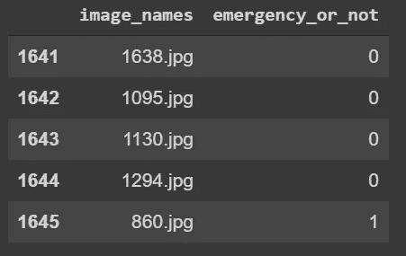

训练数据框架

我们有两列。包含图像名称的 *image_names* 列和包含每个图像标签的 *emergency_or_not* 列。此处 ***1*** 代表标签**为应急车辆**和 ***0*** **为** **非应急车辆。**

快速查看数据框为我们提供了足够的信息来加载数据并开始构建我们的*图像分类模型*，但在此之前，我们将对图像应用变换，这将有助于我们概化我们的模型，即获得高精度。

我们将应用的变换有:*do _ flip*——默认启用——和 *flip_vert，max_rotate=50。*我们还将通过调整 *max_lighting=0.1* 和 *max_warp=0 来调整灯光。*

```
tfms= get_transforms(do_flip=True,flip_vert=True,max_rotate=50,max_lighting=0.1,max_warp=0 )
```

现在我们已经准备好应用我们的转换，我们可以使用 FastAIs [数据块 api](https://docs.fast.ai/data_block.html) 加载数据。

```
data = ImageDataBunch.from_df('/content/cars', df,ds_tfms=tfms,label_delim= None,valid_pct=0.2,fn_col=0, label_col=1 , size=299,bs=64).normalize(imagenet_stats)
```

上面的`.normalize(imagenet_stats)`方法用于根据来自 ImageNet 数据集的 RGB 通道的统计数据来标准化数据集。

> 归一化所做的是将图像的强度(图像的原始强度在 0 和 255 之间)降低到 0 和 1 之间。这有助于提高我们模型的计算能力。

现在我们已经加载了数据集，让我们看一看它是什么样子的:

```
data.show_batch(rows=3, figsize=(7,7)
```

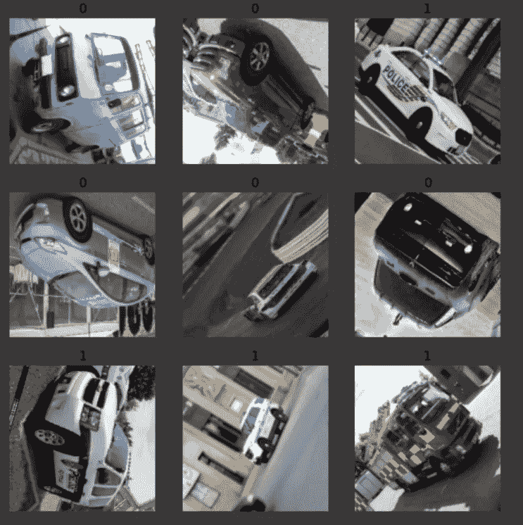

*我们知道 0 代表非紧急车辆，1 代表紧急车辆。*

我们也可以通过调用一个告诉我们图像类数量的函数来检查这一点。

```
print(data.classes)[0, 1]
```

# **训练模特**

因为我们已经准备好了数据，所以是时候把它输入到模型中了。我们可以通过从头开始构建卷积神经网络来做到这一点，但这样做实际上是低效的。因此，我们采用预先训练的 CNN 模型的权重，该模型已经学会识别特征(某些类型的事物，例如梯度、边缘圆等)

这里，我们将使用预训练的 ResNet50 卷积神经网络模型，并使用迁移学习来学习网络的最后一层的权重。

# 什么是迁移学习？

迁移学习是从一个现有的(经过训练的)用于图像识别的神经网络开始，然后在这里或那里对其进行一点(或更多)调整，以针对您的特定用例训练一个模型，我们这样做是因为从头训练一个神经网络将意味着需要大约 300，000 个图像样本，并且为了实现真正的良好性能，我们将需要*至少*一百万张图像。但是通过迁移学习，我们可以用有限的数据集和更少的时间获得高性能。

我们将通过冻结和解冻一些层并对其进行训练来对其进行微调。这是因为顶层学习简单的基本特征，我们不需要训练这些层，而后面的层学习更复杂的特征。

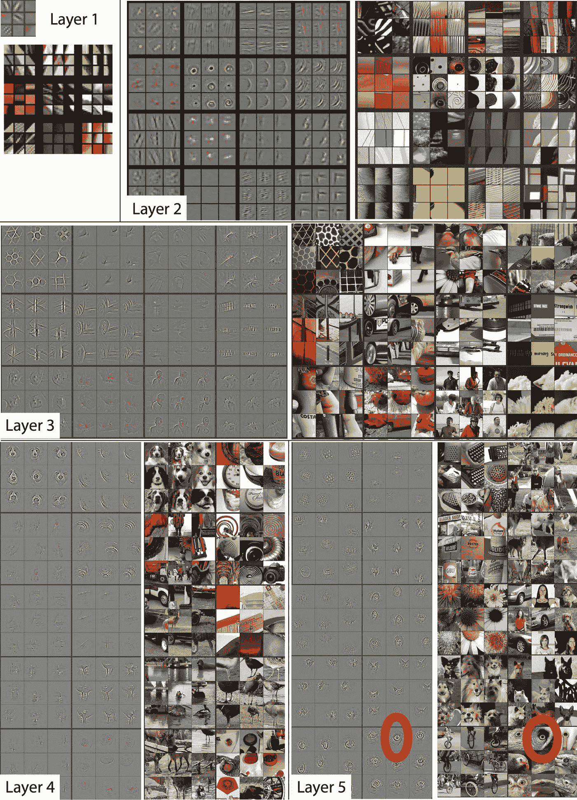

在上面的图片中，每个不同的层学习图像的不同特征。这种卷积神经网络的后几层学习鸟类眼睛等特征。

我们使用`cnn_learner`函数来加载预训练的 ResNet50 网络，该网络是在来自 [ImageNet](http://www.image-net.org/) 数据库的大约一百万张图像上训练的。

```
learn =cnn_learner(data,resnet50,pretrained=True,metrics=[accuracy])
```

现在，让我们拟合 4 个时期的一个周期，看看我们的模型在该数据集上的表现如何:

```
learn.fit_one_cycle(4)
```

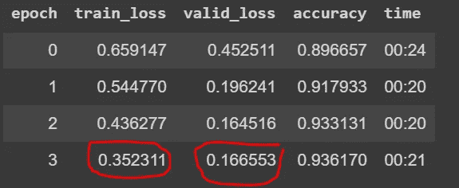

只使用 4 个时期的原因是为了了解我们的模型如何执行，并在以后对其进行微调以获得更好的结果。*正如我们可以看到的，我们的验证损失大于我们的训练损失，这清楚地表明我们的模型存在拟合不足的问题。*

让我们来看看我们模型的预测:

```
interp = ClassificationInterpretation.from_learner(learn)
```

解读最大损失:

```
interp.plot_top_losses(9, figsize=(7,7))
```

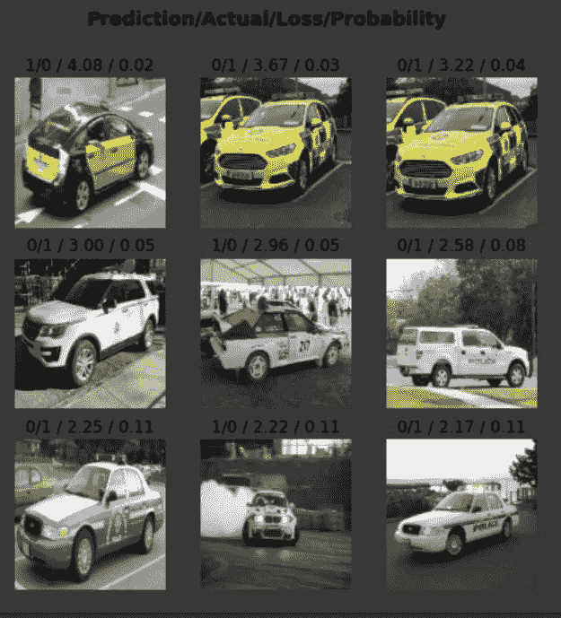

我们数据集上的 resnet50 预测

看着最大的损失，我们可以告诉我们的模型犯了同样的错误，就像人类第一次看到一些看起来是紧急车辆但被解释为非紧急车辆时会犯的错误一样。

另一个有用的工具是使用一种叫做混淆矩阵的东西，它基本上显示了每一种实际的紧急和非紧急车辆预测，它被预测了多少次。

```
`interp.plot_confusion_matrix(figsize=(8,8), dpi=60)
```

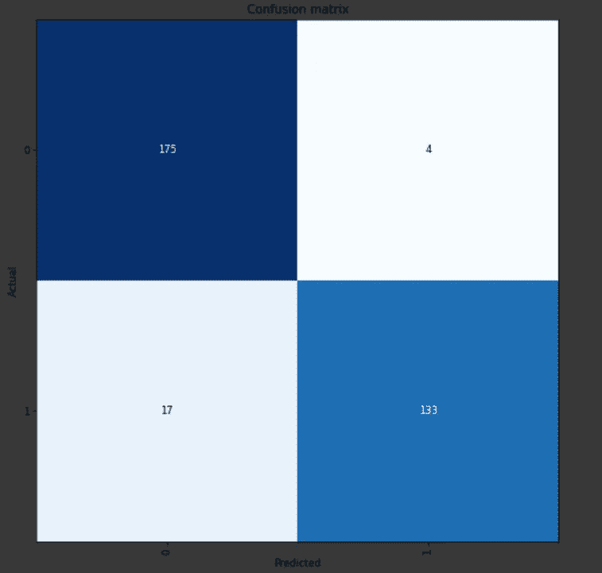

混淆矩阵

我们的模型有 17 次将紧急车辆预测为非紧急车辆，而有 4 次将非紧急车辆预测为紧急车辆。*困惑呃？毕竟我们正在处理一个混乱矩阵！*

# 解冻

> *冻结层是指未被训练的层，即未被更新的层。*

到目前为止，我们所做的一切都没有改变预先训练的模型权重。我们所做的只是在顶部添加了一些新层，并学习了如何混合和匹配预先训练的功能。

但是我们希望模型能够学习我们图像的特定特征。为了做到这一点，我们将解冻一些层，以根据我们的图像更新整个网络的权重。

检测边缘和梯度的第一层和检测曲线和拐角的第二层不需要太多的学习，它们不需要太多的改变。而更后面的层需要改变。当训练其他图像识别时，这是普遍适用的。

早期的层具有更多通用功能。因此，我们预计他们对新数据集的微调需求会减少。出于这个原因，我们将对不同的层使用不同的学习速率:最初的几个层将位于`1e-4`用于基本几何特征和最接近像素的层，而`1e-2`如前所述用于我们添加在顶部的层(完全连接的层)。我们称之为 ***差异学习率。***

```
learn.unfreeze()
```

我们将再次在我们的 unfreeze 网络上运行 fit-one 循环，并查看它现在的运行情况。

```
learn.fit_one_cycle(3)
```

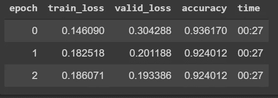

*92%的准确率不算差，但我们还可以做得更好。*

# 学习率

用于调整我们模型的最重要的超参数是学习率。它通过根据损耗梯度调整网络的权重，帮助我们找到最佳解决方案。该值越低，我们沿下坡行驶的速度越慢。虽然在确保我们不会错过任何局部最小值方面，这可能是一个好主意(使用低学习率),但这也可能意味着我们将需要很长时间才能收敛——特别是如果我们被困在一个平坦区域。

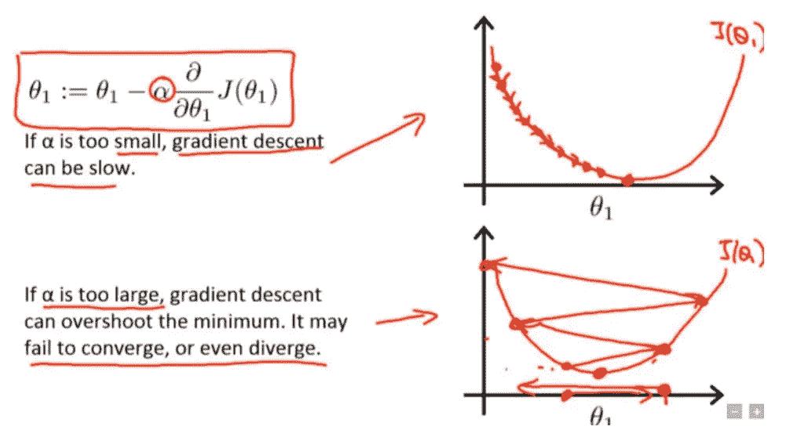

吴恩达在 Coursera 上的机器学习课程

这里我们可以看到学习率对收敛的各种影响。

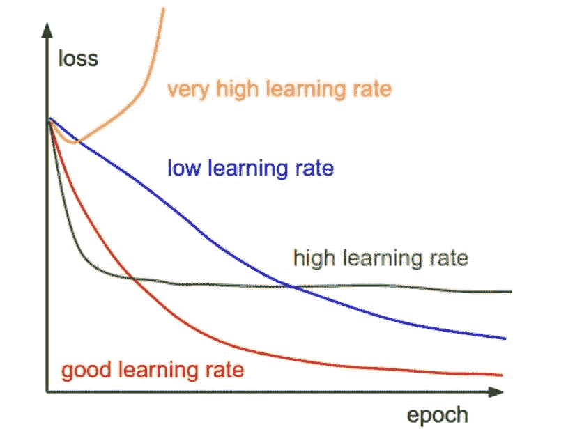

(Img 信用: [cs231n](http://cs231n.github.io/neural-networks-3/)

*因此，选择正确的学习速度很重要，而不是随意猜测或多次试错。*

为此，我们将使用一个名为`lr_find()`的函数。这个函数是 Leslie Smith 论文的实现([用于训练神经网络的循环学习率](https://arxiv.org/abs/1506.01186))。)关于调整神经网络超参数。

```
learn.lr_find()
```

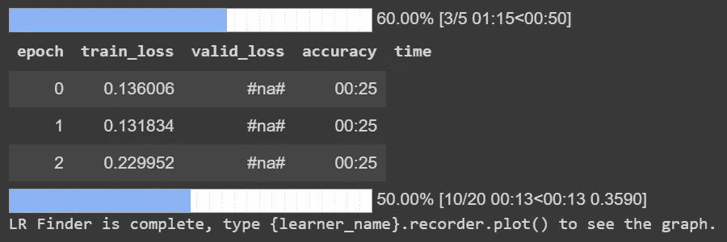

学习率查找器。

为了更好地理解它，我们将借助另一个函数来绘制它。

```
learn.recorder.plot()
```

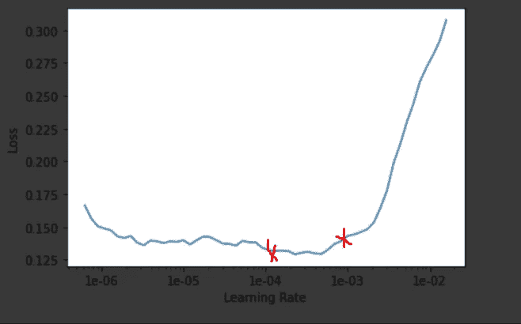

学习率是相对于损失绘制的。在这个图表的帮助下，我们可以很容易地选择我们的学习速度。

正如我们所见，在 *1e-03* 之后，损失开始增加，因此我们将在此之前选择一个数字，同样为了更新初始层的权重，我们将选择一个较低的学习速率。 *1e-04* 好像不错。

根据选择的学习率，我们将再次训练我们的解冻模型，但这次要长一点，有 10 个时期。

我们将使用准确性作为另一个参数，通常称为 ***指标*** 来评估我们的模型表现如何。

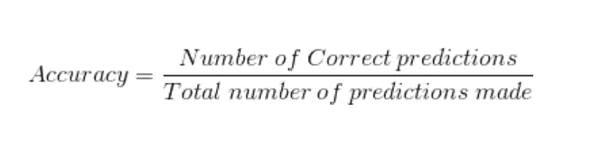

或者

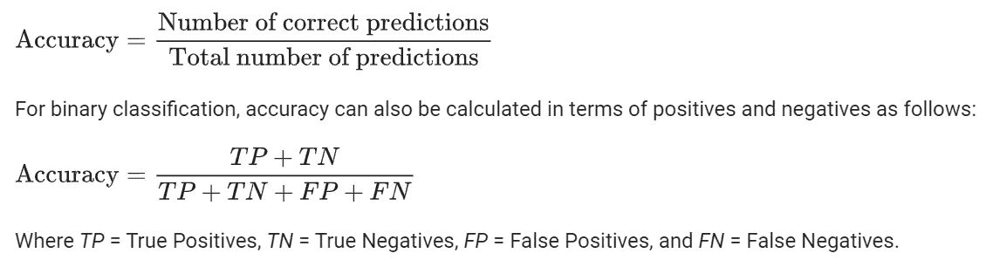

[https://developers.google.com/](https://developers.google.com/)

> 在继续之前，让我们也对 *fit_one_cycle* 方法有一个直觉。
> 
> *在这种方法中，我们用两个等长的步骤做一个循环，一个从较低的学习率到较高的学习率，然后回到最小值。最大值应该是用学习率查找器选取的值，较低的值可以低 10 倍。——再多读一点关于*`*fit_one_cycle*`*[*的内容，尽请查看本博客*](https://sgugger.github.io/the-1cycle-policy.html) *。**

*现在让我们看看我们的模型做得怎么样？*

```
*learn.fit_one_cycle(10,max_lr=slice(1e-4,1e-3))*
```

*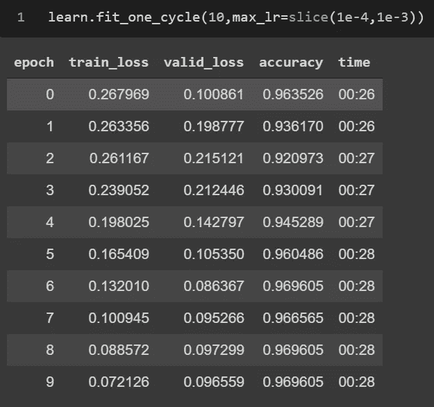*

*准确率达到约 97%*

*我们的模型做得足够好，不存在欠拟合，因为我们的模型之前存在这个问题，也不存在过拟合(*过拟合意味着训练损失远低于验证损失)*，因为我们的验证损失大约是训练损失的 0.02 倍。*

*我们已经达到了 96.96%~ 97%的 ***。****

*因为我们已经根据我们的车辆分类问题更新了我们模型的权重，我们将冻结我们模型的层，并用名称 *car_classification* 保存它。*

```
*learn.freeze()learn.save('car_classification')*
```

*我们能够达到大约 97%的准确性，同时我们可以在增加时期数量、使用绘图函数找到更优的学习率、更多的数据扩充技术等方面对我们的模型进行更多的实验。*

# *参考资料:*

*[1]:[https://arxiv.org/pdf/1803.09820.pdf](https://arxiv.org/pdf/1803.09820.pdf)*

*【2】:【https://sgugger.github.io/the-1cycle-policy.html *

*【3】:【https://arxiv.org/pdf/1506.01186.pdf *

*【4】:[*第一课笔记本，fast.ai 第一部分 V2*](https://github.com/fastai/fastai/blob/master/courses/dl1/lesson1.ipynb)*

**今天的*到此结束。💃🏻*

**感谢您的阅读！**