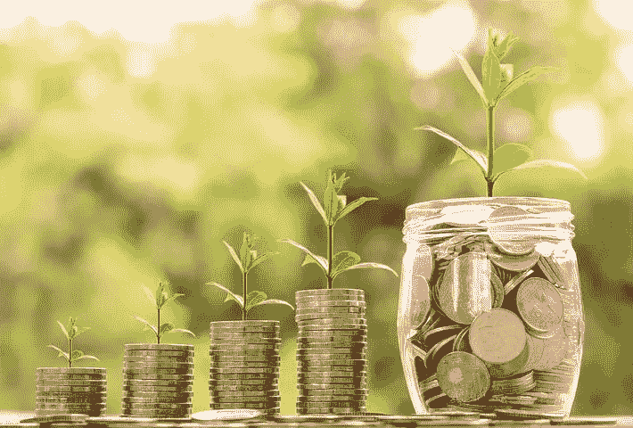
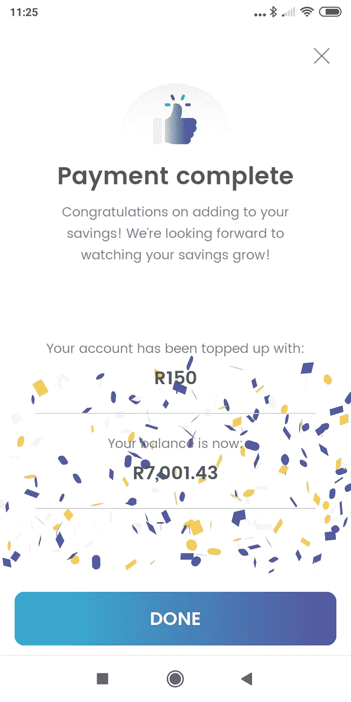

# 储蓄中的情感和习惯

> 原文：<https://towardsdatascience.com/emotion-and-habit-in-savings-d628be965bfd?source=collection_archive---------39----------------------->

## 首次探究木星关于储蓄行为的丰富数据

[*pixabay.com*](https://pixabay.com/en/money-coin-investment-business-2724241/)

***是什么让人们储蓄更多？***

*这个问题与普通人、金融技术专家、资产管理公司、银行和政策制定者息息相关。这是木星试图解决的核心问题，我们将定期分享我们所学到的东西。有些人可能认为这有风险，但我们相信开放性和我们的执行能力，所以我们愿意承担风险。*

*我们仍处于非常早期的阶段，所以我们的样本并不庞大，但它是非常精细的，包含了数百个实验。所以这将是几篇文章中的第一篇。总结其三个要点:*

*   *情感:如果你给人们储蓄带来直接和即时的回报，即使很小而且主要是情感上的回报，你会大大增加他们对未来提示做出反应或提出储蓄的机会，你会使他们更有可能成为经常储蓄者。*
*   ***习惯**:一个人是否会对储蓄的提示做出反应的最强有力的预测因素是他们之前积极储蓄的频率，也就是说，自发(如果被提示)储蓄已经成为一种习惯的程度。我们相信这不仅仅是获得了先前存在的特征。*
*   ***什么不起作用**:令人惊讶的是，与情绪和习惯因素相比，金钱奖励的大小没有影响。一个月中的某一天确实很重要，但是比我们预期的要少得多。此外，如果执行得好，诱导主动习惯要比说服人们进行自动被动储蓄容易得多，而且通过创造情感承诺和培养习惯，可以在以后产生显著的积极溢出效应。*

# *数据*

*木星关心用户隐私。因此，我们的数据湖不包含用户的人口统计数据(只有一个单独的反欺诈系统包含)。除了 Jupiter 应用程序之外，它也不包含任何关于用户财务生活的信息。*

*我们所拥有的是关于 Jupiter 用户行为的极其丰富的匿名数据——在上线的几个月里，大约每个用户有 1000 个数据点，有近 1000 个活跃的储户。*

*在这些数据点中有超过 300 个实验的结果，这些实验使用信息和提示来诱导人们存更多的钱。这些实验涉及 20 多个维度，包括六种不同的游戏、社交暗示、奖励大小、反应时间、措辞、渠道等等。因此，我们的样本仍然局限于一个维度，但来自一个系统，该系统旨在捕捉运行实验中的行为、速度和变化的特殊粒度。*

# *模特们*

*木星试图让人们存更多的钱。我们的方法与采取行动紧密相连。所以我们建立了两个机器学习模型来预测:*

*   ***立即存钱:**如果我们现在给你一个给定的“奖励”——玩游戏(有奖品)的机会、直接奖励、一定量的忠诚度积分——你有可能在接下来的 24-48 小时内存钱(固定在目标余额或目标存钱金额上)吗？*
*   ***节省频率:**如果我们为你提供一些内容、提升和其他关注的组合，你会成为一个更频繁的节省者吗？*

*目前，我们使用的模型是相当标准的回归器和[增强的树木/森林](https://xgboost.readthedocs.io/en/latest/tutorials/model.html)(抱歉违反了“假装你有疯狂惊人的人工智能模型”的创业宣传代码——如果你现在还不知道，99%的模型是一个可能只有 5 行的笔记本，包括“ [import sklearn](https://scikit-learn.org/stable/) ”)。*

*我们在我们的完整数据上训练模型，经过一点清理，例如，移除内部用户，并排除板载增强和消息(因为出于这个目的，我们对用户后来的行为感兴趣)。这些模型达到了 0.7 的精确度水平，低于简单的任务或具有巨大数据集的任务，但高于脸书的仇恨言论标记。*

# *结果呢*

*在训练模型之后，我们使用“ [SHAP(ley)值](https://github.com/slundberg/shap#citations)和决策树重要性分数来理解不同特征的相对重要性。“特征”意味着用户的一些特征——他们打开 Jupiter 应用程序的次数，或者他们打开帐户的时间，或者他们最后一次保存的时间，等等。重要性分数和 [SHAP 值](https://papers.nips.cc/paper/7062-a-unified-approach-to-interpreting-model-predictions.pdf)然后告诉我们，“这个特定特征对这个预测有多大影响？”*

*在预测模型上，当训练为梯度增强树时:*

*   *在之前，用户保存了多少次*的功能重要性得分为 5**
*   *用户在过去要求提升的次数有多少，特性重要性得分为 4*
*   *这个月的某一天——我们对最有可能发生的事情的假设(想想发薪日)——仅排在第三位，得分为 2*
*   *没有其他功能比这些更重要。*

*有些是我们没有预料到的。**事实证明，货币回报与所需储蓄规模的比率** **根本没有特征重要性。支付的原始金额**也是如此。我们还没有测试极端值——很有可能微小的支出或极端的储蓄-支出比率会产生影响。但我们大约一半的提升已经在 AUM 上以 1%的费用洗了脸，即储蓄::奖励比率超过 100(通常通过使用游戏锦标赛和其他“前 N”类型的提升来实现)。*

> *因此，在一个合理且成本有效的奖励范围内，用户之前获得情感回报的频率，以及有多少储蓄正在成为一种习惯，对他们是否能被诱导再次储蓄最重要。*

*这是针对时间点建模的。当我们转向频率模型，即预测用户是否会随着时间的推移而变得有价值时，我们有类似的结果。为此，我们根据储蓄频率将用户分为五类，然后使用他们其他非储蓄行为的频率，该模型预测每个用户属于哪个类别。我们发现:*

*   ***总的来说，三个主要的预测因素是:用户兑换 boost 的频率，用户打开 Jupiter 应用程序的频率，以及他们是否赢得了锦标赛游戏**。没有其他特征是接近的。*
*   *当我们深入研究最高频率类别的预测因素时，我们发现同样的模式在重复，尽管还有一个特征:**用户使用应用内消息的频率***
*   *几个月前，我们花了很大力气说服用户设置自动定时保存。我们只有不到 10 个人。在频率最高的类别(每月 3 次以上储蓄)中，我们有 90 多次储蓄者(约 10%)，在次高类别(每月约 2-3 次储蓄)中还有 120 次。*

*这里的一个问题可能是，我们是否只是在寻找一些先天的、隐含的特征，即“高度倾向于储蓄”。如果我们有一个更精简的数据集，并以更少的方式使用它，我们会更不自信。但是:*

*   ***我们无论如何也想不出存钱的癖好会以某种方式导致某人在触屏游戏中赢得锦标赛***
*   *SHAP 值在重要特征上非常不对称，即**未保存对增压响应的负面影响远不如保存为正面影响***
*   *不清楚为什么在查看频率类别时，原始的应用程序参与人数会很重要(一个“重度节省者”只会在他们想要节省时打开应用程序，而不是一直打开，或者至少可能会这样做)*
*   *如果预先存在的储蓄倾向占主导地位，我们希望看到用户形成一小部分清晰分离的集群，这很容易通过终生储蓄来预测。我们发现了相反的情况(后面会有更多的介绍)。*
*   *如果我们添加或删除预先存在的保存和之前的 boost 兑换，精确度会改变约 0.1，这是一个很大且有意义的变化，但不会大到怀疑标签被泄露。*
*   *最后，结果与我们的定性体验相符——用户评论说，“这让我爱上了存钱”，当我们最近做了一组简短但深入的用户调查时，用户愿望清单中的重点不是自动存钱功能或原始回报，而是与提升相关的功能。*

# *未来地*

> *未来还有更多值得探索。我们才刚刚开始理解用户行为的聚类。*

*当我们运行 K-means 时，我们找到了大约 8-10 个簇的最佳数量，但是我们仍然需要理解那些簇是什么(简单的低维表示的投影不是直接直观的)。我们还将询问随着时间的推移行为的微小变化，以及储户之间联系的任何见解(通过 Jupiter 的“储蓄伙伴”功能)。*

*与此同时，我想说的是，与之前的情感联系相比,“理性”的支付比率是如此的无关紧要，这让我们感到非常惊讶。我们几乎同样感到惊讶的是，一旦人们有了情感联系并对这一行为有所放松，他们会比建立自动化的、被动的投资更容易进行无计划的、自发的储蓄。*

*几十年来，改善金融安全的整个理论和实践一直专注于让人们变得善良——从他们的储蓄中建立一个自动扣除，当他们看到他们的余额时，每年有一点情感回报。这并没有改变任何地方的储蓄率。也许是时候换个思路了？*

**