# 利用数据科学留住员工

> 原文：<https://towardsdatascience.com/employee-retention-using-machine-learning-e7193e84bec4?source=collection_archive---------32----------------------->

蒂姆·莫斯霍尔德在 [Unsplash](https://unsplash.com?utm_source=medium&utm_medium=referral) 上的照片

雇佣和留住顶尖人才是一项极具挑战性的任务，需要资金、时间和技能。小企业主将 40%的工作时间花在不产生任何收入的任务上，比如招聘新员工。

在本文中，我们将实施数据科学技术来改善人力资源部门。

我们将预测公司中哪些员工更愿意离开公司。

因此，在本案例研究中，我们将了解以下几点。

1.  员工为什么要离职？
2.  他们为什么想留下来？
3.  怎样才能让他们有动力？

还有更多…:)

我们已经从 kaggle.com 获得了将用于本案例研究的数据集。

以下是相同内容的链接:[https://www . ka ggle . com/pavansubhasht/IBM-HR-analytics-attraction-dataset](https://www.kaggle.com/pavansubhasht/ibm-hr-analytics-attrition-dataset)

我们知道 Python 是一个非常有用的数据分析工具。我们将用它来回答上述问题。

你可以在我的 GitHub 上获得完整的 python 代码:[https://GitHub . com/Tariqueakhtar/Machine-Learning/tree/master/HR _ Department _ Solution](https://github.com/Tariqueakhtar/Machine-Learning/tree/master/HR_Department_Solution)

## **让我们直接从数据中获得一些见解。**

## 数据汇总

我们的数据总共包含 35 个特征，每个特征有 1470 个数据点

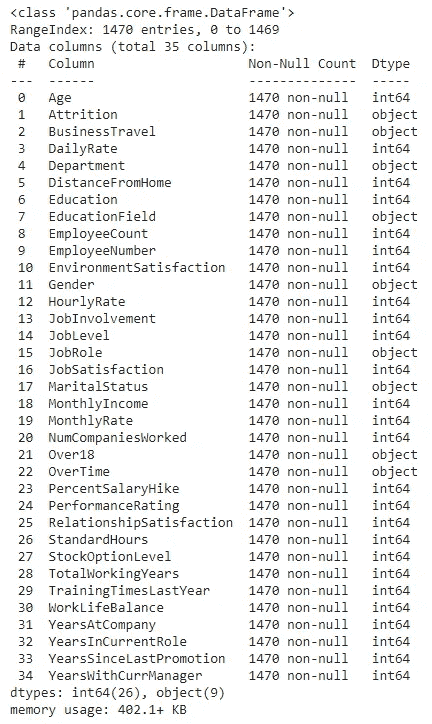

总共 35 个特征，每个特征包含 1470 个数据点(图片由作者提供)

## 让我们看看有多少员工离开了公司！

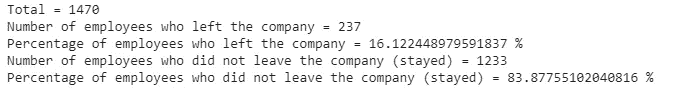

16%的员工离开了组织(图片由作者提供)

16%的员工离开了组织。

## 深入挖掘数据后，我们得到了以下发现。

## **1。年龄与流失分析**

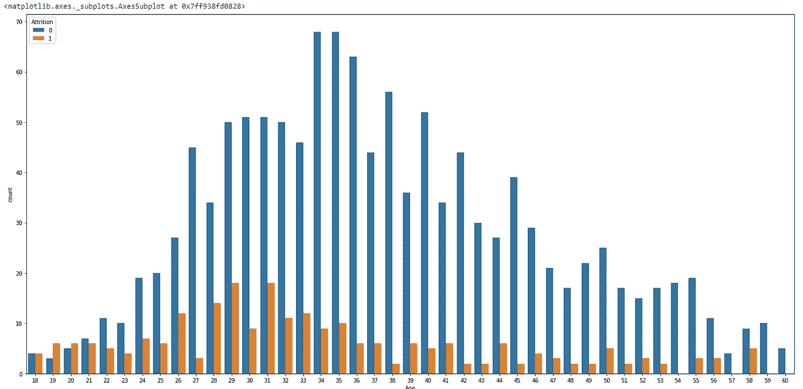

年龄与损耗(图片由作者提供)

29 岁和 31 岁的人离开公司的频率更高。虽然 18 至 23 岁年龄组的雇员人数较少，但该年龄组的自然减员率也很高。此外，随着年龄的增长，离开公司的机会减少。

## 2.婚姻状况与摩擦

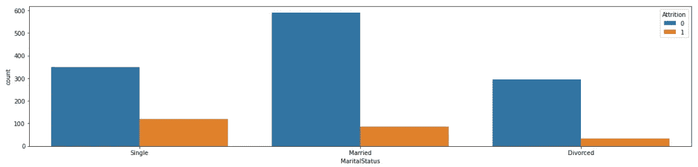

婚姻状况与摩擦(图片由作者提供)

与已婚和离异员工相比，单身员工更倾向于离职

## 3.工作角色与自然减员

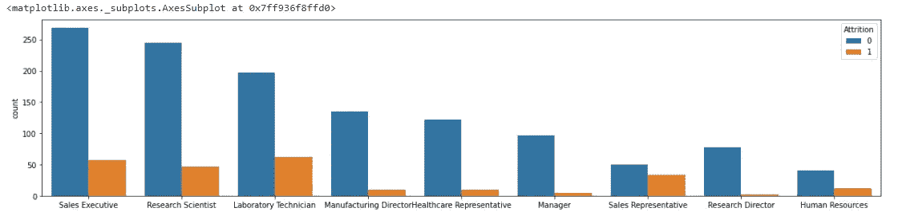

工作角色与人员流失(图片由作者提供)

与其他工作相比，销售代表和实验室技术员更倾向于离开。

## 4.工作投入与流失

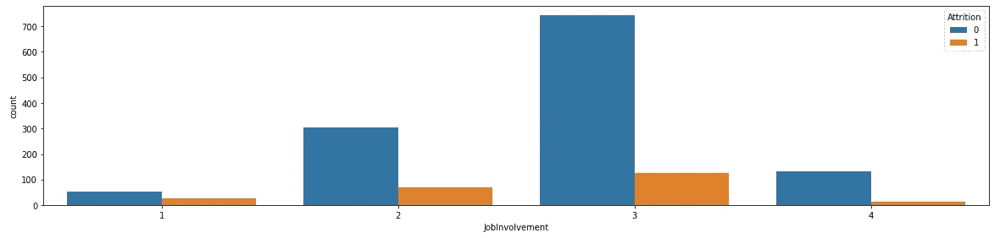

工作投入与流失(图片由作者提供)

参与度较低的员工往往会离开公司。如果你注意到 job incidence = 1，那么与该类别下的总人口相比，它的自然减员更多。

## 5.经验与损耗

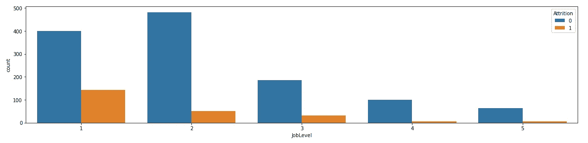

有经验与损耗(图片由作者提供)

经验不足(工作级别低，即工作级别=1)倾向于离开公司。

## 6.离家的距离与损耗

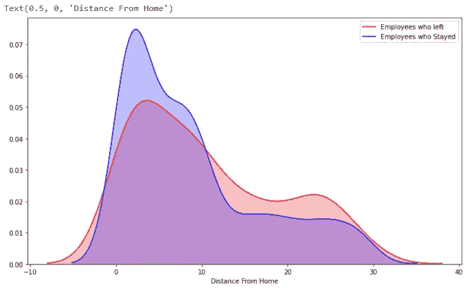

有经验与损耗(图片由作者提供)

远离办公室(超过 10 公里)的人更有可能离开公司。你可以注意到，在 x 轴 10 点之后，红线在蓝线之上，即离家的距离。

## 7 .*。现任经理任职年限与自然减员*

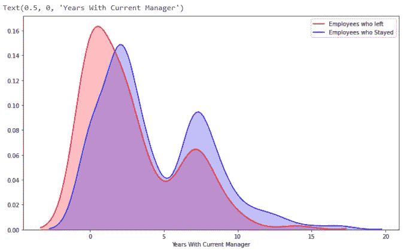

*现任经理的几年与自然减员*(图片由作者提供)

与现任经理相处时间短的员工更有可能离开公司。您可以注意到，x 轴起点的红线在蓝线之上，即现任经理的年数。然而，随着我们增加年数，蓝线倾向于取代红线，这意味着当你超过 4 到 15 年时，实际倾向于留在公司的员工数量多于实际离开公司的员工数量。

## 8.总工作年数与自然减员

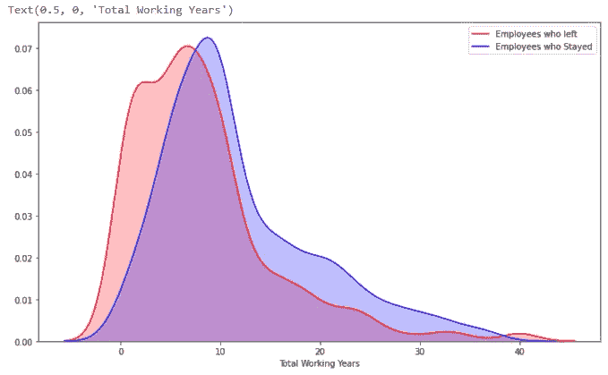

总工作年限与自然减员(图片由作者提供)

在公司工作时间较短(0 至 6 年)的员工往往会离开公司。您可以注意到，在 x 轴的起点，即总工作年限，红线在蓝线之上。然而，当你超过 6 年，你会发现蓝线倾向于取代，这意味着员工倾向于留在你增加总工作年限。

## *9。性别与月收入*

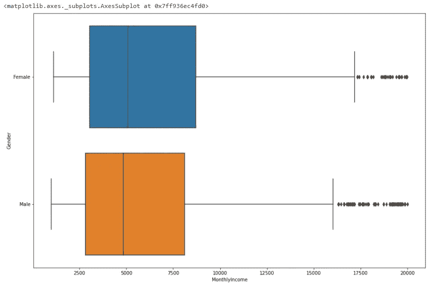

*性别与月收入*(图片由作者提供)

你可以看到，男性和女性的平均工资几乎相当，这实际上是一件好事。

对于任何公司来说，性别薪酬平等都是至关重要的事情。实际上，通过观察箱线图，似乎这里的女性实际上比男性得到的报酬更多。

## 10.M *月收入与工作角色*

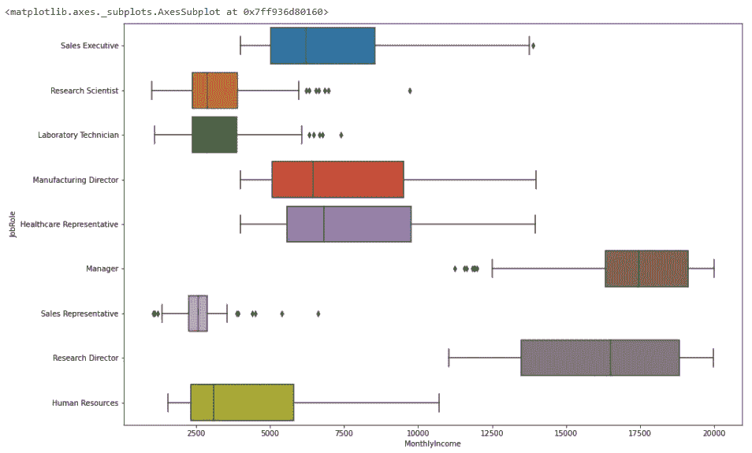

*月收入与工作角色*(图片由作者提供)

上面的方框图显示，担任经理的员工往往得到更多，这显然是有道理的。看起来，如果你是研究科学家和实验室技术员，这两种工作的工资范围几乎是一样的。

如果你做的是销售代表的工作，与经理和研究主管相比，你的收入要少得多。人力资源也介于两者之间。

## 结论:

您可以看到使用不同图表和可视化的数据分析如何帮助获得许多问题的答案。

这种分析将有助于公司制定一些员工政策，并在需要时进行修改。即便如此，这也将有助于制定一些新员工参与计划，帮助员工呆得更久。

参考:[https://www . ka ggle . com/pavansubhasht/IBM-HR-analytics-attraction-dataset](https://www.kaggle.com/pavansubhasht/ibm-hr-analytics-attrition-dataset)

 [## 2020 年雇佣一名员工的真实成本

### 雇佣一个人到底要花多少钱？雇用一名员工的成本远不止是简单地输出…

toggl.com](https://toggl.com/blog/cost-of-hiring-an-employee) 

感谢阅读！！！