# 员工流失 Catboost 和 Shap 如何帮助您了解它！

> 原文：<https://towardsdatascience.com/employees-attrition-how-catboost-and-shap-can-help-you-understand-it-814f9bfd7df4?source=collection_archive---------24----------------------->

## 了解 Scikit 和 Catboost 模型的使用如何帮助您处理不平衡的数据集，以及为什么 SHAP 是解释人工智能预测的伟大工具。


劳拉·戴维森在 [Unsplash](https://unsplash.com?utm_source=medium&utm_medium=referral) 上的照片

如何同时探索和解决两个关键问题？

*   第一种和就业一样古老:人们决定离开他们的雇主去寻找更好的工作。)工作。
*   第二个出现在过去几年:能够以一种可以理解的方式解释极其复杂的人工智能模型是如何做出预测的。

为了探究这两个问题，我们需要一些工具和数据:

*   由于没有公开共享的关于员工辞职的真实数据集，我们将使用 IBM 数据科学团队创建的数据集来推广 Watson。[在 Kaggle](https://www.kaggle.com/pavansubhasht/ibm-hr-analytics-attrition-dataset) 这里有。
*   本文使用的代码和笔记本(文末链接)是用 [**Google Colab**](https://colab.research.google.com/) 创建的。这对开发人员来说是一个很好的资源，免费提供 GPU 和 TPU 访问，以及最新的 Python 库和在需要时安装“外来”包的可能性。
*   Google Colab 确实嵌入了很多 Python 包，但是我们需要安装 [**CatBoost**](https://catboost.ai/) (我们的分类器)和 [**SHAP**](https://github.com/slundberg/shap) (我们的解释器):

```
!pip install shap
!pip install catboost
```

# 数据探索

在导入这个用例所需的库之后，我们可以观察到数据集由 1470 个条目组成，其中有 9 个分类特征和 25 个数字特征。

```
import pandas as pdfrom imblearn.under_sampling import ClusterCentroids
from sklearn.model_selection import train_test_split
from sklearn.metrics import confusion_matrixfrom catboost import CatBoostClassifierimport shap# The following lines should be used only on Google Colab
# to connect to your Google Drivefrom google.colab import drive
drive.mount('/content/drive')
```

第 9 列“EmployeeNumber”对于每个雇员都是唯一的，因此我们将使用它作为我们的 Pandas 数据框架的索引。在读取 CSV 文件时，由于“index_col=9 ”,此指令得以通过:

```
df = pd.read_csv("./WA_Fn-UseC_-HR-Employee-Attrition.csv", **index_col=9**)df.info()
```

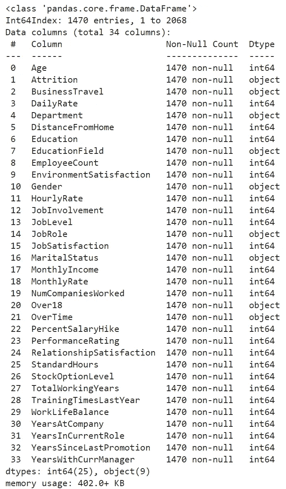

整个数据集中没有缺失的信息…这显然是一个合成的数据😅。

在我们进入建模阶段之前，我建议做一些改进:

1.  让我们创建两个字典，根据它们的基数(0，1，2)将“是/否”列转换为“0/1”和旅行频率类别。

```
yes_no_to_0_1_dict = {"Yes": 1, "No": 0}
business_travel_dict = {"Non-Travel": 0,
                        "Travel_Rarely": 1,
                        "Travel_Frequently": 2}df = df.replace({"Attrition":yes_no_to_0_1_dict})
df = df.replace({"OverTime":yes_no_to_0_1_dict})
df = df.replace({"BusinessTravel":business_travel_dict})
```

2)“employee count”、“StandardHours”和“Over18”列是稳定的(即列中有一个唯一值)，我们可以简单地删除它们，因为它们不会给模型带来任何有用的信息。

```
df.columns[df.nunique()==1]**Index(['EmployeeCount', 'Over18', 'StandardHours'], dtype='object')**df = df.drop(["EmployeeCount","StandardHours","Over18"], axis=1)
```

机器学习算法无法处理分类特征，因此我们还需要借助 **pd.get_dummies()** 指令将它们转换为数值向量:

```
df = pd.get_dummies(df)# This instruction can be used before and after the use of
# get_dummies to see changes on the dataset
df.filter(like="Marital").sample(10, random_state=22)
```

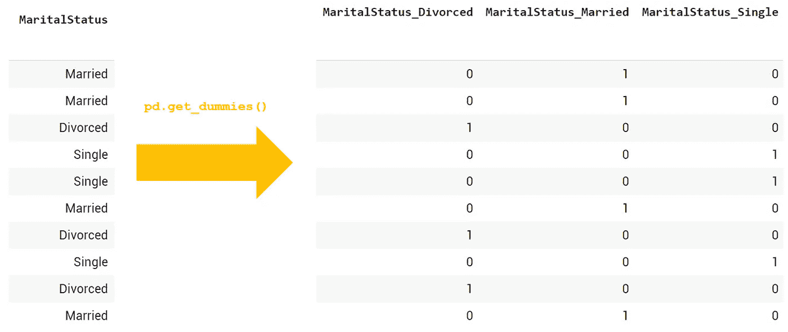

" **df.filter 的结果(like = " Marital ")。sample(10，random_state=22)** 【前后】**PD . get _ dummies()**

大多数员工会在雇主那里呆一段时间，辞职率很低，但结果是，在收集减员数据时，你会比离职者获得更多关于员工的信息…

```
df["Attrition"].value_counts()Attrition
0    1233
1     237
Name: Attrition, dtype: int64
```

只有 16%的数据集对应于已经离开公司的员工，这显然是一种“不平衡”的情况。为什么这是一个问题？

> 这里的主要风险是，算法更有可能推断出从多数类继承的模式，而感兴趣的类通常是较小的一个(例如:癌症诊断、垃圾邮件或欺诈检测、员工流失等。).

分类器的默认优化度量通常默认设置为“**准确性**”(=正确预测/总预测)，但是，对于不平衡的数据集，无用的模型仍然可以实现非常高的准确率。

例如，让我们考虑一个用不平衡数据集(10 000 封邮件中的 100 封垃圾邮件)训练的垃圾邮件检测系统。如果该模型试图最大限度地提高其准确性，它最终可以预测所有的电子邮件为“非垃圾邮件”，这将导致 99%的准确性…但您将无法检测到任何垃圾邮件！

对于此用例，建议考虑的优化指标是“召回”,因为它将评估对人群中实际上已经辞职(真阳性)的人的检测:

> 回忆=真阳性/(真阳性+假阴性)

# 模型培训—第一轮

创建我们的训练和测试数据集后:

```
X = df.drop("Attrition", axis=1)
y = df["Attrition"]X_train, X_test, y_train, y_test = train_test_split(X, y, random_state=22)
```

我们训练我们的模型，而没有关于不平衡情况的任何特定预防措施:

```
model = CatBoostClassifier(iterations=500,
                           verbose=100,
                           eval_metric="Recall")model.fit(X_train, y_train)
```

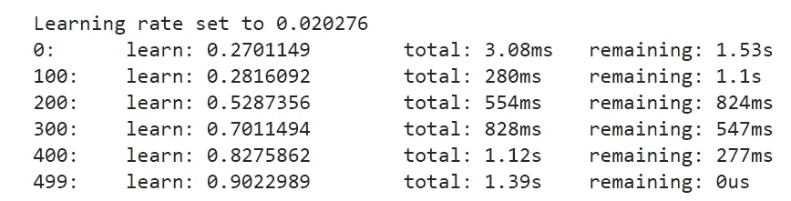

让我们显示培训和测试阶段的困惑矩阵:

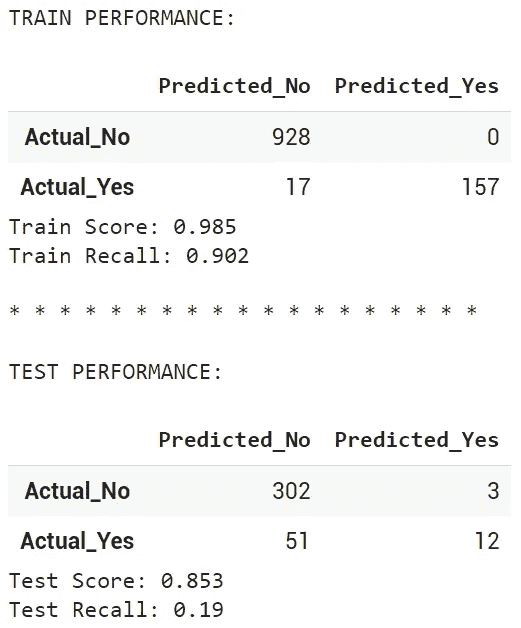

我们可以观察到召回率的真正下降，在训练和测试阶段之间从 90%下降到 19%!

# 模型训练—第二轮(使用班级权重)

向模型“教导”它需要更加关注少数群体的一种方式是引入“类权重”。

由于这种方法，当模型未能检测到真正的肯定(离开者)时，我们可以给模型分配更强的惩罚。因此，我们指定 1:5 的比率，这意味着错误的辞职检测惩罚将比错误的员工检测惩罚重 5 倍:

```
class_weights = dict({0:1, 1:5})model = CatBoostClassifier(iterations=500,
                           verbose=100,
                           eval_metric="Recall",
                           class_weights=class_weights)model.fit(X_train,y_train);
```

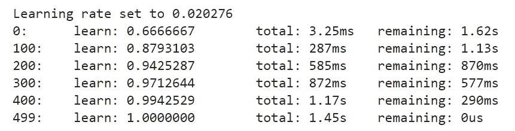

再次使用混淆矩阵，我们可以看到模型预测的真正改进，因为测试数据集上的召回分数从 19%增加到 39%，而准确性保持稳定:

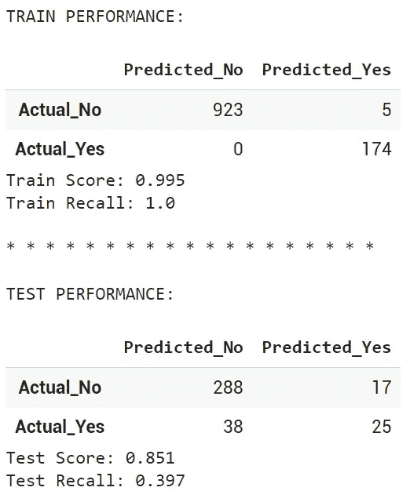

# 模型训练—第 3 轮(使用欠采样)

另外两种方法可以完成类权重的使用:

**1/过采样少数类**

第一种方法依赖于诸如 SMOT(合成少数过采样技术)之类的技术，其中基于现有的少数类生成新数据。

例如，在一个非常简化和“一维”的方式，SMOT 创造了新的个人，把他们放在少数阶级点之间的“连接线”上。

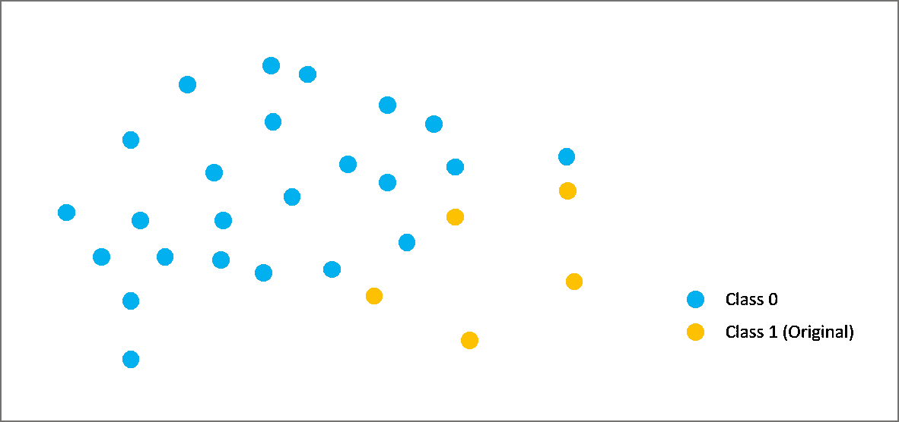

SMOT 方法:初始不平衡人口

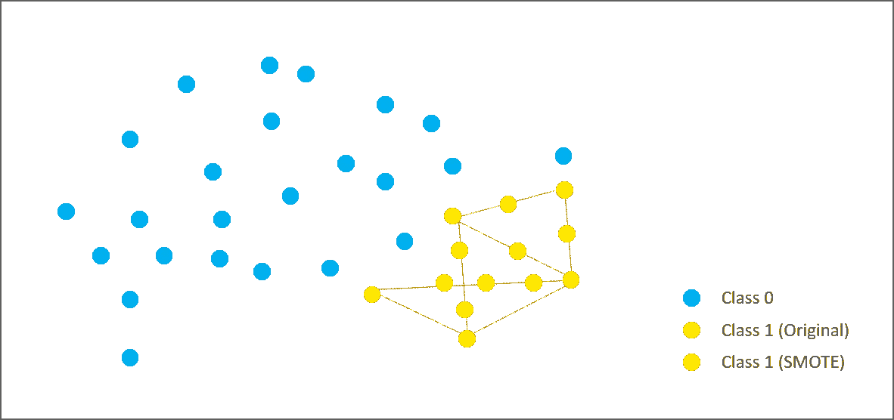

SMOT 方法:新生成数据的表示

**2/欠采样多数类**

假设许多员工都有相同的个人资料(例如:已婚男性，在会计部门工作 20 年以上，辞职率极低)。减少他们代表的数量来帮助模型理解辞职的真正影响参数是否有意思？当然！这正是欠采样技术所能提供的。

在本例中，我们将使用“ClusterCentroids”方法，该方法将:

1 -在多数类中创建聚类，其中个体具有相似或相近的属性

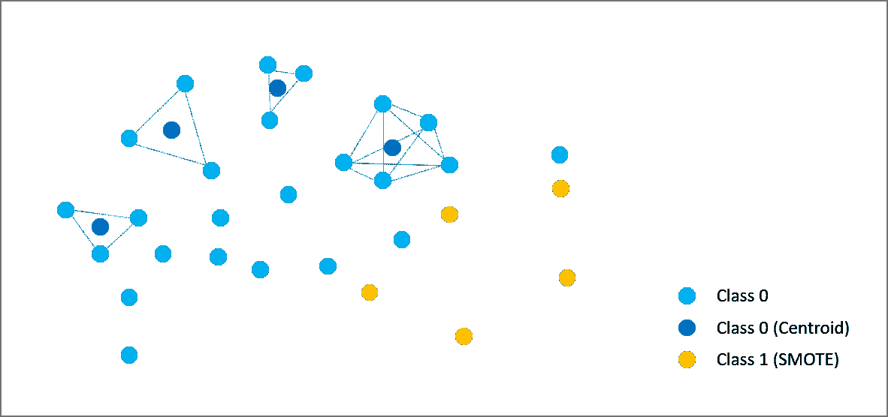

2 -用相应的质心替换每个聚类的个体。

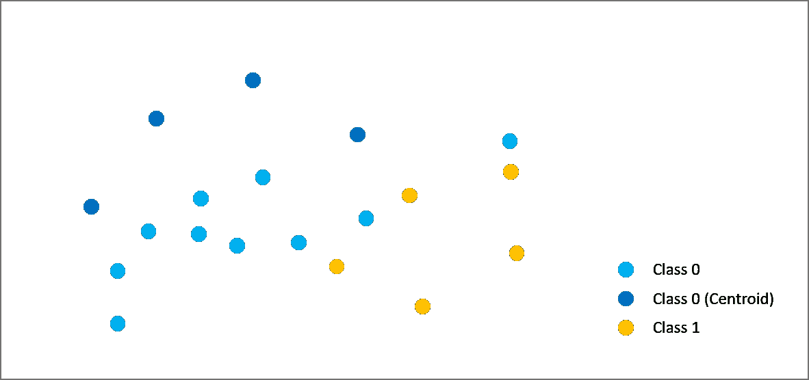

```
cc = ClusterCentroids()X_cc, y_cc = cc.fit_resample(X, y)X_train, X_test, y_train, y_test = train_test_split(X_cc, y_cc)
```

再次使用混淆矩阵，我们可以观察到训练和测试阶段的召回率现在都是 100%,这意味着在多数类中有许多具有相同特征的个体，现在被他们的质心所代替:

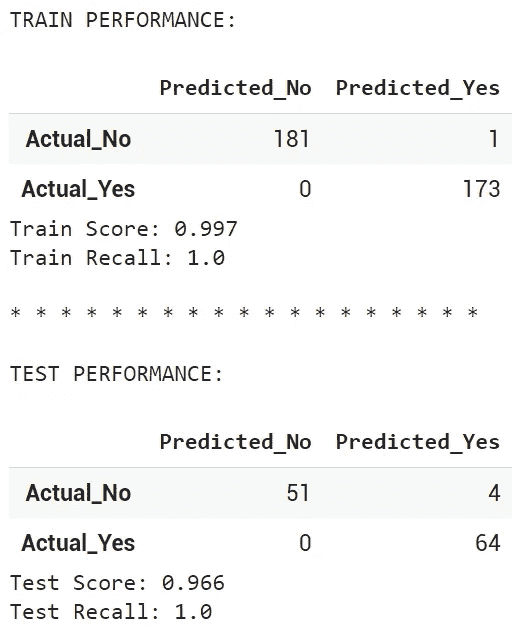

*注意:该模型的“卓越”表现是由于我们正在处理合成数据，这些数据比真实数据随机性更小。*

# 用 SHAP 解释预测

现在我们有了一个关于真阳性检测的健壮模型，从人力资源的角度来看，理解为什么模型认为一个雇员有很大的可能性辞职或不辞职将是有趣的。

定型模型上的“feature_importances_”属性是在宏观级别上了解哪些参数对预测起着重要作用的最直接的方法。

如 [**Scikit 学习文档**](https://scikit-learn.org/stable/index.html) 所述:“一个特性的重要性被计算为该特性所带来的标准的(标准化)总缩减。这也被称为基尼系数。”

```
feat_imp = pd.DataFrame(model.feature_importances_, index=X.columns, columns=["Importance"])feat_imp.sort_values(by="Importance", ascending=False).head(15)
```

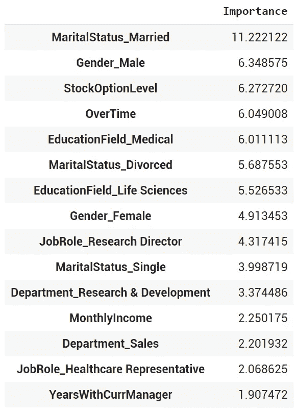

模型的 15 个 mot 影响参数

然而，它并没有指出每个参数对估计概率有正面还是负面的影响…这种影响也可能因每个样本的特征而异。

这就是最初创作于 2017 年的 SHAP(SHapley Additive explaints)进入游戏的地方！

SHAP 已经被设计，使用博弈论，以确定什么是模型中每个功能的边际贡献。如果您想进一步研究其计算机制，[快速搜索数据科学](/search?q=SHAP)将回答您的所有问题。

他们在使用 SHAP 时有许多好处，这里举几个:

**1/你可以为每一个人找出在预测中起最重要作用的参数:**

```
# Overall calculation of the SHAP model and values
shap_explainer = shap.TreeExplainer(model)
shap_values = shap_explainer.shap_values(X)#
Employee_ID = 1shap.initjs()
index_choice = df.index.get_loc(Employee_ID)
shap.force_plot(shap_explainer.expected_value, shap_values[index_choice], X.iloc[index_choice])
```

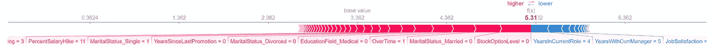

上图中显示的重要信息有:

*   **基值(3.362)** 代表员工辞职的平均概率。这是模型中所有参数的平均贡献。我们可以把它当作一个基线。
*   **个体值(5.31)** 代表员工#1 离开公司的概率，高于基线(又名“基础值”)。
*   **红色参数**显示哪些特征使员工更有可能离职:没有股票期权计划、定期加班、单身等。参数离单个值越近，它们在预测中的作用就越大(图表上每个参数的宽度也提供了这种“重要性”信息)。
*   **蓝色参数**解释了她档案中的哪些元素降低了辞职的可能性:在当前职位上 4 年，与同一位经理共事 5 年，等等。

现在让我们看看员工 2。由于高绩效评级、股票期权计划以及在同一位经理手下工作了 7 年，他的辞职概率“低于平均水平”( **3.10** )。

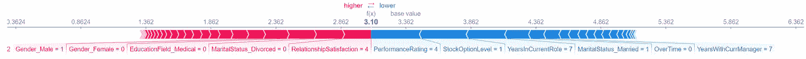

**2/您可以显示整个群体**(按个人相似度、辞职概率或原始排序排序)

```
shap.initjs()
shap.force_plot(shap_explainer.expected_value, shap_values, X)
```

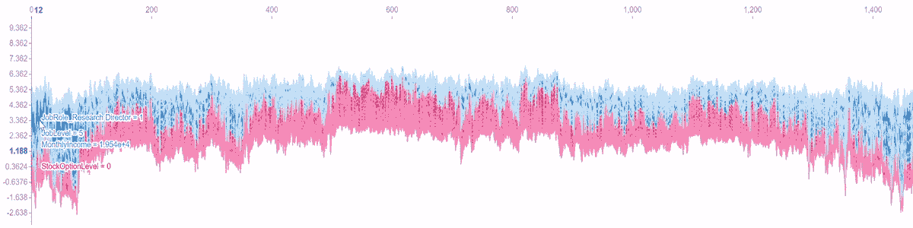

**3/你可以专注于某个具体特征的影响**。下面的图表显示，年轻确实增加了辞职的可能性，直到一个人到了 40 岁，年龄开始发挥相反的作用。

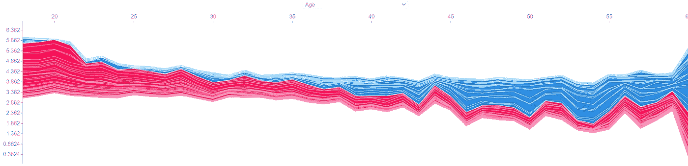

**4/并且明显地比较所有参数的各自贡献:**

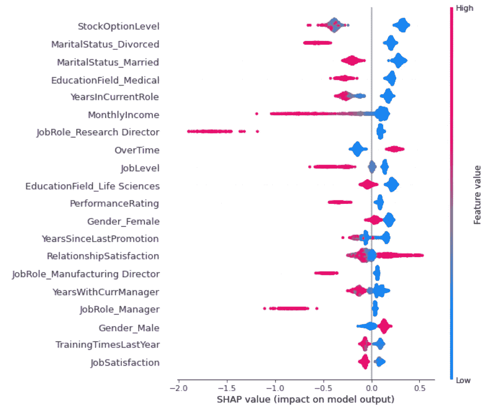

在我们结束这篇文章之前，有一些评论:

*   像往常一样，模型的稳健性将高度依赖于输入数据的质量。掌握相关的、最新的、有背景的员工信息将有助于你更好地理解辞职因素。
*   第 3 轮中的完美回忆分数是由于员工的档案是通过公式和算法创建的，这使得他们很容易预测另一种算法！即使我们可以确定员工离职的趋势，这仍然是每个人的复杂决策过程，可能没有数据集可以完全捕捉到！

**那都是乡亲们！😀**

使用过的完整笔记本储存在[这里](https://colab.research.google.com/drive/1cSDBBSctTHJ7bO-33JfnmfnOZaVBQkpD?usp=sharing)的 Google Colab/Drive 上。

[](https://pl-bescond.medium.com/pierre-louis-besconds-articles-on-medium-f6632a6895ad) [## 皮埃尔-路易·贝斯康德关于媒介的文章

### 数据科学、机器学习和创新

pl-bescond.medium.com](https://pl-bescond.medium.com/pierre-louis-besconds-articles-on-medium-f6632a6895ad)