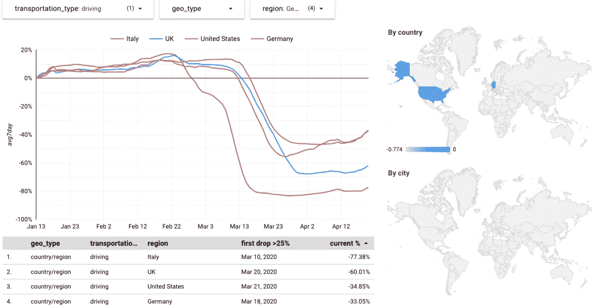

# 通过 BigQuery 和 Data Studio 实现苹果移动趋势报告

> 原文：<https://towardsdatascience.com/empowering-apple-mobility-trends-reports-with-bigquery-and-data-studio-1b188ab1c612?source=collection_archive---------35----------------------->


## 让我们为苹果移动报告的数据提供超级动力:世界各地的决策者已经在使用 BigQuery 和 Data Studio 来应对当前的危机。借助本文中的工具，我们将帮助他们充分利用这个数据集和我们的工具。

# 更新 2020 年 4 月 24 日:分步视频

查看我与[Yufeng](https://medium.com/u/2a2ae028a675?source=post_page-----1b188ab1c612--------------------------------)的实时聊天，了解[使用 Data Studio](https://youtu.be/zsm8FYrOfGs?t=307) 进行 BigQuery 的最佳实践:

# 样本结果

这个数据集的[官方苹果仪表盘显示了这样的结果:](https://www.apple.com/covid19/mobility)


在这里，我们将构建一个 [Data Studio 仪表板](https://datastudio.google.com/s/ogz13l5JjNY)，在这里我们可以看到如下所示的相同数据:



[Data Studio 仪表盘](https://datastudio.google.com/s/ogz13l5JjNY)

你可以看到:

*   趋势噪音更小(7 天平均值)。
*   突出显示国家和城市的地图。
*   显示数据摘要的表格，包括每个地区流量减少 25%以上的第一天。
*   允许您可视化其他交通类型(驾驶、公交、步行)的交互式控件。

> **请注意**我对这些图表中曲线的所有分析仅供我们娱乐。对于世界各地正在发生的事情的真正建议和分析，去找一个真正的公共卫生专家。这篇文章的目标是我们如何充分利用现有的工具，这样我们就可以帮助领域专家完成他们的工作。#负责任地

## 比较新加坡、东京、米兰、旧金山和纽约

[仪表板](https://datastudio.google.com/reporting/b15086c9-fd5f-4076-88e6-1cf57e636393/page/8ZjMB?params=%7B%22df4%22:%22include%25EE%2580%25800%25EE%2580%2580IN%25EE%2580%2580Milan%25EE%2580%2580New%2520York%2520City%25EE%2580%2580San%2520Francisco%2520-%2520Bay%2520Area%25EE%2580%2580Singapore%25EE%2580%2580Tokyo%22%7D)

*   在这 5 个城市中，米兰是第一个在苹果移动性报告中大幅下降的城市:2 月 28 日。
*   新加坡的跌幅更早(2 月 9 日)，但远没有米兰大。直到 3 月下旬和 4 月，政府才不得不采取更严厉的措施。
*   东京的交通流量并没有明显下降——只是在 4 月初情况恶化后，曲线才下降。
*   旧金山和纽约表现出相似的曲线，旧金山在步行方面领先纽约 5 天，在开车方面领先纽约 2 天。


## 比较美国城市

*   旧金山和纽约有相似的曲线(旧金山几天前放弃了)。
*   西雅图、芝加哥和迈阿密有相似的曲线。
*   亚特兰大的交通流量比其他城市下降得少。


## 交通流量没有大幅下降的城市

一些城市没有看到任何有意义的(7 天平均值<75%) drop in traffic.

We can see some of these cities here (with San Francisco for comparison):


# Latin America vs Barcelona

[仪表盘](https://datastudio.google.com/c/embed/reporting/b15086c9-fd5f-4076-88e6-1cf57e636393/page/8ZjMB?params=%7B%22df4%22:%22include%25EE%2580%25800%25EE%2580%2580IN%25EE%2580%2580Barcelona%25EE%2580%2580Buenos%2520Aires%25EE%2580%2580Colombia%25EE%2580%2580Mexico%2520City%25EE%2580%2580Rio%2520de%2520Janeiro%25EE%2580%2580Santiago%25EE%2580%2580Sao%2520Paulo%22,%22df3%22:%22include%25EE%2580%25800%25EE%2580%2580IN%25EE%2580%2580driving%22%7D)

*   巴塞罗那的下跌比拉美其他城市更早(3 月 15 日)也更深。仍在进行中。
*   你可以看到布宜诺斯艾利斯对拉美的反应最强烈。
*   圣地亚哥、布宜诺斯艾利斯和圣保罗在同一天下跌了 25%以上:3 月 19 日。
*   哥伦比亚表现出最不深刻的反应(但你应该考虑到我们在这里是把城市比作一个国家)。
*   墨西哥城是最后一个做出反应的城市:3 月 20 日。
*   圣地亚哥和圣保罗正在引领“恢复正常”。这将如何获得回报？


—

让我们回顾一下这是如何建立的。

# 背景

在分享这个数据集的过程中，苹果做了一些伟大的事情:

*   你可以看到世界各地的城市和国家是如何应对危机的。您可以将这些数字与实际措施和案例进行比较，看看反应的效果如何。
*   他们发布每日 CSV，同时[为任何寻求快速结果的人提供一个交互式仪表盘](https://www.apple.com/covid19/mobility)。

[](https://www.apple.com/covid19/mobility) [## COVID-19-移动趋势报告-苹果

### COVID-19 国家/地区和城市的移动趋势。报告每天发布，反映对…的要求

www.apple.com](https://www.apple.com/covid19/mobility) 

改进的机会:

*   **我们希望将该数据集与其他表**连接起来。谷歌的公共数据集项目已经在 BigQuery 中收集了越来越多的新冠肺炎相关数据集。
*   **他们的官方仪表盘显示了很多日常噪音**。我们可以用 7 天平均值来代替吗？
*   **可以用 SQL 对城市进行排名吗？**例如，哪些城市是第一批颁布居家政策的城市？哪些城市还没有这样做？哪些城市出现了明显的政策反弹？
*   我们能让地理信息更清晰吗？每一行仅通过城市名称来标识地理位置——这在我们需要地理定位数据时没有帮助。我们可以用一些 SQL 来改进这一点。
*   找到下载每日 CSV 的网址并不容易。
*   他们的数据不整齐。每天拥有一个专栏并不是处理数据集的最佳方式，因此需要进行一些清理。我之前的帖子展示了如何用 SQL 中的逆透视 UDF 来改进这些表。

[](/how-to-unpivot-multiple-columns-into-tidy-pairs-with-sql-and-bigquery-d9d0e74ce675) [## 如何用 SQL 和 BigQuery 将多个列拆分成整齐的一对

### 这篇文章是写给任何在 CSV 中处理时间序列的人的，每天都有一个新的专栏。处理整齐的数据是…

towardsdatascience.com](/how-to-unpivot-multiple-columns-into-tidy-pairs-with-sql-and-bigquery-d9d0e74ce675) 

# 操作方法

( [github 回购](https://github.com/fhoffa/code_snippets/tree/master/covid-19-queries/apple_mobility)最新)

## 在 BigQuery 中加载和更新每日文件

使用一些`curl`和`jq`魔法——因为没有直接的方法来获得下载 url:

```
x=$(curl -s [https://covid19-static.cdn-apple.com/covid19-mobility-data/current/v1/index.json](https://covid19-static.cdn-apple.com/covid19-mobility-data/current/v1/index.json))
url=$( echo [https://covid19-static.cdn-apple.com`jq](https://covid19-static.cdn-apple.com`jq) -n "$x" |jq -r '.basePath'``jq -n "$x"|jq -r '.regions."en-us".csvPath'
`)
curl -s $url -o /tmp/latestAppleCovidData.csv
bq load --autodetect --replace fh-bigquery:temp.latestAppleCovidData /tmp/latestAppleCovidData.csv
```

## 转换成整齐的数据

```
CREATE OR REPLACE TABLE 
  `fh-bigquery.public_dump.applemobilitytrends_initial`
OPTIONS (
  description="[https://www.apple.com/covid19/mobility](https://www.apple.com/covid19/mobility)"
) ASSELECT geo_type, region, transportation_type, unpivotted.*
FROM `fh-bigquery.temp.latestAppleCovidData` a
  , UNNEST(fhoffa.x.cast_kv_array_to_date_float(
      fhoffa.x.unpivot(a, '_2020'), '_%Y_%m_%d')) unpivotted
```

## 转换成整洁的数据，并添加有用的列

```
CREATE OR REPLACE TABLE 
  `fh-bigquery.public_dump.applemobilitytrends`
OPTIONS (
  description="[https://www.apple.com/covid19/mobility](https://www.apple.com/covid19/mobility)"
) ASWITH data AS (
  SELECT geo_type, region, transportation_type, unpivotted.*
    , LEAST(-1 + value/100, 0.2) percent
  FROM `fh-bigquery.temp.latestAppleCovidData` a
    , UNNEST(fhoffa.x.cast_kv_array_to_date_float(
      fhoffa.x.unpivot(a, '_2020'), '_%Y_%m_%d')) unpivotted
), annotated_data AS (
  SELECT *
    , -1+EXP(AVG(LOG(1+percent)) OVER(PARTITION BY geo_type, region, transportation_type ORDER BY date
      rows between 6 preceding and current row)) avg7day 
    , geo_type||transportation_type||region series_id
  FROM data
)SELECT *, ROW_NUMBER() OVER(ORDER BY current_percent) rank 
FROM (
  SELECT *
    , (SELECT percent 
       FROM annotated_data 
       WHERE a.series_id=series_id 
       AND date=(SELECT MAX(date) FROM annotated_data)
       ) current_percent
    , (SELECT MIN(date) FROM annotated_data WHERE a.series_id=series_id AND avg7day<-.25) first_drop_date 
  FROM annotated_data a
)
```

这个查询中有一些有趣的技巧:

*   带`OVER(... rows between 6 preceding and current row)`的 7 日移动平均线。
*   使用`-1+EXP(AVG(LOG(1+percent))`代替传统平均值的平方平均值来舍入异常值。
*   一些值在前一天大幅跃升至 100%以上。我们用`LEAST(-1 + value/100, 0.2)`统治他们。
*   带有自连接的子查询得到第一天的流量低于基本流量的 75%。
*   我们用`geo_type||transportation_type||region`创建了一个系列 id，以便于自连接。

# 重要注意事项

## 为什么苹果会允许访问这些数据？

根据他们的[使用条款](https://www.apple.com/covid19/mobility):

> 当新冠肺炎被世界卫生组织定义为疫情时，您可以使用本网站上提供的移动趋势报告，包括对其的任何更新(统称为“苹果数据”)，但仅限于协调对新冠肺炎公共卫生问题的回应(包括公共政策的制定)所合理需要的时间。

确保阅读他们页面上的全部条款。我写这篇文章的目的是帮助任何使用苹果发布的数据的人协调和改善他们社区对这场危机的反应。世界各地的许多团体已经在为此目的使用 BigQuery 和 Data Studio，在这里我尽我所能为他们节省时间并获得更好的结果。

## #负责任地

在创建任何新的与新冠肺炎相关的仪表板之前，请确保阅读[Amanda Makulec](https://medium.com/u/af3597c2cb6e?source=post_page-----1b188ab1c612--------------------------------)[在您创建另一个关于新冠肺炎的图表之前的十个考虑事项](https://medium.com/nightingale/ten-considerations-before-you-create-another-chart-about-covid-19-27d3bd691be8):

[](https://medium.com/nightingale/ten-considerations-before-you-create-another-chart-about-covid-19-27d3bd691be8) [## 在你创建另一个关于新冠肺炎的图表之前，要考虑十点

### 总结一下——# viz responsible；这可能意味着根本不在公共领域发布你的可视化。

medium.com](https://medium.com/nightingale/ten-considerations-before-you-create-another-chart-about-covid-19-27d3bd691be8) 

# 交互式仪表板

查看[互动数据工作室仪表盘](https://datastudio.google.com/reporting/b15086c9-fd5f-4076-88e6-1cf57e636393/page/8ZjMB)。

# 后续步骤

待定:

*   一个很好的连接来消除城市和国家的歧义。
*   与其他数据集的有趣连接。

## 了解我的 Data Studio 和 BigQuery 最佳实践

太平洋标准时间周五中午，YouTube 直播。了解一些使用 Data Studio 和 BigQuery 的最佳实践。跟我一起作为嘉宾上[郁风 G](https://medium.com/u/2a2ae028a675?source=post_page-----1b188ab1c612--------------------------------) 节目的:

[](https://www.meetup.com/Live-with-Google-Cloud-Developer-Relations/events/270186183) [## 与玉凤一起冒险-与 Felipe Hoffa 一起生活:使用 Data Studio 和 BigQuery

### 在这次冒险中，裕丰虚拟主持费利佩·霍法(应大众要求回来！)探索 Data Studio 集成…

www.meetup.com](https://www.meetup.com/Live-with-Google-Cloud-Developer-Relations/events/270186183) 

(太平洋标准时间中午 12 点，美国东部时间下午 3 点，伦敦时间晚上 8 点)

# 想要更多吗？

查看[谷歌的公共数据集项目](https://cloud.google.com/blog/products/data-analytics/free-public-datasets-for-covid19)，其特色是在 BigQuery 中收集了越来越多的新冠肺炎相关数据集:

[](https://cloud.google.com/blog/products/data-analytics/free-public-datasets-for-covid19) [## 新冠肺炎免费公共数据集|谷歌云博客

### 数据在调查、研究和应对突发公共卫生事件的能力中始终发挥着至关重要的作用

cloud.google.com](https://cloud.google.com/blog/products/data-analytics/free-public-datasets-for-covid19) 

我是 Felipe Hoffa，谷歌云的开发者倡导者。关注我 [@felipehoffa](https://twitter.com/felipehoffa) ，在[medium.com/@hoffa](https://medium.com/@hoffa)找到我之前的帖子，在[reddit.com/r/bigquery](https://reddit.com/r/bigquery)找到所有关于 BigQuery 的帖子。

[](/coronavirus-interest-inwikipedia-by-language-1b3e6562040d) [## 维基百科中冠状病毒的语言-可视化

### 通常我会写更长的帖子，但是今天让我给你一个快速的指引。先看看我是如何提取数据的…

towardsdatascience.com](/coronavirus-interest-inwikipedia-by-language-1b3e6562040d) [](/how-to-unpivot-multiple-columns-into-tidy-pairs-with-sql-and-bigquery-d9d0e74ce675) [## 如何用 SQL 和 BigQuery 将多个列拆分成整齐的一对

### 这篇文章是写给任何在 CSV 中处理时间序列的人的，每天都有一个新的专栏。处理整齐的数据是…

towardsdatascience.com](/how-to-unpivot-multiple-columns-into-tidy-pairs-with-sql-and-bigquery-d9d0e74ce675)