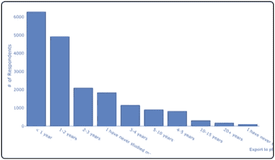
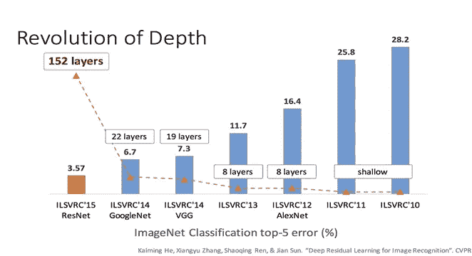
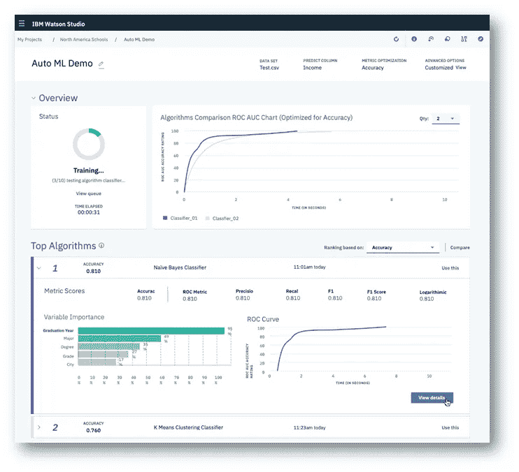
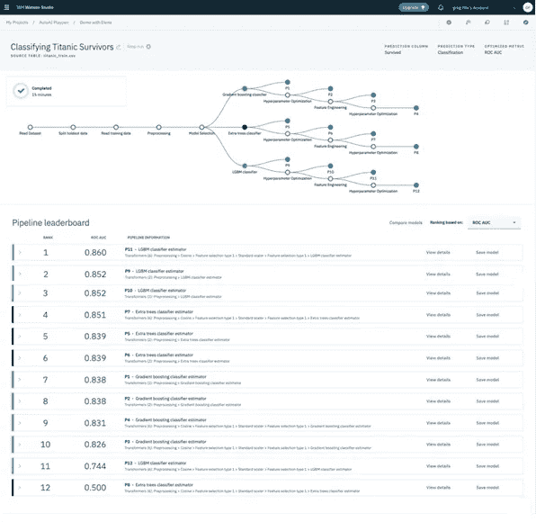
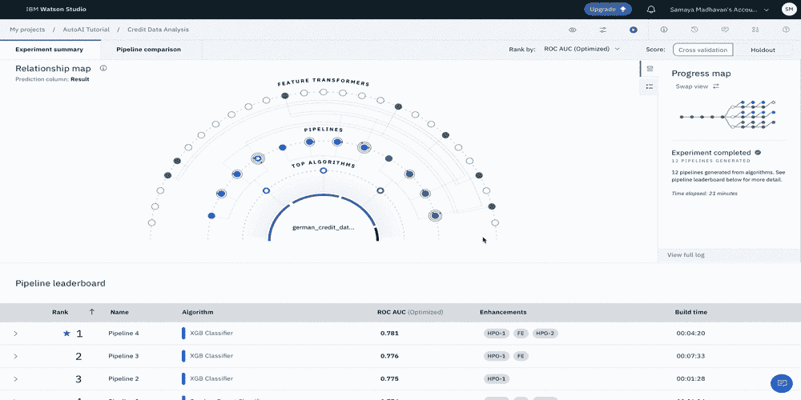

# 用 IBM Watson AutoAI 增强公民数据科学家的能力

> 原文：<https://towardsdatascience.com/empowering-citizen-data-scientists-with-watson-autoai-49a087df99e5?source=collection_archive---------57----------------------->

## 利用人工智能来自动化机器学习任务并增强模型生命周期管理

# 为什么我们需要关心 AI 自动化？

过去几年数据科学领域最重要的发展之一是自动化人工智能(AutoML)解决方案，它使业务分析师和 IT 专业人员能够在很少或没有数据科学编码经验的情况下执行复杂的机器学习活动。AutoAI 通过在数据科学和人工智能项目中使用人工智能自动化来完成关键的机器学习任务，使数据科学家能够更快、更有效地开展项目。

最近的统计数据显示，尽管机器学习和数据科学社区对角色的需求激增。Kaggle & KD Nuggets 上 50%的数据科学家受访者表示，他们在 ML 方法方面的经验不足 2 年，编码经验也是如此。

使用机器学习方法有多少年的经验？来源:KD 掘金调查

Auto AI 提供自动特征工程、模型验证、模型调整、模型选择和部署、机器学习可解释性、时间序列和模型评分的自动管道生成，为公司提供可扩展的可定制数据科学平台，满足各行业各种用例的需求。

特征工程是高级数据科学家用来从算法中提取最准确结果的有力武器。Auto AI 采用一套算法和特征转换来为给定数据集自动设计新的高价值特征。

吴恩达已经在特征工程中引入了自动化人工智能的概念

> “到 2020 年，公民数据科学家的数量将比专家数据科学家的数量增长快五倍。组织可以使用公民数据科学家，在一定程度上填补数据科学家短缺和高成本导致的机器学习人才缺口。”
> 
> **资料来源:Gartner:**10 大战略技术趋势

Watson Studio 中的 AutoAI 工具会自动分析您的数据，并为您的预测建模问题生成定制的候选模型管道。这些模型管道是在 AutoAI 分析数据集并发现最适合您的问题设置的数据转换、算法和参数设置时迭代创建的。结果显示在排行榜上，显示根据问题优化目标排列的自动生成的模型管线。

**AI 设计 AI**

人工智能自动化可以改变业务流程的工作方式。神经网络和机器学习算法可以说是数据科学家目前可用的最强大的工具。然而，虽然只有一小部分数据科学家拥有从头创建高性能神经网络所需的技能和经验，但同时需求远远超过供应。

因此，即使在概念验证阶段，大多数企业也很难快速有效地获得一种新的神经网络，这种网络在架构上是定制设计的，以满足其特定应用的需求。因此，通过为给定数据集自动设计神经网络架构来弥合这一技能差距的技术正变得越来越重要。

深度学习(depth)在神经网络中的进化来源:IBM

**AI 优化 AI**

使用人工智能设计和优化人工智能模型为人工智能技术的发展带来了一种新的和急需的能力。例如，复杂网络的参数调整可能非常耗时，容易出错，并且可能无法随时间和资源而调整。神经网络的规模和复杂性不断增长，因此有必要自动化最佳参数选择的过程，以确保机器学习过程以准确和最佳的方式生成预测结果。

使用 AutoAI 优化神经网络参数来源:IBM

**艾治艾**

60 %的公司认为**监管约束**是实施人工智能高效和自动化政策的障碍。无需昂贵的数据科学资源，在生产应用中手持多个人工智能模型:

1.当涉及到**模型** **验证**时，如果人工智能模型**符合法规**并且将在部署之前实现预期的业务成果，将会面临多重挑战

2.难以**跟踪和测量**部署下的业务成功指标。

3.**持续业务监控和合规性的资源密集型和不可靠流程**

4.业务用户不可能将微妙的领域知识反馈到模型生命周期中

# Watson AutoAI 的功能

1.  **自动化数据准备**

大多数数据集包含不同的数据格式和缺失值，正如我们所知，大多数标准的机器学习算法都没有缺失值。AutoAI 应用各种算法或估计器来分析、清理和准备用于机器学习的原始数据。它根据数据类型(如分类或数值)自动检测和分类特征。最重要的要求之一是变量缩放，以确保大多数变量被同等缩放，并减少机器学习偏差。根据分类，它使用超参数优化来为您的数据确定**缺失值插补、特征编码和特征缩放的最佳策略组合。**

**2。自动化特征工程**

**特征工程**试图将原始数据转换成最能代表问题的**特征组合，以实现最准确的预测**。AutoAI 使用一种独特的方法，以结构化、非穷举的方式探索各种特征构造选择，同时使用强化学习逐步最大化模型准确性。这导致数据转换的优化序列，最匹配模型选择步骤的算法。

IBM Watson Studio 中的自动 ML 演示

**3。超参数优化**

超参数优化流程优化了最佳性能模型 bia 算法管道。AutoAI 使用一种新颖的**超参数优化算法，针对机器学习中典型的模型训练和评分等代价高昂的函数评估**进行了优化。这种方法能够快速收敛到一个好的解决方案，尽管每次迭代的评估时间很长。

**4。自动型号选择**

下一步是自动选择与您的数据匹配的模型。AutoAI 使用一种新颖的方法，能够针对数据的小子集对候选算法进行测试和排序，逐渐增加最有希望的算法的子集大小，以达到最佳匹配。这种方法在不牺牲性能的情况下节省了时间。它能够对大量候选算法进行排序，并为数据选择最佳匹配。

Titanic 数据集中的模型管道比较来源:IBM

# IBM 的人工智能开发自动化战略

**1。转移学习**

**迁移学习** (TL)是许多深度学习应用的重要组成部分。迁移学习是机器学习(ML)中的一个研究问题，它专注于存储在解决一个问题时获得的知识，并将其应用于另一个不同但相关的问题。例如，在学习识别汽车时获得的知识可以应用于识别卡车。

这主要是由于深度学习系统中训练产品的规模；它们非常庞大，需要大量的资源。有许多预先训练的模型可用于各种平台和任务，如 MobileNet、Tensorflow 的 Yolo 等。

**2。神经网络架构搜索**

神经架构搜索(NAS)只是自动化管道的一个组成部分，旨在找到合适的架构来训练深度学习模型。这种搜索本身是一项计算密集型任务，已经引起了深度学习社区的极大兴趣。

因此，在神经结构搜索方法的发展中出现了热潮，给该领域留下了许多竞争的选择，很少或没有对已开发的方法进行整合，并且缺乏帮助从业者选择适当方法的指南。在我们的调查中，我们通过对现有景观的极其彻底的分析来解决这一差距。我们提供了一种形式主义，它统一了大量的现有方法，并批判性地检验了不同的方法。这清楚地强调了有助于神经架构搜索的设计和成功的不同组件的好处，同时也揭示了当前架构搜索趋势中的一些误解。

强化学习中的神经架构搜索来源:IBM

**3。模型管道优化&部署**

当 AutoAI 生成模型时，有两个不同的视图，通过它们可以直观地显示这些管线的创建进度。它们是进度图和关系图，如下图所示。您可以看到，AutoAI 已经选择 XGB、随机森林和决策树分类器作为这个用例中性能最好的算法。在数据预处理之后，AutoAI 识别前三个执行算法，并且对于这三个算法中的每一个，AutoAI 生成以下管道:自动模型选择(管道 1)、超参数优化(管道 2)、自动特征工程(管道 3)、超参数优化(管道 4)。

图显示了这些管道之间的关系图来源:IBM

每个模型管道都根据各种指标进行评分，然后进行排名。二元分类模型的默认排名度量是 ROC 曲线下的面积，多类分类模型的默认排名度量是准确度，回归模型的默认排名度量是均方根误差(RMSE)。排名最高的管道显示在排行榜中，因此您可以查看有关它们的更多信息。排行榜还提供了在查看后保存精选模型管道的选项。

渠道排行榜来源:IBM

***免责声明:*** *此处表达的部分观点仅代表本文作者的观点，不一定代表 IBM 公司的观点。部分内容。博客上的是版权和所有权利保留-但是，除非另有说明-根据 IBM 公司。*