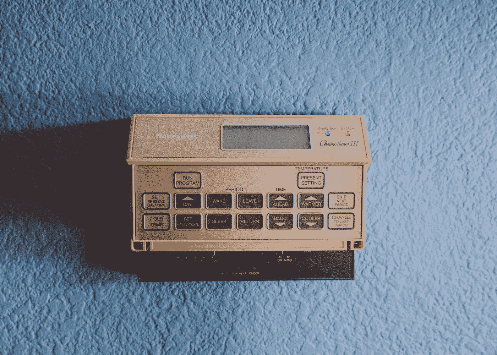
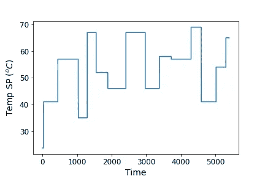
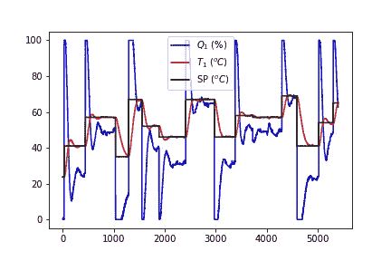

# 模拟具有长短期记忆的 PID 控制器:第 1 部分

> 原文：<https://towardsdatascience.com/emulating-a-pid-controller-with-long-short-term-memory-part-1-bb5b87165b08?source=collection_archive---------19----------------------->

## 使用温度控制实验室创建比例-积分-微分控制器数据


[亚历山大·波波夫](https://unsplash.com/@5tep5?utm_source=medium&utm_medium=referral)在 [Unsplash](https://unsplash.com?utm_source=medium&utm_medium=referral) 上拍照

你曾经对一个想法感到非常兴奋吗？也许这是你正在处理的一个新的 DIY 项目，或者是工作中一个很酷的任务。也许你和我一样疯狂，想要徒步穿越[太平洋山顶小径](https://www.pcta.org/)(因为我很快就要搬到西雅图，所以我忍不住对飞往圣地亚哥然后步行回家的想法感到兴奋)。嗯，这个项目对我来说是其中一个想法，我希望你喜欢这个旅程！

在我开始之前，我想提醒你这是一个相当广泛的项目，所以我把它分成几个部分。它们将如下:

1.  使用温度控制实验室创建比例-积分-微分控制器数据(本文)
2.  [在 Keras 中训练一个长短期记忆神经网络，以模拟 PID 控制器](https://nrlewis929.medium.com/emulating-a-pid-controller-with-long-short-term-memory-part-2-4a37d32e5b47)
3.  [用 LSTM 控制温控实验室](https://nrlewis929.medium.com/emulating-a-pid-controller-with-long-short-term-memory-part-3-23da7df3e033)
4.  [用 LSTM 控制器代替 PID 控制器进行温度控制的实际应用](https://nrlewis929.medium.com/emulating-a-pid-controller-with-long-short-term-memory-part-4-19ab327be61b)

# 项目框架

有一天，在做一个工作项目时，我看到一篇介绍了一个新颖想法的论文。[一些研究人员](https://www.sciencedirect.com/science/article/pii/S2405896318320597)有想法使用神经网络来模拟模型预测控制(MPC)策略的行为。这个想法是，一些 MPC 问题在计算上非常昂贵，但是行为是可预测的；**如果我们可以通过训练深度神经网络来模拟这种行为，那么理论上，我们可以用更快的机器学习模型来取代计算量大的 MPC。**该过程中唯一计算量大的部分是模型训练。

最棒的是，我在办公桌前测试了这个想法。温度控制实验室被完美地设计成这种问题的原型。我在之前的一篇文章中介绍了 TCLab 和一些基本的异常检测，你可以用机器学习来做这些。如果你是对外汉语实验室的新手，你可以看看我的文章，或者看看 APMonitor.com[的丰富资源。](http://apmonitor.com/pdc/index.php/Main/ArduinoTemperatureControl)

所以我决定尝试一下:我想调整一个比例-积分-微分(PID)控制器，这样我就可以在 TCLab 上设置一个温度，控制器会调整加热器，直到它达到设定值。然后，我想看看我能否用一个长短期记忆神经网络来模拟这种行为。如果这个原型成功了，它将不仅为提高计算速度打开大门，也为异常检测等应用打开大门。

这个系列是关于机器学习的，所以如果你不熟悉 PID 控制器或控制理论，那也没关系；我们将重点介绍几个亮点，以便您了解背景。在 APMonitor.com[有一些惊人的资源可以帮助你理解 PID 控制器以及如何调整它们。这些控制器在工程行业中无处不在，因此其潜在应用非常广泛。](https://apmonitor.com/pdc/index.php/Main/ProportionalIntegralDerivative)

# PID 控制器概述



[韦斯利·廷吉](https://unsplash.com/@wesleyphotography?utm_source=medium&utm_medium=referral)在 [Unsplash](https://unsplash.com?utm_source=medium&utm_medium=referral) 上拍摄的照片

控制系统无处不在。想想你的恒温器:你所要做的就是输入温度，不知何故，它知道什么时候打开和关闭暖气，以保持你的房子在那个温度(当然，除了房间总是一个冰盒……)。它是怎么做到的？控制系统可以分为三个部分:传感器(读取房间温度的东西)，执行器(打开冷气或热气的空调或炉子)，控制器(恒温器中的计算机，是操作背后的大脑)。传感器数据输入控制器，然后控制器告诉执行器做什么。

PID 控制器无处不在是有原因的:它们简单明了且极其有效，尤其是当与一个[一阶加死区(FOPDT)模型](https://apmonitor.com/pdc/index.php/Main/FirstOrderSystems)配对时。在我们的 TCLab 中，它将温度设定点和温度传感器之间的差值(在下面的等式中表示为 e(t ))作为输入，并输出一个加热器值(下面标记为 output，或 OP ),使温度接近设定点。顾名思义，有一个比例，积分和导数部分。


K_c、τ_I 和τ_D 称为调谐常数，决定控制器的行为。您可以 g [为您的 TCLab](https://apmonitor.com/pdc/index.php/Main/TCLabFOPDT) 生成阶跃响应，然后[以图形方式](https://apmonitor.com/pdc/index.php/Main/FirstOrderGraphical)获得 PID 控制器的调谐参数。对于我的 TCLab，一些有效的调优参数是 K_c = 6.0、τ_i =75.0 和τ_d = 0.0。您的可能会有所不同，因为每个 TCLab 的行为略有不同。现在让我们来看看 PID 控制器的代码。我放在函数`pid(sp,pv,pv_last,ierr,dt)`里了。

第一部分是加载您的调优参数和其他常数:

```
# PID Parameters
Kc   = 6.0
tauI = 75.0 # sec
tauD = 0.0  # sec# PID coefficients in terms of tuning parameters
KP = Kc
KI = Kc / tauI
KD = Kc * tauD

# OPbias for controller (initial heater)
op0 = 0# upper and lower bounds on heater level
ophi = 100
oplo = 0
```

然后，我们要计算设定值(sp)和温度(也称为过程变量，pv)之间的误差:

```
# calculate the error
error = sp - pv
```

积分部分通过数值计算，将之前的误差与当前的时间步长误差相加:

```
# calculate the integral error
ierr = ierr + KI * error * dt
```

最后，控制器的导数部分(也是数值计算)如下所示:

```
# calculate the measurement derivative
dpv = (pv - pv_last) / dt
```

现在将所有这些放在一起，我们可以计算 PID 输出(op):

```
# calculate the PID output
P = KP * error
I = ierr
D = -KD * dpv
op = op0 + P + I + D
```

最后，为了确保我们考虑了 0 到 100 之间的加热器限值，我们添加了一个防复位饱和条件:

```
# implement anti-reset windup
if op < oplo or op > ophi:
    I = I - KI * error * dt
    # clip output
    op = max(oplo,min(ophi,op))
```

那还不算太糟！如果没有别的，你学会了如何编程一个 PID 控制器功能，这是非常有用的工业控制器。

# 从 PID 控制器生成数据

现在我们需要在 TCLab 上实际运行 PID 控制器。我们将设置几个数组来存储数据，并运行控制器 90 分钟，以确保我们有足够的数据。我们将间歇性地改变温度设定值，这样我们就能很好地混合稳态和瞬态行为。以下是我的设置:

```
##### Set up run parameters ###### Run time in minutes
run_time = 90.0# Number of cycles
loops = int(60.0*run_time)# arrays for storing data
T1 = np.zeros(loops) # measured T (degC)
error_sp = np.zeros(loops) # Setpoint error
Q1 = np.zeros(loops) # Heater values
tm = np.zeros(loops) # Time# Temperature set point (degC)
with tclab.TCLab() as lab:
    Tsp1 = np.ones(loops) * lab.T1# vary temperature setpoint
end = 30 # leave 1st 30 seconds of temp setpoint as room temp
while end <= loops:
    start = end
    # keep new temp set point value for anywhere from 4 to 10 min
    end += random.randint(240,600) 
    Tsp1[start:end] = random.randint(30,70)
```

画出你预期会发生的事情从来都没有坏处。在 90 分钟的过程中，我们打算让 PID 控制器设置加热器，使温度遵循以下曲线:



作者的情节

我们都准备好了！在我写的另一篇文章中，我详细介绍了如何在 TCLab 上运行，但是这个应用程序稍微高级一些。最值得注意的是，我们在每个时间步调用我们的`pid(sp,pv,pv_last,ierr,dt)`函数来返回加热器输出，以便我们保持在正确的温度。我们每秒都在更新这个。PID 在计算上并不太昂贵，所以它可以在这段时间内很容易地解决。

```
# Run test
with tclab.TCLab() as lab:
    # Find current T1, T2
    print('Temperature 1: {0:0.2f} °C'.format(lab.T1))
    print('Temperature 2: {0:0.2f} °C'.format(lab.T2)) # Integral error
    ierr = 0.0
    # Integral absolute error
    iae = 0.0 start_time = time.time()
    prev_time = start_time for i in range(loops):
        # Delay 1 second
        if time.time() > prev_time + 1.0:
            print('Exceeded cycle time by ',
                   time.time()-prev_time-1.0)
        else:
            while time.time() < prev_time + 1.0:
                pass

        # Record time and change in time
        t = time.time()
        dt = t - prev_time
        prev_time = t
        tm[i] = t - start_time # Read temperatures in Kelvin 
        T1[i] = lab.T1 # Integral absolute error
        iae += np.abs(Tsp1[i]-T1[i]) # Calculate PID output
        [Q1[i],P,ierr,D] = pid(Tsp1[i],T1[i],T1[i-1],ierr,dt) # Write heater output (0-100)
        lab.Q1(Q1[i])
```

让我们来看看控制器是如何工作的:



作者的情节

相当整洁！我们希望红线(温度传感器)跟随黑线(温度设定点)。蓝色显示加热器如何调整，以使传感器与设定值相匹配。我们总是可以针对不同的性能调整 PID 参数，但我们希望进入机器学习部分，因此对于这个练习来说，这是完美的。我不知道你，但我们甚至还没有开始机器学习，但仅仅是在我们的办公桌上编程我们自己的控制器就已经很令人兴奋了！

# 最后的想法…暂时的

首先，你可以从 [Github](https://github.com/nrlewis929/TCLab_emulate_PID) 下载代码。这个练习在很大程度上依赖于 TCLab，但我希望将来添加一些带有原始数据的替代笔记本，这样您就可以在没有原始数据的情况下运行代码。

我们可以设计一个装置来控制温度，这有多棒？有这么多的应用——想想你的恒温器，或者烤箱，甚至是一个别致的烧烤架。更不用说反应器温度或进料流温度的工业应用。你能想到这种控制器的其他应用吗？

感谢您耐心阅读这篇介绍性文章，尤其是如果您从未见过控制器的话。我知道我承诺了一些机器学习应用，这正是我们正在努力的。我们将在下一节(2020 年 10 月)深入探讨这一问题。不过，如果有什么不同的话，我觉得理解机器学习应用程序背后的背景很重要。这不仅使它们与我们的工作或日常生活相关，而且也为更深刻的见解打开了大门。我很高兴听到这可能会给你带来什么想法！