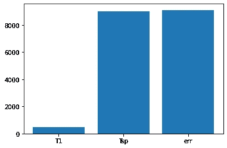
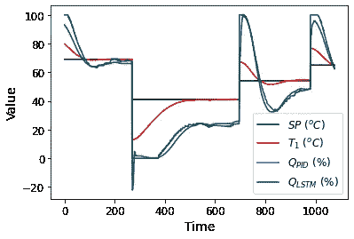

# 模拟具有长短期记忆的 PID 控制器:第 2 部分

> 原文：<https://towardsdatascience.com/emulating-a-pid-controller-with-long-short-term-memory-part-2-4a37d32e5b47?source=collection_archive---------22----------------------->

## 使用温度控制实验室在 Keras 中训练长短期记忆神经网络以仿真 PID 控制器


照片由[皮尔莫·康](https://unsplash.com/@ivorycirrus?utm_source=medium&utm_medium=referral)在 [Unsplash](https://unsplash.com?utm_source=medium&utm_medium=referral) 拍摄

欢迎来到这个激动人心的项目的第 2 部分！到目前为止，结果看起来很好，现在我们可以进入我们试图完成的内容了:用 LSTM 模拟 PID 控制器的行为。简要回顾一下，以下是我们到目前为止所探索的内容以及我们的发展方向:

1.  [使用温度控制实验室创建比例积分微分控制器数据](https://medium.com/@nrlewis929/emulating-a-pid-controller-with-long-short-term-memory-part-1-bb5b87165b08)
2.  在 Keras 中训练一个长短期记忆神经网络来模拟 PID 控制器(本文)
3.  [用 LSTM 控制温控实验室](https://nrlewis929.medium.com/emulating-a-pid-controller-with-long-short-term-memory-part-3-23da7df3e033)
4.  [用 LSTM 控制器代替 PID 控制器进行温度控制的实际应用](https://nrlewis929.medium.com/emulating-a-pid-controller-with-long-short-term-memory-part-4-19ab327be61b)

如果你想自己运行这段代码，可以在 [Github](https://github.com/nrlewis929/TCLab_emulate_PID) 上找到。它严重依赖于在您的计算机上使用 TCLab 设备，但最终我计划生成数据并添加一些笔记本，这样您也可以作为一个独立的项目来运行它。当然，我总是鼓励你看看你能从中吸取什么原则，并把它们应用到你自己的项目中。

# 用 LSTM 模拟 PID 行为

完成[最后一段](/emulating-a-pid-controller-with-long-short-term-memory-part-1-bb5b87165b08)后，我们有一些数据要处理，我们想看看 LSTM 是否能模拟 PID 控制器的行为。有一些关于 LSTMs 如何工作的优秀文章，所以如果您以前没有使用过它们，我会向您推荐这些文章。[这里](https://colah.github.io/posts/2015-08-Understanding-LSTMs/)是我在研究它们背后的一些数学知识时去的地方之一，而[这篇](/recurrent-neural-networks-by-example-in-python-ffd204f99470)是一篇关于数据科学的精彩文章，向我介绍了它们是如何用 Python 和 Keras 实现的。[这里有](/illustrated-guide-to-lstms-and-gru-s-a-step-by-step-explanation-44e9eb85bf21)另一个有视频的很棒的教程。像往常一样，[APMonitor.com](http://apmonitor.com/do/index.php/Main/LSTMNetwork)是所有与机器学习和过程控制相关的丰富资源。

LSTMs 由于其多功能性，已经成为所有类型的机器学习模型的流行方法。我在序列预测任务、自然语言处理和异常检测中使用过它们；其他人已经找到了从图像处理到语音识别的应用。它与标准递归神经网络的区别在于其细胞存储单元的存在，这有助于解决[消失梯度问题](https://en.wikipedia.org/wiki/Vanishing_gradient_problem)。

LSTMs 在这类问题上工作得很好，因为我们想记住控制系统中以前发生过什么。如果我们只是将设定点从 35°C 更改为 70°C，我们知道加热器将被置于最大温度一段时间，以达到该设定点。然而，如果我们只是从 45°C 降至 42°C，或者在 55°C 保持稳定一段时间，控制器将不得不做出不同的解释。

在仿真 PID 控制器的情况下，我们希望输入一个数据窗口，例如温度、设定点、误差或加热器值，并预测下一个加热器值应该是多少，以达到所需的设定点。这个预测是模拟具有给定调谐常数的 PID 控制器将会给我们的输出。当然，如果调谐常数改变，我们不再看到相同类型的控制器行为。这是一个有趣的想法，可以在第 4 部分中探讨。

# 模型特征和预处理

第一步是查看哪些特性对输入模型有用。直观地说，PID 控制器将传感器温度和设定点之间的误差作为输入，因此我们的 LSTM 很可能需要这些。Scikit-learn 有很多有用的[特性选择模型](https://scikit-learn.org/stable/modules/classes.html#module-sklearn.feature_selection)来帮助我们理解一些好的输入。让我们使用`SelectKBest`方法来缩小我们的选择范围。我们有传感器温度、设定值和加热器输出；我们还将导出误差，并将它们传递给`SelectKBest`函数:

```
# Create new feature: setpoint error
df['err'] = df['Tsp'] - df['T1']# Load possible features
X = df[['T1','Tsp','err']]
y = np.ravel(df[['Q1']])# SelectKBest feature selection
bestfeatures = SelectKBest(score_func=f_regression, k='all')
fit = bestfeatures.fit(X,y)
plt.bar(x=X.columns,height=fit.scores_)
```

绘制结果显示`Tsp`(设定点温度)和`err`(设定点和传感器之间的误差)是迄今为止最重要的特征，这验证了我们的直觉。



作者的情节

对于 LSTM，我将使用 Keras 和 Tensorflow 后端；我发现这是一种直观有效的建模方式。在构建模型之前，我需要缩放数据并将其格式化为 LSTM 期望的样子。在这种情况下，我将采用我的`Tsp`和`err`特征，并以这样一种方式排列它们，即过去的 15 个时间点作为输入来预测加热器输出`Q1`。一定要留出一些数据来测试模型性能。

```
X = df[['Tsp','err']].values
y = df[['Q1']].values# Scale data
s = MinMaxScaler()
Xs = s.fit_transform(X)# Each input uses last 'window' number of Tsp and err to predict the next Q1
X_lstm = []
y_lstm = []
for i in range(window,len(df)):
    X_lstm.append(Xs[i-window:i])
    y_lstm.append(y[i])# Reshape data to format accepted by LSTM
X_lstm, y_lstm = np.array(X_lstm), np.array(y_lstm)# Split into train and test 
Xtrain, Xtest, ytrain, ytest = train_test_split(X_lstm,y_lstm,test_size=0.2,shuffle=False)
```

# 训练 LSTM

我们可以查看大量的超参数来优化 LSTM 与 PID 控制器的保真度。我通常会使用一个非常有用的 Python 包，名为 [Hyperopt](http://hyperopt.github.io/hyperopt/) 来调优这些，尤其是对于一个非常复杂的问题。以下是一些运行良好的超参数:

```
window = 15
layers = 2
batch_size = 100
drop = 0.1
units = 100
```

现在，我们准备构建 LSTM 模型。有很多关于如何做到这一点的教程，所以我将继续展示代码，然后评论几个亮点。

```
# Keras LSTM model
model = Sequential()if layers == 1:
    model.add(LSTM(units=units, 
                   input_shape=(Xtrain.shape[1],Xtrain.shape[2])
                  )
             )
    model.add(Dropout(rate=drop))
else:
    # First layer specifies input_shape and returns sequences
    model.add(LSTM(units=units, 
                   return_sequences=True, 
                   input_shape=(Xtrain.shape[1],Xtrain.shape[2])
                  )
             )
    model.add(Dropout(rate=drop))
    # Middle layers return sequences
    for i in range(layers-2):
        model.add(LSTM(units=units,return_sequences=True))
        model.add(Dropout(rate=drop))
    # Last layer doesn't return anything
    model.add(LSTM(units=units))
    model.add(Dropout(rate=drop))model.add(Dense(1))
model.compile(optimizer='adam', loss='mean_squared_error')es = EarlyStopping(monitor='val_loss',
                   mode='min',
                   verbose=1,
                   patience=25
                  )result = model.fit(Xtrain, ytrain, 
                   verbose=0, 
                   validation_split=0.2,
                   callbacks = [es,TqdmCallback(verbose=1)],
                   batch_size=batch_size,
                   epochs=350)# Show results
epochs = es.stopped_epoch
plt.semilogy(result.history['loss'],label='loss')
plt.semilogy(result.history['val_loss'],label='val_loss')
plt.legend();
```

构建 LSTM 和 Dropout 图层后，我们有一个值为 1 的`Dense`图层，因为模型仅预测 1 个输出值。我们使用`adam`优化器和`mean_squared_error`作为损失函数。我喜欢留出一些训练数据来用`validation_split`参数进行验证。这使我能够监控一组单独数据的损失，如果我的损失达到稳定状态，就提前停止模型训练(你可以用`patience`参数调整它达到稳定状态后等待的时间)，这可以防止模型过度拟合。`TqdmCallback`是一个方便的进度条，比起 Keras 自带的默认进度条，我更喜欢它。最后，最好绘制损失函数，以确保训练损失和验证损失都呈现总体下降趋势。训练 LSTM 需要一点时间，但我们不会处理大数据集，所以这不是禁止性的。

# 测试 LSTM

在我们使用 LSTM 控制 TCLab 之前，我们希望确保它的行为近似于 PID 控制器的行为。这不仅对于健全性检查很重要，而且也是一个重要的安全问题。你能想象在一个你不确定能否工作的反应器上使用温度控制器吗？如果没有达到预期效果，出现失控反应，可能会造成大混乱。

幸运的是，我们已经准备了一些样本数据，都是 LSTM 期望输入的正确格式。我们只需要看到，给定输入，来自 LSTM 的预测加热器输出与 PID 控制器将做的一致。请务必撤消数据的缩放，以便我们获得真实值。

```
# Predict using LSTM
yp_s = model.predict(Xtest)# Unscale data
Xtest_us = s_x.inverse_transform(Xtest[:,-1,:])
ytest_us = s_y.inverse_transform(ytest)
yp = s_y.inverse_transform(yp_s)# Derive Tsp (setpoint) and T1 (sensor) from X data
sp = Xtest_us[:,0]
pv = Xtest_us[:,0] + Xtest_us[:,1]
```

这就是我们所看到的:



作者的情节

太神奇了！您可以看到设定值和 T1 数据(我们从中得出误差)，以及来自 PID 控制器的实际数据。绿色显示的是在给定完全相同的输入数据集的情况下，LSTM 的表现。看起来它非常逼真地遵循了 PID 控制器的行为，所以我有信心把它作为代理控制器来试用，只需要一次调整。请注意，LSTM 输出有时会超出加热器限定的范围[0，100]。当我们把它作为控制器编码时，我们必须记住裁剪结果。

# 最后的想法

我们已经有了一个工作的 LSTM 模型，下一步是把它编码成控制器。这是一个相当大的项目，所以我们将把它留到本系列的下一篇文章中(2020 年 10 月)。在此之前，请确保保存您的模型和用于预处理的任何参数。

```
# Save Keras LSTM model
model.save('pid_emulate.h5')# Save preprocessing parameters
model_params = dict()
model_params['Xscale'] = s_x
model_params['yscale'] = s_y
model_params['window'] = windowpickle.dump(model_params, open('model_params.pkl', 'wb'))
```

现在我们有了。我们成功地训练了一个 LSTM 模型来模拟 PID 控制器的行为。下一个重要的步骤是将它投入使用。