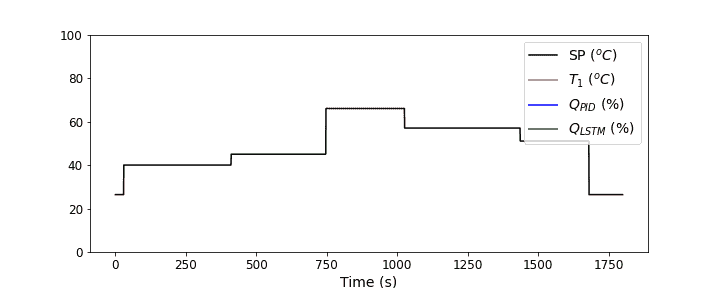
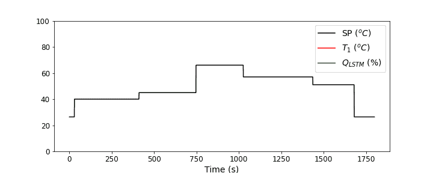

# 模拟具有长短期记忆的 PID 控制器:第 3 部分

> 原文：<https://towardsdatascience.com/emulating-a-pid-controller-with-long-short-term-memory-part-3-23da7df3e033?source=collection_archive---------27----------------------->

## 用 LSTM 控制温度控制实验室


Johannes Plenio 在 [Unsplash](https://unsplash.com?utm_source=medium&utm_medium=referral) 上拍摄的照片

欢迎来到这个项目的第 3 部分！现在，你的雇主正在看着你的结果，说“那又怎么样？”你已经做了很多跑腿的工作，但是到目前为止，它只是在电脑上看起来不错。嗯，这是“那又怎样”的部分。这就是我们最终实现这个 LSTM 神经网络来模拟 PID 控制器行为的地方。简单回顾一下，我们已经走过的路和将要去的地方如下:

1.  [使用温度控制实验室创建比例积分微分控制器数据](https://medium.com/@nrlewis929/emulating-a-pid-controller-with-long-short-term-memory-part-1-bb5b87165b08)
2.  [在 Keras 中训练一个长短期记忆神经网络，以模拟 PID 控制器](https://nrlewis929.medium.com/emulating-a-pid-controller-with-long-short-term-memory-part-2-4a37d32e5b47)
3.  用 LSTM 控制温度控制实验室(本文)
4.  [用 LSTM 控制器代替 PID 控制器进行温度控制的实际应用](https://nrlewis929.medium.com/emulating-a-pid-controller-with-long-short-term-memory-part-4-19ab327be61b)

和往常一样，你可以自由地自己运行[代码](https://github.com/nrlewis929/TCLab_emulate_PID)，最好是和温度控制实验室[一起运行，这样你就可以看到实时数据。](http://apmonitor.com/pdc/index.php/Main/ArduinoTemperatureControl)

# 最后一次检查

虽然我们上次检查了 LSTM 控制器的输出，但我们还是想先练习安全。我们不想在运行像反应堆温度这样敏感的东西时调试我们的控制回路。因此，首先，我们将保留我们的 PID 控制器，但也计算 LSTM 控制器输出。这使我们能够看到我们编程的 LSTM 控制器与 PID 控制器相比做了什么，并对其进行调试。

到目前为止，您对此已经很熟悉了，但是设置跑步只需要做一些调整:

```
#### Set up run ##### Import model and model parameters
model = load_model('pid_emulate.h5')
model_params = pickle.load(open('model_params.pkl', 'rb'))s_x = model_params['Xscale']
s_y = model_params['yscale']
window = model_params['window']# Run time in minutes
run_time = 30.0# Number of cycles
loops = int(60.0*run_time)# arrays for storing data
T1 = np.zeros(loops) # measured T (degC)
Qpid = np.zeros(loops) # Heater values for PID controller
Qlstm = np.zeros(loops) # Heater values for LSTM controller
tm = np.zeros(loops) # Time# Temperature set point (degC)
with tclab.TCLab() as lab:
    Tsp = np.ones(loops) * lab.T1# vary temperature setpoint
# leave 1st window + 15 seconds of temp set point as room temp
end = window + 15 
while end <= loops: 
    start = end
    # keep new temp set point value for anywhere from 4 to 10 min
    end += random.randint(240,600) 
    Tsp[start:end] = random.randint(30,70)# leave last 120 seconds as room temp
Tsp[-120:] = Tsp[0]
```

您将注意到的第一件事是，我们从训练运行中加载了模型和预处理参数。这些匹配很重要，否则结果会很糟糕，或者根本不起作用。我跑了 30 分钟，因为我只需要看到足够多的东西来确信它是可行的，而不是试图生成足够多的高质量数据来训练 LSTM。我还有两个独立的加热器阵列，一个存储 PID 输出，一个存储 LSTM 输出。最后，在最后 2 分钟，我把我的温度设定值调回到室温。通常你不需要担心这个，但是因为我连续做了两次测试，这使得第二次测试从接近室温开始，而不需要在两次测试之间额外等待几分钟。

我们编写的控制回路将与 PID 控制器相同(如果需要，请参见[第 1 部分](/emulating-a-pid-controller-with-long-short-term-memory-part-1-bb5b87165b08)复习)，只是现在我们还想看看 LSTM 控制器会输出什么。我已经把它放在一个函数`lstm(T1_m,Tsp_m)`中，但是我建议先把它直接放在代码中以便调试。`T1_m`是 LSTM 模型传感器 1 的温度，我们将在每个时间点读取，而`Tsp_m`是 LSTM 模型的设定点温度。让我们来看看我们用它做什么。

首先，计算误差，确保它与我们在[第二部分](https://nrlewis929.medium.com/emulating-a-pid-controller-with-long-short-term-memory-part-2-4a37d32e5b47)中训练 LSTM 时计算的方法相同。

```
# Calculate error (necessary feature for LSTM input)
err = Tsp_m - T1_m
```

接下来，我们需要将现有的数据转换成 LSTM 所期望的格式，因此用与第 2 部分相同的方式将其放入一个数组中，对其进行缩放和整形。

```
# Format data for LSTM input
X = np.vstack((Tsp_m,err)).T
Xs = s_x.transform(X)
Xs = np.reshape(Xs, (1, Xs.shape[0], Xs.shape[1]))
```

现在我们有了输入数据，我们可以调用`model.predict()`函数来获得加热器输出。回想一下，这是一个缩放值，对我们的实际加热器没有多大用处，所以我们取消了对真实值的缩放。

```
# Predict Q for controller and unscale
Q1c_s = model.predict(Xs)
Q1c = s_y.inverse_transform(Q1c_s)[0][0]
```

最后，正如我们在第 2 部分培训时注意到的，有时 LSTM 会预测有效[0，100]范围之外的值，因此我们将只限制可能的输出值。

```
# Ensure Q1c is between 0 and 100
Q1c = np.clip(Q1c,0.0,100.0)
```

我希望你能明白我为什么决定在安装之前测试和调试它！

当我们在控制回路中时，最后要做的一件事。回想一下，我们指定了一个特定的数据点窗口作为 LSTM 输入的历史。我们必须等到有了那个数量的数据点，才能向 LSTM 控制器输入任何东西。这是这个模拟器的一个潜在的缺点，也是为什么你想保持窗口适当低的一个原因。然而，在最初的窗口期过后，事情就一帆风顺了。下面是控制循环中的最终实现:

```
# Run LSTM model to get Q1 value for control
if i >= window:
   # Load data for model
   T1_m = T1[i-window:i]
   Tsp_m = Tsp[i-window:i]
   # Predict and store LSTM value for comparison
   Qlstm[i] = lstm(T1_m,Tsp_m)
```

我还保存了一些控制器行为的快照，并把它们放入视频中。让我们看看它是如何工作的。



作者的情节

相当惊人！请记住，蓝线(PID)是真正控制加热器，绿色(LSTM)只是作为参考。它不完全匹配，我也不一定期望它匹配。LSTM 控制器看起来更倾向于降低加热器值，这可能会导致现实生活中的超调量增加。它通常也会有较低的输出，但由于高温往往更危险，我很高兴看到它更保守。总的来说，看起来我们已经编程正确，所以我相信 LSTM 运行加热器输出值来控制温度。让我们看看接下来会是什么样子。

# 用 LSTM 控制

现在，我们期待已久的！让我们把控制器交给 LSTM。这里真的没有什么新东西，但是为了完整起见，这里是我的代码看起来像使用 LSTM 来控制加热器输出，模拟 PID 控制器的行为。

```
# Run test
with tclab.TCLab() as lab:
    # Find current T1, T2
    print('Temperature 1: {0:0.2f} °C'.format(lab.T1))
    print('Temperature 2: {0:0.2f} °C'.format(lab.T2)) start_time = time.time() for i in tqdm(range(loops)):
        # Delay 1 second
        if time.time() > prev_time + 1.0:
            print('Exceeded cycle time: ',time.time()-prev_time-1.0)
        else:
            while time.time() < prev_time + 1.0:
                pass # Record time
        t = time.time()
        tm[i] = t - start_time # Read temperature (C)
        T1[i] = lab.T1 # Run LSTM model to get Q1 value for control
        if i >= window:
            # Load data for model
            T1_m = T1[i-window:i]
            Tsp_m = Tsp[i-window:i]
            # Predict and store LSTM value for comparison
            Qlstm[i] = lstm(T1_m,Tsp_m) # Write heater output (0-100)
        lab.Q1(Qlstm[i])
```

我们表现如何？



作者的情节

哇哦。我不知道你怎么想，但这是令人兴奋的事情。我们成功地复制了具有 LSTM 神经网络的 PID 控制器的行为，并能够实时地将它用于全新的数据来控制温度。这就是机器学习如此令人兴奋的原因！

# 最后的想法

当然，你可能会注意到一些需要改进的地方。控制器在运行中期很难将温度一直提高到 70°c。我们总是可以调整 LSTM 模型中的超参数，并且拥有更多训练数据也无妨(还有什么其他想法可以提高 LSTM 控制器对 PID 控制器的保真度？).但是即使 LSTM 控制器与 PID 控制器不完全匹配，它仍然完成了模拟行为的目标，这本身就是令人兴奋的！

此时，你的老板还在疑惑“那又怎样？”如果 PID 控制器已经做了我们想要的事情，这又有什么意义呢？这就是我们接下来要做的，所以请留下来进行一些更刺激的探索吧！像往常一样，在这里随意跟随代码[，希望在您自己的 TCLab 上，您可以在您的办公桌上运行！](https://github.com/nrlewis929/TCLab_emulate_PID)