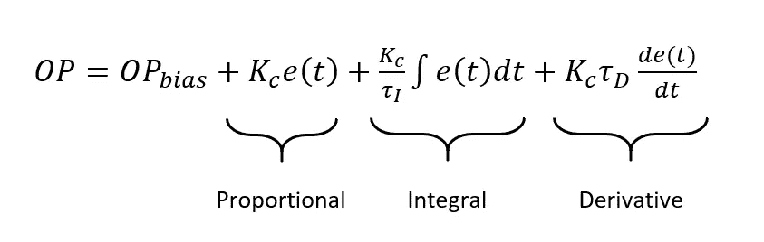
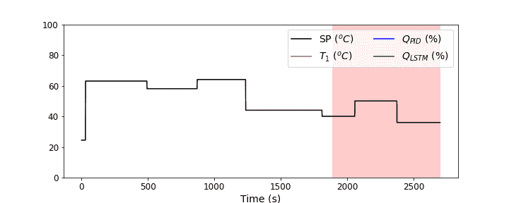
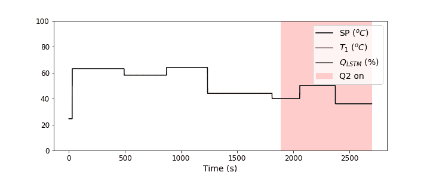

# 模拟具有长短期记忆的 PID 控制器:第 4 部分

> 原文：<https://towardsdatascience.com/emulating-a-pid-controller-with-long-short-term-memory-part-4-19ab327be61b?source=collection_archive---------33----------------------->

## 用 LSTM 控制器代替 PID 控制器进行温度控制的实际应用


照片由 [Unsplash](https://unsplash.com?utm_source=medium&utm_medium=referral) 上的 [Tasos Mansour](https://unsplash.com/@mantasos?utm_source=medium&utm_medium=referral) 拍摄

这是这个有趣项目的最后一部分！在这里，我们将看到使用 LSTM 来仿真 PID 控制器的一些实际应用，以及一些潜在的缺点。如果您还没有阅读本系列的前几篇文章，我强烈建议您回去看看，这样您就可以有一些背景知识了。当然，这个项目的巧妙之处在于，你可以在自己的[温度控制实验室](http://apmonitor.com/pdc/index.php/Main/ArduinoTemperatureControl)设备上运行所有的[代码](https://github.com/nrlewis929/TCLab_emulate_PID)，模拟你可能在真正的炼油厂或化工厂看到的东西。因此，这里有一个快速回顾这一系列，然后我们将开始！

1.  [使用温度控制实验室创建比例积分微分控制器数据](https://medium.com/@nrlewis929/emulating-a-pid-controller-with-long-short-term-memory-part-1-bb5b87165b08)
2.  [在 Keras 中训练长短期记忆神经网络，以模拟 PID 控制器](https://nrlewis929.medium.com/emulating-a-pid-controller-with-long-short-term-memory-part-2-4a37d32e5b47)
3.  [用 LSTM 控制温控实验室](/emulating-a-pid-controller-with-long-short-term-memory-part-3-23da7df3e033)
4.  用 LSTM 控制器代替 PID 控制器进行温度控制的实际应用(本文)

# 改变 PID 调节参数

如果您熟悉 PID 控制器，在问题设置期间，您可能想知道的第一件事是，如果您更改调整参数，会发生什么情况？回想一下 PID 控制器方程:



如果我们改变 K_c、τ_I 或τ_D，加热器输出也会改变，然后我们训练的 LSTM 不再与输出匹配。人们可能会认为这是一个巨大的缺点——如果我们改变 PID 控制器的调整参数，我们将不得不重新训练 LSTM 来模拟新的行为(回到[第 2 部分](/emulating-a-pid-controller-with-long-short-term-memory-part-2-4a37d32e5b47))。另一方面，我们可以利用这一点。一旦 PID 控制器被调整到一个系统，我们很少需要改变调整参数，因此 PID 行为的改变可能表明来自外部的恶意攻击(或潜在的内部攻击，如不满的员工)。

突然，我们有了一个现成的异常检测方法。我们可以像在[第 3 部分](/emulating-a-pid-controller-with-long-short-term-memory-part-3-23da7df3e033)中所做的那样进行检查，在那里我们运行 PID 之外的控制器，但是也检查 LSTM 输出以确保它们是相似的。如果不是，那么我们知道有什么东西使 PID 控制器出了问题，我们可以调查并修复它。

让我们来看看我们的设置，现在应该很熟悉了，但是有一些变化:

```
#### Set up run ##### Import model and model parameters
model = load_model('pid_emulate.h5')
model_params = pickle.load(open('model_params.pkl', 'rb'))s_x = model_params['Xscale']
s_y = model_params['yscale']
window = model_params['window']# Run time in minutes
run_time = 45.0# Number of cycles
loops = int(60.0*run_time)# arrays for storing data
T1 = np.zeros(loops) # measured T (degC)
Qpid = np.zeros(loops) # Heater values for PID controller
Qlstm = np.zeros(loops) # Heater values for LSTM controller
tm = np.zeros(loops) # Time
t_pid = np.zeros(loops) # Time to compute PID controller output
t_lstm = np.zeros(loops) # Time to compute LSTM controller output
Q2 = np.zeros(loops)# Time range to introduce anomaly (turn on heater 2, change PID tuning constants)
start_anom = int(0.7*loops)# Heater 2 turned on during anomaly window
Q2[start_anom:] = 80# Temperature set point (degC)
with tclab.TCLab() as lab:
    Tsp = np.ones(loops) * lab.T1# vary temperature setpoint
end = window + 15 # leave 1st window + 15 seconds of temp set point as room temp
while end <= start_anom: 
    start = end
    # keep new temp set point value for anywhere from 4 to 10 min
    end += random.randint(240,600) 
    Tsp[start:end] = random.randint(30,70)

while end <= loops: 
    start = end
    # keep new temp set point value for anywhere from 4 to 10 min
    end += random.randint(240,600) 
    Tsp[start:end] = random.randint(30,50)
```

像往常一样，我们导入我们的模型和附带的参数，设置运行时间，启动数组来存储数据，并创建一个设定点配置文件。还有几件事需要指出。我们有`t_pid`和`t_lstm`，稍后我们将使用它们来为控制器计时。我们有`start_anom`变量，我用它来表示数据的异常部分应该何时开始。注意，我还为 heater 2 ( `Q2`)设置了一个数组，稍后我们将使用它进行另一个测试。最后，在数据的异常部分，我将加热器的设定点保持在稍低的位置——它将在较高的温度下工作，但当温度保持较低时更容易看到。

我还对`pid(sp,pv,pv_last,ierr,dt)`函数进行了修改，因此它现在将调谐“常数”作为附加输入`(Kc,tauI,tauD)`。这将让我们在运行中途改变 PID 控制器输出。

最后，下面是我们运行模拟时的代码:

```
# Run test
with tclab.TCLab() as lab:
    # Find current T1, T2
    print('Temperature 1: {0:0.2f} °C'.format(lab.T1))
    print('Temperature 2: {0:0.2f} °C'.format(lab.T2)) # Integral error
    ierr = 0.0
    # Integral absolute error
    iae = 0.0 start_time = time.time()
    prev_time = start_time for i in tqdm(range(loops)):
        # Delay 1 second
        if time.time() > prev_time + 1.0:
            print('Exceeded cycle time')
        else:
            while time.time() < prev_time + 1.0:
                pass

        # Record time and change in time
        t = time.time()
        dt = t - prev_time
        prev_time = t
        tm[i] = t - start_time # Read temperature (C)
        T1[i] = lab.T1 # Integral absolute error
        iae += np.abs(Tsp[i]-T1[i]) # Perturb PID tuning parameter
        if i > start_anom:
            Kc, tauI, tauD = 3.0*Kc0, 0.5*tauI0, tauD0 + 2.0
        else:
            Kc, tauI, tauD = Kc0, tauI0, tauD0

        # Calculate PID output (and time)
        t0_pid = time.time()
        [Qpid[i],P,ierr,D] = pid(Tsp[i],T1[i],T1[i-1],ierr,dt,
                                 Kc=Kc,tauI=tauI,tauD=tauD)
        tf_pid = time.time() # Write heater output (0-100)
        lab.Q1(Qpid[i])

        # Run LSTM model to get Q1 value for control
        if i >= window:
            # Load data for model
            T1_m = T1[i-window:i]
            Tsp_m = Tsp[i-window:i]
            # Predict and store LSTM value for comparison
            t0_lstm = time.time()
            Qlstm[i] = lstm(T1_m,Tsp_m)
            tf_lstm = time.time()

        # Save controller times
        t_pid[i] = tf_pid - t0_pid
        t_lstm[i] = tf_lstm - t0_lstm
```

里面有很多，但从第三部看起来应该很熟悉。主要区别是当我们的时间计数超过我们的`start_anom`规格时，我们改变 PID 调节参数的行:`Kc, tauI, tauD = 3.0*Kc0, 0.5*tauI0, tauD0 + 2.0`。您还会注意到这里有一些时间记录，我们将在下一节中讨论。

运行后，我们可以绘制结果，并将其放入视频中进行可视化。让我们看看发生了什么！



正如我们在第 3 部分中看到的，LSTM 输出非常类似于 PID 输出，在瞬态时间范围内有明显的例外。正如所料，当 PID 调节参数改变时，这种情况会突然改变。你会注意到，由于 PID 控制器是实际写入输出的控制器，加热器输出也开始变得不稳定，温度开始波动得更大。

我们可以很容易地绘制出`Qpid`和`Qlstm`之间的误差，并使用它来检测异常行为。这种情况下有备份也很方便；如果我们注意到 PID 控制器开始表现异常，我们可以迅速将控制切换到 LSTM 控制器，只需将`lab.Q1(Qpid[i])`改为`lab.Q1(Qlstm[i])`。非常巧妙的是，最初可能被认为是缺点的东西实际上变得非常有用！

# 计算时间

如果你还记得，我们开始这个项目的主要原因是来自一篇[论文](https://www.sciencedirect.com/science/article/pii/S2405896318320597)讨论使用神经网络来模拟模型预测控制器，其想法是神经网络将比控制器更快。从上次我们计算 LSTM 和 PID 控制器的运行中，我们方便地节省了每个控制器所花费的时间。让我们看看结果如何:

```
print('LSTM:',t_lstm.mean())
print('PID:',t_pid.mean())>>> LSTM: 0.03118442685515792
PID: 2.043927157366717e-05
```

老实说，这正是我所期望的。PID 实际上比 LSTM 快得多，尽管 LSTM 控制器的计算时间仍不到 1 秒。使用 PID 控制器是有原因的，那是因为它们速度快，在解决一些控制问题时表现得相当好。但是，如果你有一个更复杂的控制器，假设模型输入和参数是相似的，我们可能期望 LSTM 控制器每次计算只需要几分之一秒。因此，虽然它实际上比 PID 控制器有时间上的优势，但仍然有一些用途(请查看 2020 年 11 月的一篇关于更复杂的控制器以及 LSTM 控制器在这种情况下如何有优势的额外文章)。

# 使用加热器 2 模拟额外的异常

最后，让我们再来看看如何使用 LSTM 控制器来检测其他类型的异常。我们将模拟炼油厂的环境条件不再标准的情况。也许这是良性的，如不同的天气，或者是恶意的，如针对工厂另一部分的网络攻击(甚至是这个特定的过程)。控制器的行为会有什么不同？

让我们通过打开加热器 2 一部分时间来模拟这一异常事件。虽然加热器 2 与加热器 1 上的传感器在物理上是分开的，但它仍然足够近，足以影响我们试图控制的加热器 1 周围的条件。我们的 LSTM 控制器是根据在标准室温下运行的一组特定数据进行训练的，所以如果我们打开加热器 2，就会出现 LSTM 控制器没有被训练来控制的情况。类似于改变 PID 调节参数的情况，这最初看起来像是使用 LSTM 控制器的失败。然而，如果我们的工厂有一个精心控制的周围环境，那么我们希望控制器表现一致；任何偏离都表明有异常情况发生。

这里看一下运行的代码(回想一下，我们已经在初始设置中指定了`Q2`参数)。

```
# Run test
with tclab.TCLab() as lab:
    # Find current T1, T2
    print('Temperature 1: {0:0.2f} °C'.format(lab.T1))
    print('Temperature 2: {0:0.2f} °C'.format(lab.T2)) start_time = time.time()
    t = start_time for i in tqdm(range(loops)):
        # Delay 1 second
        if time.time() > t + 1.0:
            print('Exceeded cycle time by ',time.time()-t-1.0)
        else:
            while time.time() < t + 1.0:
                pass # Record time and change in time
        t = time.time()
        tm[i] = t - start_time # Read temperature (C)
        T1[i] = lab.T1 # Run LSTM model to get Q1 value for control
        if i >= window:
            # Load data for model
            T1_m = T1[i-window:i]
            Tsp_m = Tsp[i-window:i]
            # Timer for LSTM controller output
            t0_lstm = time.time()
            # Predict and store LSTM value for comparison
            Qlstm[i] = lstm(T1_m,Tsp_m)
            tf_lstm = time.time() # Write heater output (0-100)
        lab.Q1(Qlstm[i])
        lab.Q2(Q2[i])
```

这一切现在看起来可能都很熟悉，只有最后两行是明显的例外:我们已经将控制权交给了 LSTM，并且我们还在中读取了 Q2 值。运行模拟后，我们可以再次绘制结果，并将其放入动画中。



很有意思。请注意，一旦我们打开 Q2，温度往往会超过设定值，控制器无法正确解释这种超调。这是因为控制器没有被训练去考虑来自附近加热器的额外热量。

这让我有了一个想法，但我想我会让你尝试一下，现在你知道如何设置 TCLab，训练一个 LSTM，并用它运行温度控制模拟。你能利用从本系列中学到的技巧来设置一个控制系统，打开两个加热器，并试图将两个温度控制在某个设定值吗？这将是多输入多输出(MIMO)控制器。为了找到正确的方向，请访问位于 APMonitor.com 的 MIMO 实验室。

# 最后的想法

这使我们得出了这个项目的结论。我们从一个基本的 PID 控制器开始，生成一些数据，使用这些数据训练一个自动 LSTM 来模拟 PID 控制器，将控制交给 LSTM，然后查看一些有用的应用，例如检测各种异常和潜在的计算时间节省。

你表现如何？你像我一样对这个项目感到兴奋吗？你还能想到这方面的其他应用吗？我很高兴听到对需要更多澄清的领域的建议。感谢您关注这个项目，我期待着未来的互动。如果你喜欢这个，请随时在 LinkedIn 上与我联系。