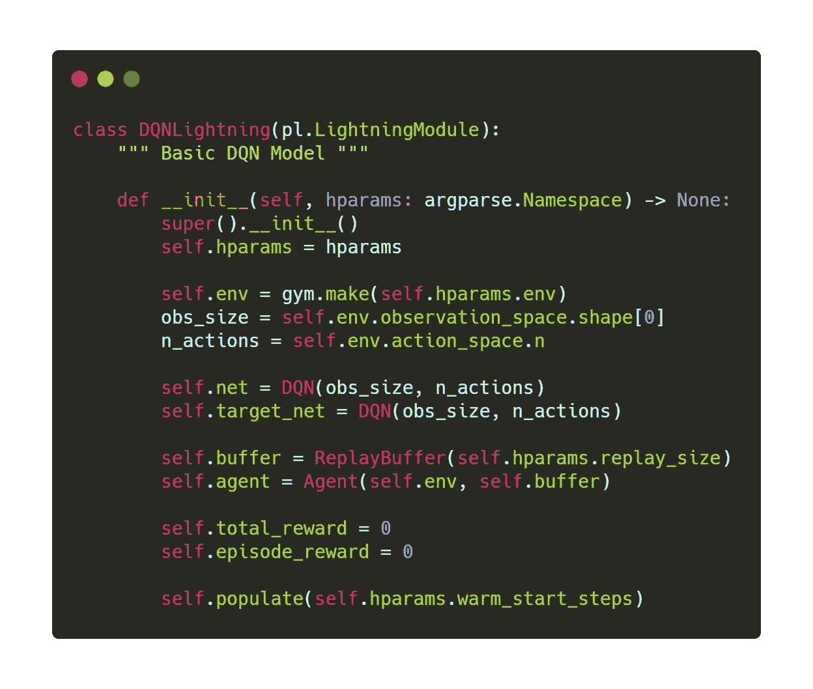
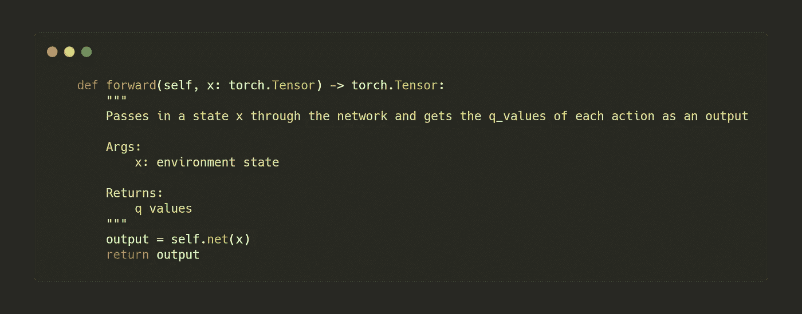
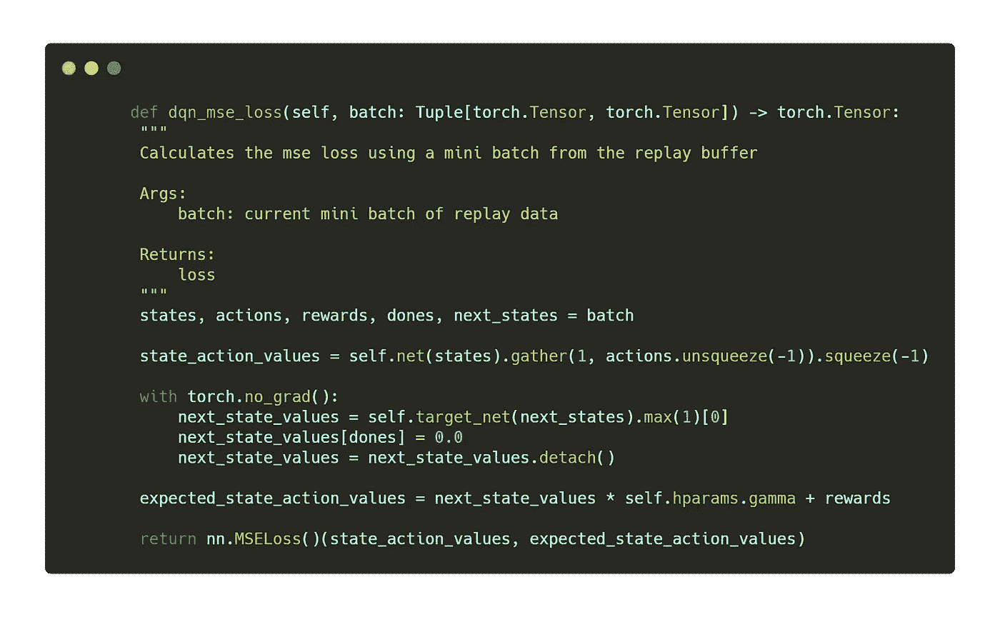
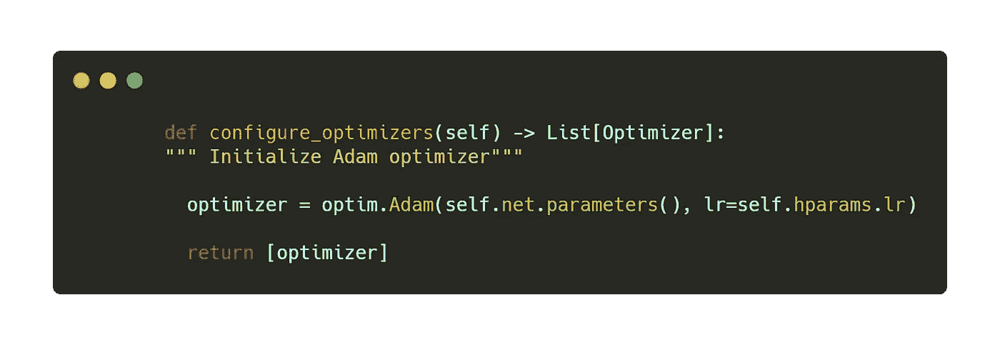
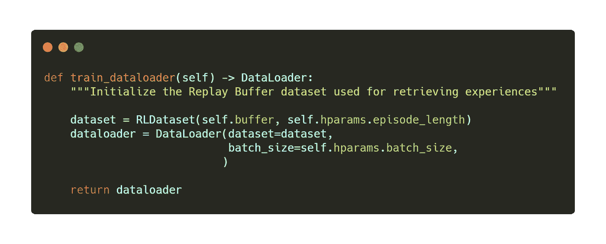
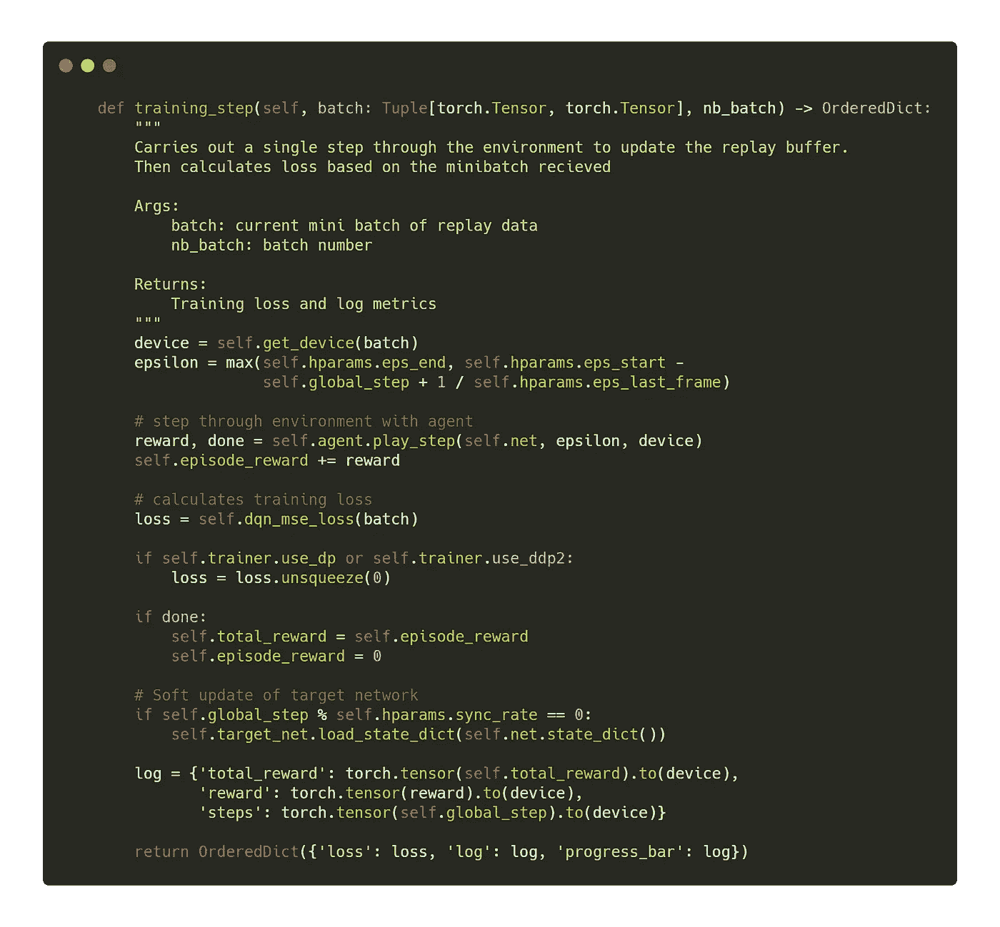
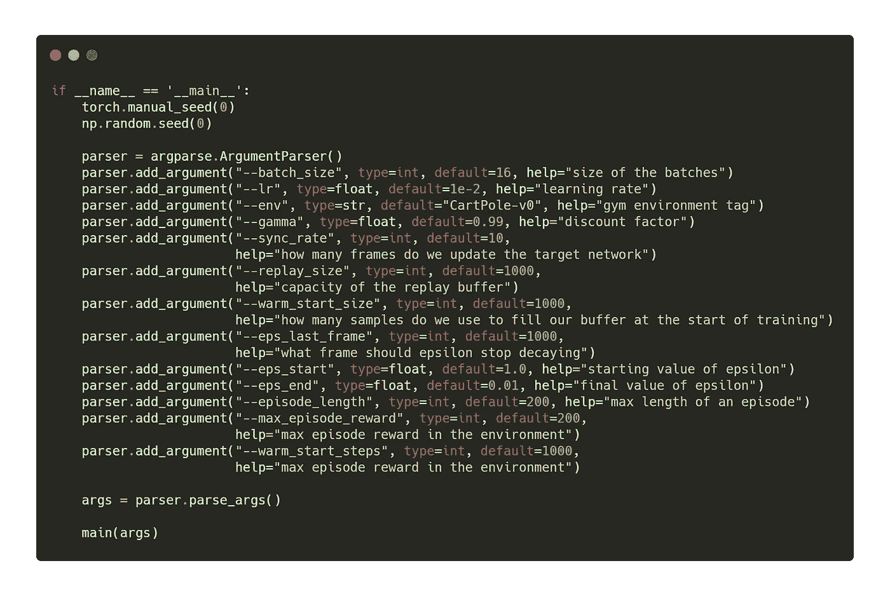
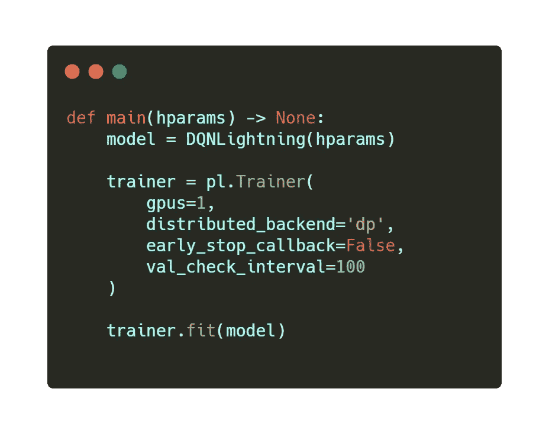
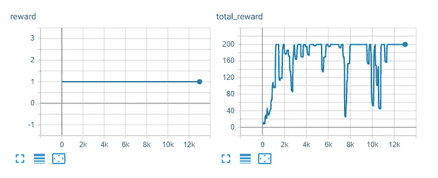

# 闪电强化学习

> 原文：<https://towardsdatascience.com/en-lightning-reinforcement-learning-a155c217c3de?source=collection_archive---------27----------------------->

## 用 PyTorch 闪电建造 DQN

本文着眼于将 PyTorch Lightning 用于强化学习(RL)这一激动人心的领域。在这里，我们将使用经典的 [CartPole](https://gym.openai.com/) gym 环境来构建一个标准的深度 Q 网络(DQN)模型，以说明如何开始使用 Lightning 来构建您的 RL 模型。

在本文中，我们将涵盖:

*   什么是闪电，为什么我们要在 RL 中使用它
*   标准 DQN 模型概述
*   利用闪电建造 DQN 的步骤
*   结果和结论

如果你想直接跳到代码，你可以在 PyTorch Lightning [示例页面](https://github.com/PyTorchLightning/pytorch-lightning/blob/master/pl_examples/domain_templates/reinforse_learn_Qnet.py)中找到示例，或者点击下面的 colab 图标查看交互式 colab 笔记本！

[](https://colab.research.google.com/drive/1F_RNcHzTfFuQf-LeKvSlud6x7jXYkG31#scrollTo=IKyaPbMhVU0E)

# 闪电是什么？

Lightning 是一个最新的 PyTorch 库，它干净地抽象和自动化了 ML 模型中所有的日常样板代码，允许您关注实际的 ML 部分(有趣的部分！) .如果你还没有看过，我强烈推荐你看看闪电团队发表的一些很棒的文章

[](/from-pytorch-to-pytorch-lightning-a-gentle-introduction-b371b7caaf09) [## 从 PyTorch 到 py torch Lightning——一个温和的介绍

### 这篇文章对使用 PyTorch 和 PyTorch Lightning 实现的 MNIST 进行了对比。

towardsdatascience.com](/from-pytorch-to-pytorch-lightning-a-gentle-introduction-b371b7caaf09) 

除了自动化样板代码之外，Lightning 还充当了一种风格指南，用于构建干净且可重复的 ML 系统。

这很有吸引力，原因如下:

1.  通过抽象出样板工程代码，识别和理解 ML 代码就容易多了。
2.  Lightning 的统一结构使得构建和理解现有项目变得容易。
3.  Lightning 自动化的代码是由经过全面测试、定期维护并遵循 ML 最佳实践的高质量代码构建的。

# DQN

在我们进入代码之前，让我们快速回顾一下 DQN 是做什么的。DQN 通过学习在特定状态下采取每个行动的价值来学习给定环境下的最佳策略。这些被称为 Q 值。

最初，代理对其环境的了解非常差，因为它没有太多的经验。因此，它的 Q 值将非常不准确。然而，随着时间的推移，代理探索它的环境，它学习更准确的 Q 值，然后可以做出好的决定。这允许它进一步改进，直到它最终收敛于一个最优策略(理想情况下)。

我们感兴趣的大多数环境，如现代视频游戏和模拟，都太复杂和太大，无法存储每个状态/动作对的值。这就是为什么我们使用深度神经网络来近似这些值。

代理的一般生命周期描述如下:

1.  代理获取环境的当前状态，并通过网络传递它。然后，网络输出给定状态下每个动作的 Q 值。
2.  接下来，我们决定是使用我们的代理认为网络给出的最佳动作，还是采取随机动作来探索更多。
3.  动作被传递给环境，我们得到反馈，告诉代理它处于下一个状态，在前一个状态中采取前一个动作的奖励，以及情节是否在该步骤结束
4.  我们以元组(状态、动作、奖励、下一个状态、完成)的形式获取在最后一步中获得的经验，并将其存储在代理存储器中。
5.  最后，我们从代理人的记忆中抽取一小批重放体验的样本，并使用这些过去的体验来计算代理人的损失

这是对 DQN 所做工作的高度概括。要了解更多信息，有很多关于这个流行模型的免费资源，比如 [PyTorch 示例](https://pytorch.org/tutorials/intermediate/reinforcement_q_learning.html)。如果你想了解更多关于强化学习的一般知识，我强烈推荐马克西姆·拉潘的最新著作[深度强化学习手把手第二版](https://www.amazon.com/Deep-Reinforcement-Learning-Hands-optimization/dp/1838826998)

# 点亮 DQN


启蒙时代是一场知识和哲学运动，主导了思想世界

让我们来看看组成 DQN 的各个部分

**模型:**用来近似我们的 Q 值的神经网络

**重放缓冲区:**这是我们代理的内存，用于存储以前的经历

**代理:**代理本身与环境和重放缓冲区进行交互

**闪电模块:**处理代理的所有培训

# 模型

对于这个例子，我们可以使用一个非常简单的多层感知器(MLP)。所有这一切意味着，我们没有使用任何像卷积或递归层，只是正常的线性层花式。这样做的原因是由于 CartPole 环境的简单性，任何比这更复杂的都是多余的。

# 重放缓冲器

重放缓冲区相当简单。我们需要的只是某种类型的数据结构来存储元组。我们需要能够对这些元组进行采样，并添加新的元组。这个缓冲区基于 Lapins replay buffer [在这里找到](https://github.com/PacktPublishing/Deep-Reinforcement-Learning-Hands-On-Second-Edition/blob/master/Chapter06/02_dqn_pong.py)，因为它是我迄今为止发现的最干净和最快的实现。看起来像这样

但是我们还没完。如果您以前使用过 Lightning，那么您会知道它的结构是基于这样一种思想:创建数据加载器，然后在后台使用它将小批量数据传递给每个训练步骤。对于大多数 ML 系统(如监督模型)来说，这是如何工作的是非常清楚的，但是当我们正在生成数据集时，它是如何工作的呢？

我们需要创建自己的 IterableDataset，它使用不断更新的重放缓冲区来采样以前的体验。然后，我们将小批经验传递给 training_step，用于计算我们的损失，就像任何其他模型一样。除了不包含输入和标签，我们的迷你批处理包含(状态、动作、奖励、下一个状态、完成)

您可以看到，在创建数据集时，我们传入 ReplayBuffer，然后可以对其进行采样，以允许数据加载器将批处理传递给 Lightning 模块。

# 代理人

代理类将处理与环境的交互。代理主要执行 3 种方法

**get_action:** 使用传递的ε值，代理决定是使用随机动作，还是采取网络输出中 Q 值最高的动作。

**play_step:** 在这里，代理通过从 get action 中选择的动作在环境中执行单个步骤。在从环境获得反馈之后，体验被存储在重放缓冲器中。如果环境完成了该步骤，环境将重置。最后，返回当前奖励和完成标志。

**重置:**重置环境并更新存储在代理中的当前状态。

# 闪电模块

现在，我们已经为 DQN 设置了核心课程，我们可以开始考虑培训 DQN 代理了。这就是闪电出现的地方。我们将通过构建一个 Lightning 模块，以一种清晰、结构化的方式设计我们所有的培训逻辑。

Lightning 提供了许多钩子和可覆盖的函数，允许最大的灵活性，但是我们必须实现 4 个关键方法来使我们的项目运行。那就是下面的。

1.  向前()
2.  配置优化器
3.  train_dataloader
4.  训练 _ 步骤

有了这 4 个方法，我们可以很好地训练我们将遇到的任何 ML 模型。除了这些方法之外，任何需要的东西都可以很好地适应 Lightning 中剩余的钩子和回调。要获得这些可用钩子的完整列表，请查看 Lightning [文档](https://pytorch-lightning.readthedocs.io/en/latest/)。现在，让我们看看填充我们的闪电方法。

## **初始化**

首先，我们需要初始化我们的环境、网络、代理和重放缓冲区。我们还调用了 populate 函数，它首先会用随机体验填充重放缓冲区(populate 函数在下面的完整代码示例中显示)。



## 向前

我们在这里所做的是包装我们的主要 DQN 网络的转发功能。



## 失败

在我们开始训练代理之前，我们需要定义我们的损失函数。这里使用的损失函数基于 Lapan 的实现，可以在这里找到[。](https://github.com/PacktPublishing/Deep-Reinforcement-Learning-Hands-On-Second-Edition/blob/master/Chapter06/02_dqn_pong.py)

这是将我们的 DQN 网络的当前状态动作值与下一个状态的预期状态动作值进行比较的简单均方误差(MSE)损失。在 RL 我们没有完美的标签可以借鉴。相反，代理从目标值中学习它期望下一个状态的值是什么。

然而，通过使用相同的网络来预测当前状态的值和下一个状态的值，结果变成了不稳定的移动目标。为了解决这个问题，我们使用一个目标网络。该网络是主网络的副本，并定期与主网络同步。这提供了一个暂时固定的目标，以允许代理计算更稳定的损失函数。



如您所见，状态动作值是使用主网络计算的，而下一个状态值(相当于我们的目标/标签)使用目标网络。

## 配置优化器的

这是另一个简单的附加功能，只需告诉 Lightning 在 backprop 期间将使用什么优化器。我们将使用标准的 Adam 优化器。



## 列车数据加载器

接下来，我们需要向 Lightning 提供我们的训练数据加载器。如您所料，我们初始化了之前创建的 IterableDataset。然后像往常一样将它传递给数据加载器。Lightning 将在训练期间提供批次，并将这些批次转换为 PyTorch 张量，并将其移动到正确的设备。



## 训练步骤

最后，我们有培训步骤。在这里，我们放入了每个训练迭代要执行的所有逻辑。

在每次训练迭代中，我们希望代理通过调用前面定义的 agent.play_step()并传入当前设备和 epsilon 值来遍历环境。这将返回该步骤的奖励以及该集是否在该步骤结束。我们将阶梯奖励添加到总剧集中，以便跟踪该代理在该剧集中的成功程度。

接下来，使用闪电提供的当前迷你批，我们计算我们的损失。

如果我们已经到达一集的结尾，由 done 标志表示，我们将使用剧集奖励更新当前的 total_reward 变量。

在该步骤结束时，我们检查是否到了同步主网络和目标网络的时间。通常使用软更新，其中仅更新一部分权重，但是对于这个简单的例子，进行完全更新就足够了。

最后，我们需要返回一个包含 Lightning 将用于反向传播的损失的字典，一个包含我们想要记录的值的字典(注意:这些必须是张量)和另一个包含我们想要在进度条上显示的任何值的字典。



差不多就是这样了！我们现在有了经营 DQN 代理商所需的一切。

# 运行代理

现在剩下要做的就是初始化并适应我们的 Lightning 模型。在我们的主 python 文件中，我们将设置种子，并提供一个 arg 解析器，其中包含我们希望传递给模型的任何必要的超参数。



然后在我们的 main 方法中，我们用我们指定的参数初始化 DQNLightning 模型。接下来是闪电训练器的设置。

这里我们设置训练器使用 GPU。如果您无法访问 GPU，请从 Trainer 中删除“GPU”和“distributed_backend”参数。这个模型训练非常快，即使使用 CPU，所以为了看到闪电在行动中，我们将关闭早期停止。

最后，因为我们使用的是 IterableDataset，所以需要指定 val_check_interval。通常，此间隔是根据数据集的长度自动设置的。但是，IterableDatasets 没有 __len__ 函数。因此，我们需要自己设置这个值，即使我们没有执行验证步骤。



最后一步是在我们的模型上调用 trainer.fit()并观察它训练。下面你可以看到完整的闪电代码

# 结果

大约 1200 步后，您应该看到代理的总奖励达到最高分 200。为了看到被绘制的奖励度量，旋转 tensorboards。

```
tensorboard --logdir lightning_logs
```



在左边你可以看到每一步的回报。由于环境的性质，这将始终是 1，因为代理人获得+1 的每一步，杆没有下降(这是他们所有的)。在右边，我们可以看到每集的总奖励。代理人很快达到最大回报，然后在很棒的剧集和不太棒的剧集之间波动。

# 结论

现在，您已经看到了在强化学习项目中利用 PyTorch Lightning 的力量是多么简单和实用。

这是一个非常简单的例子，只是为了说明闪电在 RL 中的使用，所以这里有很大的改进空间。如果你想把这段代码作为模板，试着实现你自己的代理，这里有一些我会尝试的东西。

1.  降低学习率，或者更好的是，通过在 configure_optimizer 方法中初始化学习率调度器来使用它。
2.  提高目标网络的同步速率，或者使用软更新而不是完全更新
3.  在更多步骤的过程中使用更平缓的ε衰减。
4.  通过在训练器中设置 max_epochs 来增加训练次数。
5.  除了在 tensorboard 日志中跟踪总奖励外，还可以跟踪平均总奖励。
6.  使用 test/val Lightning hook 添加测试和验证步骤
7.  最后，尝试一些更复杂的模型和环境

我希望这篇文章是有帮助的，将有助于启动您自己的项目与闪电。编码快乐！