# 在零售银行中实现数据和人工智能:客户分析

> 原文：<https://towardsdatascience.com/enabling-data-ai-in-retail-banking-part-1-customer-analytics-journey-54a7ce7d2a81?source=collection_archive---------13----------------------->

## **客户分析路线图，利用数据驱动的用例来增强客户个性化&体验**

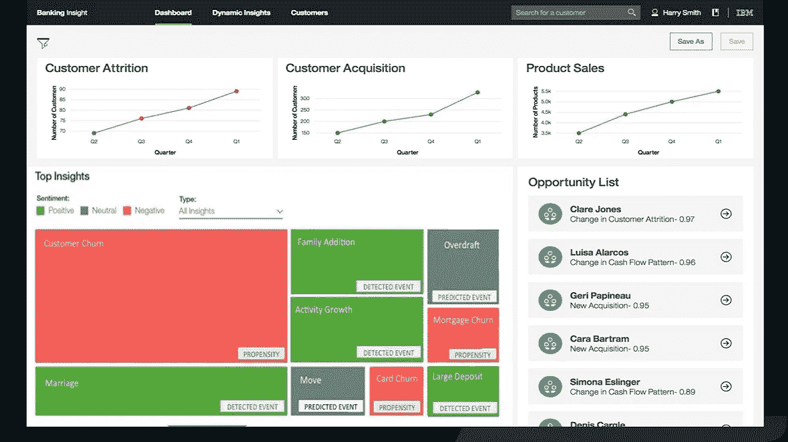

在当今互联的数字世界中，银行和金融服务提供商面临着满足并超越客户期望的挑战。金融机构必须专注于与客户互动，以保持竞争力和相关性。数据科学解决方案帮助金融机构实现数字化转型，重新定义客户关系。客户洞察提供关于客户的深刻知识，以优化与客户的每次互动。

客户往往会更快地对个性化和实时服务做出响应，这是一个重要的因素，为那些采用传统供应商的数据和人工智能驱动能力的银行带来了差异化优势，这些供应商往往会适应更好的个人偏好，甚至利用拥有高度客户信任和理解的金融中介。这类玩家吸引消费者的部分原因是他们能够为活跃客户群中的某些部分定制产品。

# 银行业采用数据科学的水平仍然很低

> 由于不断变化的客户行为、激烈的竞争、更严格的法规和数字差异，银行在保持盈利能力方面面临着诸多挑战

# **在人工智能时代采用新的银行模式**

Wipro 在**进行的一项调查显示，人工智能为何是银行业的未来，因为它为客户体验、欺诈管理和运营带来了先进的数据分析能力。人工智能算法在几秒钟内完成反洗钱活动，否则需要几个小时甚至几天。人工智能还使银行能够以创纪录的速度管理海量数据，从中获得有价值的见解。人工智能机器人、数字支付顾问和生物识别欺诈检测机制等功能可以为更广泛的客户群提供更高质量的服务。所有这些都转化为收入增加、成本降低和利润增加。**

AI 正在通过以下方式加强银行在客户个性化领域的竞争力:

增强的客户体验:基于过去的互动，人工智能对客户及其行为有了更好的理解。这使得银行能够通过添加个性化功能和直观的交互来定制金融产品和服务，以提供有意义的客户参与并与其客户建立牢固的关系。

**预测客户行为和反应:**人工智能通过分析过去的行为来预测未来的情景，帮助银行预测未来的结果和趋势。这有助于银行识别欺诈、检测反洗钱模式并向客户提出建议。同样，人工智能能够在海量数据中检测可疑的数据模式，以进行欺诈管理。此外，通过其关键的推荐引擎，AI 研究过去以预测数据点的未来行为，这有助于银行成功地进行追加销售和交叉销售。

**有效的决策**:像人类专家一样思考和反应的认知系统，根据可用数据实时提供最佳解决方案。这些系统在其称为知识库的数据库中保存了专家信息。银行家利用这些认知系统做出战略决策。

# 人工智能技术释放银行业数据的力量

传统的金融服务商业模式正处于显微镜下。对于许多金融机构来说，在当今的低利率环境下，持续盈利是一个挑战。来自新市场进入者的竞争也产生了新的破坏层，而客户体验和参与度却跟不上精通数字技术的消费者不断增长的期望。

许多金融机构已经采取了裁员和战术性成本削减措施。然而，可持续的绩效需要战略的转变——一种由新技术增强的战略。

数字时代的成功要求银行挖掘他们已经拥有的大量隐藏财富:数据。认知系统和人工智能技术可以帮助银行释放数据的力量，揭示关于企业、客户和竞争对手的见解。认知系统不断地构建知识和学习，理解自然语言，比传统的可编程系统更自然地与人类进行推理和交互。

# 客户 360:了解客户 DNA

全方位了解客户活动的各个方面以及与银行的合作将有助于实现全面的方法。下图提供了一些应该纳入的关键数据域。

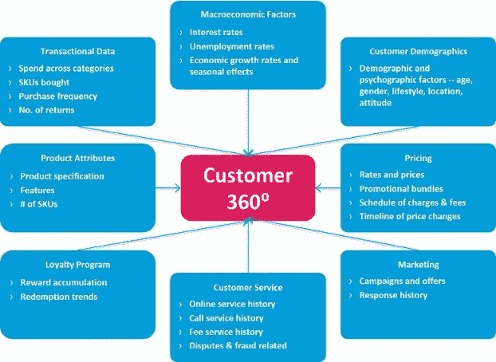

数据集市构建 360 度客户分析视图来源:Shamli Prakash

以可扩展、分阶段的方式构建这一客户 360°数据集市是许多客户分析用例的基础，如倾向建模、交叉销售/追加销售建议、客户终身价值等。customer 360 方法整合了所有客户数据领域，包括人口统计信息、交易数据、产品所有权、客户互动、客户服务、活动响应、定价和宏观经济数据。

特征工程是使用数据的领域知识来创建使机器学习算法工作的特征的过程。它在定义和创建捕捉客户行为的数据元素方面起着关键作用。为此，额外的特征被创建为这些数据域的组合(例如，滚动月平均值、虚拟变量等)。)

# IBM 数据和人工智能路线图——客户分析阶梯

银行意识到，在当今市场中保持竞争力的关键步骤之一是通过与客户建立高质量、个性化的关系来提高参与度。

这个想法是分析客户体验，并根据客户的兴趣和偏好进行个性化。人工智能在理解客户行为模式方面取得了重大进展，将客户个性化带到了一个全新的水平。

数据科学家还可以建立模型，研究客户的行为，发现客户需要财务建议的情况。预测分析工具和高级数字交付选项的结合有助于完成这项复杂的任务，在最合适的时间引导客户找到最佳的金融解决方案，并根据消费习惯、社会人口趋势、相关需求和其他偏好建议个性化的产品。

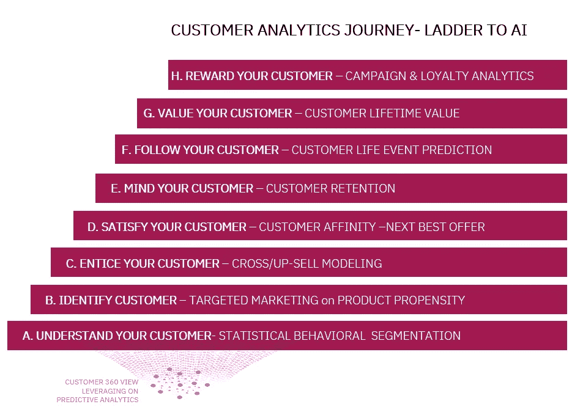

客户分析之旅-个性化策略

在下一节中，概述了在整个成熟生命周期中利用数据分析的结构化客户互动之旅，从使用动态细分技术了解客户行为的基础开始，到在整个生命周期中跟踪客户，并通过个性化的活动和促销奖励他。

**a .了解你的客户:行为细分**

客户细分是根据共同特征将客户分成不同群体的过程，这样公司就可以有效而恰当地向每个群体进行营销。细分(如行为细分)或特定特征(如人口统计)有不同的变化。
客户细分旨在改善客户服务，提高客户忠诚度，留住客户，这对银行业来说非常必要。

市场细分使得营销人员能够通过了解同质特征来更有效地定制他们的营销工作，以锁定目标客户。这些工作可能涉及到沟通和产品开发。具体来说，细分有助于零售银行:

1.  客户特征分析，以便我们能够专注于最高价值、最活跃、最懂数字的客户。
2.  创建并传达有针对性的营销信息，这些信息将引起特定客户群体的共鸣，但不会引起其他人的共鸣(相反，其他人将收到根据他们的需求和兴趣定制的信息)。
3.  根据细分市场选择最佳沟通渠道，可能是电子邮件、社交媒体帖子、广播广告或其他方式。
4.  确定改进产品或新产品或服务机会的方法。
5.  通过剖析见解建立更好的客户关系。
6.  改善客户服务，根据细分结果提供个性化服务和产品。
7.  追加销售和交叉销售其他产品和服务。

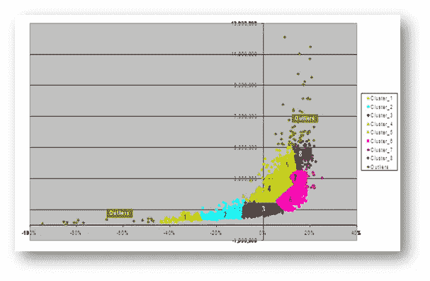

行为细分解决方案-统计聚类

**b .确定你的客户:目标产品营销**

的关键是提供适合特定客户需求和偏好的个性化服务。数据分析使我们能够创建个性化营销，在正确的时间通过正确的设备向正确的人提供正确的产品。数据挖掘广泛用于目标选择，以识别新产品的潜在客户。

数据科学家利用行为、人口统计、历史交易和产品所有权数据来构建倾向模型，预测客户对促销或优惠做出反应的概率。因此，银行可以进行高效、个性化的拓展，改善与客户的关系。

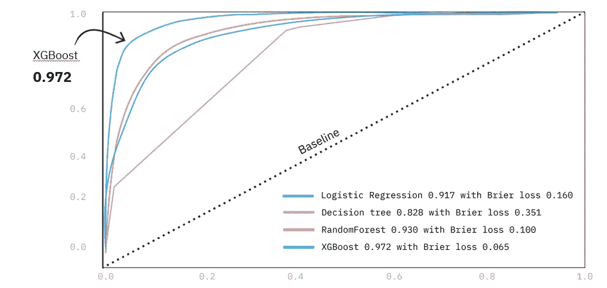

目标营销的模型评估比较:倾向建模来源:IBM

**c .吸引客户:交叉销售/追加销售模式**

**交叉销售或追加销售**模型是二进制概率算法，用于识别那些最有可能对报价做出反应的客户，或专注于保留活动的客户。基于现有的统计客户细分，可以在同类细分中开发倾向模型，以测量对特定产品活动(例如新的信用卡活动)的反应倾向

该模型可以应用于特定的客户群，并且客户可以利用输出以及活动资格标准来导出新的定制活动策略。倾向模型的主要优势在于，考虑到营销活动和采购成本，它们可以洞察更合适的客户群，并提高相对于基线随机目标的产品转化率(提升)

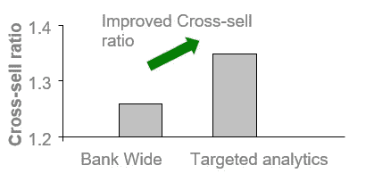

来自目标交叉销售分析的增量收入来源:IBM

**d .让客户满意:下一个最佳行动**

**客户优惠亲和力**(也称为下一个最佳行动)是一种预测分析形式，有助于营销人员及其组织更好地判断客户产品亲和力和交易行为，并引导营销工作与客户建立联系以达成交易。

当公司利用实时营销工具时，次佳报价是最成功的。公司需要了解最新的客户行为、需求和趋势，以便将“最佳”放在下一个最佳报价中。下一个最好的提议是“为客户增加最多价值的提议——以他们整体预期的客户终身价值的增加来衡量。”

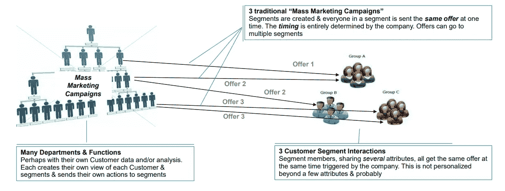

由次优产品战略推动的营销活动来源:IBM

在当今互联的数字世界中，银行和金融服务提供商面临着满足并超越客户期望的挑战。金融机构必须专注于与客户互动，以保持竞争力。

**e .关注你的客户:留住客户**

当客户结束与企业的关系时，客户流失是决定企业收入的最基本因素之一。我们需要知道你的哪些客户是忠诚的，哪些客户有流失的风险，你需要从客户的角度了解影响这些决策的因素。留住最赚钱的客户可能是企业的最佳策略之一。

虽然保留现有客户并因此增加他们的终身价值是每个人都承认的重要事情，但当银行一开始没有看到客户流失时，他们对客户流失几乎无能为力。这就是在正确的时间预测客户流失变得重要的地方，尤其是当没有明确的客户反馈时。早期和准确的客户流失预测使 CRM 和客户体验团队在与客户接触时更具创造性和主动性。

下面的 SPSS Modeler 界面解释了如何建立一个机器学习模型，并使用它来预测客户是否有流失的风险。这是一个完整的数据科学项目，您可以将您的模型发现用于以后的规范性分析或有针对性的营销。

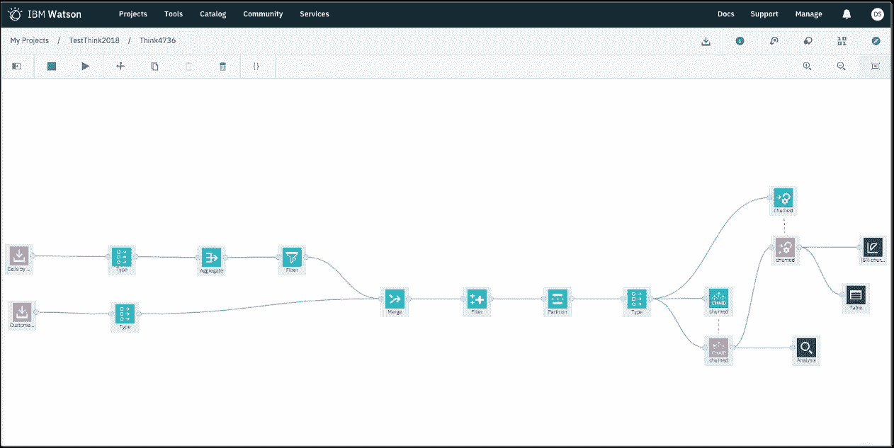

使用 SPSS Modeler Flow 的客户流失预测模型

提取有意义的预测洞察的关键是尽可能准确地定义问题陈述构建块。在客户流失的情况下，首先要定义什么被认为是“流失事件”。

一般来说，客户流失是指在给定时间内观察到的客户不活跃或不参与的程度。这在数据中以各种形式表现出来，例如账户行为的新近性或账户余额的变化。例如，在 HNW(高净值)客户的情况下，根据特定时期的资产下降率来定义客户流失是有用的。

可能有这样一种情况，客户在账户操作方面可能非常活跃，但在过去六个月中实际上已经提取了超过 50%的资产。

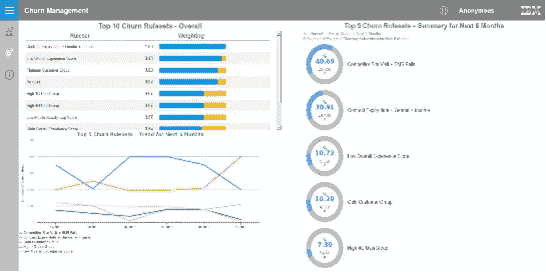

识别流失事件关键模型导向的流失倾向仪表板

确定客户流失是在产品层面(客户可能会放弃某一特定产品，如停止使用信用卡)还是在关系层面(客户可能会放弃银行本身)进行定义是至关重要的。当在关系级别分析数据时，您可以更好地理解客户的观点。例如，从一个人的储蓄账户中提取过多的钱可能是购买房子的首付或支付大学学费。这种对客户生活事件的洞察非常有力，不仅可以防止客户流失，还可以交叉销售补充产品，从而进一步加强关系。

**f .跟随你的客户:生活事件预测**

金融服务提供商可以利用客户数据，包括人口统计、行为和营销数据，以及细粒度的交易数据，来预测例如四种不同的客户生活事件:搬迁、Sudies、婚姻、孩子出生、新关系和关系结束。

结果表明，衍生的客户生活事件模型对生活事件的预测明显优于随机猜测，尤其是在结合细粒度交易和聚合数据的情况下。与基于生活事件预测和分类的模型相比，纳入定义明确的交易数据的新近性、频率和货币(RFM)价值信息也显著提高了性能。

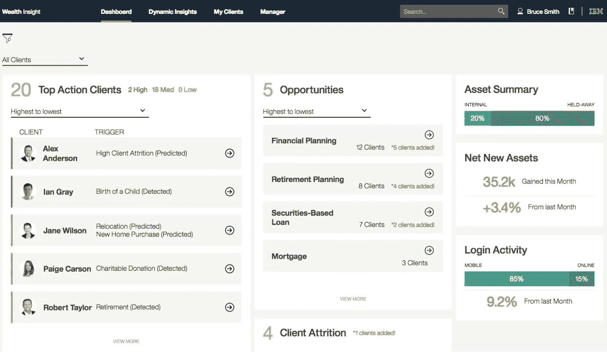

生活事件预测分析仪表板来源:IBM 数据科学精英

**g .重视你的客户:终生价值**

**客户终身价值** e (CLTV)是“客户产生的未来利润的贴现值”，然而，许多 CLTV 模型的重点是在收入方面。这是因为收入比成本更难预测，所以更需要一个模型来预测它(并且知道一个客户将产生的收入可以告知你在该客户身上的花费)。这些类型的模型通常被称为“客户资产模型”。

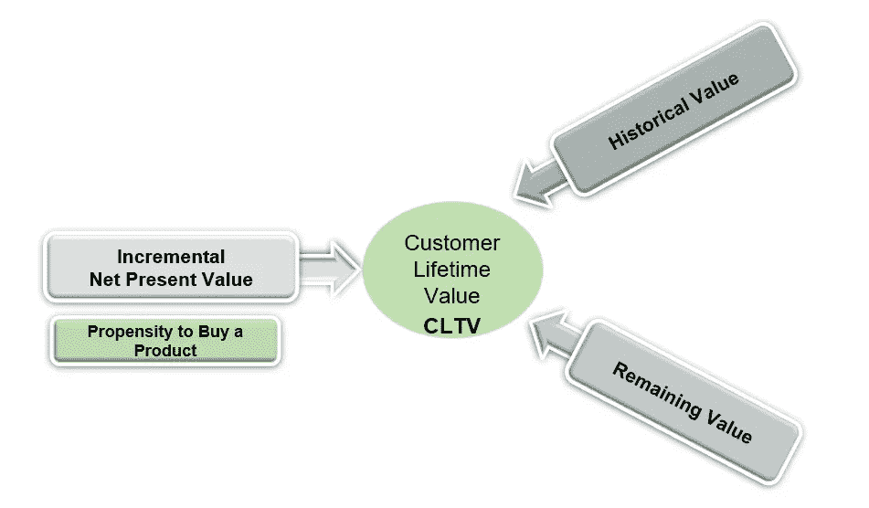

CLTV 可以分解成不同的顾客价值组成部分

。在这个框架中，CLTV 模型通常限制了表征客户行为的三个潜在(未观察到的)参数:

*   寿命:客户与公司保持关系的时期
*   **购买率:**该参数对应于客户在给定时间内的购买次数
*   **货币价值:**模型的这一部分涉及为每个未来交易分配一个货币单位

在非合同环境中，这些参数是不可观察的。概率模型将帮助我们在客户层面约束这些参数，并对未来的购买和价值做出推断。

**h .奖励你的客户:活动&忠诚度分析**

事实是，分析一直是银行忠诚度和奖励计划战略的重要组成部分，银行可以为每个客户建立档案计划，确定哪些客户是有利可图的，了解哪些激励方法最有可能对每个客户成功，然后量身定制相关计划。

文章称，建立在“智能和反应灵敏的技术平台”上的忠诚度和回报分析为银行提供了 360 度的客户视图，提供了见解，使他们能够不断微调这些计划，使它们更具相关性，对特定客户更具吸引力。

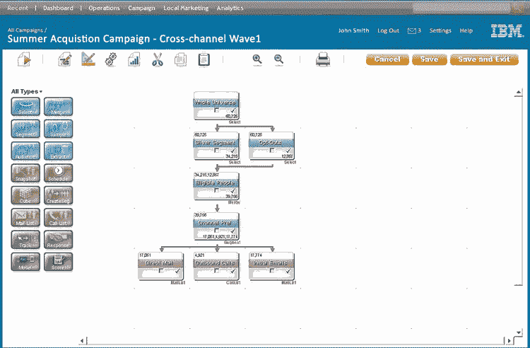

活动分析利用 Unica 环境中的交叉销售倾向模型来源:IBM

通过使用分析在正确的地点和时间生成所有必要的洞察，银行可以创建符合其客户群多样性和特征的奖励计划。

然而，银行要做的不仅仅是为客户选择正确的内容和奖励，它还必须确保这些客户无论何时、何地、通过他们选择的任何设备参与和进行交易。参与的关键是定期和定制的客户沟通，这可以带来更成功和更有利可图的关系。

更精确的细分，提供个人优惠，并通过高级营销分析创建有针对性的电子邮件活动。这加快了上市时间，提高了响应率，并提高了营销支出的回报。

# **沃森银行客户分析**

**IBM Watson Customer Insight for Banking**使用结合预测和认知能力的高级预建行业特定分析模型。该解决方案支持动态行为细分，以发现可操作的客户洞察，使银行能够创建个性化的销售产品和营销活动。该解决方案提供了直观的用户界面和专为业务线用户设计的特定于角色的控制面板。

沃森客户洞察使银行能够通过客户分析更好地洞察客户需求来源:IBM

1.  基于客户行为的动态细分
2.  通过根据每个客户的行为确定他们的参与度，确定购买或交叉销售/追加销售的倾向。
3.  预测客户生活事件:为您的客户预测潜在的生活事件，以提供主动的个性化体验
4.  通过预测流失风险，提高留住利润最高的客户的能力。
5.  识别高利润客户，以留住、营销和开发新产品。

**IBM Acoustic Analytics(前身为沃森 CX 分析公司)**根据对各接触点客户的洞察，帮助您做出更明智、更快速的营销和客户体验决策。声学旅程分析让您能够可视化您的客户通过设备、渠道和接触点与您的品牌互动的旅程。

Journey Analytics 提供了各个层面的见解，从公司范围的汇总一直到单个用户的体验。它有助于您从整体上了解客户旅程，而不必使用单独的工具来检查渠道和会话数据。您从分析中获得的知识可以帮助您改善业务成果，推动转化，并提供一致和令人满意的客户体验。

Journey Analytics 中基于角色的仪表板可以轻松直观地识别重要趋势，然后更深入地挖掘客户行为的原因。您还可以确定客户的问题所在，然后重放单个客户会议，以了解问题的确切根源。

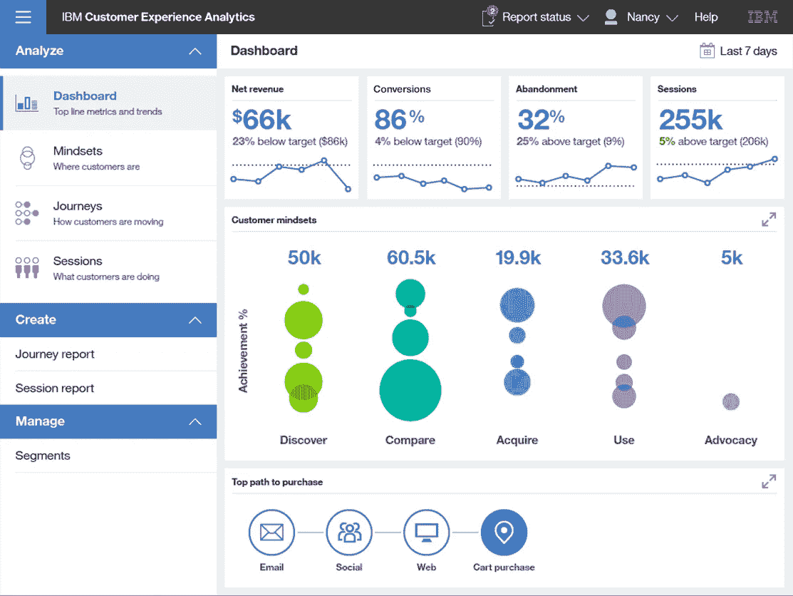

IBM Watson 客户体验分析仪表板来源:IBM

***免责声明:*** *此处表达的部分观点仅代表本文作者的观点，不一定代表 IBM 公司的观点。博客上的部分内容是版权所有，除非在 IBM Corporation 下另有说明，否则保留所有权利。*