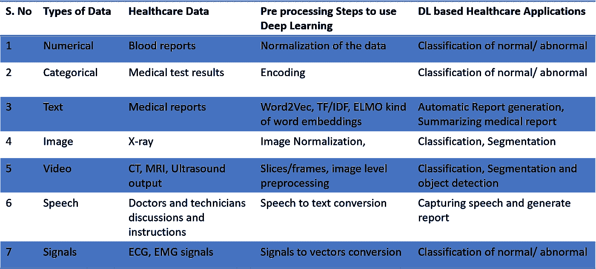
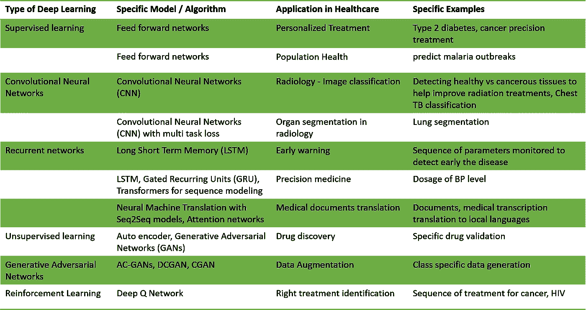
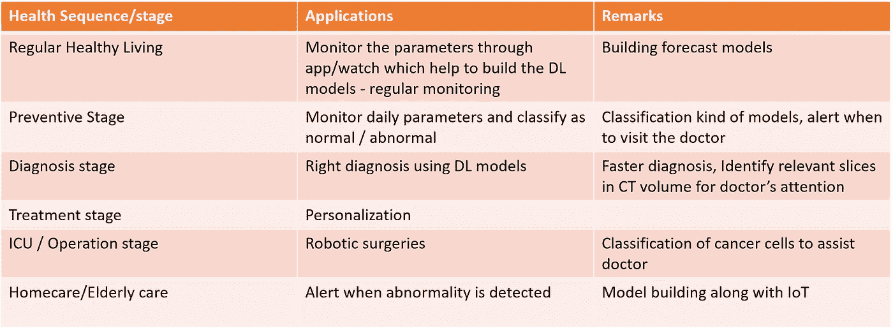

# 支持各种类型的医疗保健数据来构建 10 大 DL 应用

> 原文：<https://towardsdatascience.com/enabling-various-types-of-healthcare-data-to-build-top-10-dl-applications-f5c6f45eddba?source=collection_archive---------41----------------------->

## 探索医疗保健中的 7 种数据类型、深度学习技术和顶级应用，以应用深度学习

尽管医疗保健行业价值**【1】8 万亿美元，但只有 20%的人能够获得**高质量的医疗保健。世界人口正在老龄化。迫切需要基于价值的医疗保健[2]。医疗保健行业正朝着**数据驱动的方式发展。**如今，个人健康和人口医疗保健数据的数量正在快速增长。医疗保健行业存在资源和准入限制。一方面，病理学家、放射科医生和其他临床医生短缺，另一方面，手术和疾病(如癌症)的数量在增加。解决这个问题的唯一方法是通过技术。****

**在这篇文章中，重点是:**

> **有哪些不同类型的医疗保健数据**
> 
> **哪种深度学习(DL)技术用于医疗保健和**
> 
> **我们如何利用这些数据和技术来构建医疗保健领域的 10 大应用**

**让我们从**不同类型的数据**开始，我们使用这些数据来建立真实世界的机器学习/深度学习模型。深度学习是机器学习的一个子集。深度学习不需要以提供更多数据来建立模型为代价来手工制作特征。**

**有 7 种类型的数据即， ***数值、分类、文本、图像、视频、语音和信号*** 不考虑领域来构建深度学习模型。表 1 总结了来自医疗保健领域的不同数据类型。根据数据类型，预处理步骤可能会有所不同。然后，我们总结了每种类型的医疗数据基于深度学习的医疗应用。**

****

**表 1:数据和医疗保健应用的类型**

**接下来，我总结了各种类型的深度学习技术，以及我们如何在医疗保健应用中使用这些技术，并在表 2 中给出了具体示例。这些技术包括简单的前馈网络、卷积神经网络(CNN)到递归神经网络(RNN)以及最新的注意力网络。**

****

**表 2:深度学习技术的类型和在医疗保健中的应用**

**寻找深度学习在医疗保健中的应用的另一个维度是基于医疗保健系统的各个阶段，如表 3 所示。预防胜于治疗。DL 在医疗保健系统的早期和晚期都起着重要的作用[3]。**

****

**表 3:健康序列和深度学习应用**

**在这种背景下，让我们使用前面描述的各种类型的数据来研究医疗保健领域的 10 大深度学习应用:**

1.  ****医学影像:****

*   **卷积神经网络( **CNN** ) 2D/3D 在医学成像中发挥着重要作用[4]**
*   **我们利用 CNN 的进展来阐述医学成像中的分类、对象检测和分割类问题**
*   **这涉及到对大量图像的处理，提炼其对信息的理解和解释**
*   *****迁移学习*** 来自 AlexNet，GoogleNet 帮助构建了很多图像分类问题**
*   **DL 模型被移植到计算机断层摄影(CT)、磁共振成像(MRI)盒中，以识别重建图像 的 ***质量，并检查任何问题，例如运动检测*****
*   **实时图像重建—可以更好地重建 CT 中的图像。这可以减少患者的辐射暴露。**

**2.**更快的诊断:****

*   **分析医学图像/数据通常是一项困难且耗时的任务**
*   **GPU 加速 ***DL 自动分析*** 并提高诊断人员的准确性**
*   **DL 帮助医生 ***更好地分析疾病*** 并为患者提供最好的治疗**
*   **可以充当**第二**客观意见**

**3.**早期检测/预警:****

*   **DL 模型是通过访问来自各种设备(如移动应用程序、手表和观察模式)的连续数据而构建的**
*   **疾病可以在更早的时候 检测出来，例如在定期健康检查期间(可以在疾病发展之前采取纠正措施)**
*   **尽早发现症状，并根据需要建议去看医生/进行诊断测试，而不是定期检查**

**4.**提高效率@放射科:****

*   **放射科医生可以花更多的时间与患者在一起，而不是医疗报告，包括远程放射学**

*   *******工作流程*** ***改进*** 以放射学为服务****
*   ****没有因疲劳或其他原因造成的误诊****

****5.**个性化治疗:******

*   ****每个人的健康建议和疾病治疗都是根据他们的 ***病史*** 、过去的状况、饮食、压力水平&类似患者量身定制的****
*   *******根据一个人的病史优化治疗方案*******

****6.**基因组学——精准医学:******

*   ****了解基因组并帮助患者了解可能影响他们的疾病****
*   *******遗传因素*** 喜欢突变导致疾病****
*   ****大量的计算工作，但活跃的研究领域可以改变未来药物的使用方式[5，6]****

****7.**药物发现:******

*   ****更快地关联、吸收和连接现有数据，以帮助 ***发现数据池中的模式*******
*   ****加快临床试验研究。药物发现可能需要长达 10 年的时间，而使用 DL 和 ML 方法可以大大缩短时间。[7]****
*   *******多样化的数据集*** 避免不平衡数据带来的偏差。我们可以使用最新的技术，如生成对抗网络(GAN)来处理数据中的不平衡[8]****

****8.**机器人手术:******

*   ****我们知道外科手术中精确的重要性，比如癌症治疗****
*   ****DL 模型有助于外科医生获得更精确的细节[9]****

****9.**人群健康:******

*   ****基于 ***人口数据趋势*** 汇集的消费者数据建立模型****
*   ****我们可以与政府合作，收集大规模的数据，并建立基于数字图书馆的模型****

****10.**信息提取:******

*   ****从使用自然语言处理(NLP)的临床笔记到 ***匿名化、标注再到做语义分析和推理*******
*   ****使用图像字幕技术生成报告****
*   ****使用提取的信息构建多模态聊天机器人****

****接下来，让我们看看实施这些顶级 DL 应用程序所面临的挑战，并讨论未来的范围。****

# ****挑战:****

****我们听到的一个常见问题是“深度学习有效，但仍被视为黑盒 ***”。*** 即它是如何以及为什么工作的？这对数据科学家和临床医生都很重要。可解释人工智能(XAI)的最新发展有助于建立对深度学习模型产生的结果的信任。我计划发表另一篇关于 XAI 的文章，所以不在这里讨论这些话题。****

****深度学习处于采用周期的早期阶段，然而，技术的**成熟度**并不是采用的唯一因素。我们需要建立对技术的信任，应该能够重现临床验证的结果。这可以增加医生对该技术的接受度。****

****尽管担心会被替代，但实际上这项技术将补充医生的不足。很少有更多的挑战，例如:****

*   ******质量的可及性**和建模数据的多样性****
*   ****跨国家/医院的数据访问问题****
*   ****特定地区的数据驻留和隐私法律也限制了患者数据的共享，如通用数据保护法规(GDPR)****
*   ****来自**监管**环境的批准****

******未来范围:******

****我们期待通过 FDA 的批准，使用深度学习模型成为主流。正如预防胜于治疗一样，我们可以想到 ***左移*** 的策略来减轻损害。如果一个被保险人生病了，这是医院的收入来源。然而，我们发现保险公司有一种新的创收方式。向人收取保险费，保护人不生病是新现象。****

****随着技术的进步，我们预计**医生会广泛接受**深度学习模型和人工智能。“通过软件进行诊断的**第二意见**可能会在 10 年内成为一种趋势”——Narayana Health 董事长 Devi Shetty 博士。****

******期待生活在一个更美好的世界，通过科技获得可负担的医疗保健。******

******参考文献:******

****[1]h[ttps://www . health care . digital/home/tag/% 248% 20 trillion % 20 health care % 20 industry](https://www.healthcare.digital/home/tag/$8%20Trillion%20Healthcare%20Industry)****

****[2][https://abcnews.go.com/Health/Healthday/story?id=4509618&page = 1](https://www.bbntimes.com/en/technology/big-data-in-healthcare)****

****[3][https://www . NVIDIA . com/content/g/pdf/Deep-learning-Journey-in-health care . pdf](https://www.nvidia.com/content/g/pdfs/Deep-Learnings-Journey-in-Healthcare.pdf)****

****[4][https://www . science direct . com/science/article/ABS/pii/s 1361841517301135](https://www.sciencedirect.com/science/article/abs/pii/S1361841517301135)****

****[5][https://www . frontier sin . org/articles/10.3389/fgene . 2019.00049/full](https://www.frontiersin.org/articles/10.3389/fgene.2019.00049/full)****

****[6][https://www . the guardian . com/science/2019/sep/28/genome-sequencing-precision-medicine-bespoke-health care-NHS](https://www.theguardian.com/science/2019/sep/28/genome-sequencing-precision-medicine-bespoke-healthcare-nhs)****

****[7][https://www . science direct . com/science/article/pii/s 1359644617303598](https://www.sciencedirect.com/science/article/pii/S1359644617303598)****

****[https://arxiv.org/pdf/1803.01229.pdf](https://arxiv.org/pdf/1803.01229.pdf)****

****[9][https://emerj . com/ai-sector-overviews/machine-learning-in-robotics/](https://emerj.com/ai-sector-overviews/machine-learning-in-robotics/)****

****【https://www.youtube.com/watch?v=_1US0QwENEY ****

*****请分享您的宝贵意见和建议。感谢阅读。快乐学习。*****