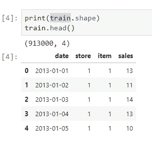
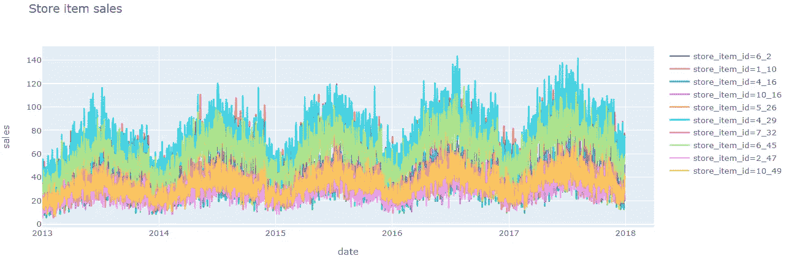
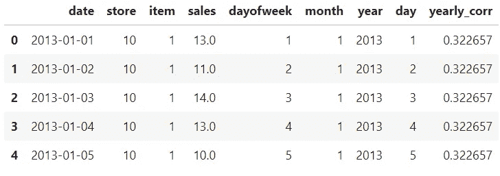
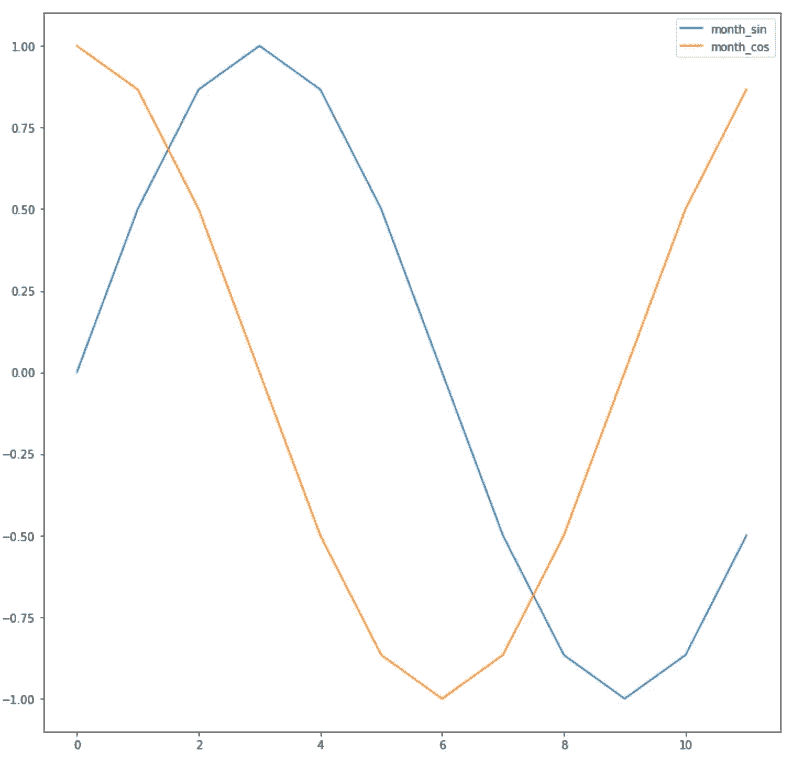
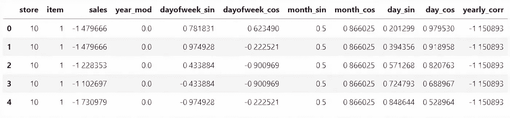
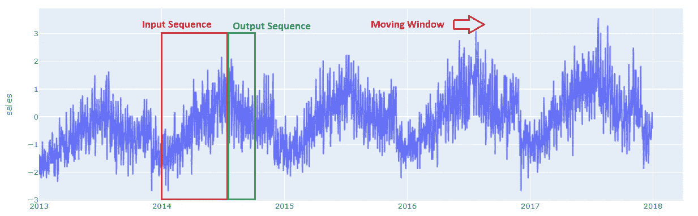
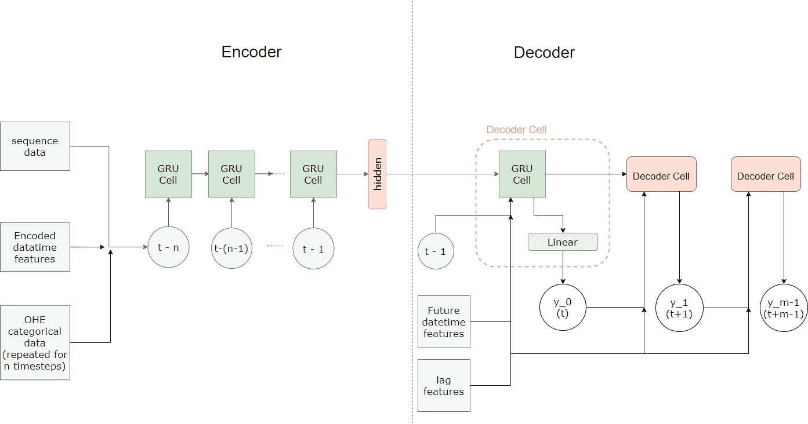
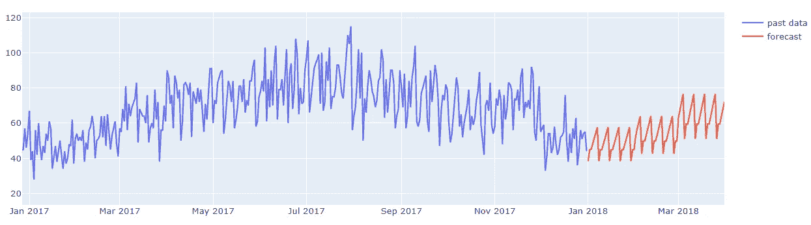
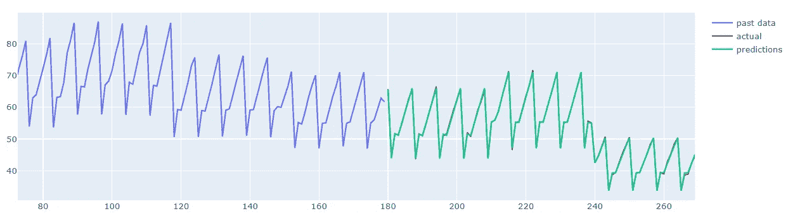

# PyTorch 多步时间序列预测的编解码模型

> 原文：<https://towardsdatascience.com/encoder-decoder-model-for-multistep-time-series-forecasting-using-pytorch-5d54c6af6e60?source=collection_archive---------3----------------------->

丹尼尔·利维斯·佩鲁西在 [Unsplash](https://unsplash.com/s/photos/time?utm_source=unsplash&utm_medium=referral&utm_content=creditCopyText) 上的照片

编码器-解码器模型已经提供了像语言翻译等的序列到序列 NLP 任务的最新结果。多步时间序列预测也可以被视为 seq2seq 任务，为此可以使用编码器-解码器模型。本文提供了一个编码器-解码器模型来解决 Kaggle 的时间序列预测任务，以及获得前 10%结果的步骤。

解决代码可以在我的 [Github repo](https://github.com/gautham20/pytorch-ts) 中找到。模型实现的灵感来自于 [Pytorch seq2seq 翻译教程](https://pytorch.org/tutorials/intermediate/seq2seq_translation_tutorial.html)，时间序列预测思想主要来自于类似竞赛的 [Kaggle 获奖解决方案](https://www.kaggle.com/c/web-traffic-time-series-forecasting/discussion/43795)。

 [## 高森 20/pytorch-ts

### 使用编码器-解码器架构进行时间序列预测的教程- gautham20/pytorch-ts

github.com](https://github.com/gautham20/pytorch-ts) 

使用的数据集来自过去的 Kaggle 竞赛— [商店商品需求预测挑战](https://www.kaggle.com/c/demand-forecasting-kernels-only)，给定 10 家不同商店的 50 种商品过去 5 年的销售数据(从 2013 年到 2017 年)，预测未来 3 个月(2018 年 1 月 1 日到 2018 年 3 月 31 日)每种商品的销售额。这是一个**多步多站点时间序列预测**问题。

比赛

提供的功能非常少:

有 500 个独特的商店商品组合，这意味着我们预测 500 个时间序列。

随机选择 10 件商品的销售图

# 数据预处理

## 特征工程

深度学习模型善于自己发现特征，因此可以将特征工程保持在最低限度。

从图中可以看出，我们的数据具有每周和每月的季节性和每年的趋势，为了捕捉这些，向模型提供了日期时间特征。为了更好地捕捉每个项目销售的年度趋势，还提供了年度自相关。

这些功能中有许多实际上是循环的，为了向模型提供这些信息，对日期时间功能应用了正弦和余弦转换。这里可以找到为什么这是有益的详细解释— [编码循环连续特征— 24 小时时间](https://ianlondon.github.io/blog/encoding-cyclical-features-24hour-time/)

月份特征的正弦和余弦变换

所以最终的特性如下所示。

## 数据缩放

神经网络期望所有特征的值都在相同的尺度上，因此数据缩放成为强制性的。每个时间序列的值被独立地标准化。每年的自相关和年份也被归一化。

## 序列构建

编码器-解码器模型将一个序列作为输入，并返回一个序列作为输出，因此我们拥有的平面数据帧必须转换成序列。

输出序列的长度固定为 90 天，以满足我们的问题要求。输入序列的长度必须根据问题的复杂性和可用的计算资源来选择。对于这个问题，选择 180 (6 个月)的输入序列长度。通过对数据集中的每个时间序列应用滑动窗口来构建序列数据。

## 数据集和数据加载器

Pytorch 提供了方便的抽象——[数据集](https://pytorch.org/docs/stable/data.html?highlight=dataset#torch.utils.data.Dataset)和[数据加载器](https://pytorch.org/docs/stable/data.html#torch.utils.data.DataLoader)——将数据输入模型。数据集将序列数据作为输入，并负责构建要提供给模型的每个数据点。它还处理提供给模型的不同类型的特征的处理，这部分将在下面详细解释。

使用 dataloader 将数据集中的数据点一起批处理并提供给模型。

# 模型架构

编码器-解码器模型是用于解决序列间问题的递归神经网络(RNN)的一种形式。编码器-解码器模型可以直观地理解如下。

编码器-解码器模型由两个网络组成——编码器和解码器。编码器网络学习(编码)输入序列的一个**表示**，它捕捉其特征或上下文，并给出一个向量。这个向量被称为**上下文向量**。解码器网络接收上下文向量，并学习从中读取和提取(解码)输出序列。

在编码器和解码器中，编码和解码序列的任务由一系列循环单元处理。解决方案中使用的循环单元是门控循环单元(GRU ),以解决短期记忆问题。关于这一点的更多信息可以在 LSTM 和 GRU 的插图指南中找到。

下面给出了解决方案中使用的模型的详细架构。

## 编码器

编码器网络的输入具有*(序列长度，n _ 值)*的形状，因此序列中的每一项由 *n* 个值组成。在构造这些值时，不同类型的特征被不同地对待。

**时间相关特性** —这些是随时间变化的特性，例如销售和日期时间特性。在编码器中，每个顺序的时间相关值被馈送到 RNN 单元。

**数字特征** —不随时间变化的静态特征，如序列的年度自相关。这些特征在整个序列中重复出现，并被输入 RNN。重复输入和合并值的过程在数据集中处理。

**分类特征** —商店 id 和商品 id 等特征可以通过[多种方式](https://datascience.stackexchange.com/questions/17099/adding-features-to-time-series-model-lstm/17139#17139)进行处理，每种方式的实现可以在 [encoders.py](https://github.com/gautham20/pytorch-ts/blob/master/ts_models/encoders.py) 中找到。对于最终的模型，分类变量是一次性编码的，在序列中重复，并输入到 RNN 中，这也在数据集中处理。

具有这些特征的输入序列被送入递归网络— [GRU](https://pytorch.org/docs/master/generated/torch.nn.GRU.html) 。下面给出了所使用的编码器网络的代码。

## 解码器

解码器从编码器接收上下文向量，此外，解码器的输入是未来日期时间特征和滞后特征。模型中使用的滞后特征是前一年的值。使用滞后特征背后的直觉是，考虑到输入序列限于 180 天，提供超过此时间范围的重要数据点将有助于模型。

与直接使用循环网络(GRU)的编码器不同，解码器通过解码器单元循环构建。这是因为从每个解码器单元获得的预测作为输入传递到下一个解码器单元。每个解码器单元由一个 GRUCell 组成，其输出馈入一个提供预测的全连接层。来自每个解码器单元的预测被组合以形成输出序列。

## 编码器-解码器模型

编码器-解码器模型是通过将编码器和解码器单元封装到一个模块中来构建的，该模块处理二者之间的通信。

# 模特培训

该模型的性能高度依赖于围绕优化、学习率计划等所采取的训练决策。我将简要地介绍一下它们。

1.  **验证策略—** 由于我们的数据与时间相关，因此跨部门培训-验证-测试分割不起作用。依赖于时间的训练-验证-测试分离提出了一个问题，即模型不是在最近的验证数据上训练的，这影响了模型在测试数据中的性能。
    为了应对这一问题，一个模型根据 2014 年至 2016 年的 3 年历史数据进行训练，并预测 2017 年的前 3 个月，用于验证和实验。最终模型根据 2014 年至 2017 年的数据进行训练，并预测 2018 年的前 3 个月。基于从验证模型训练中获得的知识，在没有验证的情况下以盲模式训练最终模型。
2.  **优化器** —使用的优化器是 AdamW，它已经在许多学习任务中提供了结果的状态。关于 AdamW 更详细的分析可以在 [Fastai](https://www.fast.ai/2018/07/02/adam-weight-decay/) 中找到。探索的另一个优化器是 [COCOBOptimizer](https://arxiv.org/abs/1705.07795) ，它不明确地设置学习率。在用 COCOBOptimizer 进行训练时，我观察到它比 AdamW 收敛得更快，尤其是在初始迭代中。但是最好的结果是通过使用 AdamW 和一个周期学习获得的。
3.  **学习率调度**—[1 使用周期学习率](https://arxiv.org/abs/1705.07795)调度器。通过使用用于循环学习的学习率查找器来确定循环中的最大学习率。使用的学习率查找器的实现来自库— [pytorch-lr-finder](https://github.com/davidtvs/pytorch-lr-finder) 。
4.  使用的损失函数是均方误差损失，它不同于完井损失— [SMAPE](https://en.wikipedia.org/wiki/Symmetric_mean_absolute_percentage_error) 。MSE 损失提供了比使用 SMAPE 更稳定的收敛。
5.  编码器和解码器网络使用了独立的优化器和调度器对，从而提高了结果。
6.  除了权重衰减之外，在编码器和解码器中都使用了丢弃来对抗过拟合。
7.  构建了一个包装器来处理训练过程，能够处理多个优化器和调度器、检查点和张量板集成。这方面的代码可以在 [trainer.py](https://github.com/gautham20/pytorch-ts/blob/master/torch_utils/trainer.py) 中找到。

# 结果

下面的图显示了模型对 2018 年前 3 个月的预测，针对商店的单个商品。

通过绘制所有项目的平均销售额和平均预测来消除噪声，可以更好地评估该模型。下面的图来自验证模型对特定日期的预测，因此可以将预测与实际销售数据进行比较。

来自编码器-解码器模型的结果将在竞赛排行榜中提供前 10%的排名。

为了达到这个结果，我做了最小的超参数调整，所以还有更多改进的余地。还可以通过探索注意机制来进一步改进模型，以进一步增强模型的记忆。

## *感谢阅读，让我知道你的想法。祝你今天开心！玩的开心！*😄

# 参考

[从无到有的 NLP:从一个序列到序列网络的翻译和注意](https://pytorch.org/tutorials/intermediate/seq2seq_translation_tutorial.html#nlp-from-scratch-translation-with-a-sequence-to-sequence-network-and-attention)

[Web 流量时间序列预测解决方案](https://www.kaggle.com/c/web-traffic-time-series-forecasting/discussion/43795)

[编码周期性连续特征— 24 小时制](https://ianlondon.github.io/blog/encoding-cyclical-features-24hour-time/)

[LSTM 和 GRU 的图解指南](/illustrated-guide-to-lstms-and-gru-s-a-step-by-step-explanation-44e9eb85bf21)

[AdamW 和超收敛是目前训练神经网络最快的方法](https://www.fast.ai/2018/07/02/adam-weight-decay/)

[通过硬币下注训练深度网络而不学习比率](https://arxiv.org/abs/1705.07795)

[超收敛:使用大学习速率非常快速地训练神经网络](https://arxiv.org/abs/1705.07795)