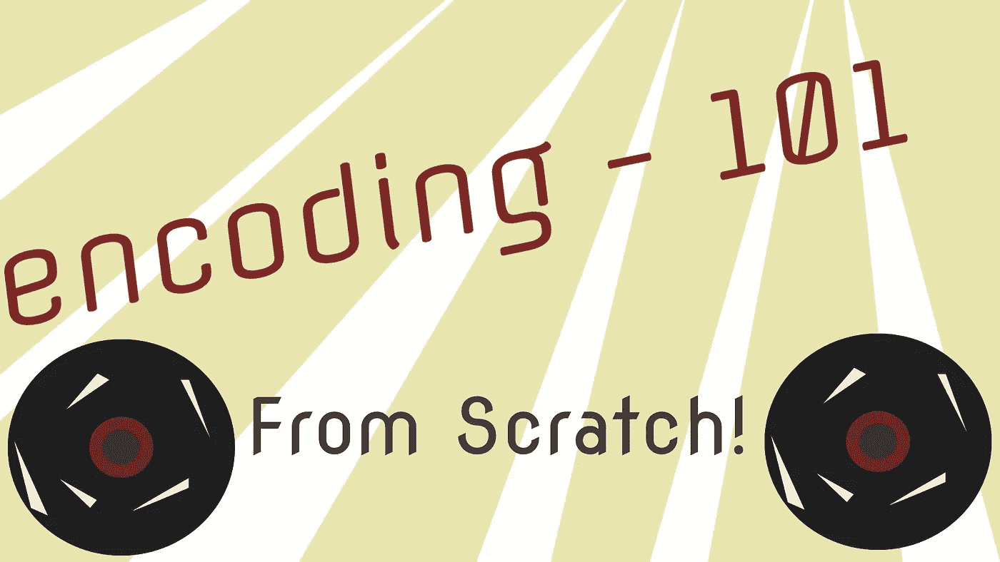
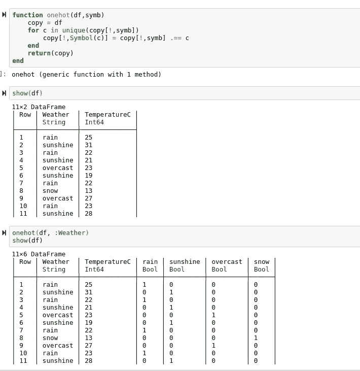
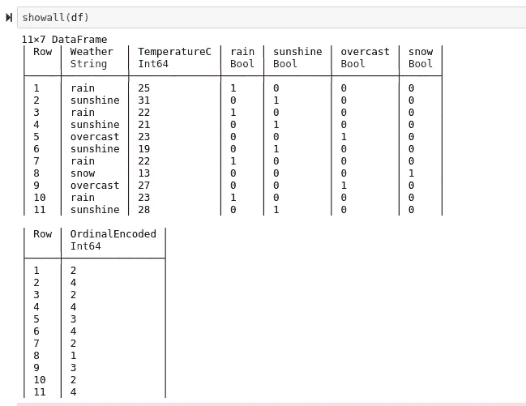
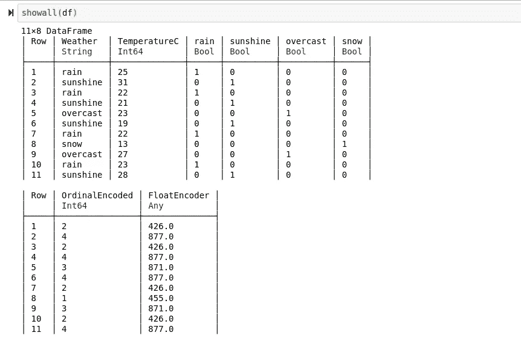

# 编码器——如何编写，如何使用

> 原文：<https://towardsdatascience.com/encoders-how-to-write-them-how-to-use-them-d8dd70f45e39?source=collection_archive---------49----------------------->

## 从头做起

## 通过这个“从头开始”的演练，探索编码器在机器学习中的多种用途！



在一个完美的世界里，所有的程序员、科学家、数据工程师、分析师和机器学习工程师都梦想所有的数据都能以最干净的形式到达他们的家门口。不幸的是，人类在开始用二进制或“哔哔哔”说话之前就发展了语音字母。因此，不幸的是，在处理数据集时，遇到单词(或“哔哔哔”语言中的“字符串”)而不是数字是非常常见的，即使是当今最干净的数据集也是如此。

数据、字符串和单词组合的问题在于，人工大脑无法直接分析单词。计算机是定量说话，而不是定性说话。让计算机解释单词，尤其是带有主观意义或情感的句子，就像让饼干怪兽吃芹菜一样；

> 这是不可能的。

幸运的是，这个问题有一个解决方案——有许多不同的方法可以将单词转换成数字进行分析！虽然这样做可能无法让计算机分析关于单词的某些事情，但它肯定有助于解决你在数据科学这一教育领域可能遇到的常见机器学习问题。通常，每当机器学习使用字符串时，数据科学家都会使用编码器。事不宜迟，我们来看看一些编码器！

> [笔记本](https://github.com/emmettgb/Emmetts-DS-NoteBooks/blob/master/Julia/ordinal1hotfloatencoders.ipynb)

# 独热编码器


我是世上最有趣的人。

如果你是机器学习的新手，你应该尽快掌握的一个技巧是对数据帧进行一次热编码的能力。一键编码，也称为一键编码或哑编码，采用一种非常激进的方法来处理分类变量。通常，我在尽可能少的类别的情况下使用 One-Hot。这是因为首先，与其他可用的算法相比，一位热编码数据占用了大量的内存和磁盘空间。此外，One-Hot 确实在这种光线下闪闪发光。

当处理大型分类特征集时，One-Hot 可以将 5 列数据帧转换为 50 列数据帧，这非常难以处理！最重要的是，通常随着类别中的更高股份，One-Hot 的有效性可能会急剧下降。为了理解为什么会发生这种情况，让我们写一个一次性编码器，看看当我们使用它时会发生什么。我们将从定义函数开始。当使用数据修改和数据破坏方法时，最起码做一个断言或浅层复制是一个好主意**。因为我们正在处理数据帧，所以使用像 copy 这样的库可能是个好主意，尤其是在 Python 中。对于这个示例，我不打算这样做——因为我的意图是将列添加到我的数据框架中，而我的数据本身是非常不重要的，并且仅用于演示目的。**

```
function onehot(df,symb)
    copy = df
```

接下来，我们需要遍历数据帧中的唯一值:

```
for c in unique(copy[!,symb])
```

接下来，我们将使用一点聪明的迭代语法在这个循环中创建一行一热算法:

```
copy[!,Symbol(c)] = copy[!,symb] .== c
```

基本上，它所做的是遍历 copy 的`“ symb”` 列上的所有值。这个例子中的 Symb 当然代表了我们字典的关键列。我们用`copy[!, Symbol(c)]`添加一个新的键，然后将它设置为一个条件。的。Julia 中的==操作数和==操作数是一回事，只是对于整个数组。因此，这将用布尔值(true 或 false)填充新列，这些值对应于原始列中的值是否对应于新列的值。现在我们将返回复制数据帧并结束我们的函数。

```
function onehot(df,symb)
    copy = df
    for c in unique(copy[!,symb])
        copy[!,Symbol(c)] = copy[!,symb] .== c
    end
    return(copy)
end
```

这在实践中是什么样子的？

> 看一看:



如您所见，我们现在有四个布尔列。天气列中的每个唯一字符串都有一列。

# 顺序编码

使分类特征数值化的一种完全不同的方法是序数编码。顺序编码器不采用使用布尔表示值的一次性方法，而是使用整数——

> 谁能想到呢？！

序数编码比一键编码占用更少的 CPU，更重要的是占用更多的内存。每当类别非常高的时候，顺序编码确实一枝独秀。在某一点上，一次性编码是跟不上的，顺序编码是正确的选择。序数编码器到底是怎么把字符串变成整数的？

> 让我们看一些代码来找出答案！

正如我在之前的例子中解释的那样，将变量复制到这里是明智的。添加一个简单的副本比因为一些混乱的数据而不得不原路返回或重新开始工作要好得多，如果你在 REPL 工作，尤其如此。在这个函数中，我要做的第一件事是创建一个集合。

```
function OrdinalEncoder(array)
    uni = Set(array)
```

集合是一种奇妙的类型，在 Julia 和 Python 中都可用，它将使获取唯一值比其他方式更快更简单。在我们得到我们的集合之后，我们将创建一个新的字典:

```
lookup = Dict()
```

这不仅是一个“类型”意义上的字典，而且是一个非常真实的字典，用于查找与键对应的值。然而，在我们可以在字典中搜索我们最喜欢的单词之前，我们需要填充它。我们可以通过迭代地枚举我们的集合并将那些键和相应的值添加到我们的字典中来做到这一点:

```
for (i, value) in enumerate(uni)
        push!(lookup, (value => i))
end
```

接下来，我们将创建一个新阵列:

```
newarray = []
```

然后，在检查字典中它对应的键之后，我们将迭代地将我们的值追加回它:

```
for row in array
        newvalue = lookup[row]
        append!(newarray, newvalue)
    end
```

然后我将添加我的 predict()函数，并返回一个类型以方便使用它。

```
predict() = newarray
()->(predict)
```

整体功能如下:

```
function OrdinalEncoder(array)
    uni = Set(array)
    lookup = Dict()
    for (i, value) in enumerate(uni)
        push!(lookup, (value => i))
    end
    newarray = []
    for row in array
        newvalue = lookup[row]
        append!(newarray, newvalue)
    end
    predict() = newarray
    ()->(predict)
end
```

> 注意到什么可疑的了吗？

幸运的是，这个函数也可以简化到令人痛苦的程度。看看这个:

```
function OrdinalEncoder(array)
    uni = Set(array)
    lookup = Dict()
    [push!(lookup, (value => i)) for (i, value) in enumerate(uni)]
    predict() = [row = lookup[row] for row in array]
    ()->(predict)
end
```

> 那好多了！

现在让我们在数据集上测试一下。

```
oe = OrdinalEncoder(df[:Weather])
df[:OrdinalEncoded] = oe.predict()
```



如您所见，顺序编码器只是枚举数据帧中的所有唯一值，然后将该值重新应用于列中的所有观察值。非常简单，但也是我今天要介绍的三种编码器中最通用和最有效的。这款编码器的伟大之处在于，它在很大程度上是“一刀切”的体验。这是因为性能不一定是最重要的，它可以很好地处理大类别和小类别，尽管它可能会失去一些准确性，这取决于它所处的环境。

# 标签编码器

什么是标签编码器？阅读这篇文章的人很可能知道什么是标签编码器——因为我们刚刚从头开始创造了一个！没错，标签编码器和顺序编码器是一样的——至少在功能上是一样的。不，这与我们看到的虚拟编码和一位热码编码的情况不太一样。这两个术语存在的全部原因在于 Sklearn 构建其预处理包的方式。为了让标签编码器和顺序编码器都非常有效地工作，它们需要分开。这两者之间的最大区别是标签编码器通常用于目标，而序号编码器通常用于编码特征——就是这样！所以，如果你想知道代码是什么样子的，就在这里盖上函数定义，假装它写着“LabelEncoder”

```
function OrdinalEncoder(array)
    uni = Set(array)
    lookup = Dict()
    [push!(lookup, (value => i)) for (i, value) in enumerate(uni)]
    predict() = [row = lookup[row] for row in array]
    ()->(predict)
end
```

# ASCII 编码器

ASCII 编码器，也称为浮点编码器(为什么所有编码器都需要两个名称？)使用对拼音字母和符号进行编号的 ASCII 系统，根据字符串中包含的字符创建唯一的类别。这既有效又通用，因为该系统不仅可以应用于标准的分类问题，还可以应用于自然语言处理！最重要的是，这也非常容易做到，而且非常有效，尤其是在处理具有许多不同值的数据集时。

创建 ASCII 编码器的第一步是将字符串分成字符。这可以通过 split()方法或字符串上的迭代循环来完成。虽然后者更密集，这是我通常更喜欢的。

```
for dim in array
        newnumber = 0
        for char in dim
```

接下来，你要做一个操纵的决定。如果我们试图对这些字符执行某种自然语言处理，或者如果我们有绝对大量的类别，那么逐个字符地创建一个新的整数可能是明智的，这个新的整数是一系列数字，代表字符串中的各个字符。然而，由于我们只是试图对一个非常小的数据集进行分类，因此我建议将数字相加，就像这样:

```
newnumber += Float64(char)
```

然后，我们将它添加到新的数字列表中，并像以前一样创建预测函数，我们开始吧:

```
function FloatEncoder(array)
    encoded_array = []
    for dim in array
        newnumber = 0
        for char in dim
            newnumber += Float64(char)
        end
        append!(encoded_array, newnumber)
    end
    predict() = encoded_array
    ()->(predict)
enddf[:FloatEncoder] = fe.predict()
```



正如你所看到的，你会得到一个非常不同的结果，而且这个算法也可以被操纵来实现比分类编码更多的目标。

# 结论

编码器。是。厉害！学习读取数据和使用正确的编码器可能是使用每个编码器的最大问题。幸运的是，理解它们是如何工作的，并且能够编写它们，这使得想象什么样的编码器在您的特定情况下可能工作得非常好变得容易得多。不管你在这方面处于什么样的情况，你都会从中学习，并且能够以新的方式应用你新发现的技能。感谢您阅读我的文章，祝您白天(或晚上)休息愉快！)