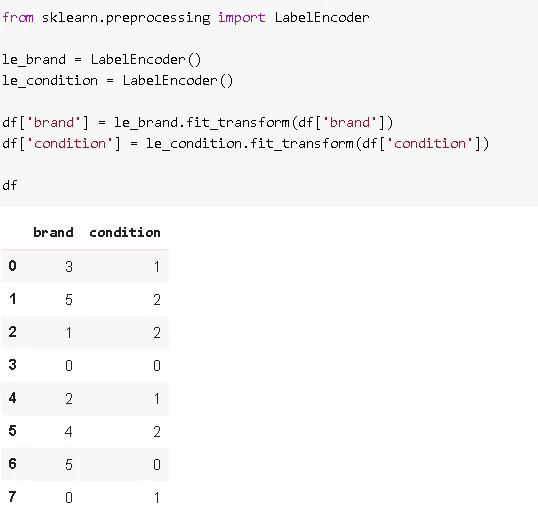

# 机器学习中的分类变量编码

> 原文：<https://towardsdatascience.com/encoding-categorical-variables-in-machine-learning-5644a43c123f?source=collection_archive---------39----------------------->

## 如何向机器学习模型输入分类数据

尼克·希利尔在 [Unsplash](https://unsplash.com/s/photos/numbers?utm_source=unsplash&utm_medium=referral&utm_content=creditCopyText) 上的照片

分类数据需要以特殊的方式处理，才能用作机器学习模型中的一个特征。在说这种特殊方式之前，不如先说一下什么是分类数据。

分类数据表示一组有限的离散值。所以分类变量从有限的几个值中取一个值。分类数据的一些例子:

*   汽车品牌:福特，丰田，宝马，…
*   服装尺码:小号，中号，大号，加大号，…
*   显示某种级别的类别:低、中、高
*   颜色:蓝色，红色，黄色，…

分类数据可以根据它所代表的内容分成几组:

**名义数据:**类别并不意味着任何定量测量，数据中通常没有顺序。例如，种族、性别、语言是分类变量，但我们不能对这些变量的不同类别进行排序。

**序数数据:**与名义数据不同，类别之间是有顺序的。一个类别可以优于另一个类别，反之亦然。

*   低、中、高
*   冷，暖，热

现在是预处理分类数据的时候了，这样我们就可以在机器学习模型中使用它们。计算机只能处理用数字表示的信息。这就是为什么我们不能给机器学习模型类别或字符串作为输入。

我们首先需要将类别转换成数字。这个过程叫做**标签编码**。有些类别已经是数字了，比如电影分级从 1 到 5。我们不需要对这种分类变量应用标签编码步骤。

如果分类变量不是有序的(也就是说，它们没有等级顺序)，标签编码是不够的。我们需要使用“**哑元**或“**一个热码**”编码对名义分类变量进行编码。假设我们对代表汽车品牌的分类变量进行了标签编码。编码器标签“道奇”为 3，“GMC”为 1。如果我们只是对这个变量进行标签编码，一个模型会认为“Dodge”比“GMC”更重要或更优越，这是不正确的。优选地，将每个类别表示为仅取两个值 1 和 0 的列。对于“道奇”品牌的汽车，只有“道奇”一栏的值变成 1，其他栏都是 0。通过这种方式，我们可以确保类别之间没有层次结构。

让我们看一个例子，这样就更清楚了。我创建了一个样本数据框架:

数据帧包括名义(品牌)和顺序(条件)数据。

**标签编码**

给类别分配标签的一种方法是使用 scikit-learn 的 **LabelEncoder()** :

因此，标签编码器为每个类别分配了一个编号。最好为每个类别使用单独的标签编码器，以防我们需要对列进行逆变换。然而，这种方法存在一个问题。您可能已经注意到,“条件”列中的平凡性没有保留。分配的标签有:

*   好:1
*   平均值:0
*   差:2

如果普通性很重要，我们可以使用 Pandas **replace** 函数手动标记编码这些类别:

我们只需创建一个将类别映射到标签的字典，然后将这个字典作为参数传递给 replace 函数。

**虚拟和一个热编码**

虚拟或 one 热编码器将每个类别转换为取值为 0 或 1 的二进制列。让我们首先应用来自 scikit-learn 的 **OneHotEncoder()** :

这个过程非常简单。我们启动一个 OneHotEncoder()对象，并使用数据应用 fit_transform 方法。值得一提的是**下降**参数。数据集包含品牌列中的 6 个类别和条件列中的 3 个类别。因此编码器应该总共返回 9 列。但是，返回的数组有 7 列。原因是我们要求编码器删除第一列，这是有意义的，因为我们不会因为删除一列而错过任何信息。考虑有 6 个类别的“品牌”栏。我们删除了第一类的列，即“奥迪”。如果其他五列中的值为 0，则该行代表“奥迪”。看一下原始 dataframe，看到第四行的品牌是奥迪。此外，编码功能数组中第四行的前五列都是零。

另一种做这个操作的方法是使用熊猫的 **get_dummies** 功能。Get_dummies 函数返回一个数据帧，通过组合原始列名和类别名来分配列名。

`pd.get_dummies(df)`

我们还删除了第一列:

`pd.get_dummies(df, drop_first=True)`

感谢您的阅读。如果您有任何反馈，请告诉我。