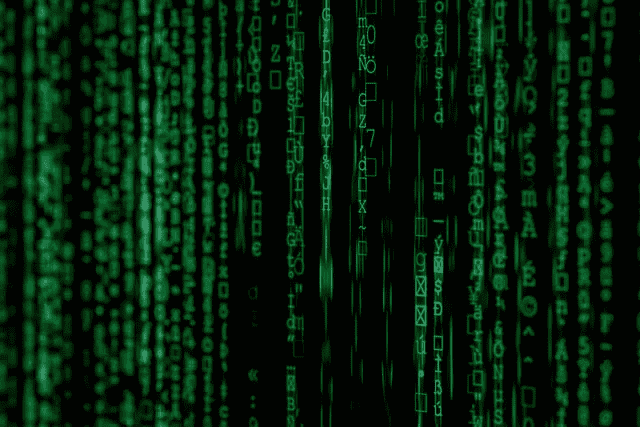

# 使用 Python 加密和解密文件— Python 编程

> 原文：<https://towardsdatascience.com/encrypt-and-decrypt-files-using-python-python-programming-pyshark-a67774bbf9f4?source=collection_archive---------3----------------------->

## 在本文中，我们将讨论如何使用 Python 加密和解密文件。



马库斯·斯皮斯克在 [Unsplash](https://unsplash.com/s/photos/encrypt?utm_source=unsplash&utm_medium=referral&utm_content=creditCopyText) 上的照片

**目录**

*   介绍
*   创建密钥
*   加载密钥
*   加密文件
*   解密文件
*   完整的面向对象编程示例
*   结论

# 介绍

今天，我们观察来自所有不同来源的数据，最终挑战变成了数据的安全性和隐私性。这不仅涉及企业持有的主要数据集，还涉及 AI/ML 模型和算法，以及最终的预测数据。

随着越来越多的行业在决策中采用数据科学实践，数据量也在不断增长。在 AI/ML 和云计算的加密和安全领域，已经发现了几家公司，它们现在甚至允许对加密数据进行计算。

在不断发展的数据和信息传输世界中，文件内容的安全性仍然是公司最关心的问题之一。一些信息可以用密码保护(电子邮件、登录)，而其他通过电子邮件或 FTP 传输的信息如果用一些关键字保护，效率会很低。这就是文件加密发挥重要作用的地方，它提供了参与文件传输的各方所寻求的安全性和便利性。

那么什么是加密呢？它是将信息转换成某种形式的代码以隐藏其真实内容的过程。访问文件信息的唯一方法是解密它。加密/解密的过程称为密码学。

让我们看看如何使用 Python 加密和解密我们的一些文件。我们将遵循对称加密，这意味着使用相同的密钥来加密和解密文件。

为了继续学习本教程，我们需要以下 Python 库:cryptography。

如果您没有安装它们，请打开“命令提示符”(在 Windows 上)并使用以下代码安装它们:

```
pip install cryptography
```

我们还需要一个我们将要使用的样本文件。下面是样本。包含一些学生成绩数据的 csv 文件:

[https://pyshark.com/wp-content/uploads/2020/08/grades.csv](https://pyshark.com/wp-content/uploads/2020/08/grades.csv)

# 创建密钥

在我们的例子中，我们将使用对称方程:

Fernet 是经过认证的加密技术，它不允许在没有“密钥”的情况下读取和/或修改文件。

现在，让我们创建密钥，并将其保存在与数据文件相同的文件夹中:

如果您检查 Python 代码所在的目录，您应该会看到 **mykey.key** 文件。您可以用任何文本编辑器打开它(在我的例子中，它显示在本地目录中，因为我使用的是 VS 代码)。该文件应该包含一行，它是某种字符顺序的字符串。对我来说就是“vld 8 H2 teijk qpkkkndnknu 8 ya 2 fpibmoo 5 oc 7 jknasvk =”。

# 加载密钥

生成加密密钥后，我们需要将其加载到我们的环境中，以便加密/解密文件。

以下步骤非常简单，只需打开 mykey.key 文件并将其存储在本地内存中:

为了验证，我们将看到以下输出:

```
VlD8h2tEiJkQpKKnDNKnu8ya2fpIBMOo5oc7JKNasvk=
```

加密密钥现在作为**密钥**变量存储在本地。

# 加密文件

既然我们有了要加密的文件和加密密钥，我们现在将编写一个函数来利用它们并返回加密的文件:

让我们讨论一下我们在这里做了什么:

*   我们将 Fernet 对象初始化为本地变量 **f**
*   接下来，我们将原始数据(grades.csv 文件)读入**原始数据**
*   然后，我们使用 Fernet 对象加密数据，并将其存储为**加密的**
*   最后，我们将它写入一个新的。名为“enc_grades.csv”的 csv 文件

您可以在这里查看加密文件:

[https://pyshark . com/WP-content/uploads/2020/09/enc _ grades . CSV](https://pyshark.com/wp-content/uploads/2020/09/enc_grades.csv)

# 解密文件

加密文件后，例如，成功地将文件传输到另一个位置，您会想要访问它。现在，这些数据是加密格式的。下一步是将其解密回原始内容。

我们现在要遵循的过程是上一部分加密的逆过程。完全相同的过程，但现在我们将从加密文件到解密文件:

让我们讨论一下我们在这里做了什么:

*   我们将 Fernet 对象初始化为 store is 作为一个局部变量 **f**
*   接下来，我们将我们的加密数据(enc_grades.csv 文件)读入**加密的**
*   然后，我们使用 Fernet 对象解密数据，并将其存储为**解密的**
*   最后，我们将它写入一个新的。名为“dec_grades.csv”的 csv 文件

您可以在这里查看解密后的文件:

[https://pyshark . com/WP-content/uploads/2020/09/dec _ grades . CSV](https://pyshark.com/wp-content/uploads/2020/09/dec_grades.csv)

把“dec_grades.csv”和原来的“grades.csv”对比一下，你会发现其实这两个内容是完全一样的。我们的加密/解密过程是成功的。

# 完整的面向对象编程示例

这是一个额外的部分，我把一切都组织得更有条理:

这是一个使用上述类进行加密/解密的示例:

# 结论

本文介绍了使用 Python 进行基本的对称文件加密和解密。我们已经讨论了密码库的一些部分，并创建了一个完整的过程示例。

如果你有任何问题或者对编辑有任何建议，欢迎在下面留下评论，并查看我的更多 [Python 编程](https://pyshark.com/category/python-programming/)文章。

*原载于 2020 年 9 月 1 日*[*【https://pyshark.com】*](https://pyshark.com/encrypt-and-decrypt-files-using-python/)*。*