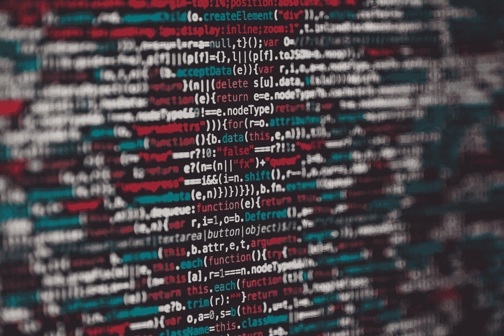
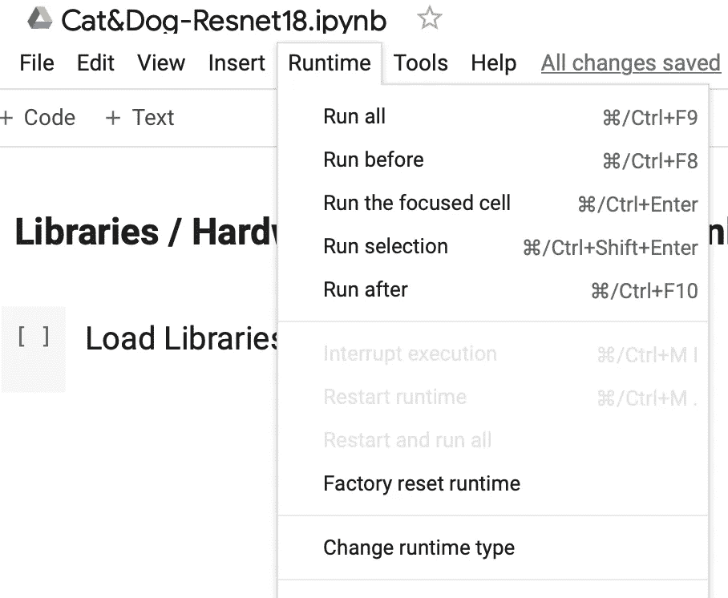
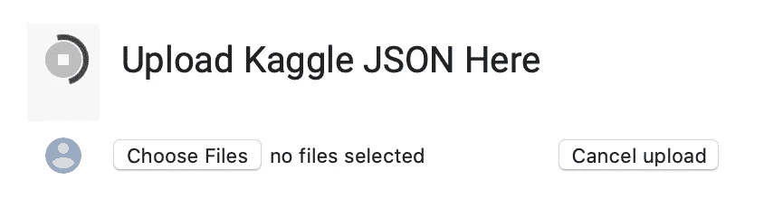
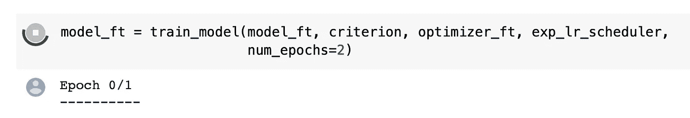
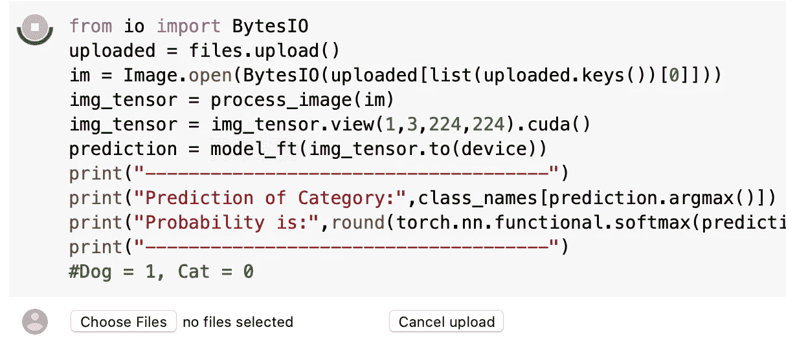
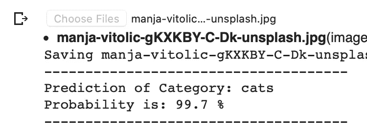

# Google Colab 中 ResNet 的端到端改编—第 1 部分

> 原文：<https://towardsdatascience.com/end-to-end-adaptation-of-resnet-in-google-colab-part-1-5e56fce934a6?source=collection_archive---------32----------------------->

## [入门](https://towardsdatascience.com/tagged/getting-started)

## 只需点击几下鼠标，就能训练出一个深度神经网络



来自 Unsplash.com,[马库斯·斯皮斯克](https://unsplash.com/@markusspiske)

我在这篇文章中提供的代码示例是几个小时的挫折和在互联网上四处搜寻的结果。

当我第一次开始自学深度神经网络时，我想找到一些我可以随时下载、即插即用并运行的东西——**，但这很难找到。**(再次)借用杰瑞米·霍华德的话，我真的很欣赏他如何从几行代码开始，证明训练一个深度神经网络不应该是令人生畏的。我想用 Google Colab 做类似的事情。

**不涉及代码和硬件要求的细节**，一开始，我真的很想体验一下训练需要多长时间，过程是什么样的，以及“端到端”网络的整个代码库是什么样的，它做了以下四件事:

1.  下载并建立了一个深度神经网络
2.  获取数据集并对其进行格式化以用于训练
3.  训练神经网络并进行验证
4.  准备好接受输入进行测试

输入谷歌 Colab。我就不多说了，除非给你这个:

[**猫&狗分类器使用 Resnet-18**](https://colab.research.google.com/drive/1W5tU1X3w1uIY-R1HpQredT1vpiLGcDIQ?usp=sharing)

**你不需要知道任何 Python 来运行这个**，你只需要两样东西——1)一个谷歌账户，这样你就可以启动笔记本；2)一个 [Kaggle](https://www.kaggle.com) 账户。

这段代码下载了一个由成千上万张狗和猫的图像(标记为)组成的数据集，通过 ResNet-18 架构运行该数据集进行训练，一旦完成，它将为您提供一种轻松测试网络的方法。

让我们开始吧。

# 1.获取您的 Kaggle API JSON

首先，登录 Kaggle，点击右上角的图标，进入“我的账户”。向下滚动到标题为“API”的部分，然后单击“创建新令牌”。这将下载一个名为“kaggle.json”的 JSON 文件(希望下载到您的下载文件夹中)。

# 2.启动笔记本

查看下面的屏幕截图—确保在单击“更改运行时类型”时选择了 GPU，然后单击“保存”。然后选择“全部运行”。



Google Colab 上的运行时菜单。作者上传

# 3.上传您的 Kaggle JSON

我已经试着让这变得尽可能简单。向下滚动一点，注意到代码正在等待您上传您在步骤 1 中下载的 JSON 文件。

单击“选择文件”并选择您的 kaggle.json 文件。这将验证您的身份，以便您能够获取数据集。



代码正在等待您的 Kaggle JSON 文件。作者上传

# 4.向下滚动

我这样说并不是开玩笑，但是一旦你上传了 JSON 文件，代码就开始快速移动，很可能已经超过了你在页面上的位置，并且很可能已经开始训练，看起来像这样:



模型训练正在进行中。作者上传

这将需要一点时间，但不会太多，它可能运行在一个高端 GPU 上，为这样的任务而构建。

等待代码完成训练。它将输出这样一行:

```
‘Training complete in 4m 51s’
Best val Acc: 0.989370
```

# 5.准备好一张狗或猫的照片了吗

同样，与上面等待 JSON 文件的方式类似，代码现在正在等待您上传图片。由于它只在狗和猫身上进行训练，我建议从这些动物中挑选一只来测试一下。任何其他动物都可能提供异常但肯定不可靠的结果。

单击“选择文件”选择您的图片。



我发现了一张很棒的猫的照片:


来源:Unsplash.com



成功！作者上传

# 几个音符

我**肯定**掩饰了上面代码的一些细节，因为我想向你展示这个极其复杂的过程是可以实现的。

Colab 的美妙之处在于，你不需要快速的互联网连接，或高端 GPU 或大量的内存来了解深度神经网络的内部工作方式。

我们在英特尔至强处理器和 NVIDIA 显卡上训练了上述模型(ResNet-18)。对于世界上的绝大多数人来说，这种硬件在本地是买不到的，因为它们的成本太高(几千美元)。

我们用一个几乎 1Gb 大小的数据集训练了上面的模型，下载 Colab 服务器只需几秒钟。在本地运行所需的时间和带宽也不是世界上大多数人能够获得的。

自学深度神经网络不应该受到你面前的技术的阻碍，你也不应该在头脑中想象这是如何在硬件上完成的。

有了我提供的 Colab 笔记本，你可以用一台简单的电脑和最少的网络连接来运行它。

但这只是第一部分！我希望你能在接下来的几周内加入我，我们将按部就班地解开这段代码。

请在下面留下任何问题，我会尽力回答。

# 参考

[1] [深度学习用 Pytorch](https://pytorch.org/tutorials/beginner/deep_learning_60min_blitz.html) ，2020 年 10 月访问

[2] [神经网络与 Pytorch。【2020 年 10 月访问](https://pytorch.org/tutorials/beginner/blitz/neural_networks_tutorial.html)

[3] [计算机视觉的迁移学习。【2020 年 10 月访问](https://pytorch.org/tutorials/beginner/transfer_learning_tutorial.html)