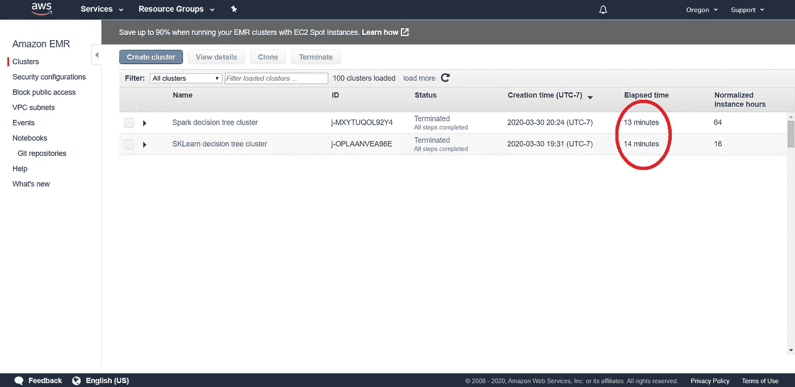

# 端到端定量分析—从 SKLearn 到 Spark

> 原文：<https://towardsdatascience.com/end-to-end-aws-quantitative-analysis-moving-from-sklearn-to-pyspark-f20f883bec90?source=collection_archive---------32----------------------->


来自 [Pexels](https://www.pexels.com/photo/interior-of-office-building-325229/?utm_content=attributionCopyText&utm_medium=referral&utm_source=pexels) 的 [Manuel Geissinger](https://www.pexels.com/@artunchained?utm_content=attributionCopyText&utm_medium=referral&utm_source=pexels) 的照片

## [构建 AWS 管道](https://towardsdatascience.com/tagged/building-an-aws-pipeline)

在之前的一篇文章中，我描述了如何使用 Amazon Web Services (AWS)建立一个自动化的工作流程。我们已经探索了如何使用 AWS 的命令行工具 awscli 来加速弹性 Map Reduce (EMR)集群。
在那篇文章中，我们已经看到了如何使用 sklearn 的`DecisionTreeClassifier`将价格运动分类为“上升”或“下降”(1 或 0，二元分类问题)。

使用 sklearn 的一个缺点是，它使用一台机器来执行所有计算。这种设置会随着数据的增加而增加运行时间，即使我们的 EMR 集群可以包含多台能够进行分布式计算的机器。这就是 Spark 推出其版本的`DecisionTreeClassifier`的原因。我们将在本教程中比较 sklearn 和 Spark 的使用。

# 火花和 PySpark

Spark 是一个 Apache 框架，旨在跨多台机器进行并行和分布式处理。这个想法是将工作分解成独立的块，这些块都可以被计算(**划分**数据)，然后汇集独立计算的结果。Spark 非常强大，但是，对于 Python 程序员来说，可悲的是，它是用 Java 编写的。这就是 PySpark 发挥作用的地方。它是围绕 Spark 框架的 python 包装器。

Spark 结合了来自 pandas 的几个抽象，比如 dataframes，以及来自 sklearn 的几个抽象，比如转换和机器学习技术。

# 将我们的数据转换成火花数据帧

我们要做的第一件事是将我们的熊猫数据帧转换成 spark 数据帧。这是一个非常常见的操作，因此 PySpark 有一个内置函数来完成这个操作。

将我们的库存熊猫数据框架转换为 spark 数据框架

注意，我们使用了 Spark 的内置类型来指定转换的模式。这一步是**强烈推荐**并节省大量加工时间。如果不这样做，Spark 会尝试自己推断模式。
还要注意，我们在模式中将`nullable`属性设置为`False`。这也节省了处理时间，因为 Spark 在进行转换时不必担心某些列包含空值。
完成后，您会注意到我们可以打印 spark 数据帧的模式来查看其结构:

```
root
 | — Open_pct: double (nullable = false)
 | — Close_pct: double (nullable = false)
 | — High_pct: double (nullable = false)
 | — Low_pct: double (nullable = false)
 | — Volume_pct: double (nullable = false)
 | — Target: double (nullable = false)
```

# 将特征转换成矢量

Scikit-learn 模型用于表格数据；numpy 数组或 pandas 数据帧。然而，Spark 机器学习模型需要稍微不同的架构。

虽然 pandas 和 numpy 利用单台机器上的高效内存使用，但 Spark 更关心如何轻松地将数据分布到不同的机器上。因此，它需要将每个数据点封装在一个`vector`类中。我们需要使用一个`VectorAssembler`将我们的特性列转换成一个包含向量的列。我们必须告诉`VectorAssembler`哪些列要插入到这个新列中。

使用向量汇编程序创建向量列

```
root
 |-- Open_pct: double (nullable = false)
 |-- Close_pct: double (nullable = false)
 |-- High_pct: double (nullable = false)
 |-- Low_pct: double (nullable = false)
 |-- Volume_pct: double (nullable = false)
 |-- Target: double (nullable = false)
 |-- features: vector (nullable = true)
```

现在，当我们检查模式时，我们看到我们添加了一个存储数据的 vector 类型的单列。在这种方法下，每个数据点都是一个封装的项目，可以在我们的集群中发送。

# 使用决策树分类器

Spark 有两个主要的机器学习库； [MLlib](https://spark.apache.org/docs/latest/api/python/pyspark.mllib.html) 和 [ML](https://spark.apache.org/docs/latest/api/python/pyspark.ml.html) 。首选的库是 ML，因为 MLlib 正在慢慢淡出。我们将使用 ML 中的决策树分类器。

这部分和我们使用 sklearn 还蛮像的；我们初始化我们的模型，拟合它，然后要求预测。有两个主要区别:
1)我们必须在同一个数据框架中指定特性和目标列。决策树希望所有特征都位于一列(vector 类型)中。
2)与 sklearn 决策树不同，这里没有单独的`predict`和`predict_proba`方法。一个非常详细的数据帧作为我们的预测返回，其中包含硬类预测、概率预测和许多其他项目。

我们将运行以下代码来使用决策树:

运行决策树分类器

我们已经采取了几个步骤，让我们来分解一下:

1.  我们将数据分为 80%的训练数据和 20%的测试数据。请注意，与 sklearn 不同的是，这里没有专门的函数，但它是数据帧的一个特性
2.  我们将数据帧分成 10 个分区。每个分区都是我们的数据的一个原子块，当它在节点之间传递时不会被进一步分割。每个分区将驻留在单个节点上，这意味着我们已经将数据帧切割成 10 个可以四处发送的数据块。
    这一步必须包括在内，因为默认情况下 Spark 只使用 2 个分区，这使得大量数据被发送。
3.  我们必须初始化决策树，并明确告诉它应该对哪些列进行操作。我们说我们有一个“features”列(vector 类型)和一个“Target”列(double 类型)。一旦我们的树被初始化，我们可以使用`fit`方法使它适合训练数据。
4.  用一种`transform`方法(而不是`predict`)抓住我们的预测。这些预测来自它们自己的火花数据框架。
5.  打印该模型的总运行时间。在我的例子中，打印输出是:
    `run-time: 3.55`
6.  打印出我们的预测数据框架的模式和预测。请注意，预测数据帧也包含测试数据帧的所有列:

```
root
 | — Open_pct: double (nullable = false)
 | — Close_pct: double (nullable = false)
 | — High_pct: double (nullable = false)
 | — Low_pct: double (nullable = false)
 | — Volume_pct: double (nullable = false)
 | — Target: double (nullable = false)
 | — features: vector (nullable = true)
 | — rawPrediction: vector (nullable = true)
 | — probability: vector (nullable = true)
 | — prediction: double (nullable = false) +--------------+----------+-----------+
| rawPrediction|prediction|probability|
+--------------+----------+-----------+
|[0.0,131301.0]|       1.0|  [0.0,1.0]|
|[0.0,131301.0]|       1.0|  [0.0,1.0]|
|[0.0,131301.0]|       1.0|  [0.0,1.0]|
|[0.0,131301.0]|       1.0|  [0.0,1.0]|
|[0.0,131301.0]|       1.0|  [0.0,1.0]|
|[0.0,131301.0]|       1.0|  [0.0,1.0]|
|[0.0,131301.0]|       1.0|  [0.0,1.0]|
|[0.0,131301.0]|       1.0|  [0.0,1.0]|
|[0.0,131301.0]|       1.0|  [0.0,1.0]|
|[0.0,131301.0]|       1.0|  [0.0,1.0]|
|[0.0,131301.0]|       1.0|  [0.0,1.0]|
|[0.0,131301.0]|       1.0|  [0.0,1.0]|
|[0.0,131301.0]|       1.0|  [0.0,1.0]|
|[0.0,131301.0]|       1.0|  [0.0,1.0]|
|[0.0,131301.0]|       1.0|  [0.0,1.0]|
|[0.0,131301.0]|       1.0|  [0.0,1.0]|
|[0.0,131301.0]|       1.0|  [0.0,1.0]|
|[0.0,131301.0]|       1.0|  [0.0,1.0]|
|[0.0,131301.0]|       1.0|  [0.0,1.0]|
|[0.0,131301.0]|       1.0|  [0.0,1.0]|
+--------------+----------+-----------+
only showing top 20 rows
```

# AWSCLI 的配置

我们将需要使用一个新的命令，其中包含了更多的信息

```
aws2 emr create-cluster \
--name “Spark cluster with step” \
--release-label emr-5.29.0\
--applications Name=Spark \
--log-uri s3://**logs**/logs/ \
--ec2-attributes KeyName=**my-key-pair**,AvailabilityZone=us-west-2a \
--instance-groups **file://instanceGroupConfig.json** \
--bootstrap-actions Path=s3://**scripts-and-set-up**/bootstrap_file.sh \
--configuration **file://config.json** \
--steps Name=”Command Runner”,Jar=”command-runner.jar”,Args=[“spark-submit”,
”--conf”,”spark.executor.memory=18g”,\
”--conf”,”spark.driver.memory=16g”,\
”--conf”,”spark.rpc.message.maxSize=1500",\
”--deploy-mode=cluster”,”s3://**workflow-scripts/process_data.py**, s3://**data-files**/AAPL.csv”] \
--use-default-roles \
--auto-terminate
```

我不会探究每一个新的参数，因为我在之前的[帖子](/end-to-end-quantitative-trading-automating-ml-using-awscli-83035b4f6d03)中探究了`create-cluster`命令。但是，我要指出的是，您必须将 s3 存储桶设置为您自己的存储桶。
说到这里，让我们来看看我们添加的几个新参数:

*   `--instance-groups file://instanceGroupConfig.json` —我们实际上可以使用一个配置文件来指定部署多少个节点以及部署哪种类型的节点。我的集群使用了 4 个节点；1 个主节点、1 个任务节点和 2 个核心节点

instanceGroupConfig.json

*   这是我们集群的另一个配置文件，但是它概述了我们的资源管理器(YARN)应该如何工作。它基本上允许我们在主节点上消耗大量内存

配置. json

*   我们这里有相当多的火花配置参数。它们控制整体内存管理。每个执行器应该分配高达 18Gb 的内存来运行，控制所有执行器的驱动程序应该分配 16Gb 的内存来运行，最后 Spark 应该能够在执行器和驱动程序之间一次发送高达 1.5Gb 的数据包。我花了一些时间通过反复试验来调整这些参数。我不会说它们是最优的，但它们允许进行比较。

# 比较两个决策树的运行时间

为了便于比较，让我们来看看我之前用于 sklearn 树和 Spark 树的代码。

使用 sklearn 的决策树分类器

`>>> run-time: 9.19`

使用 Spark 的 ML 决策树分类器

`>>> run-time: 3.55`

使用 Spark 的决策树最终会使数据处理速度提高一倍以上。这符合我们的预期，因为 Spark 可以削减任务和核心节点之间的工作。然而，这个特殊的例子变得稍微复杂一些。

虽然 Spark 的决策树显示了明显的优越性能，但在这种情况下，使用 Spark 并没有快多少。



使用 sklearn 决策树的集群总共运行了 14 分钟，而 Spark 集群运行了 13 分钟。运行时间接近是因为将数据帧转换成 Spark 数据帧本身就是一项成本高昂的操作。

然而，我们在这个实例中探索的数据只有大约 4GB 大小。随着数据大小和集群大小的增加，这种差异肯定会增加。Spark 被设计为运行在万亿字节的数据上，甚至更多。所以这个例子仅仅说明了部署基于 Spark 的机器学习工作流的过程。

用于 PySpark 处理的整个脚本如下所示:

process _ data _ with _ 火花. py

# 结论

Spark 可用于加速您的机器学习需求，由于它包含许多与 sklearn 相同的算法，转换非常容易。一旦您熟悉了 Spark 框架，PySpark 接口允许几乎无缝的转换。然而，为了达到熟悉的程度，人们必须超越机器学习算法的通常知识，并深入了解配置和内存管理知识，以允许 Spark 应用程序发挥其全部潜力。

我写这篇文章的时候很开心，我希望你读的时候也开心。关于 Spark，我还有一些东西需要学习，但我希望能让您的学习体验更轻松。

# 迄今为止的成本

在试验 3-4 个节点的集群时，以及花了相当多的时间来实现指定显式模式节省了相当多的处理时间，我不得不花更多的钱来学习如何使用 Spark。我希望这篇教程确实能为阅读它的人节省时间和金钱，但是对我来说总的花费大约是 60 美元。我建议你在使用 Spark 和 EMR 进行原型开发时要小心，因为这很容易增加费用，但是如果不尝试和失败，你就无法学会如何使用这些工具。