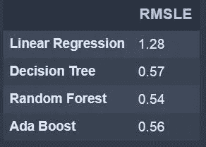
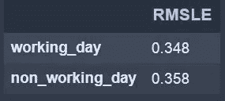
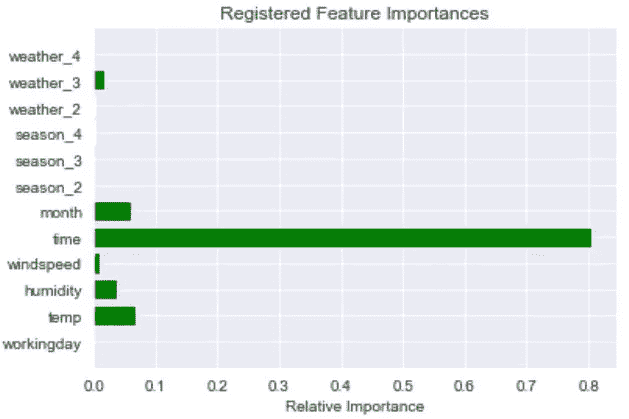
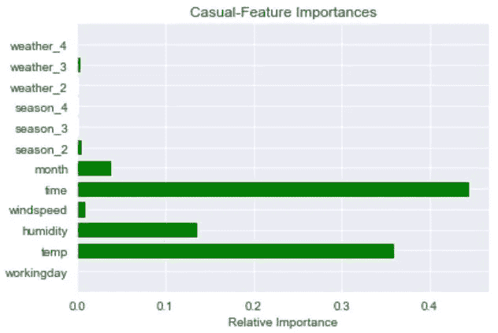

# 端到端案例研究:自行车共享需求预测

> 原文：<https://towardsdatascience.com/end-to-end-case-study-bike-sharing-demand-dataset-53201926c8db?source=collection_archive---------7----------------------->

阿纳托利·阿尼金在 [Unsplash](https://unsplash.com?utm_source=medium&utm_medium=referral) 上拍摄的照片

大家好！！

欢迎来到这个关于自行车共享需求预测的博客。这个数据集取自 [Kaggle](https://www.kaggle.com/c/bike-sharing-demand/overview) 。在这篇博客中，我们将经历简单而有效的预处理步骤，然后我们将更深入地挖掘数据，并应用各种机器学习回归技术，如*决策树、随机森林和 Ada boost 回归器*。我们将通过使用 GridSearchCV 对每个回归器算法进行参数调整来找到最佳的超参数。

在分析每个模型的误差后，我们将选择一个给出最小**均方根对数误差(RMSLE)分数**的模型，并使用它建立一个模型。

最后，我们将看到如何使用函数将整个代码包含在 python 中以获得更高的效率。希望，你会喜欢。

## 1)数据预处理

*   理解数据

给定的训练数据集具有 10886 行和 12 列。季节、假日、工作日列是绝对的。除了' datetime '之外，其余都是数字列。

使用' datetime '列获得另外两个功能' time '和' month '。

删除不必要的列。

分类列上的一个热编码。

用每个相应列的中值输入空值。

*   使用 python 函数的代码:

## 2)模型构建:

我已经根据“工作日”列分离了数据，因为与非工作日相比，工作日的需求变化很大。

我建立了两个模型，一个预测“休闲”，另一个预测“注册”。预测的“计数”是预测的“临时”和预测的“注册”的总和。这里，我只展示了预测工作日“已注册”的代码。同样的技术可以用于预测工作日的“休闲”和非工作日的“休闲”、“注册”。最后可以检查全部代码。

*   **线性回归**

线性回归在这里被用作基础模型，尽管我们知道线性回归在这里不起作用。我们拟合该模型以使用该模型的‘均方误差’( mean _ squared _ log _ error)作为参考来检查其他模型的表现如何。

*   **决策树**

对' **max_depth** '和' **min_samples_leaf** '参数进行参数调整。

用最佳参数建立决策树模型。

*   **随机森林**

对' **n_estimators** '、 **max_depth** 和' **min_samples_leaf** 参数进行参数调整。

用最佳参数建立随机森林模型。

*   **Ada-Boost**

用基本模型作为我们在上面找到的“最佳随机森林模型”来寻找最佳的 n 估计量。

用最佳 n 估计量建立一个最终的 Ada 推进模型。

## 3)分析错误

上述模型在工作日预测“注册”的均方根对数误差( **RMSLE** ):

每个模型的 RMSLE 分数

**随机森林**的 RMSLE 分数**最低**，非工作日也是如此。因此，我们可以得出结论，随机森林是这里的最佳模型。

## 4)最终模型

在对整个数据进行模型拟合后，以下是工作日和非工作日的 RMLSE 得分。

一个工作日和非工作日的 RMSLE 分数

**整体数据**的 RMSLE 分数结果为 **0.351。**

使用 python 函数的代码:

## 5)特征重要性

对于工作日，预测“已登记”的重要特征是:

对于工作日，预测“休闲”的重要特征是:

非工作日的特性重要性也类似于工作日。因此，**时间、湿度、温度和月份**是所有情况下最重要的**特征**。

## 6)模型测试

由于测试数据缺少一些列，我们将编写一个新的函数，使用以前的模型来预测“计数”。

使用 python 函数的代码:

更新和保存 CSV 文件:

最后在 Kaggle 提交了这个文件后，我得到了一个 RMSLE 的分数 **0.513。**

你可以在这里找到完整的代码。