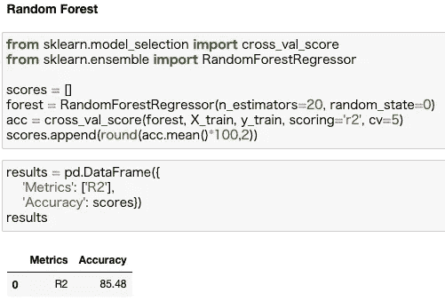

# 端到端数据科学项目:使用回归预测二手车价格

> 原文：<https://towardsdatascience.com/end-to-end-data-science-project-predicting-used-car-prices-using-regression-1b12386c69c8?source=collection_archive---------14----------------------->

图片来自 [Pixabay](https://pixabay.com/?utm_source=link-attribution&amp;utm_medium=referral&amp;utm_campaign=image&amp;utm_content=2755908) 的 [JOERG-DESIGN](https://pixabay.com/es/users/joerg-design-524252/)

# 介绍

> 大约[每年售出 4000 万辆二手车](https://static.ed.edmunds-media.com/unversioned/img/industry-center/insights/2019-used-vehicle-outlook-report-final.pdf)。有效的定价策略可以帮助任何公司在竞争激烈的市场中高效地销售其产品并获取利润。

在汽车行业，定价分析对于公司和个人在出售或购买汽车之前评估汽车的市场价格起着至关重要的作用。

我想通过这个数据科学项目实现两个主要目标。首先，根据历史数据，通过考虑一组特征来估计二手车的价格。第二，更好地了解有助于确定二手车价格的最相关特征。

# 数据

将用于该项目的数据可在 [*Kaggle*](https://www.kaggle.com/austinreese/craigslist-carstrucks-data) 和获得，这些数据来自 Craigslist，这是世界上最大的二手车销售网站。

该数据库由 423，857 行和 25 个特征组成，其中一个特征将是我们要预测的连续因变量(“价格”)。

数据库概述

# 方法学

**EDA**

数字特征在这个回归模型中起着很大的作用，所以很好地理解它们在数据库中的分布是很重要的。

数字特征的统计数据

我们的重点将是“价格”、“年份”和“里程表”。如上图所示，这三个特征的最大值/最小值和百分位数之间有很大的差异。这是异常值存在的一个指标，异常值会极大地阻碍我们模型的性能。它们将在以后处理。

**缺失值&重复值**

在了解了我们将要使用的数据库之后，务必检查是否有任何缺失值(NaN)。

数据库中某些要素的值缺失

大多数特性都有大量的缺失值，但是仅仅删除所有具有 NaN 值的行是不实际的，因为这样会使数据库变得过于稀疏。

现在，我将把它留在那里，只去掉一些不会带来任何附加值的功能。保留它们只会让模型更难解释数据库。

从数据库中删除的一组要素

最后，还需要检查数据库中是否有重复值。

在这种情况下，数据库中有几个副本。它们将通过删除现有的重复行来处理，但第一行除外，第一行将被保留。

处理数据库中的重复项

**特色工程**

首先，我将在“描述”列上使用**正则表达式**。此功能包含每辆二手车的广告文本。

目标是从那里获得关键信息，以便填充数据库中其他列的 NaN 值。我们要填充的列是那些具有分类值但没有太多唯一值的列:

使用正则表达式的模式匹配

完成此操作后，有值被不一致地添加。例如，我们在同一列中有这些类型的值:“awd”和“awd”。为了统一字符串，将使用 strip()方法。

处理不一致的数据输入

通过这个 Regex 步骤，数据库获得了成千上万的新条目，用一致的数据填充了大量缺失的值。由于我们不再需要“描述”功能，我将删除它。

下一步，是时候让**处理数据库中的离群值**了。将被处理的三列是:“里程表”、“价格”和“年份”。

让我们从想象前两个开始:

价格和里程表值的分布

由于“价格”在最小值和 25%百分位之间以及在最大值和 75%百分位之间有如此大的差异，我将在两端省去 10%的值。

价格两端的价值下降 10%

接下来，是时候关注“里程表”了。这个特性有 NaN 值，所以处理起来比较棘手。让我们用散点图来显示异常值。

显示里程表上的异常值

因为离群值开始于大约 3，000，000；我将放弃超过这个值的值。此外，去掉最小值(0)也是一个好主意，因为它与 25%的百分位数有很大不同。这样,“里程表”功能也已成功调整。

调整后的里程表功能

为了结束这一步，特征“年份”的异常值将以与“里程表”中相同的方式进行处理。

接下来，我想通过使用数据库中其他现有列的**来处理另外两个相关特性。它们是:“条件”和“标题 _ 状态”。它们非常相似，基本上告诉我们二手车的状态(干净、脏、新、好、坏……)。**

为此，我将使用“里程表”值。“里程表”功能是一个连续的功能，因此最好将其值分组到几个箱中作为参考。

标题 _ 状态与里程表

“title_status”的大部分值都是干净的，所以我将把“干净”添加到该列的所有 NaN 值中。接下来，是时候检查“状况”了:

状况与里程表

在这种情况下，值的差异更大。使用上面的图表作为指导，我将填写“条件”的 NaN 值。最后，因为“condition”和“title_status”是相互关联的，所以将它们合并到一个特性中是一个好主意。

填充 NaN 值和连接要素

最后，现在是时候再次查看缺失值图表了。我会应用**其他方法**来处理它们。

数据库中缺少值

考虑到丢失值的数量，我将把特性分成三个不同的组，并删除具有最多 NaN 值的“size”。

首先，NaN 值少于 5%的行将删除缺少值的行。

删除具有 NaN 值的行

第二，NaN 值小于 20%的那些将通过使用 fillna()函数填充。

在具有缺失值的要素中使用 fillna()

最后，最后一个特性“cylinders”将通过使用另一个列(“drive”)来处理，以推断它的值，因为我觉得它是模型的一个相关特性。

利用另一列填写 NaN 值

在本特性工程部分的结尾，将“区域”和“州”合并成一个特性是一个好主意，因为它们是紧密相关的。

将区域和州连接成一个特征

**分类变量编码**

在数据库中，既有数字变量，也有分类变量。但是，为了继续下面的步骤，需要将这些分类值编码成数字数据。这将在标签编码的帮助下完成。

分类变量编码

**相关性**

当两个变量高度相关时，它们对我们要预测的因变量的影响是一样的。在这种情况下，建议删除其中一个。

相关矩阵

在这种情况下，没有一个特性是高度相关的，所以我们让它们保持原样。

**造型**

是时候开始这个项目的建模了。这一次，我将只使用**随机森林回归**模型来获得“价格”预测。

> 随机森林算法是决策树的集合。对于我们的项目来说，它肯定会派上用场，因为它有能力处理具有更高维度的大型数据集，并且不允许在模型中过度拟合树。

为了开始建模，我们希望将数据库分为训练集和测试集。这项工作将以 80:20 的比例完成。像往常一样，我们将首先重新索引数据库，并将因变量“价格”作为最后一列，以便进行更简单的拆分。

重新索引并拆分成训练/测试集

在分割之后，由于独立特征的值存在很大的差异，因此有必要实现特征缩放。务必在拆分数据库后进行，以避免数据泄漏到机器学习模型中。

将特征缩放应用于 X_train 和 X_test

然后，我们使用交叉验证方法在训练集中拟合模型，以便更精确地估计模型的准确性。我将利用 R (R 平方)指标来评估模型的性能。

> R 是一个无标度分数，这意味着值太大或太小都没有关系，R 将总是小于或等于 1。越接近 1 越好。

顺便提一下，由于百分比在评估结果时更有洞察力，我将把我们从 R 得到的值转换成百分比。

基于 R 度量评估模型

我们一开始就获得了超过 85.48%的分数。一点也不差。但是我们可以通过调整超参数来进一步改善它。

一旦模型的超参数得到优化，就应该再次训练它(使用交叉验证)并再次检查它在训练集上的性能。

随机森林回归模型的超参数调整

从上面的图片中我们可以看到，在优化了超参数之后，分数变得更好了。

最后，一旦训练完成，模型已经从训练数据中学习，剩下的就是检查它在测试集中的表现如何。这将是我们模型的关键时刻。

对测试集的预测

我们的模型在训练集和测试集中的良好表现表明，结果似乎相当可靠。事实上，它在测试集中的预测更加准确(87.03%)，这一点尤其值得注意。

# 结果

对于这个项目，为了预测二手车的价格，我只使用了一个模型:随机森林回归变量。

它在如此大的数据集上表现出了出色的性能，并且在整个训练和测试过程中表现一致。更重要的是，测试集的结果优于训练集，其预测准确率为 87.03%。

该项目的目标之一是创建一个能够估计二手车价格的模型，我们已经实现了这个目标。

第二个目标是在估计因变量“价格”时，找出哪些特性是最相关的:

随机森林模型中每个特征的重要性

# 结论

通过这个项目，我们建立了一个模型，在给定一组特征的情况下，该模型可以以 87.03%的准确率预测二手车的价格。当公司和个人试图了解如何估计一辆汽车的价值时，这些信息可能具有巨大的价值，更重要的是，了解决定其定价的关键因素。

正如所料，到目前为止，在计算价格时，车辆的年份是主要因素，几乎占 43%，其次是里程表。有趣的是，我期望汽车的状态和里程表有很深的关联，但是在这两个指标之间的相关性差异上有很大的差距。

也就是说，这个地区似乎也起了作用，这完全有道理。可能会有更多的通用汽车在任何地方都受欢迎，但像跑车或敞篷车这样的专业汽车更适合温暖的地区，而大型卡车和 SUV 在寒冷的地方会发挥更好的作用。

掌握定价的艺术不是一件容易的事情，但是通过对历史数据的研究，有可能找到导致准确结果的模式。在出售或在市场上购买汽车之前，获得这些知识可以为你提供一个比较优势。

关于这个项目内核的更多信息，请访问:[https://github.com/josem-gp](https://github.com/josem-gp)