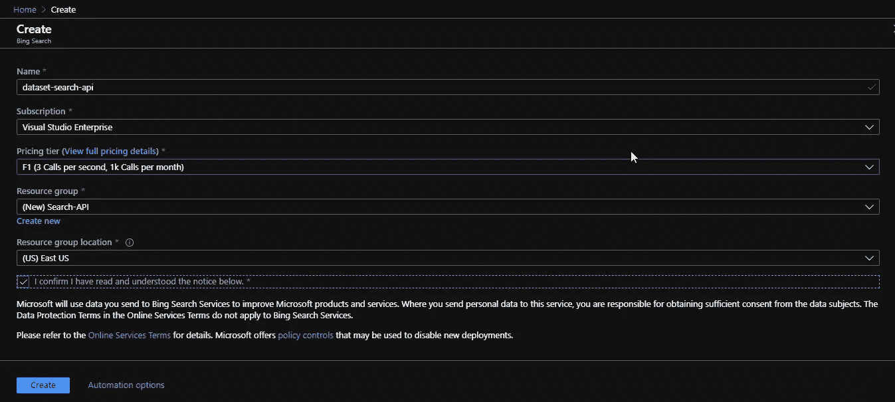
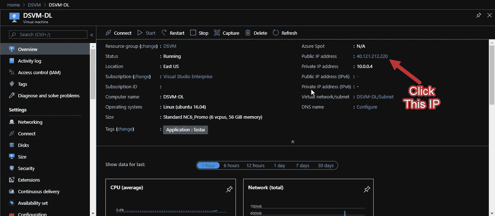
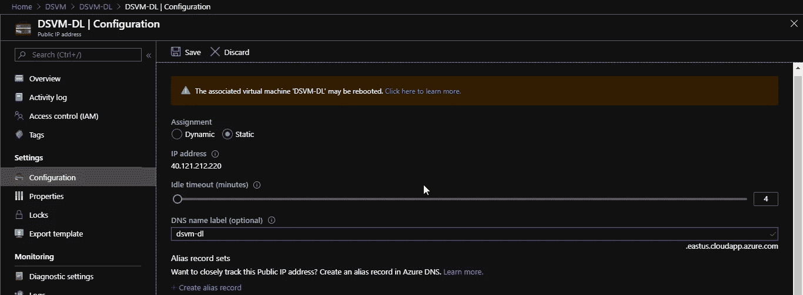
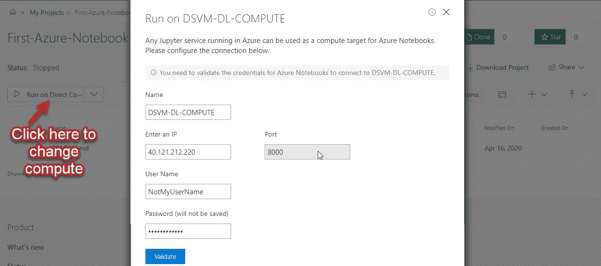
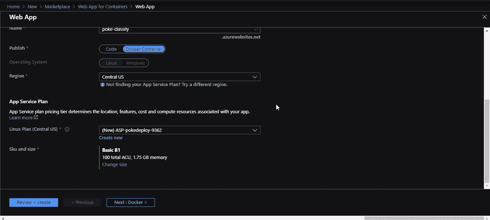
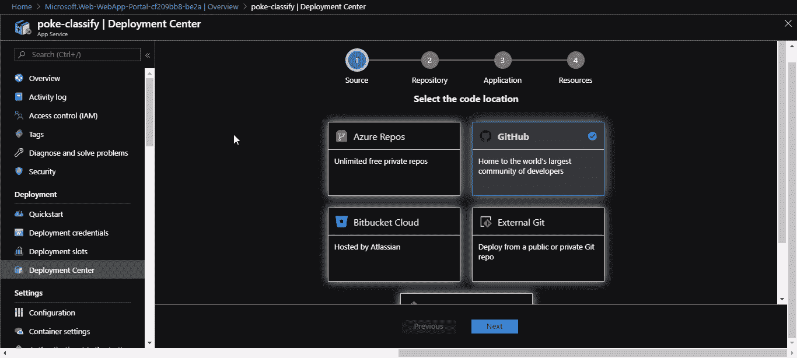

# 使用 Azure 的端到端深度学习教程

> 原文：<https://towardsdatascience.com/end-to-end-deep-learning-tutorial-using-azure-f7bb524f7277?source=collection_archive---------27----------------------->


在 Azure 上学习深度学习

## 了解如何设置深度学习工作区，构建自定义数据集，使用 azure pipelines 通过持续部署来培训和部署模型。

## 简介:

本文的目标是在 azure 上建立一个深度学习工作区，在 azure 上构建和部署端到端的深度学习项目。我们将首先构建一个定制的图像数据集，以在生产中部署模型。本文是由[微软学生合作伙伴](https://studentpartners.microsoft.com)(印度)项目发起的 MSP 开发者故事的一部分。

## 我们将会建造什么？

我们将构建一个口袋妖怪图像分类器来分类令人敬畏的新手皮卡丘、小火龙、杰尼龟和妙蛙种子。

mini-pokedex.azurewebsites.net[的现场演示](https://mini-pokedex.azurewebsites.net/)

## 我们将遵循的步骤:

1.  使用 Bing 图像搜索 API 构建自定义图像数据集
2.  使用 azure Data Science VM 设置我们的深度学习工作区
3.  使用快速人工智能在 Azure 数据科学虚拟机中构建和训练模型。
4.  构建一个 web 应用程序，通过 API 和 dockerizing 使用我们的模型。
5.  将 web 应用程序的 Docker 映像推送到 azure 容器注册表。
6.  从 azure 容器注册表在 Linux 容器 VM 中部署 web 应用程序。
7.  使用 azure 管道设置连续部署。

## 注意:

开始之前，请确保您在 Azure 上拥有一个有效订阅的帐户。如果你是 STEM 的学生，你可以使用 [Azure for Student](https://azure.microsoft.com/en-in/free/students/) s 免费订阅，或者你可以使用 [Azure 免费帐户](https://azure.microsoft.com/en-in/free/)。

## 步骤 1:使用 Bing 图像搜索 api 构建自定义图像数据集

我们将使用 Bing 图像搜索 API，转到 [Bing 图像搜索 API 页面](https://azure.microsoft.com/en-in/services/cognitive-services/bing-image-search-api/)，点击尝试 Bing 图像搜索并登录。然后通过填写必填字段来激活您的服务，如下所示:

给它一个名字，我把它命名为***dataset-search-API***，你可以根据它的可用性尝试任何不同的东西。选择您合适的订阅。对于 ***定价层，F1*** 将是合适的，因为它每月提供 1000 笔免费交易。创建一个 ***资源组搜索-API*** ，你可以给它起任何名字，但是在 Azure 中工作时要记住的重要一点是给资源组起一个合适的名字，因为你以后会使用资源组的名字来跟踪费用和删除资源。 ***为资源组选择一个位置*** ， ***接受条件*** ， ***点击创建*** 。然后 ***等待*** 创建您的资源。一旦创建了 ***，点击转到资源*** 。



创建阿炳图像搜索资源

*   你可以找到 bing 图片搜索资源页面的 API 键。
*   然后 git 克隆这个 repo:[image-dataset-bing-API](https://github.com/Akshay090/image-dataset-bing-api)
*   在 VS 代码中打开它，并创建一个名为。并将文件 [.env.example](https://github.com/Akshay090/image-dataset-bing-api/blob/master/.env.example) 的内容粘贴到其中。
*   然后从你的资源页面复制你的 bing 图片搜索 API 密匙并粘贴到。env 文件放在适当的位置。
*   用***python-m venv venv***创建一个虚拟环境
*   使用***venv \ Scripts \ activate . bat***(windows 中)或***source venv/bin/activate***(Linux 中)激活它
*   使用***pip install-r requirements . txt***安装依赖项
*   使用 python search_bing_api.py 这样的脚本—查询“妙蛙种子”
*   对杰尼龟小火龙的皮卡丘重复上述过程。
*   现在你有了一个名为 dataset 的文件夹，里面有每个口袋妖怪的图像。
*   浏览图片，删除那些你觉得不相关的。
*   像我在这里做的那样，将文件夹(数据集)添加到一个新的 git repo 中 [pokemon-image-dataset](https://github.com/Akshay090/pokemon-image-dataset)

现在 GitHub 中有了一个带有自定义图像的 repo，让我们开始下一步:

## 第二步:使用 azure Data Science VM 建立我们的深度学习工作区

我们将制作一个 NC6 宣传片，这是一个带有 1 个 K80 NVIDIA GPU (1/2 物理卡)的 Linux 虚拟机，它是 12 GB GPU 和 6 个 CPU 内核。

你可以在这里了解更多关于虚拟机的信息。

如果你需要一个详细的安装程序，你可以参考[快速人工智能 azure 页面](https://course.fast.ai/start_azure.html)，否则你可以遵循以下说明。

*   我们将使用 fast ai 团队创建的模板来设置虚拟机:[单击此链接](http://aka.ms/dsvm/fastai)将带您进入虚拟机创建页面。
*   创建一个名为 **DSVM** 的**新资源组**，根据您的喜好设置位置。
*   **设置**管理员**用户名**(小写或 Jupyter Hub 登录失败，出现 500 内部服务器错误)，设置**密码**
*   设置适当的虚拟机名称，我将其命名为 ***DSVM-DL*** 并在虚拟机大小中选择 NC6 Promo
*   选择接受条款，然后单击购买。

现在等待，直到资源被创建。单击通知图标以了解它是否已创建，并在创建时单击转到资源组。

在“resource，group”页面中，单击您在上面为其命名的虚拟机。并单击您的公共 IP，如下图所示



单击 ip 将其设置为静态

点击 IP 将带您到一个配置为您的公共 IP，现在改变分配为静态从动态，你也可以设置一个 DNS 名称标签。由于这一步，您的虚拟机 IP 将不会改变后，重新启动。该页面将如下图所示



设置静态 IP

现在我们已经完成了 DSVM 的设置，让我们进入下一步

## 步骤 3:使用快速人工智能在 Azure 数据科学虚拟机中构建和训练模型。

由于你已经设置了一个带 GPU 的 DSVM，你可以通过 ssh 将带 **azure 笔记本**或**使用到 DSVM 中并使用**。我推荐第二种方法，因为它给你更多的灵活性。首先，让我向您展示 azure notebooks 方法，然后我们将开始使用带有 SSH 的 VM。

**在 Azure 笔记本上使用 Azure DSVM。**

*   前往[notebooks.azure.com](https://notebooks.azure.com/)，登录并创建一个用户 id。
*   然后单击我的笔记本并创建一个新笔记本。
*   现在，要在 azure 笔记本中使用带有 GPU 的 VM，请将选项 Run on Free Compute 更改为 Run on Direct Compute。
*   现在你可以开始在带有 GPU 的 DSVM 上使用 azure 笔记本了。



更改计算步骤的屏幕

**SSH 进入 DSVM，从那里使用**

这种方法比上面的方法更灵活。对于 **windows 用户，**我推荐**使用 wsl** 在这一步之前，只需**在当前 shell** 中键入 wsl 即可启动。

要连接到您的虚拟机，请使用:

```
ssh <username>@<VM Public IP> and enter password
```

用下面的命令设置 Jupyter 笔记本并启动 Jupyter

```
jupyter notebook password
// Enter password:
// Verify password:jupyter notebook --port 8888
```

创建从虚拟机到 localhost:9999 的 ssh 隧道

```
ssh -L 9999:127.0.0.1:8888 <username>@<VM Public IP>
```

现在进入 [localhost:9999](http://localhost:9999/) 使用 jupyter 笔记本，输入密码开始使用。

你可以创建一个文件夹，制作一个名为 pokedex-dl 的笔记本，然后开始工作。

**注意:**请参考 [pokedex.ipynb](https://github.com/Akshay090/Pokedex-DL/blob/master/pokedex.ipynb) 训练并将您的模型导出到 outputs 文件夹。我已经在笔记本上解释了每一个步骤，如果你有任何疑问，请在下面评论。

跟随 [pokedex.ipynb](https://github.com/Akshay090/Pokedex-DL/blob/master/pokedex.ipynb) 之后，您将有一个名为 poke_predictor_resnet34 的输出文件夹，从 Jupyter 笔记本下载。 ***上传模型到 Dropbox******获取可共享链接*** 。

## 步骤 4:构建一个 web 应用程序，通过 API 使用我们的模型，并对其进行 dockerizing。

第一个 git 克隆:[pokedex-在本地部署](https://github.com/Akshay090/pokedex-deploy)。用你的共享链接替换 [server.py](https://github.com/Akshay090/pokedex-deploy/blob/master/app/server.py) 中的 dropbox 链接。你也应该根据你的喜好改变 index.html。

您可以在 docker 中运行 [pokedex-deploy](https://github.com/Akshay090/pokedex-deploy) ,使用

```
docker build -t poke-image . && docker run --rm -it -p 5000:5000 poke-image
```

也可以用自己喜欢的图像名称替换`poke-image`。

现在我们已经准备好了 docker 图像，我们可以进入下一步了

## 第五步:将 web 应用的 Docker 映像推送到 azure 容器注册表。

首先我们需要设置 azure CLI，请咨询[docs.microsoft.com/en-us/cli/azure/install-azure](https://docs.microsoft.com/en-us/cli/azure/install-azure-cli?view=azure-cli-latest)。给 Windows 用户的提示:-试试 [Chocolatey](http://chocolatey.org/) 你可以参考[chocolatey.org/packages/azure-cli](https://chocolatey.org/packages/azure-cli)进行安装。

别忘了`az login`

***现在我们将使用 Azure CLI*** 创建一个私有容器注册表。容器注册表基本上是 docker 图像的 GitHub，docker hub 是一个公共容器注册表。

如果您需要以下步骤的更多细节，请参考[容器-注册表-入门-azure-CLI](https://docs.microsoft.com/en-us/azure/container-registry/container-registry-get-started-azure-cli)

```
# create a resource group named container_registry_rg
az group create - name container_registry_rg - location eastus# create container registry named pokeRegistry
az acr create --resource-group container_registry_rg --name pokeRegistry --sku Basic# Login to your container registry
az acr login --name pokeregistry# tag your container registry in following format,
docker tag poke-image pokeregistry.azurecr.io/poke-image:v1# Push image to container registry, it will take a while
docker push pokeregistry.azurecr.io/poke-image:v1# You can verify if it's uploaded by 
az acr repository list --name pokeregistry --output table# Important Please don't forget this,important for deployment
az acr update -n pokeregistry --admin-enabled true
```

## 步骤 6:从 azure 容器注册中心在 Linux 容器 VM 中部署 web 应用程序。

在 portal.azure.com[去天蓝色](https://portal.azure.com/)。并选择**创建资源**、 **Web** ，然后选择 **Web App for Containers** 或者你可以直接[点击这个链接去那里。](https://portal.azure.com/#blade/Microsoft_Azure_Marketplace/MarketplaceOffersBlade/selectedMenuItemId/home/searchQuery/Web%20App%20for%20Containers)

点击 create，在页面中填写详细信息并创建一个新的资源组。请**更改** ***Sku 和尺寸*默认选项:B1 基本**在开发/测试中，因为它将足以满足基本需求。不要忘记在 Docker 标签中将图像源设置为 Azure 容器注册表。



使用容器的 Web 应用程序进行部署

完成后，点击“转到资源”,您可以在 **URL** 找到您的网络应用程序 URL

恭喜你现在已经部署了你的深度学习模型🚀

## 步骤 7:使用 azure 管道设置连续部署。

现在在 azure 的 web 应用页面上，你会发现一个叫做**部署中心的东西，**这是 azure 中最酷的东西之一。它将帮助我们在 Azure 中创建 CI/CD 管道。

*   单击部署中心
*   选择源代码位置(Github)并授权它
*   选择您的存储库
*   它会自动检测 docker 文件，只需点击下一步
*   创建 Azure DevOps 组织并选择使用容器注册表中的现有组织，单击完成
*   完成页面后，单击“在中发布管道”

以上步骤可以在下面的 gif 中看到:



azure 部署中心

现在你必须在[dev.azure.com](https://dev.azure.com)如果不去那里，在 dev.azure.com[的组织内部找到你的项目](https://dev.azure.com)。

通过当前的设置，我们已经为我们的项目建立了 CI/CD 管道，这要感谢部署中心。

如果你对你的代码做了任何修改，并把它推送到 GitHub，它会构建一个新的镜像，把它添加到你的容器注册表中并进行部署。

但是我们现在有两个问题需要解决

*   想象一下，你不断地修改你的代码，你的容器注册表(10 GB)将被所有未使用的图片使用
*   如果您编辑您的 Readme.md，它将构建一个新的映像并部署它。

要解决这两个问题，请访问您在 dev.azure.com[的组织内部的项目页面，并观看下面的视频。](https://dev.azure.com)

哇哦。如果你到了这里，恭喜你🎉。如果你有任何疑问，请在评论区发表。