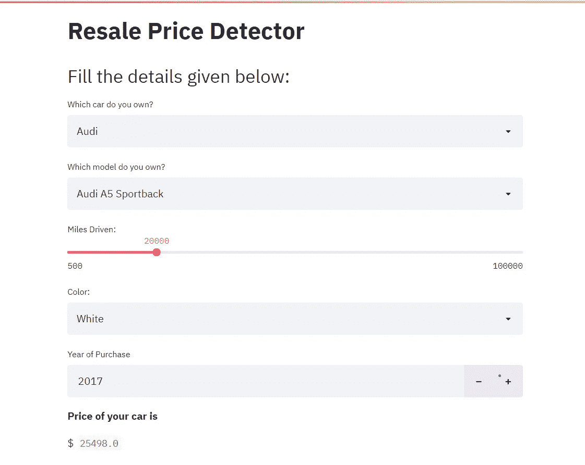
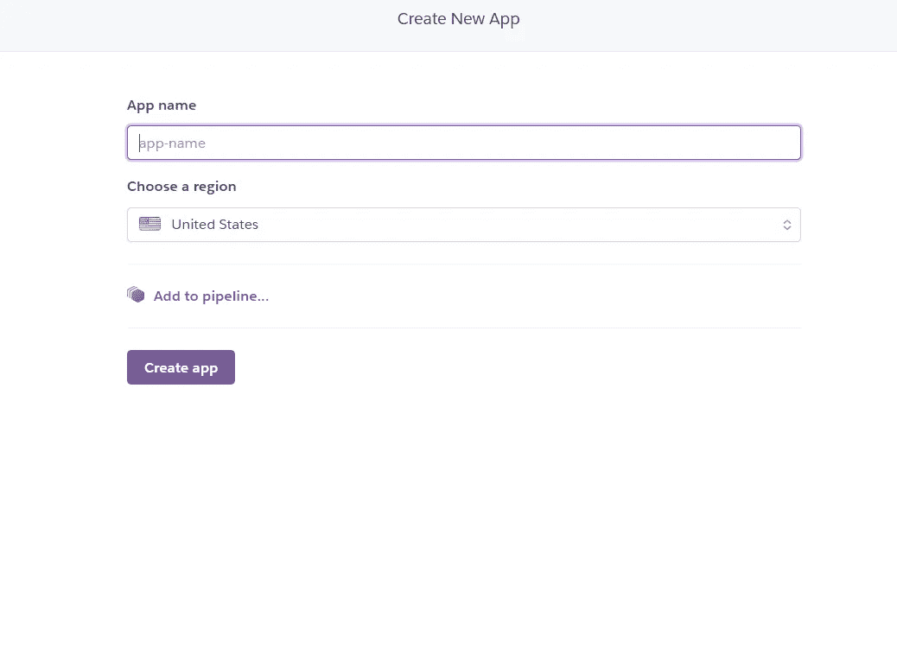
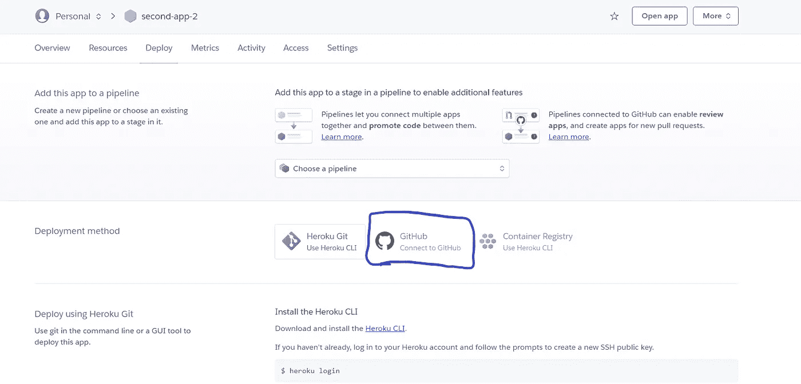
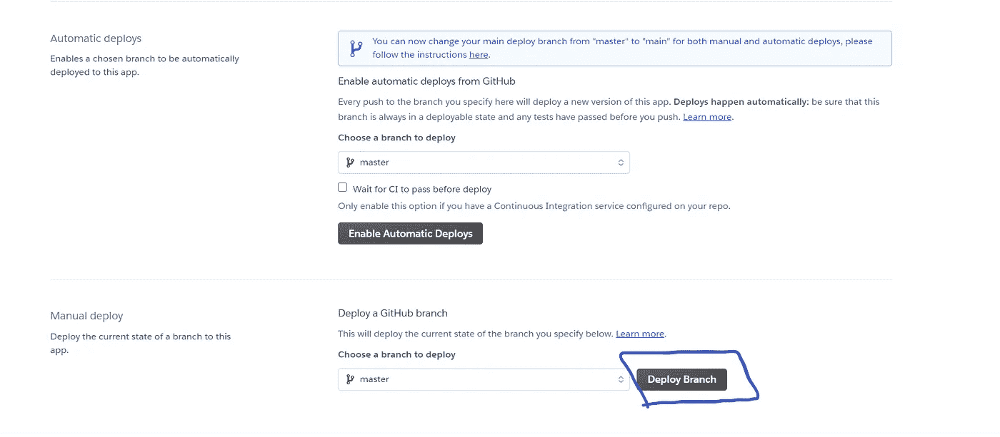

# 使用 Streamlit 和 Heroku 进行部署

> 原文：<https://towardsdatascience.com/end-to-end-deployed-project-machine-learning-part-2-43ddb1bc43d0?source=collection_archive---------74----------------------->

## 每一个渴望进入数据科学领域的新手，都有一大堆项目放在自己的桌面上，无人触及。我们把它们放到网上怎么样？？


在 [Unsplash](https://unsplash.com?utm_source=medium&utm_medium=referral) 上由 [Minh Pham](https://unsplash.com/@minhphamdesign?utm_source=medium&utm_medium=referral) 拍摄的照片

本文中使用的所有代码和截图都来自我今年早些时候参与的一个个人项目。GitHub 回购的代码在这里[被链接](https://github.com/SandeepRam31/ReSaleCars)，部署的模型在这里[被链接](https://resalecars.herokuapp.com/)

# 使用 STREAMLIT 构建 UI:

首先，您需要将 streamlit 安装在您的系统上，或者您正在进行这个项目的虚拟环境中。

如果您没有安装 streamlit，请打开命令提示符并键入:

```
 pip install streamlit
```

一旦安装了 streamlit，您应该查看 streamlit 的官方文档，以熟悉其 python 库提供的各种小部件。我将从以下我认为最有用的小部件开始:

1.  要输入纯文本

```
streamlit.write('Text data')
```

2.创建下拉列表

```
choices = ['1', '2', '3']
selected_ch = streamlit.selectbox('Pick a number', choices)
```

3.要创建滑块

```
num = streamlit.slider('Enter num', min_val, max_val, step)
```

4.接受输入

```
inp = streamlit.text_input('Enter some text here', default)
num = streamlit.number_input('Number', default)
```

使用上面的小部件，我们可以为我们的应用程序创建一个简单的 UI。当我第一次尝试这样做时，我用了不到 15 分钟就完成了整个 UI！这真的没有那么难！

如果您对此有任何疑问，请查看 streamlit 的[官方文档](https://www.streamlit.io/)。

将它保存在一个. py 文件中(比如“stream.py”)。



使用 streamlit 构建的 UI 示例[图片由作者提供]

# 部署到 Heroku:

如果这是你第一次部署到 Heroku，这可能会有点混乱。我将带你完成这最后一步，之后你的网站将在互联网上直播！这难道不令人兴奋吗？？？我们开始吧！

有很多方法可以做到这一点。然而，我将用最简单的方法开始

*   第一步:创建一个 Heroku 账户，如果你还没有的话

这很简单。转到 [Heroku 注册页面](https://signup.heroku.com/)并填写那里给出的表格。

*   第二步:创建一个新的应用程序，并给它一个合适的名字。

单击仪表板上的“新建”选项。您将被重定向到此页面



作者图片

*   步骤 3:转到存储 stream.py 文件的文件夹

创建一个名为' Procfile '的文件，这是一个文件类型，因此，没有任何扩展名，如'。txt '或'。xlsx。在 Procfile 中键入以下内容

```
web: sh setup.sh && streamlit run stream.py
```

*   第 4 步:在同一个目录中创建一个名为 requirements.txt 的文件，并列出到目前为止您在项目中使用的所有模块。
*   步骤 5:创建一个名为“setup.sh”的文件，并用以下内容填充它:

```
mkdir -p ~/.streamlit/ 
echo "\
[server]\n\
headless = true\n\
port = $PORT\n\
enableCORS = false\n\
\n\
" > ~/.streamlit/config.toml
```

*   步骤 6:将整个文件夹上传到 GitHub repo 中，比如 [this repo](https://github.com/SandeepRam31/ReSaleCars) 。
*   第七步:打开你在 Heroku 上创建的新应用，点击“连接到 GitHub”图标



单击突出显示的图标[作者图片]

*   第 8 步:输入你的 GitHub 库名并点击连接
*   步骤 9:单击部署分支



[图片由作者提供]

瞧啊。！你的网站现在必须是活的！如果你已经做到这一步，请与我联系或留下评论，让我知道这篇文章是否对你有帮助。祝你未来的项目一切顺利。