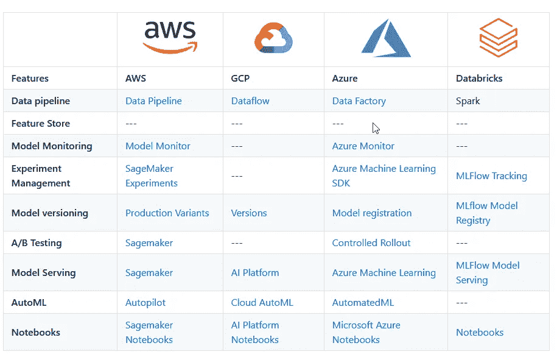

# 端到端机器学习平台比较

> 原文：<https://towardsdatascience.com/end-to-end-machine-learning-platforms-compared-c530d626151b?source=collection_archive---------38----------------------->

## 对业界领先的机器学习平台的简短对比。

由 [Martin Reisch](https://unsplash.com/@safesolvent?utm_source=unsplash&utm_medium=referral&utm_content=creditCopyText) 在 Unsplash 上拍摄的照片

任何参与将机器学习模型部署到生产中的组织都知道它会带来业务和技术挑战，并且通常会通过使用机器学习平台来解决这些挑战中的一些挑战，并辅以一些 [MLOps](https://martinfowler.com/articles/cd4ml.html) 流程来提高团队的成熟度和治理。

对于在生产中运行多种模型并寻求采用 ML 平台的组织，他们通常要么在内部构建一个端到端的 ML 平台([优步](https://eng.uber.com/michelangelo-machine-learning-platform/)、 [Airbnb](https://databricks.com/session/bighead-airbnbs-end-to-end-machine-learning-platform) 、[脸书学习者](https://engineering.fb.com/core-data/introducing-fblearner-flow-facebook-s-ai-backbone/)、[谷歌 TFX](https://www.tensorflow.org/tfx) 等)，要么购买。在这篇文章中，我将比较一些你可以买到的 ML 平台。

# 什么时候需要一个端到端的 ML 平台？

你应该先回答另一个问题。*“你想解决什么问题？”*。如果你想不出任何现存的问题，那么实施新技术就毫无意义。然而，如果您遇到了一些问题，例如，跟踪生产中的模型或版本，增加对 ML 实验的管理，随着数据科学团队的增长共享笔记本电脑，或者主动监控数据漂移和/或功能漂移，那么您很可能正在或即将走上实施 ML 平台组件的道路。

为了帮助这个过程，我对我认为的 ML 平台的关键组件进行了高层次的比较。

# 比较

以下比较考虑了开箱即用的功能。例如，不部署开源解决方案来弥补功能上的差距或自行开发。

点击此处查看链接:[https://gist . github . com/ash his/f54a 523 bb 5390d 55 a 46 FCE 415 bcdc 691](https://gist.github.com/AshHimself/f54a523bb5390d55a46fce415bcdc691)

我在从 github 嵌入表格时遇到了一些问题，所以如果你想浏览上表中的链接，请[点击这里](https://gist.github.com/AshHimself/f54a523bb5390d55a46fce415bcdc691)。

# 特色店？

您可能已经注意到，没有一个解决方案提供功能存储。特色商店是一个相当新的组成部分，我怀疑在不久的将来会有更多的组织将它加入到他们的 ML 平台中。他们有一些可用的开源解决方案，在这个神奇的[网站](http://featurestore.org/)上有更多的研究资料。记住，在把时间和金钱投入到一个无关紧要的问题之前，把注意力集中在你要解决的问题上。

> *“你想解决什么问题？”*

# 结论

在这篇短文的结尾，我想强调一些其他值得一提的产品，但它们没有包括在这个比较中。 [DataRobot](https://www.datarobot.com/) ， [IBM Watson Studio](https://www.ibm.com/au-en/cloud/watson-studio) ， [H2o.ai](https://www.h2o.ai/products/h2o/) ，[数据砖块](https://databricks.com/product/unified-data-analytics-platform) & [Cloudera](https://www.cloudera.com/products/machine-learning.html) 。随着机器学习领域的迅速变化，我将努力在未来几个月保持这篇文章的最新状态。你不必听我的，只要看看今年 Spark + AI 峰会上 Databricks 的 MLflow 博客上的所有[公告](https://databricks.com/blog)就知道了！

如果您想将您的产品添加到这一比较中，请通过我的 LinkedIn 联系我。

*关于我:我是数据&机器学习的产品负责人，生活在商业、数据和机器学习的交汇点。想联系的可以在*[*LinkedIn*](https://www.linkedin.com/in/ashleygsmith/)*上联系我。*