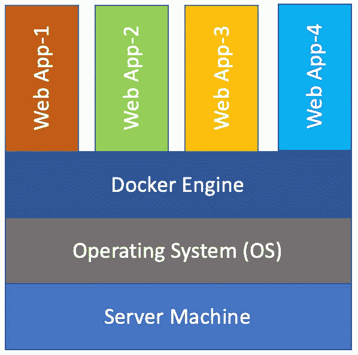
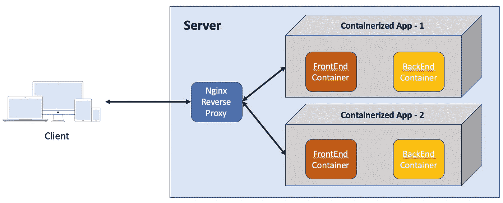
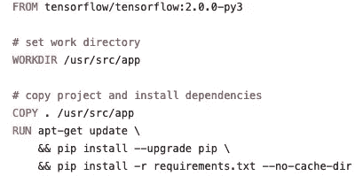
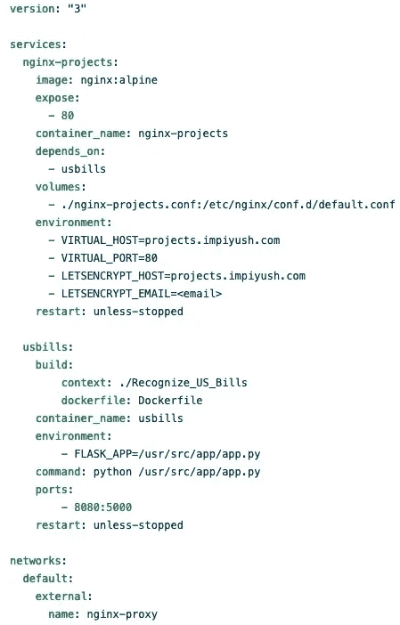

# 端到端机器学习项目:第二部分

> 原文：<https://towardsdatascience.com/end-to-end-machine-learning-project-627ed48f8109?source=collection_archive---------55----------------------->


杰克·安斯蒂在 [Unsplash](https://unsplash.com?utm_source=medium&utm_medium=referral) 上的照片

在[之前的帖子](/end-to-end-machine-learning-project-part-1-806d04da8deb)中，我们看到了我如何训练一个图像分类模型，从数据准备开始到训练模型的不同迭代，都使用了*卷积神经网络*和*转移学习*来获得一个对美钞进行分类的最终模型。如果你还没有，我建议你先浏览一下那篇文章，然后再来看这篇文章。

> [*Part-1(前一篇)*](/end-to-end-machine-learning-project-part-1-806d04da8deb) *:准备数据并训练图像分类模型
> Part-2(后一篇):使用 Flask 和 Docker 部署模型*

训练完模型后，下一个挑战就是展示它。我不想在云资源托管上花费太多，所以我尝试了许多不同的选项，但找不到一个看起来足够容易快速启动和运行的选项。相信我，当我说*有大量的资源和教程讨论如何创建和训练你的深度学习模型，但只有少数资源谈论部署这些模型*。

# 用什么“工具”？

当我接近完成这个模型的时候，这个问题在我的脑海里打转。我知道我想部署这种模式，但不确定平台——它应该是一个本地移动应用程序还是一个 web 应用程序。在进一步讨论之后，我选择了一个快捷的 web 应用程序，这样就可以通过浏览器从任何设备访问它。

我选择了用[*Flask*](https://flask.palletsprojects.com/en/1.1.x/)*—*一个轻量级的 [WSGI](https://wsgi.readthedocs.io/) web 应用框架。它是可用的最流行的 Python web 应用程序框架之一，以其简单易用以及能够扩展以构建更复杂的应用程序而闻名。

对于这个部署，我选择使用我现有的云服务器— [*a Nanode*](https://www.linode.com/products/nanodes/) ，以避免投资额外的云资源，并决定采用基于容器的方法。

> 容器是一个标准的软件单元，它将代码及其所有依赖项打包，以便应用程序能够快速可靠地从一个计算环境运行到另一个计算环境。([来源](https://www.docker.com/resources/what-container))

我决定使用 [*Docker、*](https://www.docker.com/) *，它提供了一种使用公共运行时在同一台机器上运行多个容器的方法，即* [*Docker 引擎*](https://www.docker.com/products/container-runtime) *。*



图 1:使用 Docker 的容器化应用程序

对于托管应用程序，我选择了 Nginx，它提供了一个代理服务器来托管您的 web 应用程序。

> NGINX 是一个免费、开源、高性能的 HTTP 服务器和反向代理，以及一个 IMAP/POP3 代理服务器。NGINX 以其高性能、稳定性、丰富的特性集、简单的配置和低资源消耗而闻名。([来源](https://www.nginx.com/resources/wiki/))

# 构建基于 Flask 的 web 应用程序

我发现这个非常有用的 [GitHub 项目](https://github.com/mtobeiyf/keras-flask-deploy-webapp) [1],它提供了一个简单的模板来使用 *Flask* 将你训练好的图像分类模型部署为一个 web 应用。我对[1]中的代码做了一些修改，通过加载我训练过的模型(我正在使用一个*)使它特定于我的模型的目标。tf* 模型而不是使用 *.h5* 文件)、设置输出类名、设置成功预测的概率阈值等。所有这些更改都是对作为 flask web 应用程序主要后端的 *app.py* 文件进行的。

我还对这个项目的 *CSS(网页样式)和 JavaScript 文件*做了一些小的改动。

你可以参考这个项目的[我的 GitHub 库的所有这些变化。](https://github.com/impiyush/Projects/tree/master/Recognize_US_Bills)

# 设置服务器(正确…)

这是这个部署难题中最重要的一块，我可能花了最多的时间来研究、完成和设置它，甚至比构建模型本身还多。

第一步是根据操作系统(OS)在您的服务器上安装最新版本的 Docker。我有一个 Ubuntu 盒子作为我的服务器，所以我按照这个快速[指南](https://www.linode.com/docs/applications/containers/how-to-install-docker-and-pull-images-for-container-deployment/) [2]安装 Docker，这是一帆风顺的。

下一步是找到一种方法，使用多个 docker 容器在同一服务器上部署不同的应用程序。经过大量的谷歌搜索，我偶然发现了这篇令人惊叹的[文章](https://olex.biz/2019/09/hosting-with-docker-nginx-reverse-proxy-letsencrypt)【3】，它与我试图实现的目标相似，作者用非常好和简单的方式解释了这一切。



图 2:使用 Nginx 反向代理和 Docker 的部署

这里，nginx 反向代理充当这个设置的*主*容器，监听外部端口 80 (HTTP)和 443 (HTTPS)，充当世界和*从*容器之间的通信媒介。*从*容器本身的内部工作是隐藏的，用户在访问这些应用程序时看不到任何区别。

按照[3]中的[示例 docker-compose.yml](https://olex.biz/2019/09/hosting-with-docker-nginx-reverse-proxy-letsencrypt/#nginx-reverse-proxy-and-ssl) ，我为充当*主容器的服务器设置了我的 nginx 反向代理和 SSL 版本，同时按照 docker-compose 中的定义设置了网络。*

下一步是创建一个*从属容器*，它将托管我的 web 应用程序。为此，我基于[3]和这个 [post](https://dev.to/ishankhare07/nginx-as-reverse-proxy-for-a-flask-app-using-docker-3ajg) [4】的组合创建了一个容器应用程序，它使用 docker 文件来设置承载项目的容器。基于我的项目需求，我修改了 docker-compose 和 Dockerfile。



图片-3: Dockerfile(作者提供图片)

项目容器基于 docker hub 的*tensor flow-2 . 0 . 0-py3 docker image*，使用 python3 和 tensorflow-2.0。点击这里查看你可以在项目中使用的其他 tensorflow 图片列表。下载完基础映像后，我将项目的 flask 应用程序和模型复制到这个容器中，并使用 pip 安装运行项目的需求。



图 4: Docker 撰写(作者提供照片)

最终的 docker-compose 文件使用上述 docker 文件来创建一个名为 *usbills* 的容器，该容器托管模型和 web 应用程序。它还创建了一个 nginx 服务，这个服务*依赖* *依赖**usbills*容器，也就是说，如果构建 us bills 容器时出现问题，nginx 容器将不会被创建。

这个 nginx 容器的 environment 部分设置了一个 VIRTUAL_HOST，它是这个 web 应用程序的 DNS 名称，一旦部署了这个容器，就可以访问它。*这个 nginx 容器充当从容器，并根据从服务器主容器接收的请求工作。*

一旦创建了这两个文件，并且我确保了*主容器*正常工作，那么只需编写一行命令就可以托管这个应用程序了。

```
$ docker-compose up -d
```

# 结论

如上面的 docker-compose 所示，通过访问这个[链接](https://projects.impiyush.com/)，可以从任何设备和浏览器访问这个 web 应用程序。在我最终建立和部署这个模型之前，我花了很多时间*搜索、阅读、理解、尝试和失败。这种多容器部署方法还为将来在同一台服务器上使用类似的 docker-compose 设置轻松部署任何其他应用程序奠定了基础。*

希望您喜欢这个两部分的系列。我知道这种方法可能不适合每个人，但希望它能帮助那些和我处境相同的人，他们正在寻找部署我训练有素的模型的方法，而不必花费大量的云资源。请随意使用这种方法来共享您的模型部署的链接，或者如果您有任何其他比这种方法更好的方法。

*不断学习，打造酷炫模型。下次见…*

# 参考

[1] [用 flask 作为 web app 在 10 分钟内部署 Keras 模型](https://github.com/mtobeiyf/keras-flask-deploy-webapp)
【2】[如何安装 Docker 并拉取映像进行容器部署](https://www.linode.com/docs/applications/containers/how-to-install-docker-and-pull-images-for-container-deployment/)
【3】[托管多个站点使用 Docker 和 NGINX 反向代理使用 SSL](https://olex.biz/2019/09/hosting-with-docker-nginx-reverse-proxy-letsencrypt/)
【4】[NGINX 作为 flask app 的反向代理使用 Docker](https://dev.to/ishankhare07/nginx-as-reverse-proxy-for-a-flask-app-using-docker-3ajg)
【5】[什么是容器？](https://www.docker.com/resources/what-container)