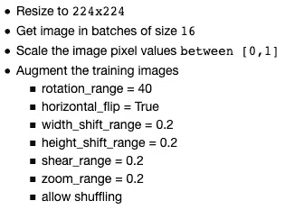
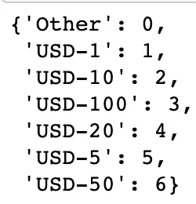
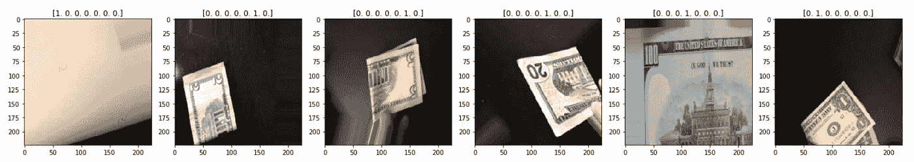
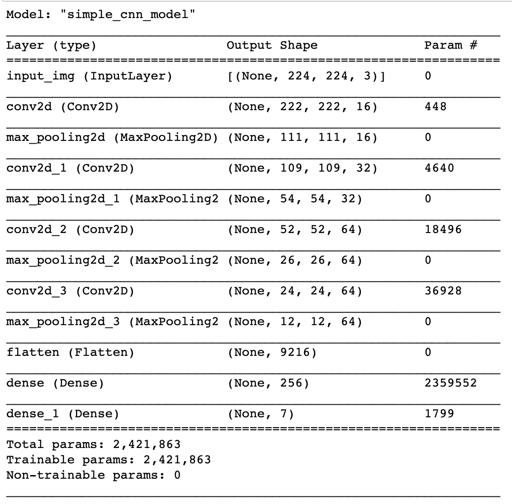
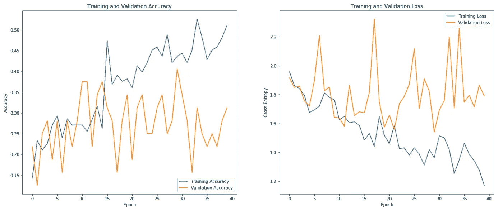
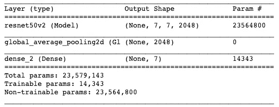
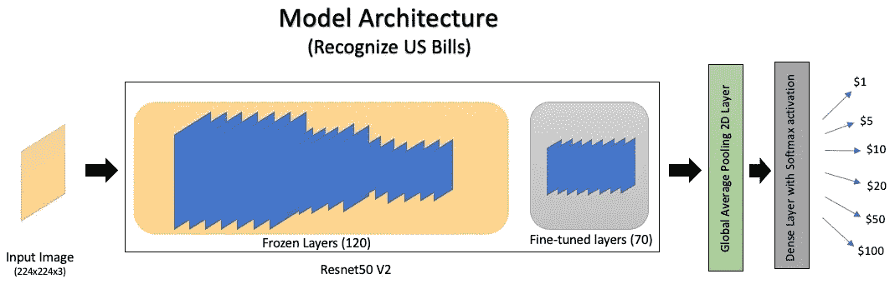
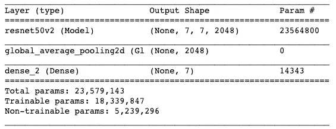
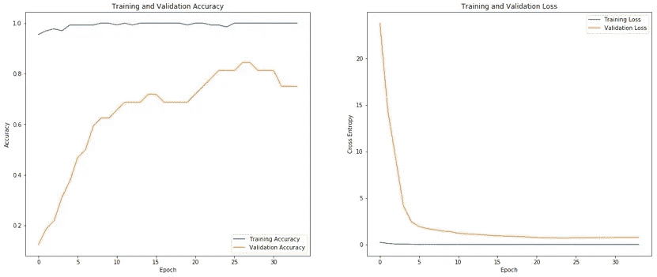

# 端到端机器学习项目:第 1 部分

> 原文：<https://towardsdatascience.com/end-to-end-machine-learning-project-part-1-806d04da8deb?source=collection_archive---------50----------------------->

比约恩·斯内尔德斯在 [Unsplash](https://unsplash.com?utm_source=medium&utm_medium=referral) 上的照片

***端到端机器学习*** *关注的是准备你的数据，在上面训练一个模型，然后部署那个模型*。这两部分系列的目标是展示如何为图像分类模型开发和部署端到端的机器学习项目，并使用*迁移学习*。

尽管有大量的其他在线资源向您详细展示了如何构建您自己的模型，但是很少有资源深入研究如何部署这些模型。本文是第二部分的前身，第二部分将展示部署步骤。如果你已经熟悉构建这样一个模型，并且正在寻找如何部署它的方法，那么我建议你浏览一下这篇文章，看看[第 2 部分](/end-to-end-machine-learning-project-627ed48f8109)。

> 第一部分(本文):准备数据并训练图像分类模型
> [第二部分](/end-to-end-machine-learning-project-627ed48f8109):使用 Flask 和 Docker 部署构建好的模型

***机器学习*** 模型目前被广泛用于构建聊天机器人、语音助手、无人驾驶汽车等。一个具体的进步是在图像识别和分类领域。[卷积神经网络(CNN)](https://en.wikipedia.org/wiki/Convolutional_neural_network)尤其被证明在从图像中学习方面非常有帮助，这导致了在创建最先进模型方面的重大突破，如 [Resnet](https://arxiv.org/abs/1512.03385) 、 [Alexnet](https://papers.nips.cc/paper/4824-imagenet-classification-with-deep-convolutional-neural-networks.pdf) 、 [Inception](https://arxiv.org/abs/1409.4842) 等。这已经被证明在 [Imagenet 数据集](http://www.image-net.org/)上对图像进行分类时非常有效。

在这篇文章中，我们将看到如何从头开始训练一个图像分类模型，并使用 Resnet 模型中预先训练好的权重。这种技术称为*迁移学习，非常受欢迎，因为它有助于使用使用大得多的数据集和计算资源训练的权重，以最小的变化应用于另一个数据集。通常，您只需根据数据集更改输出图层，就可以从这些预训练的权重中获益。这个项目中模型的目标是*对不同的美钞*进行分类，并使用 ***Tensorflow 2.x*** 和 ***Keras 构建。****

# *要求*

*第一个挑战是收集数据。由于找不到任何适合这个项目的数据集，我最终拍摄了不同美钞的照片来创建我自己的数据集。该最终数据集包含大约 *180 幅图像*，其中包括一些负图像，即没有任何美钞的图像，因此当图像中有美钞时，模型可以更好地区分。*

*我使用[***paper space Gradient***](https://gradient.paperspace.com/)*来训练模型，这非常类似于 Google Colab，并提供免费的 GPU 和基于 Jupyter 笔记本的环境来训练模型。*在我看来，这上面的免费 GPU 比 Google Colab 里面提供的好一点*。**

# **数据准备和加载**

**由于这些图像的大小都不同，第一步是做一些数据准备，并将它们的大小调整为相同的大小。Resnet 期望输入图像大小为 **224x224** ，因此我调整了数据集中图像的大小以匹配。我还使用*数据扩充*技术来补充我的数据集，这也有助于*减少过度拟合*。**

> *****数据扩充*** 通过应用产生看起来可信的图像的随机变换，帮助从现有训练样本生成更多训练数据。*目标是在训练时，你的模特永远不会两次看到完全相同的图片。这将模型暴露给数据的更多方面，从而允许它更好地进行归纳。***

**如下图 1 所示，对图像进行了处理和加载。**

****

**图片-1:数据准备步骤(作者提供图片)**

**20%的可用图像，没有增强，被留在一边用于 ***验证*** 。**

> ***重要的是保持验证集不变，以便更好地评估您训练的模型。***

**剩余的图像用于训练模型。类别标签采用*一键编码。***

****

**图片-2:班级指数(作者照片)**

****

**图 3:可视化数据集(作者照片)**

# **训练一个简单的 CNN 模型**

**既然我已经加载并扩充了数据集，下一步就是训练模型。我首先创建一个简单的 CNN 模型，它有一个由 4 个卷积层和最大池层组成的集合，然后是一个带有 T2 激活函数的输出层。**

****

**图 4:简单的 CNN 模型架构(作者拍摄)**

**我把这个模型设定为 *100 个* [*纪元*](https://machinelearningmastery.com/difference-between-a-batch-and-an-epoch/) *。*我还为 [***使用了一个回调函数，提前停止***](https://www.tensorflow.org/api_docs/python/tf/keras/callbacks/EarlyStopping)**(*[*more info*](https://machinelearningmastery.com/how-to-stop-training-deep-neural-networks-at-the-right-time-using-early-stopping/)*)****，*** 当它看到模型没有进一步改进并且开始[过拟合](https://machinelearningmastery.com/overfitting-and-underfitting-with-machine-learning-algorithms/)时，就停止训练。对于该模型训练，*验证损失*在第 30 个时期附近停止下降，并且由于提前停止，训练在第 40 个时期停止。使用另一个回调函数— [***模型检查点***](https://www.tensorflow.org/api_docs/python/tf/keras/callbacks/ModelCheckpoint) 保存第 30 时段的*最佳模型—*。***

****

**图 5:简单的 CNN 模型图(作者照片)**

# **使用迁移学习训练模型**

**简单的 CNN 模型在验证集上表现不太好，所以尝试创建更好的模型的下一步是使用迁移学习。我选择了 *Resnet50v2 作为基础模型*的 imagenet 权重。感谢 Keras，它使得使用[*TF . Keras . applications*](https://www.tensorflow.org/api_docs/python/tf/keras/applications)包在一行中获得这些权重变得容易得多，拥有一个模型架构列表，如 resnet、inception 等。用他们预先训练好的重量。**

> **在开始编译和训练基础模型之前，**冻结**(防止训练期间体重更新)是很重要的。您可以通过设置`layer.trainable = False`来冻结模型的单层。一个模型可以有许多层，所以将整个模型的可训练标志设置为**假**将冻结所有层。**

**在冻结了基本 Resnet50v2 模型的层之后，我添加了一个 [GlobalAveragePooling](https://www.tensorflow.org/api_docs/python/tf/keras/layers/GlobalAveragePooling2D) 层，然后是一个激活了 softmax 的密集层，以获得所有类的预测值。**

****

**图片-6:迁移学习模型架构(作者提供图片)**

***注意，在图 6 中，大约 2350 万个参数(对应于基本 Resnet50v2 模型)被冻结并标记为不可训练参数。我们只训练大约 14000 个与最终输出层相关的参数。***

**下一步是使用 *adam optimizer* 编译和训练模型，其中*分类 _ 交叉熵损失*是根据*准确性度量计算的。***

> **注意这里使用的 categorical _ crossentropy，因为每个标签都由一个独热向量表示。如果单个值(类的索引)代表每个标签，应该使用 sparse _ categorical _ crossentropy。**

**与简单的 CNN 模型类似，我将这个模型设置为使用相同的两个回调函数训练 100 个纪元，但这个模型的性能甚至更差。*验证损失*在仅仅 4 个时期后开始增加，这非常糟糕，但这可能是因为基础模型的预训练 imagenet 权重不直接与我的数据集一起工作，并且可能我必须重新训练基础模型的一些层，以帮助它学习特定于我的数据集的特征。**

# **使用迁移学习对模型进行微调和训练**

**预先训练的基础 Resnet50v2 模型在这个现成的数据集上表现不太好，但仍有一些希望，以 ***微调*** *的形式。***

> ****微调**基础模型是迁移学习中的一个过程，在这个过程中，你训练模型的最上面几层，保持这些层的权重不变。这将强制将权重从通用要素映射调整为与这些顶层的当前数据集特定关联的要素。**

**在使用了几次之后，我发现调整基本模型的前 70 层在这个数据集上工作得非常好。您可能需要经过几轮讨论才能得出适合您的特定数据集的数字。 *Resnet50v2 模型总共有 190 层*，不包括输出层，所以我保持前 120 层的权重*冻结，并在我的数据集*上重新训练后 70 层的权重。**

****

**图 7:微调的模型架构(作者提供照片)**

****

**图 8:微调后的模型拱门(作者拍摄)**

**如果你仔细观察图 8，你会发现这个微调模型有超过 1800 万个可训练参数，相比之下，当我保持基本模型的所有权重不变时，只有大约 14000 个可训练参数(参见图 6)。**

**与其他两个模型类似，我将这个经过微调的模型设置为使用相同的两个回调函数运行 100 个时期。在第 24 代左右，*验证损失*开始非常缓慢地增加，这表明模型从这一点开始*缓慢地过度拟合*。最佳模型在这一瞬间被保存。**

****

**图 9:微调后的模型图(作者提供照片)**

# **结论**

**在使用不同的模型进行了几次迭代之后，我能够训练一个在我的数据集上表现良好的模型。迁移学习肯定很有帮助，并且是一种在你自己的数据集上快速建立模型的巧妙技术，同时获得预先训练的成功模型的好处。**

**改进该模型的下一步将是添加更多数据，并尝试使用[类激活图(CAMs)](http://cnnlocalization.csail.mit.edu/) 来了解模型关注图像的哪些部分。**

***你可以在这里* *找到用来训练这三个型号* [*的笔记本和代码。*](https://github.com/impiyush/Projects/blob/master/Recognize_US_Bills/model/US-Bills-TF2_v2.ipynb)**

**在本系列的下一部分中，我们将看到如何使用 *Flask 和 Docker 部署训练好的模型。*现在就来看看吧，享受创建新数据集、训练模型和部署它们的乐趣。**

***下次见……***