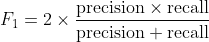

# 端到端机器学习项目:综述和分类

> 原文：<https://towardsdatascience.com/end-to-end-machine-learning-project-reviews-classification-60666d90ec19?source=collection_archive---------32----------------------->

## 将评论分为正面或负面的项目


图 1(来源:作者)

在本文中，我们将讨论一个分类问题，包括将评论分为正面或负面。此处使用的评论是客户对 ABC 服务的评论。

# 数据收集和预处理

这个特定项目中使用的数据是从网上搜集的，数据清理是在[这个笔记本](https://github.com/kipronokoech/Reviews-Classification/blob/master/data_collection.ipynb)中完成的。

[](/web-scraping-scraping-table-data-1665b6b2271c) [## 网页抓取:抓取表格数据

### 在这篇文章中，我们将学习如何使用 Python 抓取 web 数据。简化。

towardsdatascience.com](/web-scraping-scraping-table-data-1665b6b2271c) 

在我们抓取之后，数据被保存到一个`.txt file`文件中，这里是一行文件的例子(代表一个数据点)

```
{'socialShareUrl': 'https://www.abc.com/reviews/5ed0251025e5d20a88a2057d', 'businessUnitId': '5090eace00006400051ded85', 'businessUnitDisplayName': 'ABC', 'consumerId': '5ed0250fdfdf8632f9ee7ab6', 'consumerName': 'May', 'reviewId': '5ed0251025e5d20a88a2057d', 'reviewHeader': 'Wow - Great Service', 'reviewBody': 'Wow. Great Service with no issues.  Money was available same day in no time.', 'stars': 5}
```

数据点是一个字典，我们对`reviewBody` 和`stars`感兴趣。

我们将评论分类如下

```
1 and 2 - Negative
3 - Neutral
4 and 5 - Positive
```

在收集数据时，网站上有 36456 条评论。数据高度不平衡:总评论中 94%是正面的，4%是负面的，2%是中性的。在这个项目中，我们将在不平衡数据和平衡数据上拟合不同的 [Sklearn](https://scikit-learn.org/stable/) 模型(去掉过多的正面数据，这样我们就有相同数量的正面和负面评论)。)

下图显示了数据的构成:


图 2:数据构成(来源:作者)

在图 2 和上面的图中，我们可以看到数据非常不平衡。这可能是问题的征兆吗？我们会看到的。

让我们从导入必要的包开始，并定义我们将用来对给定的审查消息进行分类的类`Review`

这里，我们将加载数据，并使用`Review`类将评论消息分类为正面、负面或中性

```
Wow. Great Service with no issues.  Money was available same day in no time.POSITIVE
```

# 将数据分成训练集和测试集

```
Size of train set:  25519
Size of train set:  10937
```

在我们继续深入之前，我们需要理解**单词袋的概念。**

# 词汇袋

[ [链接](https://scikit-learn.org/stable/modules/feature_extraction.html) ] [ [链接](https://scikit-learn.org/stable/modules/generated/sklearn.feature_extraction.text.CountVectorizer.html)

正如我们所知，计算机只理解数字，因此我们需要使用单词袋模型将我们的评论消息转换成数字列表。

一个**单词包**是描述单词在文档中出现的文本表示。它涉及两件事:一是已知单词的**词汇**。对已知单词的存在的测量。

单词袋模型是在文档分类中使用的支持模型，其中每个单词的出现(频率)被用作训练分类器的特征。

**举例:**

考虑这两个评论

*   ABC 汇款团队的卓越服务。推荐
*   糟糕的服务。交易延迟三天。不推荐。

从上面的两个句子，我们可以推导出下面的字典

**【优秀，服务，通过，通过，ABC，汇款，团队，推荐，不良，交易，延迟，为，三，天，不要】**

我们现在对这个字典进行标记化，以生成下面两个数据点，现在可以用它们来训练分类器


图 3(来源:作者)

在 python 中，标记化是按如下方式完成的

```
['abc', 'bad', 'by', 'days', 'delayed', 'don', 'excellent', 'for', 'recommend', 'remit', 'services', 'team', 'the', 'three', 'transaction'][[1 0 1 0 0 0 1 0 1 1 1 1 1 0 0]
 [0 1 0 1 1 1 0 1 1 0 1 0 0 1 1]]
```

既然我们已经理解了单词袋的概念，现在让我们将这些知识应用到我们的`train_x`和`test_x`中

# 在不平衡数据中训练模型

此时，我们已经有了可以用来拟合模型的向量，我们可以继续这样做了

**支持向量机**

```
Review Message:  easy efficient  first class
Actual:  POSITIVE
Prediction:  ['POSITIVE']
```


图 4:拟合 SVM 产生的混淆矩阵(来源:作者)

训练的其他模型包括集合随机森林、朴素贝叶斯、决策树和逻辑回归。一个[链接](https://github.com/kipronokoech/Reviews-Classification)到完整代码。

# 不平衡数据下的模型性能评估

1.  **精度**

使用准确性度量对模型进行评估，结果如下


图 5:模型在不平衡数据上的表现(来源:作者)

我们得到了 90%的准确率，是正确的还是有问题？答案是，有问题。

数据是不平衡的，使用准确性作为评估标准不是一个好主意。以下是类别分布情况

```
----------TRAIN SET ---------------
Positive reviews on train set: 23961 (93.89%)
Negative reviews on train set: 1055 (4.13%)
Neutral reviews on train set: 503 (1.97%) ----------TEST SET ---------------
Positive reviews on test set: 10225 (93.48%)
Negative reviews on test set: 499 (4.56%)
Neutral reviews on test set: 213 (1.95%)
```

如果分类器正确预测了测试集中所有正面评论，而没有负面和中性评论，会发生什么？分类器的准确率将达到 93.48% ！！！！！！

这意味着我们的模型将有 93.48%的准确性，我们将认为该模型是好的，但在现实中，该模型“只知道最好”如何预测一个类别(正面评论)。事实上，从图 4 来看，SVM 预测根本没有中立的评论

为了进一步理解这个问题，让我们引入另一个度量: **F1 得分，**并用它来评估我们的模型。

2. **F1 得分**

F1 分数是精确度和召回率的调和平均值。



精确度和召回率衡量模型正确分类正面案例和负面案例的程度。在这里阅读更多。

当我们根据这个指标评估我们的模型时，结果如下


图 6(表格) :不同分类器的 F1 分数(来源:作者)


图 7(绘图) :不同分类器的 F1 分数(来源:作者)

从图 6 和图 7 中，我们现在知道模型在分类正面评论方面非常好，而在预测负面和中性评论方面很差。

# 使用平衡数据

作为平衡数据的一种方式，我们决定随机删除一些积极的评论，以便我们使用均匀分布的评论来训练模型。这一次，我们在 1055 条正面评论和 1055 条负面评论上训练模型。我们也放弃了中立阶级。


图 8:平衡数据的分布(来源:作者)

(您也可以考虑使用[过采样技术](https://machinelearningmastery.com/smote-oversampling-for-imbalanced-classification/)来解决数据不平衡的问题)

训练完模型后，我们得到了以下结果


图 9:平衡数据的模型精确度(来源:作者)

SVM 获得了 88.9%准确率的最佳结果，在检查 F1 分数(如下)后，我们现在可以意识到，这些模型预测负面评论与正面评论一样好。


图 10(表格) :不同分类器的 F1 分数(来源:作者)


图 11(绘图):不同分类器的 F1 分数(来源:作者)

如果我们观察显示 SVM 结果的混淆矩阵，我们会注意到该模型在预测这两类中都很好


图 12:使用 SVM 结果生成的混淆矩阵

找到完整的代码[在这里](https://github.com/kipronokoech/Reviews-Classification)

# **结论**

在完成这个项目后，我希望你能够了解到:

*   根据不平衡的数据拟合一个或多个模型可能(在大多数情况下确实如此)导致不良结果。
*   在处理不平衡的数据时，准确性不是一个好的衡量标准。
*   大部分工作是在预处理阶段完成的。

感谢您的阅读:-)