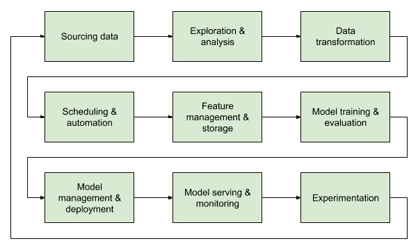

# TFX 在 TensorFlow 2.x 上的端到端机器学习

> 原文：<https://towardsdatascience.com/end-to-end-machine-learning-with-tfx-on-tensorflow-2-x-6eda2fb5fe37?source=collection_archive---------20----------------------->

去年年底 Tensorflow 2.0 发布时，我非常兴奋。毕竟，它承诺了比 1.x 版本更令人愉快的开发人员体验(或者被称为来自地狱的 Java 的深度学习等价物)。对部署模型有强大支持的 Keras 层？算我一个！

然而，当我意识到对将 TF 2.0 模型投入生产的支持并不是我想象的那样时，我的兴奋是短暂的。当然， [TensorFlow Extended](https://github.com/tensorflow/tfx) 是一个选项，但考虑到文档尚未跟上，这不是一个特别令人愉快的选项。


尽管如此，我还是不耐烦了；还有，[急于执行](https://www.tensorflow.org/guide/eager)。接下来是一段充满泪水和欢呼的艰苦旅程，所有人都在寻找一个真正的奖励，那就是一个工作的机器学习管道。我向你们展示我在 r̶a̶n̶t̶s̶的发现，希望你们不必重蹈我的覆辙。不管怎样，直到下一个版本。

## 这是(不是)什么

这篇文章绝不是关于构建生产就绪的 TF 2.0 管道的*方法的权威文章。它展示了部署 ML 模型的一个可能的工作流，该工作流考虑了内存约束和训练服务偏差(以及其他因素)。如果这些概念听起来很陌生，我推荐阅读谷歌的[机器学习规则](https://developers.google.com/machine-learning/guides/rules-of-ml/)。有神经网络和机器学习生命周期的经验肯定会有帮助。*

**

*Gojek 采用的机器学习生命周期[示例](https://blog.gojekengineering.com/an-introduction-to-gojeks-machine-learning-platform-108968c85e64)*

*您将学习如何:*

*   *使用 [TF 变换](https://www.tensorflow.org/tfx/transform/get_started)执行特征插补和缩放*
*   *使用 [Keras functional API](https://www.tensorflow.org/guide/keras/functional) 和[特性列](https://www.tensorflow.org/tutorials/structured_data/feature_columns)构建模型*
*   *为服务于的 [TF 导出一个重用转换图的模型](https://www.tensorflow.org/tfx/serving/serving_basic)*

*为了简短起见，我将只展示代码片段。*

## *1.安装依赖项*

*您将需要以下 Python 包。因为我们将使用 Apache Beam 来运行我们的 TF 转换管道，所以让我们也安装它。*

```
*pip install apache-beam==2.16.0 tensorflow==2.0.0 tensorflow-transform==0.15.0*
```

## *2.使用 TF 变换预处理数据*

*本指南假设读者熟悉 TF 转换，这涉及到在一个`preprocessing_fn`中编写由射束管道执行的转换。关于如何开始的更多信息可以在[这里](https://www.tensorflow.org/tfx/transform/get_started)找到。*

*让我们为一个数值变量`age`编写一个简单的转换，用平均值估算缺失值并应用特征缩放。*

```
*import tensorflow as tf
import tensorflow_transform as tftdef preprocessing_fn(inputs):
    outputs = inputs.copy()

    age = outputs["age"]
    mean_age = tft_mean(age)
    age = impute(age, -1, mean_age)
    outputs["age"] = tft.scale_to_z_score(age)

    return outputs*
```

*停下来。TF 变换不支持使用`tft.mean()`分析器计算平均值吗？为什么我们需要自己编写`tft_mean`的实现？这是因为 TF 变换有一个[已知问题](https://github.com/tensorflow/transform/issues/152#issuecomment-568000987)，其中 nan 可能会为某些分析器产生意外结果。为了解决这个问题，我们只使用非空值来计算平均值。*

```
*def tft_mean(tensor):
    finite_indices = tf.math.is_finite(tensor.values)
    finite_values = tf.boolean_mask(tensor.values, finite_indices)
    return tft.mean(finite_values)*
```

*现在，让我们使用平均年龄来估算缺失值。有两种方法表示缺失值:第一，通过使用[稀疏处理器](https://www.tensorflow.org/api_docs/python/tf/sparse/SparseTensor)进行排除；第二，通过使用一些任意值(例如，`-1`代表数字变量，或者`NULL`代表分类变量)。让我们考虑这两种情况。*

```
*def impute(tensor, missing, replacement):
    sparse = tf.sparse.SparseTensor(
        tensor.indices, tensor.values, [tf.shape(tensor)[0], 1]
    )
    dense = tf.sparse.to_dense(sp_input=sparse, default_value=replacement)
    return tf.where(tf.equal(tensor, missing), replacement, dense)*
```

*然后，您可以运行您的 TF 转换管道，不要忘记导出转换图，以便我们可以在以后重用它！*

```
*import apache_beam as beam 
import tensorflow_transform.beam as tft_beam
import tempfilewith beam.Pipeline() as pipeline:
    with tft_beam.Context(temp_dir=tempfile.mkdtemp()):
        # read raw data
        raw_data = pipeline >> beam.io.ReadFromTFRecord(...)

        # apply transformation
        transformed_data, transform_fn = (
            (raw_data, raw_metadata) >> tft_beam.AnalyzeAndTransformDataset(preprocessing_fn)
        )

        # export transform graph
        _ = (
            transform_fn >> tft_beam.WriteTransformFn("data/tft/")
        )*
```

## *3.使用 Keras 图层和要素列构建模型*

*是时候进行一些功能工程了。TensorFlow 特性列为常见操作(如一键编码)提供了一个简洁的 API。让我们为一个数字变量`age`和一个分类变量`country`定义特性列。*

```
*features = [
    tf.feature_column.numeric_column("age"),
    tf.feature_column.indicator_column(
        tf.feature_column.categorical_column_with_vocabulary_list(
            "country", ["America", "Japan", "China"],
        )
    ),
]*
```

*在 Keras functional API 中使用特性列可能有点棘手。你需要使用一个[输入](https://www.tensorflow.org/api_docs/python/tf/keras/Input)层来实例化一个 Keras 张量。*

```
*from tensorflow.keras.layers import Inputfeature_inputs = {
    "age": Input(name="age", shape=(), dtype=tf.float32),
    "country": Input(name="country", shape=(), dtype=tf.string),
}*
```

*我们现在可以将它输入到 Keras [DenseFeatures](https://www.tensorflow.org/api_docs/python/tf/keras/layers/DenseFeatures) 层，并继续定义我们的神经网络架构。*

```
*from tensorflow.keras.layers import Dense, DenseFeatures
from tensorflow.keras import Modeloutput_1 = DenseFeatures(features)(feature_inputs)
output_2 = Dense(16, activation="relu")(output_1)
preds = Dense(10, activation="softmax")(output_2)
model = Model(inputs=feature_inputs, outputs=preds)model = model.compile(...)
model.fit(...)*
```

## *4.导出模型和调用转换图*

*恭喜你走到这一步！在训练我们的模型之后，我们将把我们的模型导出为一个[保存的模型](https://www.tensorflow.org/guide/saved_model)来部署它。为了防止训练和服务之间的偏差，我们需要加载导出的转换图，以便对服务输入运行相同的转换。*

```
*tft_dir = "data/tft/"  # location of exported transform_fntft_output = tft.TFTransformOutput(tft_dir)
tft_output.transform_raw_features(raw_serving_inputs)*
```

*在 Tensorflow 1.x 中，当导出您的模型时，您将在`serving_input_receiver_fn` [中包含上述逻辑。然而，随着我们远离 TF 2.x 中的估计器 API，这个功能已经被弃用了。相反，我们需要通过覆盖`save()`方法来修改 Keras 模型的服务签名。](https://www.tensorflow.org/api_docs/python/tf/estimator/Estimator#export_saved_model)*

```
*class ExportModel(tf.keras.Model):
    def __init__(self, model, tft_dir):
        super().__init__(self)
        self.model = model
        self.tft_output = tft.TFTransformOutput(tft_dir)

    @tf.function(input_signature=[SERVING_FEATURE_SPEC])
    def serving_fn(self, inputs):
        transformed = self.tft_output.transform_raw_features(inputs)
        return {"preds": self.model(transformed)} def save(self, output_dir):
        signatures = {"serving_default": self.serving_fn} 
        tf.saved_model.save(self, output_dir, signatures)ExportModel(model, "data/tft/").save("data/model/1/")*
```

*然后我们可以使用 TF 服务来服务我们的模型。*

*希望这有所帮助。再见。*