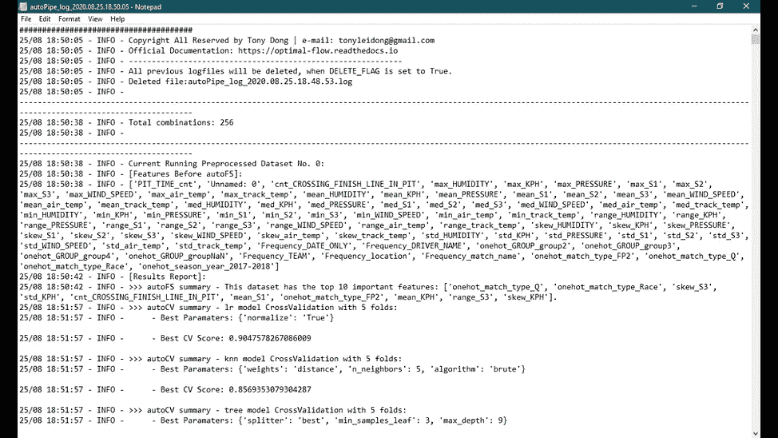

# 包含真实项目的端到端 OptimalFlow 自动化机器学习教程

> 原文：<https://towardsdatascience.com/end-to-end-optimalflow-automated-machine-learning-tutorial-with-real-projects-formula-e-laps-31d810539102?source=collection_archive---------23----------------------->

## 公式 E Laps 预测—第 2 部分


在本教程的上一篇 [***第 1 部分***](https://medium.com/@tonyleidong/end-to-end-optimalflow-automated-machine-learning-tutorial-with-real-projects-formula-e-laps-8b57073a7b50) 中，我们讨论了如何实施数据工程以准备合适的数据集，从而提供进一步的建模步骤。而现在我们将重点讨论如何使用 ***OptimalFlow*** 库( [*文档*](https://optimal-flow.readthedocs.io/)|[|*GitHub*](https://github.com/tonyleidong/OptimalFlow))来实现 Omni-ensemble 自动化机器学习。

为什么我们使用 ***OptimalFlow*** ？你可以阅读另一个关于它的介绍的故事:[*一个全方位的自动化机器学习——optimal flow*](/an-omni-ensemble-automated-machine-learning-optimalflow-369d6485e453)。


# 步骤 1:安装 OptimalFlow

用 Python 3.7+设置好自己的工作环境，通过Pip 命令安装 ***OptimalFlow*** 。目前，最新版本是 0.1.7。更多包的信息可以在 [PyPI](https://pypi.org/project/optimalflow/) 找到。

```
pip install OptimalFlow
```

# 步骤 2:仔细检查缺失值

在本教程第 1 部分的数据准备之后，大多数特性都准备好了，可以进入建模过程。当数据流到达[*autoPP*](https://optimal-flow.readthedocs.io/en/latest/autoPP.html)(***optimal flow 的*** 自动特征预处理模块)时，类别特征中的缺失值不受欢迎。因此，我们需要仔细检查清理后的数据，并对缺失值的要素进行数据清理。对于这个问题，我只发现'组'功能有丢失的值，并使用以下代码来转换它。


# 步骤 3:自定义设置

***OptimalFlow*** 提供开放接口，供用户在各个模块中进行自定义设置。甚至在[*autoCV*](https://optimal-flow.readthedocs.io/en/latest/autoCV.html)(***optimal flow***的模型选择&评估模块)中，您也可以自定义设置具体的模型或超参数搜索空间。你可以在 [***文档***](https://optimal-flow.readthedocs.io/en/latest/demos.html#custom-estimators-parameters-setting-for-for-autocv) 中找到更多细节。

如下面的代码，我们为[*autoPP*](https://optimal-flow.readthedocs.io/en/latest/autoPP.html)(***optimal flow***的 auto feature 预处理模块)设置了缩放器和编码器算法； [*autoFS*](https://optimal-flow.readthedocs.io/en/latest/autoFS.html) 的选择器( ***OptimalFlow*** 的自动特征选择模块)；估算器为[*autoCV*](https://optimal-flow.readthedocs.io/en/latest/autoCV.html)*模块。*

*对于特征选择和模型选择，我们建立了选择器和估计器搜索空间。*

**

> ***请注意:**“稀疏度”和“列数”是您可以设置的两个限制，以减少数据集组合的数量。通常，当数据集的稀疏度太低时，特征内的方差将很低，这意味着信息值将很低。根据可接受的数据集数量，您可以尝试这两个参数的不同值设置，这些数据集将通过管道簇遍历实验(PCTE)过程来找到其管道工作流的最佳模型。当然，从 [autoPP](https://optimal-flow.readthedocs.io/en/latest/autoPP.html) 模块生成的数据集组合越多，在 OptimalFlow 自动机器学习中进一步处理需要的时间就越多。反之，当没有满足稀疏性和列数限制的数据集组合时，后续过程无法继续。所以，要小心，用这些设置尝试一些值。*

# *步骤 4:管道集群遍历实验(PCTE)*

****optimal flow****中的核心概念/改进是*流水线簇遍历实验(PCTE)* ，这是 Tony Dong 在 Genpact 2020 GVector 大会上首次提出的一种框架理论，利用系综流水线算法优化和自动化机器学习工作流。**

**与使用单个流水线的其他自动化或经典机器学习工作流的重复实验相比，*流水线簇遍历实验*更强大，因为它通过集合所有可能的流水线(*流水线簇*)和自动化实验将工作流从 1 维扩展到 2 维。凭借更大的覆盖范围，在没有人工干预的情况下找到最佳模型，并且由于其在每个组件中的系综设计而更加灵活地处理不可见的数据，*管道簇遍历实验*为数据科学家提供了一种更方便和“全自动”的机器学习方法。**

****

**为了实现 PCTE 过程， ***OptimalFlow*** 提供了 [*autoPipe*](https://optimal-flow.readthedocs.io/en/latest/autoPipe.html) 模块来实现。更多示例和功能详情可在[文档](https://optimal-flow.readthedocs.io/en/latest/autoPipe.html)中找到。**

**下面是我们在 [*自动管道*](https://optimal-flow.readthedocs.io/en/latest/autoPipe.html) 模块中设置的属性:**

*   **对于 *autoPP* 模块:给它我们上面设置的自定义参数；设置预测列为“Total_Lap_Num”，选择 model_type 为“regression”(防止哑变量陷阱)；**
*   **对于拆分规则:设置 20%验证，20%测试，60%训练数据；**
*   **对于 *autoFS* 模块:设置 10 个顶级特性，5 个交叉验证文件夹；**
*   **对于 autoCV 模块:使用*快速回归器*类，5 个交叉验证文件夹。**

****

**下面是这个自动化过程的简单描述:**

*   **基于我们之前的自定义设置， *autoPP* 模块将生成总共#256 个数据集组合(基于我们自定义的*稀疏度*和*列*限制设置)。我们的 PCTE 进程将会经历所有这些。它将使用 *autoFS* 模块自动选择前 10 个功能。并使用调整后的超参数搜索最佳模型，最终在 [*流水线簇*](https://optimal-flow.readthedocs.io/en/latest/autoPipe.html) 内找到具有流水线工作流的最佳模型。**

**你会在自动生成的日志文件中找到 PCTE 进程的所有日志信息，这些日志文件是由 ***OptimalFlow*** 的 [*autoFlow*](https://optimal-flow.readthedocs.io/en/latest/autoFlow.html) 模块创建的。**

********

**模块自动生成的日志文件**

**PCTE 过程几乎涵盖了数据科学家需要涵盖的所有机器学习步骤，并通过其管道工作流信息自动搜索最佳模型，以便于评估和实施。**

**虽然 PCTE 不会为每个机器学习流水线操作节省时间，但当 ***OptimalFlow*** 为时，数据科学家可以转移到其他任务，帮助他们摆脱繁琐的模型实验和调整工作。**

> **这是我所理解的真正的自动化机器学习过程。OptimalFlow 应该自动完成所有这些任务。**

***流水线簇遍历实验* (PCTE)过程的输出包括应用于准备好的数据集组合的预处理算法的信息(DICT_PREP_INFO)、为每个数据集组合选择的顶部特征(DICT_FEATURE_SELECTION_INFO)、模型评估结果(DICT_MODELS_EVALUATION)、分割数据集组合(DICT_DATA)、模型选择结果排序表(models_summary)。**

****

**这对于数据科学家来说是一个有用的功能，因为当他们想要重用以前的输出时，检索以前的机器学习工作流是很痛苦的。**

# **步骤 5:用最佳模型保存管道群**

**由于当有大量数据集组合作为输入时，PCTE 过程将持续很长时间，我们最好将上一步的输出(*管道集群*最优模型)保存为 pickles，用于结果解释和可视化步骤。**

****

# **步骤 6:建模结果解释**

**下一步，我们将通过导入上一步中保存的 pickles 来查看我们的建模结果。我们可以使用下面的代码找到 PCTE 自动化流程后具有最佳流程的前 3 个模型:**

****

**很明显，具有可调超参数的 KNN 算法性能最好。我们可以从 PCTE 的输出中检索整个管道工作流程。**

*****具体来说:*****

> **最佳流水线由 KNN 算法组成，该算法使用 256 个数据集组合中的数据集 _214、数据集 _230，具有最佳参数[('权重': '距离')，(' n _ 邻居':' 5 ')，('算法':' kd_tree')]。R 平方是 0.971，MAE 是 1.157，MSE 是 5.928，RMSE 是 5.928，延迟分数是 3.0。**

****

> **所有 256 个数据集的流水线性能评估结果都可以通过 [*autoViz*](https://optimal-flow.readthedocs.io/en/latest/autoViz.html) 模块的动态表函数生成(更多细节和其他已有的可视化示例可以在[这里](https://optimal-flow.readthedocs.io/en/latest/demos.html#pipeline-cluster-traversal-experiments-model-retrieval-diagram-using-autoviz)找到)，你可以在*找到。/temp-plot . html***

****

> **由 *autoFS* 模块选择的前 10 个特性是:**

****

> **特征预处理细节到 Dataset_214，Dataset_230:具有前 10%和后 10%离群值的 Winsorization 通过平均编码方法对“匹配名称”和“仅日期”特征进行编码；通过 OneHot 编码方法对“组”特征进行编码；预处理步骤中不涉及缩放器。**

****

**仅此而已。我们做了第一个 ***OptimalFlow*** 自动化机器学习项目。简单容易，对吧？😎**

# ***更多的事情需要考虑:**

**我们模型的顶部管道具有非常高的 R 平方值，超过 0.9。对于大多数物理过程来说，这个值可能并不令人惊讶，但是，如果我们预测人类的行为，这个值就有点太高了。因此，我们还需要考虑 MSE 等其他指标。**

**在本教程中，我们将真实项目简化为更适合***optimal flow****初学者的情况。所以基于这个出发点，这个结果可以接受成为你第一个 ***OptimalFlow*** 自动化机器学习的输出。***

**这里有一些建议，如果您想继续改进我们的示例脚本，以便用更实用的优化模型方法更深入。**

*   **高 R 平方值通常意味着过度拟合。因此，放弃更多的功能，以防止这一点；**
*   **聚合是汇集数据的好主意，但它也让我们丢失了逐圈和逐时的差异信息；**
*   **缩放方法对于防止过度拟合也是必不可少的，我们可以从 custom_pp 中移除“None ”,并在步骤 3 中添加一些其他缩放方法(即，minmax、robust );**

# ****总之:****

***OptimalFlow* 是一个简单易用的 API 工具，用简单的代码实现 Omni-ensemble 自动化机器学习，也是证明*流水线簇遍历实验* (PCTE)理论的最佳实践库。**

**它的 6 个模块既可以连接起来实现 PCTE 过程，也可以单独使用来优化传统机器学习工作流的组件。你可以在 [***文档***](https://optimal-flow.readthedocs.io/en/latest/demos.html) 中找到它们各自的用例。**

****

> **"算法专家认为没有免费的午餐."—卡尔伯森**

**最后但同样重要的是，作为数据科学家，我们应该永远记住:无论什么样的自动化机器学习算法，“没有免费的午餐定理”永远适用。**

**关于 ***OptimalFlow*** 的相关阅读:**

> **[*使用 OptimalFlow 进行机器学习中的集成特征选择—使用简单代码选择顶级特征的简单方法*](/ensemble-feature-selection-in-machine-learning-by-optimalflow-49f6ee0d52eb)**
> 
> **[*集成模型选择&机器学习中使用 OptimalFlow 的评估——用简单代码选择最优模型的简便方法*](/ensemble-model-selection-evaluation-in-machine-learning-by-optimalflow-9e5126308f12)**
> 
> **[用 OptimalFlow Web App 建立无代码自动化机器学习模型](/build-no-code-automated-machine-learning-model-with-optimalflow-web-app-8acaad8262b1)**

# **关于我:**

**我是一名医疗保健和制药数据科学家以及大数据分析和人工智能爱好者。我开发了 ***OptimalFlow*** 库，帮助数据科学家以一种简单的方式构建最优模型，并用简单的代码实现机器学习工作流的自动化。**

**作为一名拥有多年分析经验的大数据洞察寻求者、流程优化者和人工智能专家，我使用数据科学中的机器学习和问题解决技能将数据转化为可操作的洞察，同时提供战略和量化产品作为最佳结果的解决方案。**

**你可以在 [LinkedIn](https://www.linkedin.com/in/lei-tony-dong/) 或者 [GitHub](https://github.com/tonyleidong) 上和我联系。**