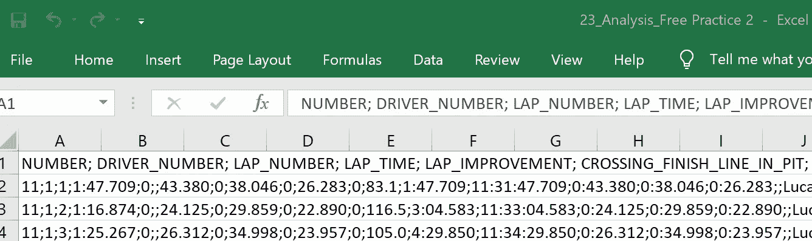

# 包含真实项目的端到端 OptimalFlow 自动化机器学习教程

> 原文：<https://towardsdatascience.com/end-to-end-optimalflow-automated-machine-learning-tutorial-with-real-projects-formula-e-laps-8b57073a7b50?source=collection_archive---------21----------------------->

## 公式 E Laps 预测—第 1 部分

在这个端到端的教程中，我们将说明如何使用***optimal flow***([*文档*](https://optimal-flow.readthedocs.io/)|[|*GitHub*](https://github.com/tonyleidong/OptimalFlow))，一个 *Omni-ensemble 自动化机器学习工具包*，来预测车手在 FIA Formula E 比赛中需要完成的圈数。这是一个典型的回归预测问题，影响了车队的赛车和能量策略的表现。

为什么我们使用 ***OptimalFlow*** ？你可以读另一个关于它的介绍的故事:[*一个全方位的自动化机器学习——optimal flow*](/an-omni-ensemble-automated-machine-learning-optimalflow-369d6485e453)。

***项目背景:***

比赛中剩余的圈数可以确定其策略，即决定积极驾驶并消耗更多电池，或保守驾驶并节省能源。车队总是知道汽车电池的状态。

***可用数据:***

Formula E 官方网站:[*【https://results.fiaformula.com】*](https://results.fiaformula.com)上的公开数据，包括每位车手单圈的历史比赛计时数据和天气数据(风、雨等)

***本条工程简化为:***

我们将把问题简化为一个目标，来预测一场 Formula E 比赛的总圈数。我们将忽略其他人为干预因素，如撞车的可能性，或安全车对比赛时间的影响，这可能会影响特征的变化。

# **第一步:获取数据**

从[*【https://results.fiaformula.com】*](https://results.fiaformula.com)*获取公共时间和天气数据，并保持它们的层次结构，保存在类似结构的文件夹中。我们将提取他们的文件夹字典作为关于系列赛季(即 2017–2018)、比赛地点(即柏林)、比赛类型(即 FP1)等的特征。*

**

# ***第二步:数据整合***

*在将数据输入 OptimalFlow 模块之前，需要进行基本的数据工程步骤。有 3 种类型的数据:分析数据、天气数据和分类数据。对于这个简化的问题，我们可以把分析数据看成是人种数据，而忽略分类数据。此外，我们将包括从自由练习，资格赛，超级极，和比赛的分析数据。*

*下一个挑战是我们发现天气数据和比赛数据是分开的，这将很难找到它们之间的影响关系。因此，我们需要通过创建“关键”列/特征来建立连接。*

*为了创建连接键，我们应该快速浏览原始数据，但是显然，这里没有比赛日期信息，只有逐圈计时数据。但是我们知道天气数据和分析数据都保存在同一个文件夹目录中，这意味着我们可以使用数据的文件目录信息作为“关键”来合并天气和分析/比赛数据。*

****

*因此，将所有天气数据合并到一个数据集，并按年份追加比赛数据。同时，saved 单独提取所有数据集的文件位置信息(命名为‘file _ loc’)，以便进一步与天气数据合并。*

**

*经过前面的编码，我们将收到每年的比赛数据集，和天气综合数据集。*

*接下来，我们将在所有年度比赛数据集中找到共同的特征，并将年度比赛数据集合并为一个完整的数据集，将其保存为“contest_data.csv”。*

**

*然后，我们需要使用数据集的文件目录信息来创建“key”列，以连接综合天气数据和综合比赛数据。(请原谅我在以下代码中拼错了“天气”这个词……)*

**

*从竞赛数据的文件目录信息中提取属性*

**

*从天气数据的文件目录信息中提取属性*

*因此，我们将为进一步的合并步骤获得元数据数据集。您将拥有“match_key”作为我之前提到的“key”列。*

**

# *步骤 3:探索性数据分析(EDA)*

*在统计学中，探索性数据分析(EDA)是一种分析数据集以总结其主要特征的方法，通常采用可视化方法。可以使用或不使用统计模型，但 EDA 主要是为了查看数据可以告诉我们什么，而不仅仅是正式的建模或假设测试任务。*

*我更喜欢使用 *pandas-profiling* 库来加速这一步。但这一步只是让我们对集成数据集、特征关系有一个总体感觉，并了解哪些特征可能与我们的最终预测目标相关。所以我们不需要在这一步花太多时间，还有 OptimalFlow 的 autoFS(自动特征选择模块)，以及 [*autoPP*](https://optimal-flow.readthedocs.io/en/latest/autoPP.html) (自动特征预处理模块)会帮助我们覆盖它们，以防我们在 EDA 步骤中遗漏一些见解。*

**

# *步骤 4:数据聚合*

*我们需要预测一场比赛的总圈数，所以一圈一圈的比赛数据和一次又一次的天气信息作为依赖因素并不清晰和强大。*

*所以更好的想法应该是数据聚合。我们不知道哪种聚合方法会极大地影响预测结果，所以我们可以尝试常见的计算方法，如平均值、中值、偏斜度、标准差等。，并将它们应用于综合天气数据和比赛数据。下面是天气数据聚合的代码示例:*

**

*天气数据聚合*

*然后我们将比赛数据与天气数据合并。合并后的数据集中共有 74 个要素。每一行记录都涵盖了特定 Formula E 事件/比赛中的一名车手，具有聚合的比赛和天气特征。这个输出或者我们通常所说的“预测”在我们的问题中是“***【Total _ Lap _ Num】***”列。*

**

# *总而言之:*

*数据准备对于机器学习至关重要。作为进一步建模步骤的基础，它通常需要数据工程师和数据科学家的共同努力。领域经验和对数据源的熟悉是影响如何清理和集成原始数据的策略的关键因素。*

*在本教程的 [***第二部分***](https://medium.com/@tonyleidong/end-to-end-optimalflow-automated-machine-learning-tutorial-with-real-projects-formula-e-laps-31d810539102) 中，我们将使用 ***OptimalFlow*** 库来实现 Omni-ensemble 自动化机器学习。*

*关于 ***OptimalFlow*** 的相关阅读:*

> *[*使用 OptimalFlow 进行机器学习中的集成特征选择—使用简单代码选择顶级特征的简单方法*](/ensemble-feature-selection-in-machine-learning-by-optimalflow-49f6ee0d52eb)*
> 
> *[*集成模型选择&机器学习中的评估使用 OptimalFlow —用简单代码选择最优模型的简便方法*](/ensemble-model-selection-evaluation-in-machine-learning-by-optimalflow-9e5126308f12)*
> 
> *[用 OptimalFlow Web App 建立无代码自动机器学习模型](/build-no-code-automated-machine-learning-model-with-optimalflow-web-app-8acaad8262b1)*

# **关于我:**

*我是一名医疗保健和制药数据科学家以及大数据分析和人工智能爱好者。我开发了 ***OptimalFlow*** 库，帮助数据科学家以简单的方式构建最优模型，用简单的代码实现机器学习工作流程的自动化。*

*作为一名拥有多年分析经验的大数据洞察寻求者、流程优化者和人工智能专家，我使用数据科学中的机器学习和问题解决技能将数据转化为可操作的洞察，同时提供战略和量化产品作为最佳结果的解决方案。*

*你可以在我的 [LinkedIn](https://www.linkedin.com/in/lei-tony-dong/) 或 [GitHub](https://github.com/tonyleidong) 上与我联系。*