# 为数据科学家设置多类影像分类的端到端管道

> 原文：<https://towardsdatascience.com/end-to-end-pipeline-for-setting-up-multiclass-image-classification-for-data-scientists-2e051081d41c?source=collection_archive---------15----------------------->


图片由来自 [Pixabay](https://pixabay.com/?utm_source=link-attribution&utm_medium=referral&utm_campaign=image&utm_content=987783) 的 [Louise Dav](https://pixabay.com/users/louda2455-152087/?utm_source=link-attribution&utm_medium=referral&utm_campaign=image&utm_content=987783) 拍摄

## 使用 PyTorch 和迁移学习

*你有没有想过脸书是如何处理一些用户分享的侮辱性和不恰当的图片的？或者脸书的标签功能是如何工作的？或者说 Google Lens 是如何通过图像识别产品的？*

以上都是[图像分类](https://lionbridge.ai/services/image-annotation/)在不同设置下的例子。多类图像分类是计算机视觉中的一项常见任务，我们将图像分为三类或更多类。

以前我都是用 Keras 做计算机视觉项目。然而，最近当从事多类图像分类的机会出现时，我决定使用 PyTorch。我已经把所有的 NLP 任务从 Keras 转移到 PyTorch，那么为什么不把 vision 也转移呢？

> [PyTorch](https://redirect.viglink.com/?format=go&jsonp=vglnk_159220215223010&key=0d3176c012db018d69225ad1c36210fa&libId=kbg41t7r0102t244000DAap2a6q0u&subId=fd1ffa7fd7152e4e20568fbe49a489d0&cuid=fd1ffa7fd7152e4e20568fbe49a489d0&loc=https%3A%2F%2Fmlwhiz.com%2Fblog%2F2020%2F02%2F21%2Fds2020%2F&v=1&out=https%3A%2F%2Fclick.linksynergy.com%2Flink%3Fid%3DlVarvwc5BD0%26offerid%3D467035.14805039480%26type%3D2%26murl%3Dhttps%253A%252F%252Fwww.coursera.org%252Flearn%252Fdeep-neural-networks-with-pytorch&ref=https%3A%2F%2Fwww.google.com%2F&title=Become%20a%20Data%20Scientist%20in%202020%20with%20these%2010%20resources&txt=Deep%20Neural%20Networks%20with%20Pytorch) 功能强大，我也喜欢它更 pythonic 化的结构。

在这篇文章中，我们将使用 Pytorch 为图像多类分类创建一个端到端的管道。 这将包括训练模型，将模型的结果以一种可以显示给业务伙伴的形式，以及帮助轻松部署模型的功能。作为一个附加的特性，我们也将使用 Pytorch 来增加测试时间。

但是在我们学习如何进行图像分类之前，我们先来看看迁移学习，这是处理这类问题最常见的方法。

# 什么是迁移学习？

迁移学习是将知识从一项任务转移到另一项任务的过程。从建模的角度来看，这意味着使用在一个数据集上训练的模型，并对其进行微调以用于另一个数据集。但是为什么会起作用呢？

先说一些背景。每年视觉识别社区都会为一个非常特殊的挑战而聚集在一起:[Imagenet 挑战](http://image-net.org/explore)。这项挑战的任务是将 1，000，000 幅图像分为 1，000 个类别。

这一挑战已经导致研究人员训练大型卷积深度学习模型。结果包括像 Resnet50 和 Inception 这样的优秀模型。

但是，训练一个神经模型意味着什么呢？本质上，这意味着研究人员在一百万张图像上训练模型后，已经学习了神经网络的权重。

那么，如果我们能得到这些重量呢？然后，我们可以使用它们，并将它们加载到我们自己的神经网络模型中，在测试数据集上进行预测，对吗？实际上，我们可以走得更远。我们可以在这些研究人员已经准备好的神经网络之上添加一个额外的层来对我们自己的数据集进行分类。

> 虽然这些复杂模型的确切工作方式仍然是一个谜，但我们知道较低的卷积层可以捕捉边缘和梯度等低级图像特征。相比之下，更高的卷积层捕捉越来越复杂的细节，如身体部位、面部和其他组成特征。

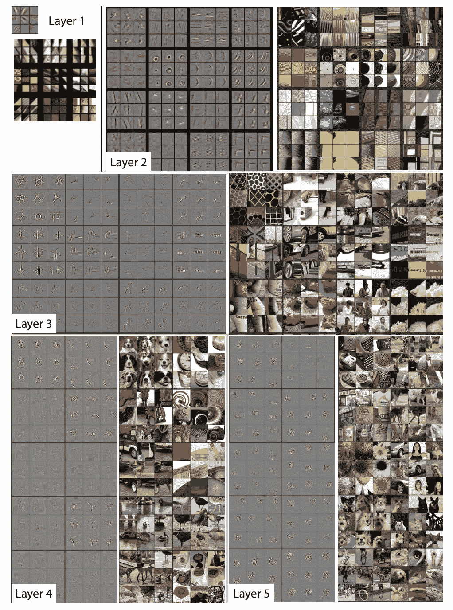

来源:[可视化和理解卷积网络](https://arxiv.org/pdf/1311.2901.pdf)。你可以看到前几层是如何捕捉基本形状的，在后面的层中形状变得越来越复杂。

在上面来自 ZFNet(Alex net 的变体)的示例中，ZFNet 是在 Imagenet 任务上获得成功的第一批卷积神经网络之一，您可以看到较低层是如何捕捉线条和边缘的，而后面的层是如何捕捉更复杂的特征的。通常假设最终的全连接层捕获与解决相应任务相关的信息，例如，ZFNet 的全连接层指示哪些特征与将图像分类到 1，000 个对象类别之一相关。

对于新的视觉任务，我们可以简单地使用预先在 ImageNet 上训练的最新 CNN 的现成特征，并在这些提取的特征上训练新的模型。

这个想法背后的直觉是，一个经过训练可以识别动物的模型也可以用来识别猫和狗。在我们的例子中，

> 一个在 1000 个不同类别上训练过的模型已经看到了很多真实世界的信息，我们可以使用这些信息来创建我们自己的定制分类器。

***理论和直觉就是这样。我们如何让它真正发挥作用？让我们看一些代码。你可以在***[***Github***](https://github.com/MLWhiz/data_science_blogs/tree/master/compvisblog)***上找到这篇文章的完整代码。***

# 数据探索

我们将从 Kaggle 的[船数据集](https://www.kaggle.com/clorichel/boat-types-recognition/version/1)开始，以理解多类图像分类问题。该数据集包含大约 1，500 张不同类型的船只照片:浮标、游轮、渡船、货船、平底船、充气船、皮艇、纸船和帆船。我们的目标是创建一个模型，该模型查看船只图像并将其分类到正确的类别中。

以下是数据集中的图像示例:

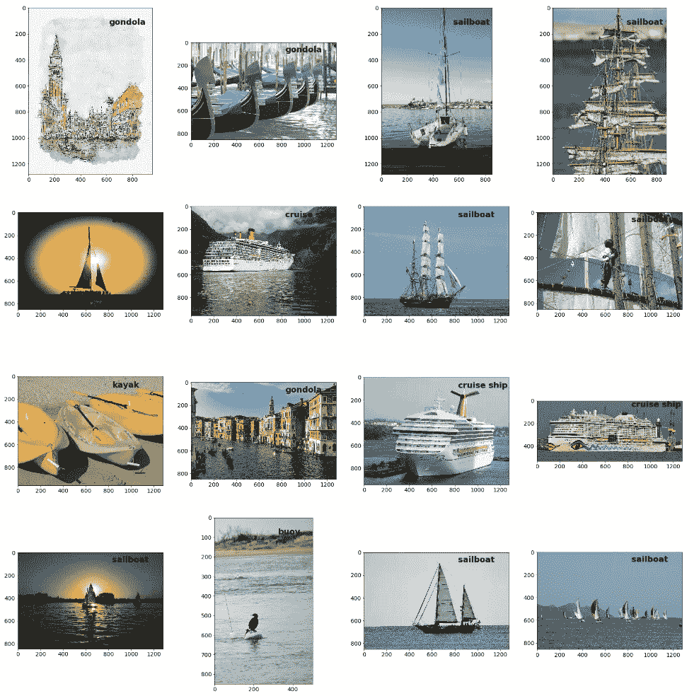

以下是类别计数:

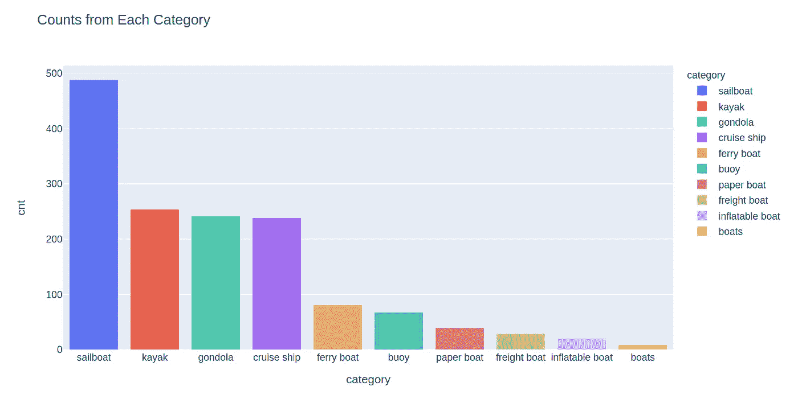

由于类别*“货运船”
“充气船”*“船”没有太多的图像；我们将在训练模型时删除这些类别。

# 创建所需的目录结构

在我们可以训练我们的深度学习模型之前，我们需要为我们的图像创建所需的目录结构。现在，我们的数据目录结构看起来像这样:

```
images
    sailboat
    kayak
    .
    .
```

我们需要我们的图像被包含在 3 个文件夹`train`、`val`和`test`。然后，我们将对`train`数据集中的图像进行训练，对`val`数据集中的图像进行验证，最后对`test`数据集中的图像进行测试。

```
data
    train
        sailboat
        kayak
        .
        .
    val
        sailboat
        kayak
        .
        .
    test
        sailboat
        kayak
        .
        .
```

您可能有不同格式的数据，但是我发现除了通常的库之外，`glob.glob`和`os.system`函数非常有用。在这里你可以找到完整的[数据准备代码](https://github.com/MLWhiz/data_science_blogs/blob/master/compvisblog/Boats_DataExploration.ipynb)。现在让我们快速浏览一下我在准备数据时发现有用的一些不常用的库。

## 什么是 glob.glob？

简单地说，glob 允许您使用正则表达式获取目录中文件或文件夹的名称。例如，您可以这样做:

```
from glob import glob
categories = glob(“images/*”)
print(categories)
------------------------------------------------------------------
['images/kayak', 'images/boats', 'images/gondola', 'images/sailboat', 'images/inflatable boat', 'images/paper boat', 'images/buoy', 'images/cruise ship', 'images/freight boat', 'images/ferry boat']
```

## 什么是 os.system？

`os.system`是`os`库中的一个函数，它允许你在 python 中运行任何命令行函数。我通常用它来运行 Linux 函数，但它也可以用来运行 python 中的 R 脚本，如这里的[所示](/python-pro-tip-want-to-use-r-java-c-or-any-language-in-python-d304be3a0559)。例如，在从 pandas 数据框中获取信息后，我在准备数据时使用它将文件从一个目录复制到另一个目录。我也使用 [f 字符串格式](/how-and-why-to-use-f-strings-in-python3-adbba724b251)。

```
import osfor i,row in fulldf.iterrows():
    # Boat category
    cat = row['category']
    # section is train,val or test
    section = row['type']
    # input filepath to copy
    ipath = row['filepath']
    # output filepath to paste
    opath = ipath.replace(f"images/",f"data/{section}/")
    # running the cp command
    os.system(f"cp '{ipath}' '{opath}'")
```

现在，既然我们已经在所需的文件夹结构中有了数据，我们可以继续进行更令人兴奋的部分。

# 数据预处理

## 转换:

**1。Imagenet 预处理**

为了将我们的图像用于在 Imagenet 数据集上训练的网络，我们需要以与 Imagenet 网络相同的方式预处理我们的图像。为此，我们需要将图像缩放到 224×224，并按照 Imagenet 标准对其进行标准化。我们可以利用火炬视觉`transforms`图书馆做到这一点。这里我们取 224×224 的`CenterCrop`，按照 Imagenet 标准进行归一化。下面定义的操作按顺序发生。您可以在这里找到由 PyTorch 提供的所有转换的列表。

```
transforms.Compose([
        transforms.CenterCrop(size=224),  
        transforms.ToTensor(),
        transforms.Normalize([0.485, 0.456, 0.406],
                             [0.229, 0.224, 0.225])  
    ])
```

**2。数据扩充**

我们可以为数据扩充做更多的预处理。神经网络在处理大量数据时效果更好。[数据扩充](https://lionbridge.ai/articles/data-augmentation-with-machine-learning-an-overview/)是一种策略，我们在训练时使用它来增加我们拥有的数据量。

例如，我们可以水平翻转一艘船的图像，它仍然是一艘船。或者我们可以随机裁剪图像或添加颜色抖动。这是我用过的图像转换字典，它适用于 Imagenet 预处理和增强。这本字典包含了我们在这篇[伟大的文章](/transfer-learning-with-convolutional-neural-networks-in-pytorch-dd09190245ce)中使用的训练、测试和验证数据的各种转换。正如您所料，我们没有对测试数据和验证数据应用水平翻转或其他数据增强转换，因为我们不想在增强的图像上获得预测。

```
# Image transformations
image_transforms = {
    # Train uses data augmentation
    'train':
    transforms.Compose([
        transforms.RandomResizedCrop(size=256, scale=(0.8, 1.0)),
        transforms.RandomRotation(degrees=15),
        transforms.ColorJitter(),
        transforms.RandomHorizontalFlip(),
        transforms.CenterCrop(size=224),  # Image net standards
        transforms.ToTensor(),
        transforms.Normalize([0.485, 0.456, 0.406],
                             [0.229, 0.224, 0.225])  # Imagenet standards
    ]),
    # Validation does not use augmentation
    'valid':
    transforms.Compose([
        transforms.Resize(size=256),
        transforms.CenterCrop(size=224),
        transforms.ToTensor(),
        transforms.Normalize([0.485, 0.456, 0.406], [0.229, 0.224, 0.225])
    ]),

        # Test does not use augmentation
    'test':
    transforms.Compose([
        transforms.Resize(size=256),
        transforms.CenterCrop(size=224),
        transforms.ToTensor(),
        transforms.Normalize([0.485, 0.456, 0.406], [0.229, 0.224, 0.225])
    ]),
}
```

以下是应用于训练数据集中图像的训练变换示例。我们不仅从一幅图像中得到许多不同的图像，而且它还帮助我们的网络变得对物体方向不变。

```
ex_img = Image.open('/home/rahul/projects/compvisblog/data/train/cruise ship/cruise-ship-oasis-of-the-seas-boat-water-482183.jpg')t = image_transforms['train']
plt.figure(figsize=(24, 24))for i in range(16):
    ax = plt.subplot(4, 4, i + 1)
    _ = imshow_tensor(t(ex_img), ax=ax)plt.tight_layout()
```

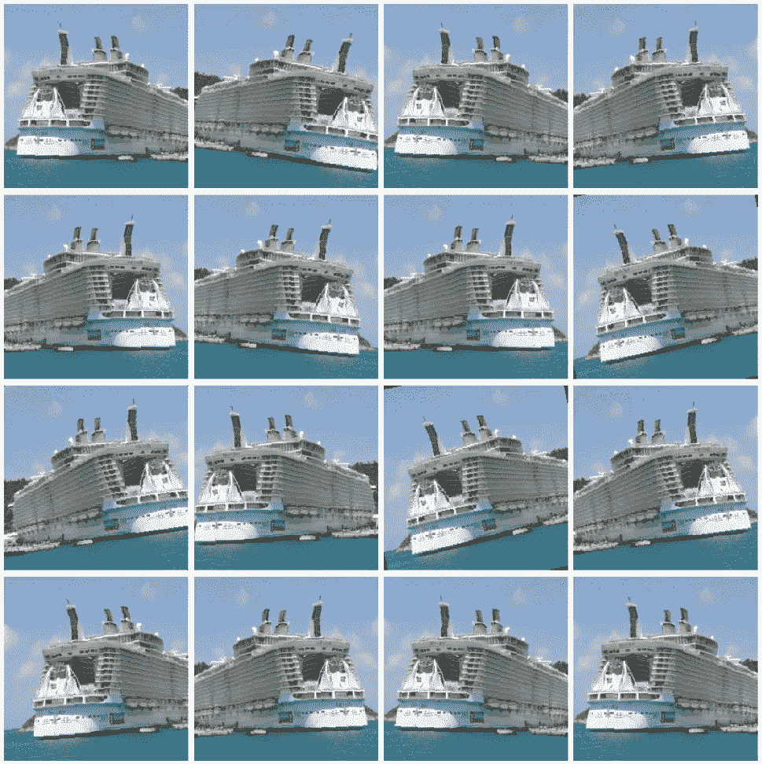

## 数据加载器

下一步是向 PyTorch 提供培训、验证和测试数据集的位置。我们可以通过使用 PyTorch `datasets`和`DataLoader`类来做到这一点。如果我们将数据放在所需的目录结构中，这部分代码将基本保持不变。

```
# Datasets from folderstraindir = "data/train"
validdir = "data/val"
testdir = "data/test"data = {
    'train':
    datasets.ImageFolder(root=traindir, transform=image_transforms['train']),
    'valid':
    datasets.ImageFolder(root=validdir, transform=image_transforms['valid']),
    'test':
    datasets.ImageFolder(root=testdir, transform=image_transforms['test'])
}# Dataloader iterators, make sure to shuffle
dataloaders = {
    'train': DataLoader(data['train'], batch_size=batch_size, shuffle=True,num_workers=10),
    'val': DataLoader(data['valid'], batch_size=batch_size, shuffle=True,num_workers=10),
    'test': DataLoader(data['test'], batch_size=batch_size, shuffle=True,num_workers=10)
}
```

这些数据加载器帮助我们遍历数据集。例如，我们将在模型培训中使用下面的数据加载器。数据变量将包含形式为`(batch_size, color_channels, height, width)`的数据，而目标的形状为`(batch_size)`，并保存标签信息。

```
train_loader = dataloaders['train']
for ii, (data, target) in enumerate(train_loader):
```

# 建模

## 1.使用预先训练的模型创建模型

现在，这些预先训练好的模型可以在`torchvision`图书馆使用:

*   [AlexNet](https://arxiv.org/abs/1404.5997)
*   [VGG](https://arxiv.org/abs/1409.1556)
*   [ResNet](https://arxiv.org/abs/1512.03385)
*   [挤压网](https://arxiv.org/abs/1602.07360)
*   [DenseNet](https://arxiv.org/abs/1608.06993)
*   [开始](https://arxiv.org/abs/1512.00567) v3
*   [谷歌网](https://arxiv.org/abs/1409.4842)
*   沙狐球网 v2
*   [移动互联网](https://arxiv.org/abs/1801.04381) v2
*   [ResNeXt](https://arxiv.org/abs/1611.05431)
*   [广 ResNet](https://pytorch.org/docs/stable/torchvision/models.html#wide-resnet)
*   [多边核安全网](https://arxiv.org/abs/1807.11626)

在这里，我将在我们的数据集上使用 resnet50，但是您也可以根据自己的选择有效地使用任何其他模型。

```
from torchvision import models
model = models.resnet50(pretrained=True)
```

我们从冻结模型重量开始，因为我们不想改变 renet50 模型的重量。

```
# Freeze model weights
for param in model.parameters():
    param.requires_grad = False
```

我们需要做的下一件事是用我们的自定义分类器替换模型中的线性分类层。我发现，要做到这一点，最好先看看模型结构，以确定最终的线性层是什么。我们可以简单地通过打印模型对象来做到这一点:

```
print(model)
------------------------------------------------------------------
ResNet(
  (conv1): Conv2d(3, 64, kernel_size=(7, 7), stride=(2, 2), padding=(3, 3), bias=False)
  (bn1): BatchNorm2d(64, eps=1e-05, momentum=0.1, affine=True, track_running_stats=True)
  (relu): ReLU(inplace=True)
   .
   .
   .
   .(conv3): Conv2d(512, 2048, kernel_size=(1, 1), stride=(1, 1), bias=False)
      (bn3): BatchNorm2d(2048, eps=1e-05, momentum=0.1, affine=True, track_running_stats=True)
      (relu): ReLU(inplace=True)
    )
  )  
(avgpool): AdaptiveAvgPool2d(output_size=(1, 1))
  **(fc): Linear(in_features=2048, out_features=1000, bias=True)**
)
```

在这里，我们发现从卷积层获取输入的最后一个线性层被命名为`fc`

我们现在可以使用我们定制的神经网络简单地替换`fc`层。该神经网络将来自前一层的输入输入到`fc`，并给出形状`(batch_size x n_classes)`的 log softmax 输出。

```
n_inputs = model.fc.in_features
model.fc = nn.Sequential(
                      nn.Linear(n_inputs, 256), 
                      nn.ReLU(), 
                      nn.Dropout(0.4),
                      nn.Linear(256, n_classes),                   
                      nn.LogSoftmax(dim=1))
```

请注意，现在添加的新层在默认情况下是完全可训练的。

## 2.在 GPU 上加载模型

我们可以使用 PyTorch 的 DataParallel 来使用单个或多个 GPU(如果我们有)。这里是我们可以用来检测 GPU 以及在 GPU 上加载模型的 GPU 数量。现在，我正在双英伟达泰坦 RTX 图形处理器上训练我的模型。

```
# Whether to train on a gpu
train_on_gpu = cuda.is_available()
print(f'Train on gpu: {train_on_gpu}')# Number of gpus
if train_on_gpu:
    gpu_count = cuda.device_count()
    print(f'{gpu_count} gpus detected.')
    if gpu_count > 1:
        multi_gpu = True
    else:
        multi_gpu = Falseif train_on_gpu:
    model = model.to('cuda')if multi_gpu:
    model = nn.DataParallel(model)
```

## 3.定义标准和优化器

当你训练任何模型时，最重要的事情之一是损失函数和优化器的选择。这里我们想使用分类交叉熵，因为我们有一个多类分类问题和 [Adam](https://cs231n.github.io/neural-networks-3/#ada) 优化器，这是最常用的优化器。但是，由于我们对模型的输出应用 LogSoftmax 运算，因此我们将使用 NLL 损耗。

```
from torch import optimcriteration = nn.NLLLoss()
optimizer = optim.Adam(model.parameters())
```

## 4.训练模型

下面给出了用于训练模型的完整代码。它本身看起来可能很大，但本质上我们所做的如下:

*   开始运行纪元。在每个时代-
*   使用`model.train()`将模型模式设置为训练。
*   使用列车数据加载器循环数据。
*   使用`data, target = data.cuda(), target.cuda()`命令将你的数据加载到 GPU
*   使用`optimizer.zero_grad()`将优化器中的现有梯度设置为零
*   使用`output = model(data)`向前运行批次
*   使用`loss = criterion(output, target)`计算损失
*   使用`loss.backward()`通过网络反向传播损耗
*   使用`optimizer.step()`采取优化步骤改变整个网络的权重
*   训练循环中的所有其他步骤只是为了维护历史和计算准确性。
*   使用`model.eval()`将模型模式设置为评估。
*   使用`valid_loader`获得验证数据的预测，并计算`valid_loss`和`valid_acc`
*   打印每个`print_every`时期的验证损失和验证准确度结果。
*   保存基于验证损失的最佳模型。
*   **提前停止:**如果交叉验证损失在`max_epochs_stop`内没有改善，则停止训练并加载验证损失最小的最佳可用模型。

下面是运行上述代码的输出。只显示最近几个时代。在第一个纪元中，验证精度从大约 55%开始，我们以大约 90%的验证精度结束。

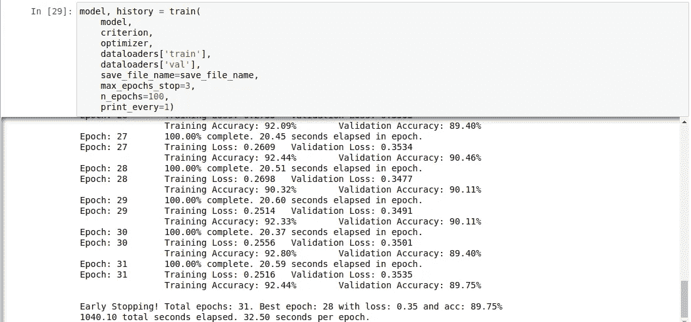

下面是显示损失和准确性指标的训练曲线:

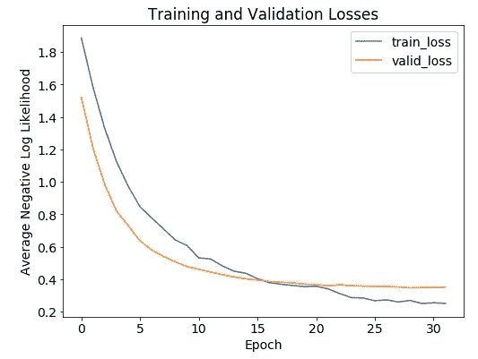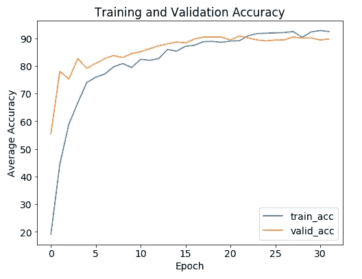

训练曲线

# 推理和模型结果

我们希望我们的结果以不同的方式使用我们的模型。首先，我们需要测试精度和混淆矩阵。创建这些结果的所有代码都在代码笔记本中。

## 1.试验结果

测试模型的总体精度为:

```
Overall Accuracy: 88.65 %
```

这是测试数据集结果的混淆矩阵。

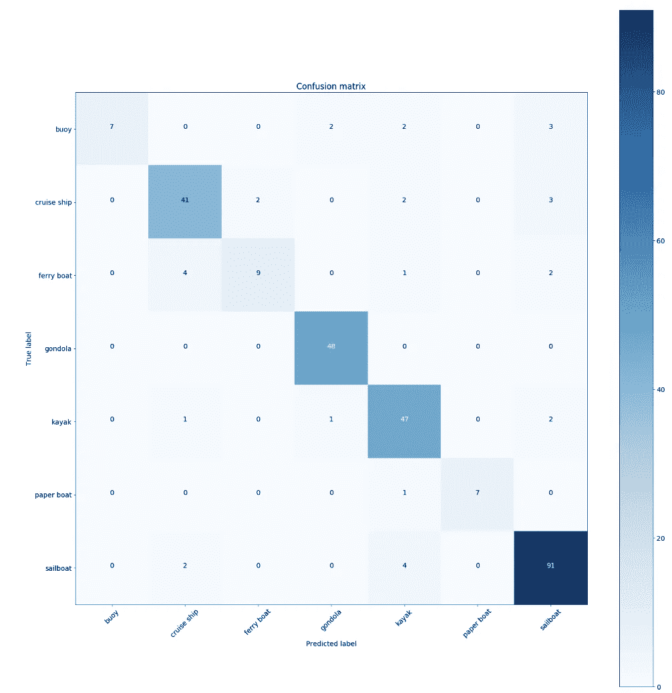

我们也可以看看类别的准确性。我还添加了列车计数，以便从新的角度查看结果。

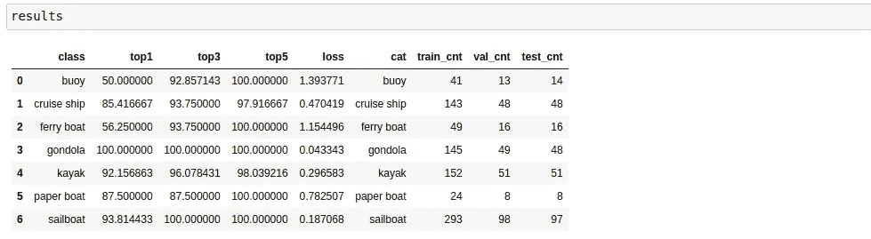

## 2.单个图像的可视化预测

出于部署目的，能够获得对单个图像的预测是有帮助的。你可以从笔记本上找到密码。

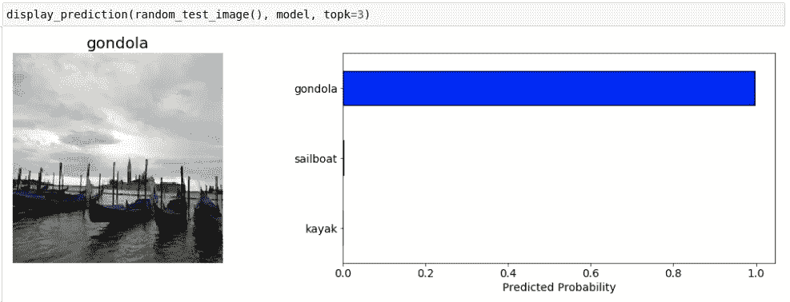

## 3.可视化类别的预测

我们还可以看到用于调试和演示的分类结果。

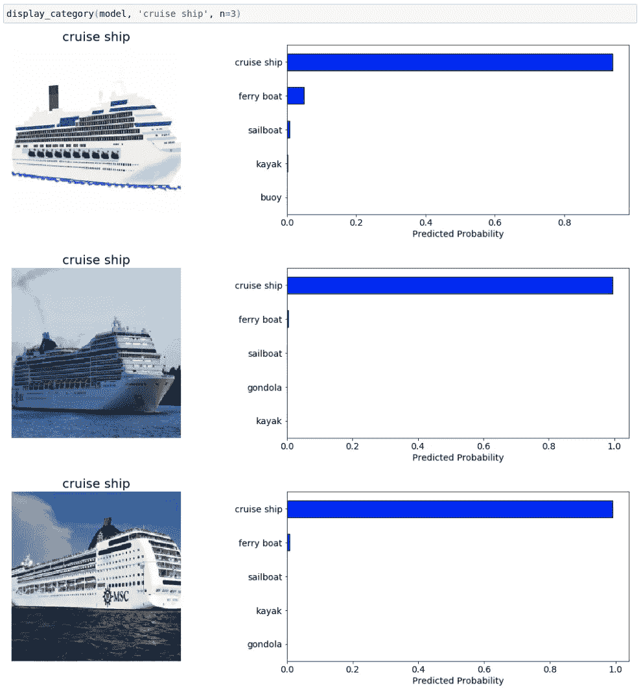

## 4.测试时间增加后的测试结果

我们还可以增加测试时间来提高我们的测试精度。这里我使用了一个新的测试数据加载器和转换:

```
# Image transformations
tta_random_image_transforms = transforms.Compose([
        transforms.RandomResizedCrop(size=256, scale=(0.8, 1.0)),
        transforms.RandomRotation(degrees=15),
        transforms.ColorJitter(),
        transforms.RandomHorizontalFlip(),
        transforms.CenterCrop(size=224),  # Image net standards
        transforms.ToTensor(),
        transforms.Normalize([0.485, 0.456, 0.406],
                             [0.229, 0.224, 0.225])  # Imagenet standards
    ])# Datasets from folders
ttadata = {
    'test':
    datasets.ImageFolder(root=testdir, transform=tta_random_image_transforms)
}# Dataloader iterators
ttadataloader = {
    'test': DataLoader(ttadata['test'], batch_size=512, shuffle=False,num_workers=10)
}
```

然后，我们可以使用以下函数获得测试集上的预测:

在上面的函数中，在得到预测之前，我对每张图片应用了 5 次`tta_random_image_transforms`。最终预测是所有五次预测的平均值。当我们在整个测试数据集上使用 TTA 时，我们注意到准确率提高了大约 1%

```
TTA Accuracy: 89.71%
```

此外，以下是 TTA 的结果与正常结果的分类比较:

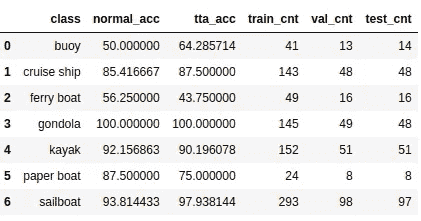

在这个小数据集中，TTA 似乎没有增加多少价值，但我注意到它增加了大数据集的价值。

# 结论

在这篇文章中，我谈到了使用 PyTorch 进行多类图像分类项目的端到端管道。我们致力于创建一些现成的代码来使用迁移学习训练模型，可视化结果，使用测试时间增加，并获得对单个图像的预测，以便我们可以在需要时使用任何工具部署我们的模型，如 [Streamlit](/how-to-write-web-apps-using-simple-python-for-data-scientists-a227a1a01582) 。

你可以在 [**Github**](https://github.com/MLWhiz/data_science_blogs/tree/master/compvisblog) 上找到这篇文章的完整代码。

如果你想了解更多关于图像分类和卷积神经网络的知识，看看来自吴恩达的深度学习专业。此外，要了解 PyTorch 的更多信息并从基础开始，您可以看看 IBM 提供的[深度神经网络与 PyTorch](https://www.coursera.org/learn/deep-neural-networks-with-pytorch?ranMID=40328&ranEAID=lVarvwc5BD0&ranSiteID=lVarvwc5BD0-qRrseBA2NWUg_WxbnxmDwQ&siteID=lVarvwc5BD0-qRrseBA2NWUg_WxbnxmDwQ&utm_content=2&utm_medium=partners&utm_source=linkshare&utm_campaign=lVarvwc5BD0) 课程。

谢谢你的阅读。将来我也会写更多初学者友好的帖子。在 [**媒体**](https://medium.com/@rahul_agarwal) 关注我，或者订阅我的 [**博客**](http://eepurl.com/dbQnuX) 了解他们。一如既往，我欢迎反馈和建设性的批评，可以通过 Twitter [@mlwhiz](https://twitter.com/MLWhiz) 联系到我。

此外，一个小小的免责声明——这篇文章中可能会有一些相关资源的附属链接，因为分享知识从来都不是一个坏主意。

*本帖首发* [*此处*](https://lionbridge.ai/articles/end-to-end-multiclass-image-classification-using-pytorch-and-transfer-learning/) *。*