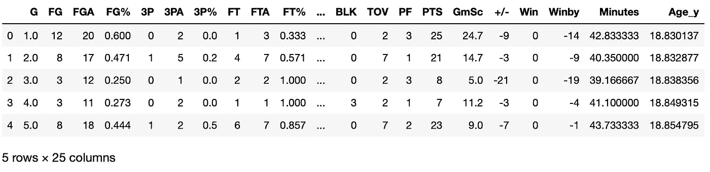
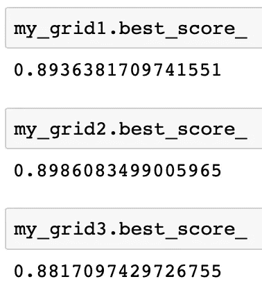

# 使用三种机器学习模型基于勒布朗数据的端到端游戏预测方案

> 原文：<https://towardsdatascience.com/end-to-end-project-of-game-prediction-based-on-lebrons-stats-using-three-machine-learning-models-38c20f49af5f?source=collection_archive---------23----------------------->

## 机器学习

## 使用三种不同的分类器(包括逻辑回归、随机森林分类器和深度学习分类器)对二元分类问题进行综合指导。


照片由 [JC Gellidon](https://unsplash.com/@jcgellidon?utm_source=medium&utm_medium=referral) 在 [Unsplash](https://unsplash.com?utm_source=medium&utm_medium=referral)

我是 ***机器学习*** 和 ***篮球*** 的超级粉丝，所以我喜欢把这两个结合起来生成一些迷你项目。在这篇文章中，我想和你分享其中的一个项目。

不管你是不是篮球迷，你都必须知道[勒布朗詹姆斯](https://en.wikipedia.org/wiki/LeBron_James)。作为核心球员，他的表现对比赛结果至关重要。所以，我在这个项目中试图回答的问题是 ***“我们能根据勒布朗的比赛数据预测比赛结果吗？”***

我把它框定为一个二元分类问题，以团队的“赢”或“输”作为输出标签。特征是勒布朗·詹姆斯每场比赛的基本统计。

我在项目中实现了三个分类器，****随机森林分类器******深度学习分类器*** ，通过使用机器学习中流行的两个 Python 库，[***sk learn***](https://scikit-learn.org/stable/)，以及[***keras***](https://keras.io/)。*

*我正在一步一步地完成这个项目，希望对你有所帮助。*

## *准备数据集*

**

*[在](https://unsplash.com/@thecreative_exchange?utm_source=medium&utm_medium=referral) [Unsplash](https://unsplash.com?utm_source=medium&utm_medium=referral) 上创意交流的照片*

*这里列出了代码中使用的库。*

```
*import pandas as pd
import numpy as np
from sklearn.model_selection import train_test_split
from sklearn.model_selection import StratifiedKFold
from sklearn.impute import SimpleImputer
from sklearn.preprocessing import StandardScaler
from sklearn.pipeline import Pipeline
from sklearn.linear_model import LogisticRegression
from sklearn.ensemble import RandomForestClassifier
from keras.layers import Dense, Dropout
from keras.models import Model, Sequential
from keras.wrappers.scikit_learn import KerasClassifier
from sklearn.model_selection import GridSearchCV*
```

*我手动整理了勒布朗从赛季***2003–2004***到赛季***2019–2020***(直到 3 月 [NBA 停赛](https://en.wikipedia.org/wiki/Suspension_of_the_2019%E2%80%9320_NBA_season))的比赛基本统计。总共有 1258 场比赛。进口代码如下:*

```
*df = pd.read_csv("lebron_2003_2020_career_gamelog.csv",index_col=0)
df.head()*
```

**

*端到端游戏预测(由[虞风](https://medium.com/@jianan.jay.lin)*

*从上图可以看到*基础统计*和*游戏结果*(“赢”和“Winby”)。*

*然后，我要确保数据类型是“float32 ”,这样我就可以直接将它们提供给 keras 中的神经元网络模型。数据类型转换代码如下:*

```
*df = df.astype('float32')*
```

*接下来，我需要使用如下代码指定数据集中的特征空间和标签:*

```
*y = df['Win']
X = df.drop(columns=['Win','Winby'])*
```

*列“ ***赢*** ”是记录的游戏结果，其中 1 表示 ***赢*** ，0 表示 ***输*** 。而“ ***Winby*** ”一栏则是该组件的游戏分数差，其中正数表示 ***赢*** ，负数表示 ***输*** 。因此，有必要将它们从特征空间中移除。*

*接下来，数据被分成 ***训练*** 和 ***测试*** 集合，其中测试集合在模型评估步骤之前永远不会被触及。代码如下:*

```
*X_train, X_test, y_train, y_test = train_test_split(X, y, test_size=0.2,stratify=y, random_state=42)*
```

*你可能会注意到，我在这里使用了一个 ***分层分割*** ，避免了游戏结果在训练数据中偏向一类的情况。“分层=y”表示基于我们的输出标签 ***y*** 完成*“分层分割”*。*

*到现在为止，牛排已经做好了，我们需要开始预热烤箱。*

## *模特培训*

**

*Ashim D'Silva 在 [Unsplash](https://unsplash.com?utm_source=medium&utm_medium=referral) 上拍摄的照片*

*正如我提到的，将使用三个模型，*逻辑回归*，*随机森林分类器*，以及*深度学习分类器*。为了使它们都符合相同的 Scikit-Learn 工作流，我们需要首先以如下的 *Scikit-Learn* 风格定义深度学习模型:*

```
*def my_DL(epochs=6,batchsize=512):
    model = Sequential()
    model.add(Dense(32,activation='relu'))
    model.add(Dense(16,activation='relu'))
    model.add(Dense(1,activation='sigmoid'))
    model.compile(loss='binary_crossentropy',optimizer='rmsprop', metrics=['accuracy']) return model*
```

*具体来说，这个神经网络有两个隐层，分别是 32 个和 16 个节点。网络的损失函数、优化器和度量分别固定为'*二元交叉熵*'、 *rmsprop* 和'*精度*'。*

*该编译模型有两个可调参数， ***历元*** 为历元数， ***批次大小*** 为每批样本数。这两个参数都有默认值，格式类似于 ***sklearn*** 中的分类器。*

*不能从数据中训练出来但需要在训练过程前赋值的模型参数称为 ***超参数*** 。这些超参数总是与模型的**复杂度**相关，需要正确选择以避免**欠拟合**或**过拟合**问题。*

*要选择最佳的超参数集，我们可以用两种方法。首先，我们可以进一步将训练数据集分成两部分，即 ***训练*** 和 ***验证*** 数据集。然后，我们需要在*验证*集合上评估来自*训练*数据集的训练模型。最佳超参数集是在验证集上具有最佳性能的超参数集。*

*然而，当样本量很小时，只有一个数据分割会有偏差。所以， ***交叉验证*** 是另一种训练超参数的方式，更受欢迎。因此，我在这个项目中使用交叉验证。*

*我在下面列出了超参数调谐的全部功能，并将详细介绍。*

```
*def train_hyper_tune(X,y):
    # create the pre-processing component
    my_scaler = StandardScaler()
    my_imputer = SimpleImputer(strategy="median")

    # define classifiers
    ## Classifier 1: Logistic Regression
    clf_LR = LogisticRegression(random_state=0,penalty='elasticnet',solver='saga')
    ## Classifier 2: Random Forest Classifier
    clf_RF = RandomForestClassifier(random_state=0)
    ## Classifier 3: Deep Learning Binary Classifier
    clf_DL = KerasClassifier(build_fn=my_DL)

    # define pipeline for three classifiers
    ## clf_LR
    pipe1 = Pipeline([('imputer', my_imputer), ('scaler', my_scaler), ('lr_model',clf_LR)])
    ## clf_RF
    pipe2 = Pipeline([('imputer', my_imputer), ('scaler', my_scaler), ('rf_model',clf_RF)])
    ## clf_DL
    pipe3 = Pipeline([('imputer', my_imputer), ('scaler', my_scaler), ('dl_model',clf_DL)])

    # create hyperparameter space of the three models
    ## clf_LR
    param_grid1 = {
        'lr_model__C' : [1e-1,1,10],
        'lr_model__l1_ratio' : [0,0.5,1]
    }
    ## clf_RF
    param_grid2 = {
        'rf_model__n_estimators' : [50,100],
        'rf_model__max_features' : [0.8,"auto"],
        'rf_model__max_depth' : [4,5]
    }
    ## clf_DL
    param_grid3 = {
        'dl_model__epochs' : [6,12,18,24],
        'dl_model__batchsize' : [256,512]
    }

    # set GridSearch via 5-fold cross-validation
    ## clf_LR
    grid1 = GridSearchCV(pipe1, cv=5, param_grid=param_grid1)
    ## clf_RF
    grid2 = GridSearchCV(pipe2, cv=5, param_grid=param_grid2)
    ## clf_DL
    grid3 = GridSearchCV(pipe3, cv=5, param_grid=param_grid3)

    # run the hyperparameter tunning process
    grid1.fit(X,y)
    grid2.fit(X,y)
    grid3.fit(X,y)

    # return results of the tunning process
    return grid1,grid2,grid3,pipe1,pipe2,pipe3*
```

*如代码所示，函数内部主要有六个步骤:*

***第一步。创建预处理函数。***

```
 *# create the pre-processing component
    my_scaler = StandardScaler()
    my_imputer = SimpleImputer(strategy="median")*
```

*我使用*特征的中值*来估算缺失值，使用*标准缩放器*来标准化数据。这一步对于所有三种型号都是一样的。*

***第二步。定义所有三个分类器。***

```
 *# define classifiers
    ## Classifier 1: Logistic Regression
    clf_LR = LogisticRegression(random_state=0,penalty='elasticnet',solver='saga')
    ## Classifier 2: Random Forest Classifier
    clf_RF = RandomForestClassifier(random_state=0)
    ## Classifier 3: Deep Learning Binary Classifier
    clf_DL = KerasClassifier(build_fn=my_DL)*
```

*首先，逻辑回归分类器通常被用作*“Hello world！”*机器学习书籍中的模型。这里，它与惩罚函数一起使用，以避免过度拟合。带有这个罚项的模型称为“弹性网”，它是正则化中 l1 和 l2 范数的组合。*

*对于那些对我们为什么选择弹性网作为惩罚条款感兴趣的人，请阅读我下面的另一篇文章:*

*[](/a-practical-suggestion-in-linear-regression-cb639fd5ccdb) [## 线性回归中的一个实用建议

### 从弹性网开始，记得调好定义 l1 范数之比的超参数。

towardsdatascience.com](/a-practical-suggestion-in-linear-regression-cb639fd5ccdb) 

第二，随机森林分类器以更自由的方式定义，而不固定任何超参数。它的三个超参数将在下面的步骤中进行调整，我将在后面详细介绍。

第三，这里使用的深度学习分类器是基于前面提到的 *Scikit-Learn* 风格模型， ***my_DL*** 。谢天谢地，Keras 为 Scikit-Learn API 提供了精彩的[包装器。我通过将函数 ***my_DL*** 传递给函数 ***KerasClassifier()来直接调用它。***](https://keras.io/scikit-learn-api/)

**第三步。为每个模型定义一个管道，将预处理和建模结合在一起。**

```
 # define pipeline for three classifiers
    ## clf_LR
    pipe1 = Pipeline([('imputer', my_imputer), ('scaler', my_scaler), ('lr_model',clf_LR)])
    ## clf_RF
    pipe2 = Pipeline([('imputer', my_imputer), ('scaler', my_scaler), ('rf_model',clf_RF)])
    ## clf_DL
    pipe3 = Pipeline([('imputer', my_imputer), ('scaler', my_scaler), ('dl_model',clf_DL)])
```

对于这三个模型中的每一个，我都用 sklearn 中的 [***流水线函数将预处理和分类器组合成一个流水线。对于处理的每一步，都应该给出一个名称。例如，我将我的逻辑回归模型命名为“ *lr_model* ”，并在管道中通过 ***clf_LR*** 调用它。***](https://scikit-learn.org/stable/modules/generated/sklearn.pipeline.Pipeline.html)

将所有内容合并到一个管道中的目的是确保在*交叉验证*中对训练数据进行完全相同的处理。这对于避免数据泄露至关重要。

**步骤四。为每个模型创建超参数空间。**

```
 # create hyperparameter space of the three models
    ## clf_LR
    param_grid1 = {
        'lr_model__C' : [1e-1,1,10],
        'lr_model__l1_ratio' : [0,0.5,1]
    }
    ## clf_RF
    param_grid2 = {
        'rf_model__n_estimators' : [50,100],
        'rf_model__max_features' : [0.8,"auto"],
        'rf_model__max_depth' : [4,5]
    }
    ## clf_DL
    param_grid3 = {
        'dl_model__epochs' : [6,12,18,24],
        'dl_model__batchsize' : [256,512]
    }
```

这部分比较灵活，因为这三个模型中有大量的参数。选择与模型复杂性密切相关的参数很重要。例如，随机森林模型中树的最大深度是一个*必须调整的*超参数。有兴趣的可以参考下面这个帖子。

[](/one-potential-cause-of-overfitting-that-i-never-noticed-before-a57904c8c89d) [## 我以前从未注意到的过度拟合的一个潜在原因

### 当训练数据中的性能比测试数据中的性能好得多时，就会发生过度拟合。默认…

towardsdatascience.com](/one-potential-cause-of-overfitting-that-i-never-noticed-before-a57904c8c89d) 

注意，管道中的步骤名称需要在超参数空间中指定。比如深度学习模型中的历元数命名为***“dl _ model _ _ epochs”***，其中***“dl _ model”***是我的管道中深度学习模型的名称***“epochs”***是可以传递给我的深度学习模型的参数名称。它们在超参数空间中以字符串格式由“__”连接。

**第五步。通过交叉验证设置跨超参数空间的网格搜索功能。**

```
 # set GridSearch via 5-fold cross-validation
    ## clf_LR
    grid1 = GridSearchCV(pipe1, cv=5, param_grid=param_grid1)
    ## clf_RF
    grid2 = GridSearchCV(pipe2, cv=5, param_grid=param_grid2)
    ## clf_DL
    grid3 = GridSearchCV(pipe3, cv=5, param_grid=param_grid3)
```

与*随机搜索*相比，*网格搜索*的计算成本更高，因为它跨越了整个超参数空间。在这个项目中，我使用网格搜索，因为超参数空间相对较小。

对于每个网格搜索，我使用 ***5 重交叉验证*** 来评估超参数组合的平均性能。

**第六步。运行调整过程。**

```
 # run the hyperparameter tunning process
    grid1.fit(X,y)
    grid2.fit(X,y)
    grid3.fit(X,y)
```

这一步非常简单，在三个定义的管道上执行网格搜索。

最后，我们只需要运行如下函数:

```
my_grid1,my_grid2,my_grid3,my_pipe1,my_pipe2,my_pipe3 = train_hyper_tune(X_train, y_train)
```

我们可以通过拉出网格搜索结果中的最佳分数来检查训练性能。



端到端游戏预测(由[虞风](https://medium.com/@jianan.jay.lin)

看起来随机森林在训练数据集上具有最好的性能。但是这三个模型彼此之间非常相似。

## 测试数据的模型评估


韦德·奥斯汀·埃利斯在 [Unsplash](https://unsplash.com?utm_source=medium&utm_medium=referral) 上的照片

在前面的步骤中选择了超参数之后，我使用它们在整个训练数据上重新训练模型。代码如下所示:

```
def train_on_entire(X,y,pipe,grid_res):
    # fit pipeline
    pipe.set_params(**grid_res.best_params_).fit(X, y)
    # return the newly trained pipeline
    return pipe
```

这里，**** * grid _ RES . best _ params _***用于将网格搜索中的最佳参数传递给管道，以进行超参数设置。

在用 X 和 y 重新调整后，返回的管道 ***管道*** 是在整个训练数据集上完全训练的模型。

然后，我们需要在测试数据集上评估这个经过训练的模型。

```
train_on_entire(X_train,y_train,my_pipe1,my_grid1).score(X_test,y_test)
train_on_entire(X_train,y_train,my_pipe2,my_grid2).score(X_test,y_test)
train_on_entire(X_train,y_train,my_pipe3,my_grid3).score(X_test,y_test)
```

逻辑回归、随机森林分类器和深度学习分类器在准确度方面的性能分别为 **0.869** 、 **0.901** 和 **0.877** 。

从结果中我们可以得出几个结论。 ***首先，*** 随机森林分类器在这次预测中似乎表现优于其他两种方法。 ***第二，*** 深度学习方法在处理这样的表格化数据集时并没有表现出优势。 ***第三，*** 这三种方法都说明勒布朗的比赛数据对比赛结果有预测能力，可见他在球队中的统治地位。

*就是这样，端到端的机器学习项目。我希望你从中学到了一些东西。*


克里斯汀娜·戈塔迪在 [Unsplash](https://unsplash.com?utm_source=medium&utm_medium=referral) 上的照片

## 参考资料:

1.  【https://keras.io/scikit-learn-api/ 
2.  [https://sci kit-learn . org/stable/modules/generated/sk learn . model _ selection。stratifiedkfold . html # sk learn . model _ selection。分层折叠](https://scikit-learn.org/stable/modules/generated/sklearn.model_selection.StratifiedKFold.html#sklearn.model_selection.StratifiedKFold)
3.  [https://sci kit-learn . org/stable/modules/generated/sk learn . pipeline . pipeline . html](https://scikit-learn.org/stable/modules/generated/sklearn.pipeline.Pipeline.html)
4.  [https://sci kit-learn . org/stable/modules/generated/sk learn . linear _ model。LogisticRegression.html](https://scikit-learn.org/stable/modules/generated/sklearn.linear_model.LogisticRegression.html)
5.  [https://sci kit-learn . org/stable/modules/generated/sk learn . ensemble . randomforestclassifier . html](https://scikit-learn.org/stable/modules/generated/sklearn.ensemble.RandomForestClassifier.html)*